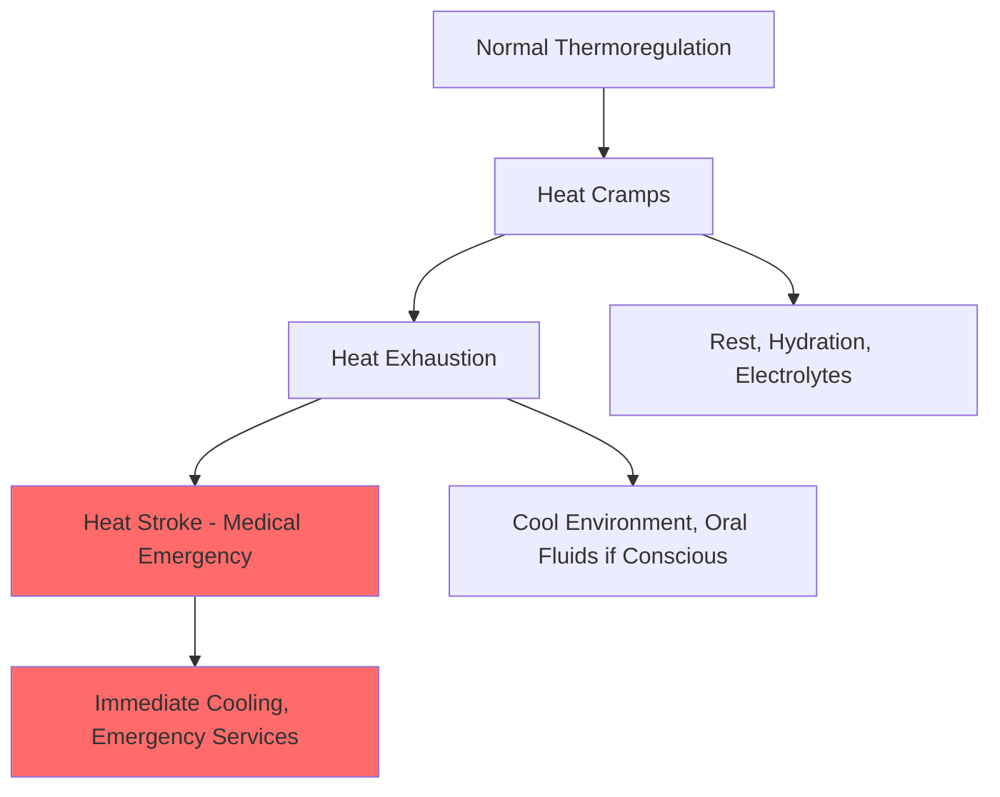

## Обзор требований первой помощи специфичных для HVAC

Техники HVAC сталкиваются с уникальными профессиональными опасностями, требующими специализированных знаний по первой помощи, выходящих за пределы стандартных протоколов рабочего места. Характер работ HVAC—включающий электрические системы, химические хладагенты, экстремальные температуры, ограниченные пространства и работу на высоте—требует немедленного реагирования на специфичные для отрасли чрезвычайные ситуации.

OSHA 29 CFR 1910.151 требует, чтобы работодатели обеспечивали доступность предметов первой помощи и обученного персонала. Для HVAC операций это расширяется на специфичные протоколы распознавания опасностей и лечения, охватывающие электрический контакт, химическое воздействие, тепловые повреждения и дыхательные чрезвычайные ситуации.

## Протоколы реагирования на электрический удар

Электрический удар представляет наиболее критичную непосредственную опасность в работах HVAC. Контакт с энергизированными проводниками в конденсирующих блоках, воздухообрабатывающих установках и распределительных панелях может вызвать остановку сердца, паралич дыхания или тяжелые ожоги.

### Последовательность немедленного реагирования

1. **Оценка безопасности места происшествия** - Деэнергизировать цепь или извлечь пострадавшего, используя неэлектропроводящие материалы
2. **Оценка сознания и дыхания** - Проверить отзывчивость в течение 10 секунд
3. **Активировать экстренные службы** - Немедленно позвонить в скорую помощь при любом электрическом контакте
4. **Начать СЛР при показаниях** - Начать компрессии в течение 30 секунд после распознавания остановки сердца

Физиологический эффект электрического тока зависит от величины, пути и продолжительности. Порог ощущения возникает при приблизительно 1 мА, в то время как фибрилляция желудочков может происходить при токах, превышающих 100 мА. Отношение между током, напряжением и сопротивлением тела следует закону Ома:

$$I = \frac{V}{R}$$

Где типичное сопротивление сухой кожи составляет от 1 000 до 100 000 Ω, но влажные условия снижают это примерно до 500 Ω, резко увеличивая ток и тяжесть повреждения.

### Оценка электрического ожога

Электрические ожоги имеют уникальные характеристики из-за повреждения внутренних тканей по пути прохождения тока. Поверхностное повреждение может выглядеть минимальным, в то время как глубокий некроз тканей прогрессирует. Контролируйте пострадавших на предмет сердечных аритмий в течение 24 часов после воздействия, так как отсроченная фибрилляция желудочков может произойти.

## Реагирование на чрезвычайные ситуации при воздействии хладагента

Современные хладагенты представляют особые профили токсичности, требующие специфичных протоколов лечения. Воздействие высокой концентрации в ограниченных пространствах может вызвать удушье путем вытеснения кислорода или прямой токсичности.

### Распространенные сценарии воздействия хладагента

| Тип хладагента | Первичная опасность | Немедленное реагирование | Вторичные проблемы |
|------------------|----------------------|--------------------------|---------------------|
| R-410A | Удушье, обморожение | Удалить из зоны, кислород если доступен | Сенсибилизация сердца |
| R-134a | Вытеснение кислорода | Свежий воздух, контролировать дыхание | Холодные ожоги от жидкого контакта |
| R-22 | Раздражение дыхания | Вентилировать, смыть кожу/глаза | Продукты разложения при нагревании |
| R-717 (Аммиак) | Тяжелое повреждение дыхания | Удалить пострадавшего, дезактивировать | Отек легких (отсроченный) |
| R-744 (CO₂) | Удушье, обморожение | Немедленно вывести на свежий воздух | Гиперкапния, ацидоз |

### Обморожение от контакта с хладагентом

Контакт жидкого хладагента вызывает быстрое замерзание тканей из-за испарительного охлаждения. Скорость теплопередачи во время фазового перехода описывается:

$$Q = m \cdot h_{fg}$$

Где $m$ — масса хладагента, а $h_{fg}$ — скрытая теплота парообразования. Для R-410A, $h_{fg}$ = 276 кДж/кг при атмосферном давлении, вызывая немедленные тяжелые холодные ожоги при контакте.

**Протокол лечения:**
- Снять загрязненную одежду
- Постепенно согревать поврежденную ткань водой температуры тела (37-40°C)
- Никогда не растирайте замерзшую ткань
- Закройте стерильной повязкой
- Немедленно обратитесь к врачу

## Реагирование на связанные с жарой заболевания

Техники HVAC, работающие на чердаках, в машинных комнатах и на кровельных установках, сталкиваются с значительным риском теплового стресса. Регулирование температуры тела становится скомпрометированным, когда производство тепла и нагрузка окружающей среды превышают мощность рассеяния.

### Прогрессия тепловых заболеваний

### Протокол экстренной помощи при тепловом ударе

Тепловой удар представляет истинную медицинскую чрезвычайную ситуацию с уровнями смертности от 10-50% в зависимости от времени реагирования. Температура ядра выше 40°C с измененным психическим статусом определяет это состояние.

**Немедленные действия:**
1. Вызвать скорую помощь
2. Переместить пострадавшего в прохладную среду
3. Снять лишнюю одежду
4. Применить активное охлаждение—погрузить в холодную воду если возможно, или приложить ледяные пакеты к паху, подмышкам и шее
5. Контролировать проходимость дыхательных путей и дыхание
6. Поместить в позицию восстановления, если без сознания, но дышит

Целевая скорость охлаждения должна составлять 0,15-0,20°C в минуту для снижения температуры ядра ниже 39°C в течение 30 минут.

## Применение СЛР и АДП в условиях HVAC

Остановка сердца у рабочих HVAC часто результат электрического контакта, сенсибилизации сердца хладагентами (особенно галогенированными углеводородами) или теплового удара. Немедленная качественная СЛР значительно улучшает показатели выживания.

### Протокол СЛР с компрессией только

Современные рекомендации American Heart Association подчеркивают непрерывные компрессии грудной клетки для неподготовленных спасателей:

- **Частота:** 100-120 компрессий в минуту
- **Глубина:** 5-6 см в взрослых
- **Отскок:** Разрешить полный отскок грудной клетки между компрессиями
- **Перерывы:** Минимизировать менее 10 секунд

Механическая работа, выполняемая во время СЛР, может быть аппроксимирована как:

$$W = F \cdot d \cdot n$$

Где $F$ — приложенная сила (примерно 400-500 Н для адекватной глубины), $d$ — глубина компрессии (0,05-0,06 м), и $n$ — количество компрессий. За 30 минут это представляет существенную физическую нагрузку, требующую смены спасателя каждые 2 минуты для поддержания качества компрессии.

### Развертывание АДП в полевых условиях

Автоматические наружные дефибрилляторы должны быть доступны на служебных автомобилях HVAC и на объектах, связанных с работой нескольких техников. Ранняя дефибрилляция в течение 3-5 минут после обрушения улучшает показатели выживания с 5-10% до 50-70% для поддающихся лечению ритмов.

**Последовательность применения АДП:**
1. Включить устройство и следовать голосовым подсказкам
2. Обнажить грудь и убедиться в сухости кожи
3. Приложить прокладки, как указано на диаграммах
4. Обеспечить отсутствие контакта во время анализа ритма
5. Доставить удар при рекомендации, немедленно возобновить СЛР
6. Продолжить до приезда скорой помощи

## Медицинские чрезвычайные ситуации в ограниченных пространствах

Работы HVAC в машинных комнатах, подвальных помещениях и коммунальных хранилищах вводят опасности ограниченного пространства, включая дефицит кислорода, токсичные атмосферы и риски захоронения. OSHA 29 CFR 1910.146 требует программы допускных ограниченных пространств, включая процедуры спасения.

### Атмосферные опасности

| Опасность | Нормальный уровень | Уровень IDLH | Физиологический эффект | Ответная первая помощь |
|------------|---------------------|--------------|-------------------------|-----------------------|
| Кислород (O₂) | 20,9% | <19,5% | Гипоксия, потеря сознания | Удалить, кислород, СЛР при необходимости |
| Углекислый газ (CO₂) | 0,04% | 40 000 ppm | Удушье, ацидоз | Извлечь, вентилировать, кислород |
| Углекислый газ (CO) | 0 ppm | 1 200 ppm | Тканевая гипоксия | 100% кислород, гипербарическая терапия |
| Пар хладагента | 0 ppm | Варьируется | Удушье | Свежий воздух, контролировать сердечный ритм |

### Приоритет спасения без входа

Протоколы первой помощи для ограниченных пространств подчеркивают спасение без входа, чтобы предотвратить множественные потери. Атмосферное состояние, которое инцидировало первоначального пострадавшего, остается. Системы извлечения, вентиляция и скорая помощь должны быть использованы вместо входа неподготовленного спасателя.

## Требования к сертификации обучения и возобновлению

OSHA рекомендует сертификацию первой помощи от организаций, использующих основанные на фактах протоколы, включая American Red Cross, American Heart Association или National Safety Council. Специализированное обучение HVAC должно охватывать:

- Распознавание и лечение электротравм
- Реагирование на химическое воздействие (хладагенты, продукты сгорания)
- Управление тепловыми повреждениями (тепловые заболевания, холодовое воздействие, ожоги)
- Дыхательные чрезвычайные ситуации (удушье, токсическое вдыхание)
- Травмы опорно-двигательного аппарата (падения, раздавливающие повреждения)

Действительность сертификата обычно распространяется на 2 года для СЛР/АДП и 3 года для первой помощи, хотя годовое обучение-переквалификация поддерживает компетентность более эффективно. Работодатели должны задокументировать обучение и обеспечить адекватное покрытие сертифицированного персонала по всем рабочим сменам и полевым операциям.

## Интеграция с планами действий при чрезвычайных ситуациях

Возможности первой помощи функционируют как один компонент в комплексной подготовке к чрезвычайным ситуациям. ASHRAE Standard 15 Раздел 8.12 требует процедур экстренной помощи для инцидентов с системами охлаждения. Эффективные планы действия при чрезвычайных ситуациях включают:

1. **Специфичные для опасности протоколы реагирования** для ожидаемых инцидентов
2. **Системы связи** для оповещения спасателей и эвакуации персонала
3. **Доступность оборудования**, включая наборы первой помощи, АДП, экстренные станции промывки глаз/душа
4. **Назначенные роли** с обученными людьми, назначенными первыми спасателями
5. **Процедуры после инцидента**, включая медицинскую оценку, расследование инцидента и корректирующие действия

Регулярные учения при чрезвычайных ситуациях проверяют эффективность обучения и выявляют недостатки системы до фактических инцидентов.

---

**Ссылки:**
- OSHA 29 CFR 1910.151 - Медицинские услуги и первая помощь
- OSHA 29 CFR 1910.146 - Ограниченные пространства, требующие разрешения
- ASHRAE Standard 15 - Стандарт безопасности для систем охлаждения
- Рекомендации American Heart Association по СЛР и экстренной сердечно-сосудистой помощи
- Пороговые предельные значения ACGIH для химических веществ
