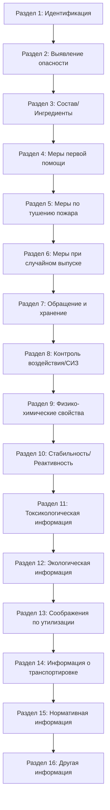

## Обзор

Подготовка по коммуникации об опасности (HazCom) обеспечивает, чтобы техники HVAC могли выявлять, понимать и безопасно обрабатывать разнообразные химические опасности, встречаемые при установке, обслуживании и ремонте оборудования. Стандарт OSHA по коммуникации об опасности (29 CFR 1910.1200) требует, чтобы работодатели информировали рабочих об химических опасностях посредством комплексных программ, включающих маркировку, паспорта безопасности материала (SDS) и эффективное обучение.

Работа в HVAC включает воздействие хладагентов, смазочных масел, чистящих растворителей, припойных флюсов, герметиков утечек хладагента, продуктов сгорания и строительных материалов, содержащих опасные вещества. Понимание этих химических опасностей посредством надлежащей подготовки HazCom снижает уровень травматизма, предотвращает хронические проблемы со здоровьем и обеспечивает соответствие нормативным требованиям.

## Стандарт OSHA по коммуникации об опасности

Стандарт HazCom (1910.1200) устанавливает три фундаментальных требования для безопасности при работе с химией:

1. **Классификация химической опасности** с использованием стандартизированных критериев
2. **Коммуникация информации об опасности** через этикетки и SDS
3. **Подготовка рабочих** по распознаванию опасности и защитным мерам

Стандарт применяется ко всем рабочим местам, где сотрудники могут подвергаться воздействию опасных химических веществ в нормальных условиях или предвидимых чрезвычайных ситуациях. Техники HVAC, работающие на производственных объектах, в больницах, коммерческих зданиях и жилых помещениях, подпадают под эту защиту.

### Ответственность работодателя

Работодатели должны разработать письменную программу коммуникации об опасности, которая включает:

- Перечень химических веществ со списком всех опасных веществ на рабочем месте
- Систему сбора и ведения SDS, доступную всем рабочим
- Процедуры маркировки всех химических контейнеров
- Подготовку сотрудников по опасностям и защитным мерам
- Процедуры информирования подрядчиков об химических опасностях

## Всемирная согласованная система (GHS)

GHS обеспечивает международную стандартизацию классификации и коммуникации химических веществ. Принятие OSHA GHS в 2012 году привело в соответствие практику в США с глобальными стандартами, улучшив согласованность выявления опасности и коммуникации.

### Классы опасности GHS, относящиеся к работе HVAC

**Физические опасности:**
- Горючие газы (хладагенты R-290, R-32)
- Газы под давлением (все хладагенты, азот)
- Горючие жидкости (растворители, обезжириватели, спиртовые чистящие средства)
- Коррозионное воздействие на металлы (кислые чистящие средства, средства для удаления флюса)

**Опасности для здоровья:**
- Острая токсичность (превышение воздействия хладагента, вдыхание растворителя)
- Коррозия кожи/раздражение (щелочные чистящие средства, остатки флюса)
- Повреждение глаз/раздражение (контакт с жидким хладагентом, химические брызги)
- Сенсибилизация дыхательной системы (изоцианатная пенная изоляция)
- Канцерогенность (асбест в старой изоляции, кремнезем)
- Токсичность для репродукции (некоторые растворители)
- Простая асфиксия (продувка азотом, хладагенты CO₂)

**Экологические опасности:**
- Опасность для водной среды (некоторые хладагенты, чистящие средства)

### Система классификации GHS

Химические опасности классифицируются на категории, указывающие на серьезность, при этом категория 1 представляет наивысший уровень опасности. Эта классификация определяет элементы маркировки, которые требуются.

## Паспорта безопасности материала (SDS)

SDS обеспечивают комплексную информацию об опасности в стандартизованном формате из 16 разделов. Техники HVAC должны знать, как получить доступ к SDS и интерпретировать их перед использованием любого химического продукта.

### Формат SDS из 16 разделов

### Критические разделы SDS для полевых техников

**Раздел 2: Выявление опасности**
- Классификация GHS и элементы маркировки
- Пиктограммы, показывающие типы опасности с первого взгляда
- Сигнальное слово (Опасность или Предупреждение), указывающее на серьезность
- Высказывания об опасности, описывающие конкретные опасности
- Предостерегающие высказывания, обеспечивающие руководство по безопасности

**Раздел 4: Меры первой помощи**
- Немедленное лечение при воздействии по маршрутам (вдыхание, кожа, глаза, проглатывание)
- Симптомы воздействия, требующие медицинского внимания
- Особые примечания по лечению для спасателей

**Раздел 8: Контроль воздействия/Личное защитное оборудование**
- Предельно допустимые концентрации при воздействии (PEL, TLV, REL)
- Инженерные контрольные меры (требования к вентиляции)
- Спецификации СИЗ (тип респиратора, материал перчаток, защита глаз)

**Раздел 9: Физико-химические свойства**
Критические свойства для хладагентов и химических веществ HVAC:

| Свойство | Значение для работы HVAC |
|----------|---------------------------|
| Давление паров | Указывает на скорость испарения и потенциальную опасность вдыхания |
| Плотность пара | Определяет, поднимается или оседает пар (>1 оседает в низких местах) |
| Температура кипения | Предсказывает поведение при окружающих условиях |
| Температура вспышки | Риск воспламеняемости при пайке и горячих работах |
| Пределы взрывоопасности (НПВ/ВПВ) | Диапазон горючей концентрации в воздухе |
| Удельный вес | Вес хладагента для расчетов заполнения |
| Температура разложения | Температура, при которой начинается токсичное разложение |

## Пиктограммы опасности и распознавание

GHS использует девять пиктограмм с красными границами и черными символами на белом фоне для визуального выражения информации об опасности.

### Пиктограммы, относящиеся к HVAC

| Пиктограмма | Категория опасности | Примеры HVAC |
|-----------|----------------|---------------|
| Пламя | Горючие материалы | Хладагент R-290, ацетилен, растворители, спиртовые чистящие средства для катушек |
| Баллон с газом | Газы под давлением | Все хладагенты, азот, ацетилен, кислород |
| Коррозия | Коррозионное воздействие на кожу/металлы | Кислые/щелочные чистящие средства для катушек, средства для удаления флюса, средства для удаления накипи |
| Череп и скрещенные кости | Острая токсичность | Высоко концентрированные чистящие средства, пестициды в обработчиках воздуха |
| Восклицательный знак | Менее серьезные опасности | Кожные раздражители, раздражители глаз, слабая токсичность |
| Символ здоровья | Серьезные эффекты для здоровья | Канцерогены (асбест), репродуктивные токсины, сенсибилизаторы дыхательной системы |
| Окружающая среда | Токсичность для водной среды | Хладагенты с высоким ПГП, некоторые чистящие средства |

### Сигнальные слова

**Опасность:** Используется для более серьезных категорий опасности (требует немедленного внимания)

**Предупреждение:** Используется для менее серьезных категорий опасности

Этикетка химического вещества может содержать только одно сигнальное слово, представляющее наиболее серьезную присутствующую опасность.

## Требования к маркировке химических веществ

Каждый контейнер с химическим веществом на рабочем месте должен иметь соответствующую маркировку, содержащую шесть элементов:

1. **Идентификатор продукта**, совпадающий с именем в SDS
2. **Сигнальное слово** (Опасность или Предупреждение)
3. **Высказывание(я) об опасности**, описывающее опасности
4. **Пиктограмма(ы)**, показывающие типы опасности
5. **Предостерегающее(ие) высказывание(я)**, обеспечивающие руководство по безопасности
6. **Информация поставщика** (название, адрес, телефон)

### Маркировка рабочего места для перелитых химических веществ

При переливании химических веществ из оригинальных контейнеров во вторичные контейнеры (распылительные бутылки, сервисные емкости) этикетки должны содержать:

- Идентификатор продукта или имя химического вещества
- Предупреждения об опасности, соответствующие классу опасности

Многие подрядчики HVAC используют ромб National Fire Protection Association (NFPA) или систему идентификации опасных материалов (HMIS) для маркировки на рабочем месте, что приемлемо, если оно передает требуемую информацию об опасности.

### Маркировка баллонов с хладагентом

Баллоны с хладагентом содержат специальную маркировку сверх требований GHS:

- Обозначение хладагента (R-410A, R-32 и т. д.)
- Классификация безопасности ASHRAE (A1, A2L, A3, B1 и т. д.)
- Класс опасности DOT (Класс 2.2 невоспламеняющийся или Класс 2.1 воспламеняющийся)
- Кодирование цветов (добровольное, не стандартизировано международно)
- Спецификации веса и давления

## Опасности химических веществ, специфичные для HVAC

### Хладагенты

**Физические опасности:**
Все хладагенты - это газы под давлением. Классификации A2L и A3 указывают на опасности воспламеняемости, требующие специальной обработки:

$$\text{Плотность пара} = \frac{\text{Молекулярный вес}_{\text{хладагент}}}{28.97 \text{ (МВ воздуха)}}$$

Хладагенты с плотностью пара >1 оседают в низких местах, вытесняя кислород и создавая опасность удушья. R-410A имеет молекулярный вес 72,6 г/моль:

$$\text{Плотность пара}_{\text{R-410A}} = \frac{72.6}{28.97} = 2.51$$

Это указывает, что R-410A в 2,51 раза тяжелее воздуха и будет накапливаться в ямах, подвалах и замкнутых пространствах.

**Опасности для здоровья:**
- Простое удушье посредством вытеснения кислорода
- Чувствительность сердца при высоких концентрациях (повышенный риск нарушения ритма сердца)
- Обморожение при контакте жидкого хладагента с кожей (точки кипения -51°C до -46°C)
- Продукты термического разложения при воздействии открытого пламени или горячих поверхностей (>427°C)

**Продукты разложения:**
Когда хладагенты контактируют с пламенем или горячей металлической поверхностью, они разлагаются на высокотоксичные вещества:

- Фтористый водород (HF) - едкий газ
- Фторид карбонила (COF₂) - токсичный газ
- Фосген (COCl₂) - химическое боевое средство, чрезвычайно токсичный

Реакция разложения для R-410A при воздействии открытого пламени:

$$\text{CHF}_2\text{CF}_3 + \text{O}_2 + \text{тепло} \rightarrow \text{HF} + \text{COF}_2 + \text{CO}_2 + \text{H}_2\text{O}$$

### Чистящие средства и растворители

**Чистящие средства для катушек:**
- Щелочные чистящие средства (pH 11-14): едкие, вызывают химические ожоги
- Кислые чистящие средства (pH 1-3): едкие, реагируют с металлами с выделением газа водорода
- Требуют СИЗ: химически стойкие перчатки, защитные очки, защитный щиток для концентрированных форм

**Обезжириватели и растворители:**
- Горючие (температуры вспышки 10°C-38°C типичные)
- Опасности для здоровья: наркотические эффекты, повреждение печени/почек при хроническом воздействии
- Требуется адекватная вентиляция (≥135 м³/ч на м² площади испарения)
- Риск поглощения кожей требует перчаток из нитрила или неопрена

### Припойные и сварочные материалы

**Материалы флюса:**
- Содержат фторидные соединения, которые выделяют фтористый водород при нагревании
- Раздражение глаз, кожи, дыхательной системы
- Требуется адекватная вентиляция при пайке

**Серебряные припойные сплавы:**
- Сплавы, содержащие кадмий (BCuP-7), генерируют токсичные пары кадмия
- ПДК OSHA для паров кадмия: 0,005 мг/м³ (очень низко)
- Рекомендуется использовать альтернативы без кадмия (BCuP-3, BCuP-4)

**Атмосфера пайки:**
Продувка азотом при пайке предотвращает окисление, но создает опасность удушья:

$$\text{Требуемый расход вентиляции (CFM)} = \frac{\text{Расход N}_2\text{ (CFM)} \times 100}{80 - 20.9}$$

Для расхода азота 2,4 м³/ч, минимальная вентиляция для поддержания 19,5% кислорода:

$$\text{Вентиляция} = \frac{2.4 \times 100}{80 - 20.9} = \frac{240}{59.1} = 4.06 \text{ м³/ч}$$

### Продукты сгорания

Печи, котлы и работающее на газе оборудование производят горючие газы, требующие осведомленности об опасности:

**Угарный газ (CO):**
- Бесцветный, без запаха токсичный газ от неполного сгорания
- ПДК OSHA: 50 ppm ПДК
- Симптомы: головная боль, головокружение, тошнота, спутанность сознания, смерть при высоких уровнях
- Связывается с гемоглобином в 200 раз легче, чем кислород:

$$\text{COHb\%} = \frac{[\text{CO}]}{[\text{CO}] + [\text{O}_2]/200}$$

**Диоксид азота (NO₂):**
- Красновато-коричневый газ с резким запахом
- ПДК OSHA: предельно допустимая концентрация 5 ppm
- Вызывает отек легких, раздражение дыхательной системы
- Производится при высоких температурах сгорания (>1538°C)

**Диоксид серы (SO₂):**
- Образуется при сгорании топлива, содержащего серу
- ПДК OSHA: 5 ppm ПДК
- Серьезный раздражитель дыхательной системы

## Пределы воздействия и расчеты дозы

OSHA устанавливает предельно допустимые концентрации (ПДК) для регулируемых химических веществ. ACGIH публикует пороговые предельные значения (TLVs) как рекомендуемые рекомендации.

### Средневзвешенное по времени значение (ПДК)

Средняя концентрация в течение 8-часового рабочего дня:

$$\text{ПДК} = \frac{(C_1 \times T_1) + (C_2 \times T_2) + \cdots + (C_n \times T_n)}{8 \text{ часов}}$$

Где:
- $C_n$ = концентрация в течение периода времени
- $T_n$ = продолжительность времени в часах

**Пример:** Техник подвергается воздействию паров растворителя с концентрацией 75 ppm в течение 3 часов и 40 ppm в течение 2 часов. Если ПДК составляет 50 ppm ПДК:

$$\text{ПДК} = \frac{(75 \times 3) + (40 \times 2)}{8} = \frac{225 + 80}{8} = \frac{305}{8} = 38.1 \text{ ppm}$$

Воздействие ниже ПДК 50 ppm ПДК, указывающее на соответствие требованиям.

### Предельно допустимая концентрация на короткий период (ПДКС)

Максимальная концентрация для периодов 15 минут, не превышающая 4 раза в день с минимум 60 минутами между воздействиями.

### Потолочный лимит

Концентрация, которая никогда не должна превышаться в любое время в течение рабочего дня.

## Выбор личного защитного оборудования

Раздел 8 SDS указывает требуемое СИЗ на основе классификации опасности. Техники HVAC должны понимать критерии выбора СИЗ.

### Защита органов дыхания

Требуется, когда инженерные контрольные меры не могут снизить воздействие ниже ПДК/TLV:

| Тип опасности | Выбор респиратора |
|-------------|---------------------|
| Твердые частицы (пыль, волокна) | Фильтрующий лицевой respirator N95 (APF 10) или полумаска эластомерная (APF 10) |
| Органические пары (растворители) | Полумаска с картриджем для органических паров (APF 10) |
| Кислотные газы (HF, HCl) | Полумаска с картриджем для кислотных газов (APF 10) |
| Утечка хладагента аммиак | Полумаска с картриджем для аммиака (APF 50) или SCBA для высоких концентраций |
| IDLH атмосфера | Автономное дыхательное устройство (SCBA) или respirator с подачей воздуха |

**Коэффициент назначенной защиты (APF):** Ожидаемый уровень защиты дыхания, обеспечиваемый:

$$\text{Эффективное воздействие} = \frac{\text{Фактическая концентрация}}{\text{APF}}$$

Если концентрация растворителя составляет 200 ppm, а ПДК составляет 50 ppm, требуемый APF:

$$\text{Требуемый APF} = \frac{200}{50} = 4$$

Полумаска respirator (APF 10) обеспечивает адекватную защиту.

### Химически стойкие перчатки

Материал перчатки должен быть устойчив к проникновению конкретного химического вещества:

| Класс химического вещества | Рекомендуемый материал перчаток |
|----------------|---------------------------|
| Хладагенты | Неопрен, нитрил |
| Нефтяные масла | Нитрил, ПВХ |
| Кислые чистящие средства | Неопрен, бутиловый каучук |
| Щелочные чистящие средства | Неопрен, нитрил |
| Растворители (спирты, кетоны) | Нитрил, бутиловый каучук |

**Время прорыва:** Продолжительность до проникновения химического вещества сквозь материал перчатки. Замените перчатки до истечения времени прорыва.

### Защита глаз и лица

- Защитные очки с боковыми щитками: минимум для всех работ с химией
- Защитные очки для химических брызг: при переливании или смешивании концентрированных химических веществ
- Защитный щиток (с защитными очками): при обращении с коррозионными материалами

## Требования к подготовке

OSHA требует подготовки HazCom во время первоначального назначения и когда вводится новая химическая опасность.

### Требуемые элементы подготовки

1. **Обзор требований стандарта HazCom**
2. **Химические опасности, присутствующие в рабочей зоне**
3. **Местоположение и доступность SDS**
4. **Методы обнаружения химического присутствия** (запах, мониторинг, визуальный)
5. **Физические и опасности для здоровья** от химических веществ
6. **Защитные меры** (инженерные контрольные меры, СИЗ, рабочие процессы)
7. **Элементы маркировки и пиктограммы GHS**
8. **Формат SDS и способ получения информации об опасности**

### Специфичные для HVAC темы подготовки

- Классификации хладагентов и процедуры обработки
- Опасности чистящих средств и процедуры разбавления
- Распознавание продуктов сгорания и реагирование на угарный газ
- Опасности припойного флюса и требования вентиляции
- Распознавание асбеста в существующих зданиях
- Процедуры экстренного реагирования при пролива и воздействии химических веществ

## Управление химическим инвентарем

Ведение точного инвентаря химических веществ обеспечивает доступность SDS и облегчает оценку опасности.

### Разработка инвентаря

1. **Обследуйте все рабочие зоны** на наличие химических продуктов
2. **Запишите названия продуктов**, совпадающие с идентификаторами SDS
3. **Задокументируйте количество и места хранения**
4. **Получите SDS для каждого продукта** у производителя или поставщика
5. **Проверяйте SDS ежегодно** на предмет обновлений
6. **Удалите устаревшие химические вещества** из инвентаря и рабочего места

### Мобильные сервисные автомобили

Сервисные автомобили HVAC содержат многочисленные химические вещества, требующие инвентаризации:

- Хладагенты (несколько типов)
- Смазочные масла
- Припойный флюс и сплавы
- Герметики утечек
- Чистящие средства
- Баллоны с азотом
- Ацетилен/кислород

Ведите папку SDS или электронный доступ в автомобилях для справки полевых техников.

## Процедуры экстренного реагирования

Подготовка HazCom включает процедуры экстренного реагирования при пролива, пожарах и инцидентах воздействия химических веществ.

### Реагирование при небольшом пролива (случайные выпуски)

Для пролива, который сотрудники могут безопасно очистить без специальной подготовки:

1. Предупредите других в этой области
2. Проветрите, если присутствуют пары
3. Наденьте соответствующее СИЗ (перчатки, очки)
4. Изолируйте пролив абсорбирующим материалом
5. Соберите загрязненный материал в соответствующий контейнер
6. Утилизируйте согласно рекомендациям SDS и нормативным требованиям

### Реагирование при большом пролива (чрезвычайные выпуски)

Пролива, требующие специализированной очистки или эвакуации:

1. Эвакуируйте зону
2. Изолируйте зону опасности
3. Обратитесь к команде экстренного реагирования
4. Предоставьте SDS спасателям
5. Не пытайтесь очистить без надлежащей подготовки и оборудования

### Реагирование при выпуске хладагента

Крупные выпуски хладагента в замкнутых пространствах создают немедленные опасности:

- **Эвакуируйте**, если предположена нехватка кислорода
- **Активируйте механическую вентиляцию** на максимальную мощность
- **Исключите источники зажигания** для горючих хладагентов (A2L, A3)
- **Проконтролируйте уровень кислорода** перед повторным входом (минимум 19,5%)
- **Отремонтируйте утечку** после того, как зона безопасна

Эффективная подготовка по коммуникации об опасности защищает техников HVAC от химических опасностей, встречаемых на протяжении их карьеры. Понимание классификаций GHS, интерпретация информации SDS, распознавание элементов маркировки и внедрение защитных мер обеспечивают безопасную обработку химических веществ и соответствие требованиям OSHA.

## Компоненты

- Стандарт Hazcom OSHA
- Всемирная согласованная система GHS
- Понимание паспортов безопасности материала SDS
- Категории классификации опасности
- Распознавание пиктограмм опасности
- Интерпретация сигнальных слов
- Понимание высказываний об опасности
- Применение предостерегающих высказываний
- Требования к маркировке контейнеров
- Системы маркировки рабочего места
- Ведение химического инвентаря
