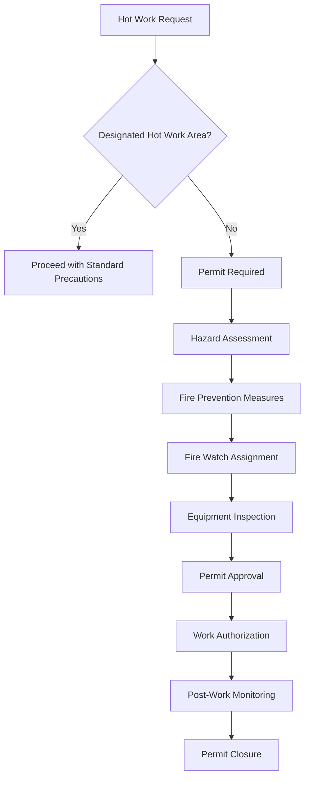

# Безопасность проведения горячих работ при обслуживании систем HVAC

Операции горячих работ представляют одну из наиболее опасных видов деятельности при монтаже, обслуживании и ремонте систем HVAC. Эти операции включают пайку твёрдым припоем холодильных линий, сварку воздуховодов, резку металлических компонентов и пайку мягким припоем соединений — все процессы, генерирующие достаточно тепла для воспламенения горючих материалов и создания пожарной опасности.

## Определение и область применения горячих работ

Горячие работы охватывают любые операции, при которых образуются пламя, искры или тепло, достаточные для воспламенения обычных горючих материалов. В контексте HVAC это включает:

- **Операции пайки твёрдым припоем**: Соединение медных холодильных линий при температурах от 449°C до 1 093°C
- **Процессы сварки**: Сплавление металлических воздуховодов, опор и конструктивных компонентов
- **Операции резки**: Использование горелок, плазменных резаков или абразивных дисков для модификации металла
- **Пайка мягким припоем**: Низкотемпературное соединение водопроводных линий и электрических соединений
- **Шлифование**: Генерирование искр при абразивном контакте с металлическими поверхностями

Тепловая энергия, выделяемая при этих операциях, создаёт источники зажигания, способные инициировать пожары в материалах, расположенных на значительном расстоянии от места проведения работ.

## Физика опасности горячих работ

### Теплопередача и риск воспламенения

Опасность от горячих работ обусловлена тремя режимами теплопередачи:

**Теплопроводность через металлические компоненты:**

$$Q_{cond} = \frac{kA(T_1 - T_2)}{L}$$

Где:
- $Q_{cond}$ = скорость теплопередачи теплопроводностью (Вт)
- $k$ = теплопроводность металла (Вт/м·К)
- $A$ = площадь поперечного сечения (м²)
- $T_1 - T_2$ = разность температур (К)
- $L$ = длина пути теплопроводности (м)

Медная трубка (k = 385 Вт/м·К) проводит тепло быстро, потенциально воспламеняя материалы на расстоянии 3,0–4,6 м от точки пайки. Стальные воздуховоды (k = 50 Вт/м·К) передают тепло медленнее, но всё равно создают опасность.

**Конвекция от горячих газов:**

$$Q_{conv} = hA(T_s - T_\infty)$$

Где:
- $Q_{conv}$ = теплопередача конвекцией (Вт)
- $h$ = коэффициент конвекции (Вт/м²·К)
- $T_s$ = температура поверхности (К)
- $T_\infty$ = температура окружающей среды (К)

Горячие выхлопные газы от резательных горелок могут достигать 1 649°C и воспламенять материалы в их потоке.

**Излучение от раскалённых поверхностей:**

$$Q_{rad} = \epsilon \sigma A(T_s^4 - T_{surr}^4)$$

Где:
- $\epsilon$ = степень черноты (0-1)
- $\sigma$ = постоянная Стефана-Больцмана (5,67×10⁻⁸ Вт/м²·К⁴)
- $T_s$ = температура поверхности (К)
- $T_{surr}$ = температура окружающей среды (К)

Тепловое излучение от светящегося металла может воспламенять горючие материалы на расстояниях, превышающих 10,7 м.

## Система разрешений на горячие работы

NFPA 51B и OSHA 29 CFR 1910.252 требуют формальных разрешений на горячие работы для операций вне выделенных зон. Система разрешений обеспечивает систематическую оценку опасности до начала работ.

### Компоненты разрешения

### Контрольный список предварительной проверки

| Требование | Дистанция проверки | Метод проверки |
|-------------|---------------------|---------------------|
| Горючие материалы удалены | Радиус 10,7 м | Визуальный осмотр |
| Легковоспламеняющиеся жидкости удалены | Радиус 15,2 м | Проверка контейнеров, дренажа |
| Полы подметены | Рабочая зона | Удаление пыли и мусора |
| Отверстия в стенах/полах закрыты | Все отверстия | Установлены металлические экраны |
| Огнетушитель доступен | В пределах 9,1 м | Правильный тип, заряженный |
| Пожарный дозорный назначен | Непрерывно | Обученный персонал |
| Вентиляция достаточна | Рабочая зона | Измерить воздухообмены |
| Баллоны газа закреплены | Зона хранения | Цепи и подставки проверены |

## Безопасность пайки твёрдым припоем в холодильных работах

Пайка твёрдым припоем медных холодильных линий представляет наиболее распространённые горячие работы в HVAC. Процесс требует температур 649–816°C для плавления фосфористо-медных или серебряных припоев.

### Контроль температуры

Температура плавления припоя определяет минимальную температуру горелки:

| Тип припоя | Диапазон плавления | Типичное применение | Прочность соединения |
|------------|---------------|---------------------|----------------|
| 15% серебро | 649–816°C | Общее холодильное оборудование | 276 МПа |
| 5% серебро | 652–802°C | Приложения с низкой стоимостью | 241 МПа |
| 0% серебра (фосф.-медь) | 704–802°C | Только медь-медь соединения | 207 МПа |
| 45% серебро | 607–704°C | Тонкостенные трубки | 345 МПа |

Чрезмерное тепло ослабляет соединение и увеличивает риск пожара. Оптимальная температура пайки превышает точку плавления только на 28–83°C.

### Продувка азотом

Во время пайки введение азота при 21–34 кПа (избыточное давление) через холодильный контур предотвращает образование окисной плёнки:

$$\dot{m}_{N_2} = \frac{P_{gage} \cdot V_{pipe}}{RT}$$

Где:
- $\dot{m}_{N_2}$ = требуемая массовая скорость потока азота
- $P_{gage}$ = избыточное давление (21–34 кПа)
- $V_{pipe}$ = объём паяемой трубки
- $R$ = удельная газовая постоянная для азота
- $T$ = абсолютная температура

Поток азота также обеспечивает охлаждение и снижает внутренние температуры, минимизируя риск воспламенения ближайшей изоляции.

## Стратегии профилактики пожаров

### Управление горючими материалами

Температура воспламенения обычных материалов HVAC устанавливает требования к расстояниям:

| Материал | Температура воспламенения | Требуемое расстояние | Метод защиты |
|----------|----------------------|--------------------|--------------------|
| Целлюлозная изоляция | 149–204°C | 10,7 м | Удалить или увлажнить |
| Изоляция стекловолокна воздуховодов | 232–288°C | 6,1 м | Закрыть металлом |
| Резиновая изоляция труб | 260–316°C | 4,6 м | Полностью удалить |
| Деревянная обрешётка | 204–260°C | 10,7 м | Закрыть мокрыми одеялами |
| Потолочные плиты | 177–232°C | 6,1 м | Удалить или закрыть |
| Электрические кабели | 149–204°C | 3,0 м | Защита металлом |

### Сварочные одеяла и экраны

Огнестойкие материалы защищают горючие материалы, которые невозможно удалить:

- **Стекловолоконные одеяла**: Выдерживают температуры до 538°C, блокируют тепловое излучение
- **Углеволоконные экраны**: Сопротивляются температурам до 816°C, отражают 95% теплового излучения
- **Керамические одеяла**: Выдерживают температуры до 1 260°C для экстремальных приложений

Требуемая толщина для теплозащиты:

$$t = \frac{k(T_1 - T_2)}{q''_{max}}$$

Где $t$ — толщина одеяла для поддержания безопасной температуры $T_2$ на защищённой стороне.

## Требования к пожарному дозору

NFPA 51B требует назначения пожарного дозора во время и после горячих работ. Пожарный дозор служит последней линией защиты от воспламенения.

### Продолжительность пожарного дозора

Мониторинг после работы продолжается в течение минимальных периодов, основанных на риске пожара:

```mermaid
gantt
    title Fire Watch Timeline
    dateFormat HH:mm
    axisFormat %H:%M
    section Standard Operations
    Hot Work Period           :active, 00:00, 1h
    Fire Watch During Work    :active, 00:00, 1h
    Post-Work Monitoring      :crit, 01:00, 30m
    section High-Risk Areas
    Hot Work Period           :active, 00:00, 1h
    Fire Watch During Work    :active, 00:00, 1h
    Extended Monitoring       :crit, 01:00, 3h
```

Зоны высокого риска включают области со скрытыми пространствами, горючими материалами стен или ограниченной видимостью, где может развиться тление незамеченным.

### Оборудование пожарного дозора

Требуемое оборудование для эффективного пожарного дозора:

- Огнетушитель класса ABC (минимальная вместимость 4,5 кг)
- Прямая связь со службами экстренной помощи
- Фонарик для осмотра тёмных областей
- Тепловизионная камера (рекомендуется для скрытых пространств)
- Водоснабжение для охлаждения горячих поверхностей

## Безопасность баллонов газа

Баллоны ацетилена и кислорода, используемые при резке и сварке, требуют специальной обработки:

### Требования к хранению и обращению

| Требование | Спецификация | Основание |
|-------------|---------------|-------|
| Закрепление баллона | Цепь или ремень на 2/3 высоты | Предотвращение опрокидывания |
| Расстояние разделения | 6,1 м или преграда 127 мм | Разделение ацетилена и кислорода |
| Ориентация хранения | Вертикально, вентиль вверху | Распределение ацетона |
| Установка колпака | При отсутствии использования | Защита вентиля |
| Метод транспортировки | Только тележка для баллонов | Предотвращение повреждения |
| Управление вентилем | Открыть на 1/4–1/2 оборота | Возможность аварийного перекрытия |

### Регулирование давления

Ацетилен становится нестабильным выше 103 кПа. Регуляторы должны ограничивать давление подачи:

$$P_{safe} = P_{cylinder} \times \frac{A_{orifice}}{A_{diaphragm}}$$

Надлежащее регулирование предотвращает реакции разложения, которые могут вызвать взрыв баллона.

## Требования к вентиляции при горячих работах

Сварка и пайка генерируют металлические дымы, требующие вентиляции для поддержания безопасных уровней воздействия.

### Скорости генерирования дымов

Масса дыма, производимого при сварке:

$$\dot{m}_{fume} = F_r \times \dot{m}_{rod}$$

Где:
- $F_r$ = коэффициент генерирования дыма (0,01–0,03 для типичных электродов)
- $\dot{m}_{rod}$ = скорость расхода электрода (г/мин)

### Требуемая скорость вентиляции

Для поддержания концентраций ниже пороговых предельных значений (TLV):

$$Q = \frac{\dot{m}_{fume} \times 10^6}{TLV \times \rho_{air}}$$

Где:
- $Q$ = требуемая скорость вентиляции (CFM (м³/ч))
- $TLV$ = пороговое предельное значение (мг/м³)
- $\rho_{air}$ = плотность воздуха

Для замкнутых пространств OSHA требует минимум 100 CFM (169,9 м³/ч) на сварщика плюс адекватный приток свежего воздуха.

## Процедуры аварийного реагирования

Несмотря на меры предосторожности, пожары при горячих работах происходят. Процедуры немедленного реагирования:

1. **Активировать сигнализацию**: Оповестить занимающихся и пожарную службу
2. **Попытка потушения**: Использовать подходящий огнетушитель, если это безопасно
3. **Эвакуация при необходимости**: Когда пожар превышает мощность огнетушителя
4. **Перекрыть подачу газа**: Закрыть вентили баллонов для прекращения подачи топлива
5. **Встреча спасателей**: Предоставить информацию об опасностях и планировке здания

### Выбор огнетушителя

| Класс пожара | Применение при горячих работах HVAC | Тип огнетушителя | Минимальный рейтинг |
|------------|---------------------------|-------------------|----------------|
| Класс A | Дерево, бумага, изоляция | Вода, ABC | 2-A |
| Класс B | Режущие масла, смазочные материалы | ABC, BC, CO₂ | 10-B |
| Класс C | Электрощиты, двигатели | ABC, BC, CO₂ | C-rated |
| Класс D | Магний, титановая пыль | Специальный порошок | Спецификация производителя |

## Нормативная база

Несколько стандартов регулируют безопасность горячих работ в операциях HVAC:

- **NFPA 51B**: Стандарт профилактики пожаров при сварке, резке и других горячих работах
- **OSHA 29 CFR 1910.252**: Общие требования к сварке, резке и пайке
- **OSHA 29 CFR 1926.352**: Профилактика пожаров в строительной промышленности
- **ASHRAE 15**: Положения безопасности холодильных агентов, влияющие на операции пайки
- **International Fire Code**: Муниципальные требования к разрешениям на горячие работы

Соответствие требует понимания конкретных положений, применимых к каждому месту работ и типу операций.

## Сертификация обучения

Эффективное обучение безопасности горячих работ охватывает:

- Треугольник огня и принципы горения
- Механизмы теплопередачи и опасности воспламенения
- Процедуры системы разрешений и документирование
- Методы предварительной проверки
- Ответственность и продолжительность пожарного дозора
- Обращение и хранение газовых баллонов
- Использование огнетушителей и аварийное реагирование
- Требования нормативной базы

Обучение должно включать практическую демонстрацию использования огнетушителя и практику заполнения форм разрешений. Рекомендуется повторное обучение ежегодно, с переподготовкой, необходимой после любого инцидента при горячих работах.
