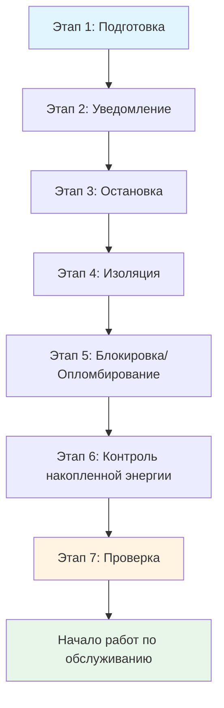
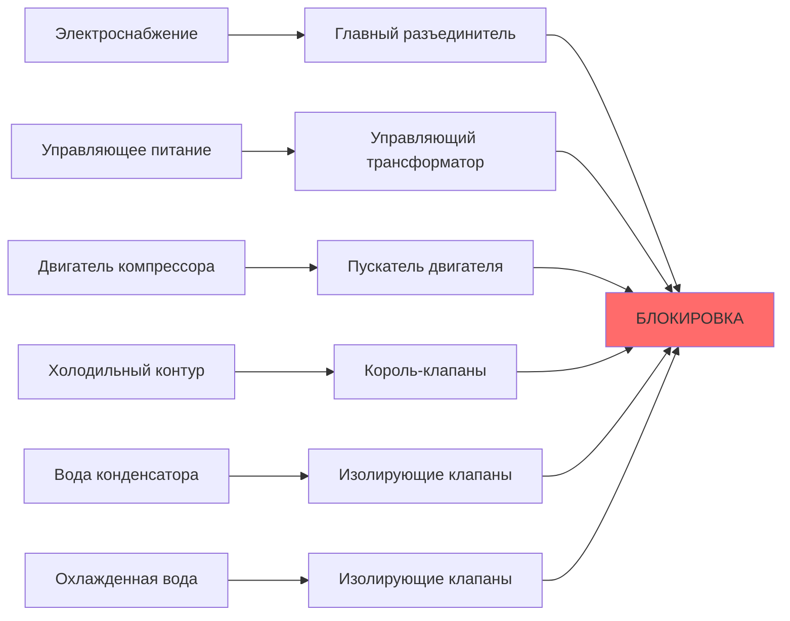

## Основы блокировки и опломбирования

Процедуры блокировки-опломбирования (LOTO) контролируют опасную энергию во время обслуживания и ремонта оборудования HVAC. Процесс обеспечивает достижение оборудованием нулевого энергетического состояния перед началом работ, предотвращая неожиданное включение, запуск или выброс накопленной энергии, который ежегодно вызывает около 120 смертельных случаев и 50 000 травм в промышленных условиях.

### Типы энергии в системах HVAC

Оборудование HVAC содержит несколько форм энергии, требующих изоляции:

| Тип энергии | Источники HVAC | Механизм опасности | Метод изоляции |
|-------------|--------------|------------------|------------------|
| Электрическая | Двигатели, органы управления, нагреватели | Электрическая дуга, поражение электротоком | Автоматические выключатели, разъединители |
| Механическая | Вращающееся оборудование, приводные ремни | Запутывание, удар | Фиксаторы вала, защиты ремней |
| Пневматическая | Линии сжатого воздуха | Выброс под высоким давлением | Закрытие клапана, выпуск давления |
| Гидравлическая | Системы насосов, приводы | Впрыск жидкости под давлением | Изоляция клапана, выпуск давления |
| Тепловая | Горячие поверхности, хладагент | Ожоги, обморожение | Охлаждение, теплоизоляция |
| Потенциальная (гравитационная) | Подвешенные компоненты | Падающие предметы | Механическая поддержка, блоки |
| Накопленная энергия | Конденсаторы, пружины, аккумуляторы | Внезапный разряд | Заземление, сброс сжатия |

## Требования OSHA 1910.147

Стандарт по контролю опасной энергии предусматривает специальные процедуры для изоляции оборудования. Соответствие требует письменных программ контроля энергии, обучения сотрудников и периодических проверок с минимальным интервалом в один год.

### Семиэтапная процедура LOTO

**Этап 1 – Подготовка**: Определите все источники энергии и точки изоляции. Для кровельного блока кондиционирования это включает электроснабжение, газоснабжение, холодильные контуры и линии управляющего воздуха.

**Этап 2 – Уведомление**: Информируйте затронутый персонал об остановке. Критично для занятых зданий, где прерывание работы HVAC влияет на операции.

**Этап 3 – Остановка**: Используйте стандартные рабочие процедуры для остановки оборудования. Избегайте аварийной остановки, которая может оставить энергию накопленной в системе.

**Этап 4 – Изоляция**: Физически отключите все источники энергии. Закройте клапаны, откройте автоматические выключатели и извлеките предохранители согласно процедурам для конкретного оборудования.

**Этап 5 – Применение устройств**: Применяйте устройства блокировки и опломбирования. Каждый уполномоченный сотрудник применяет свой личный замок, создавая многозамковый сценарий для группового обслуживания.

**Этап 6 – Контроль накопленной энергии**: Выпустите или сдержите всю накопленную энергию. Этот этап предотвращает большинство травм, связанных с LOTO.

**Этап 7 – Проверка**: Протестируйте оборудование, чтобы подтвердить нулевое энергетическое состояние перед началом работ.

## Расчеты накопленной энергии

Количественное определение накопленной энергии определяет уровень опасности и надлежащие меры контроля.

### Запасание энергии в конденсаторах

Электрические конденсаторы в приводах двигателей и устройствах коррекции коэффициента мощности накапливают энергию согласно:

$$E_c = \frac{1}{2}CV^2$$

Где:
- $E_c$ = накопленная энергия (джоули)
- $C$ = емкость (фарады)
- $V$ = напряжение (вольты)

Конденсатор емкостью 500 мкФ при 480В накапливает:

$$E_c = \frac{1}{2}(500 \times 10^{-6})(480)^2 = 57,6 \text{ Дж}$$

Этот уровень энергии может передать летальный ток при разряде через технолога. Процедуры заземления должны рассеять эту энергию перед контактом.

### Энергия пневматического давления

Системы сжатого воздуха накапливают энергию в приемниках и трубопроводах:

$$E_p = \frac{P_1V}{k-1}\left[1-\left(\frac{P_2}{P_1}\right)^{\frac{k-1}{k}}\right]$$

Где:
- $E_p$ = пневматическая энергия (джоули)
- $P_1$ = начальное абсолютное давление (Па)
- $P_2$ = конечное абсолютное давление (Па)
- $V$ = объем (м³)
- $k$ = показатель адиабаты (1,4 для воздуха)

Для приемника объемом 0,5 м³ при 690 кПа, выпускающегося в атмосферу:

$$E_p = \frac{(690000)(0,5)}{1,4-1}\left[1-\left(\frac{101325}{690000}\right)^{\frac{0,4}{1,4}}\right] = 387000 \text{ Дж}$$

Этот выброс 387 кДж создает опасность взрывного разрыхления, требующего управляемого стравливания через клапаны, а не мгновенного отсоединения.

### Кинетическая энергия вращения

Эффекты маховика в крупных вентиляторах и нагнетателях накапливают кинетическую энергию:

$$E_k = \frac{1}{2}I\omega^2$$

Где:
- $E_k$ = кинетическая энергия (джоули)
- $I$ = момент инерции (кг·м²)
- $\omega$ = угловая скорость (рад/с)

Центробежный вентилятор с моментом инерции 50 кг·м², работающий при 1200 об/мин, накапливает:

$$\omega = 1200 \times \frac{2\pi}{60} = 125,66 \text{ рад/с}$$

$$E_k = \frac{1}{2}(50)(125,66)^2 = 395000 \text{ Дж}$$

Накопленные 395 кДж требуют полной проверки остановки вращения, так как скользящее оборудование может неожиданно перезапуститься из-за снижения трения в подшипниках или изменений воздушного потока.

## Процедуры LOTO для конкретного оборудования

### Протокол блокировки чиллера

Критические точки изоляции для охлаждаемых водой чиллеров включают:

1. **Электрическая**: Главный разъединитель 480В, первичная обмотка управляющего трансформатора (120В), контакты пускателя
2. **Холодильная**: Сервисные клапаны всасывания и нагнетания компрессора (король-клапаны)
3. **Гидравлическая**: Изолирующие клапаны воды конденсатора и охлажденной воды с точками слива
4. **Пневматическая**: Подача управляющего воздуха при использовании для приведения клапанов в действие
5. **Тепловая**: Уравнивание давлений в холодильном контуре, проверка отключения масляного нагревателя

### Протокол блокировки котла

Высокого давления котлы представляют экстремальные тепловые и давления опасности:

1. **Подача топлива**: Блокировка клапана природного газа с кровотечением нижегостоящего давления
2. **Электрическая**: Изоляция двигателя горелки, системы зажигания и управляющего питания
3. **Питающая вода**: Изоляция насоса и проверка обратного клапана
4. **Пар**: Закрытие главного парового клапана с атмосферным выпуском
5. **Тепловая**: Охлаждение до менее 60°C перед входом

Тепловое охлаждение следует закону охлаждения Ньютона:

$$T(t) = T_a + (T_0 - T_a)e^{-kt}$$

Где:
- $T(t)$ = температура в момент времени $t$
- $T_a$ = температура окружающей среды
- $T_0$ = начальная температура
- $k$ = константа охлаждения

Для котла при 150°C, охлаждающегося до 60°C при окружающей температуре 30°C с константой охлаждения 0,05 ч⁻¹:

$$60 = 30 + (150-30)e^{-0,05t}$$

$$t = \frac{\ln(\frac{30}{120})}{-0,05} = 27,7 \text{ часов}$$

Этот период охлаждения 28 часов невозможно обойти для полной безопасности изоляции.

## Методы проверки

Проверка нулевой энергии предотвращает большинство отказов LOTO.

### Электрическая проверка

Трехэтапный процесс проверки:

1. **Проверка приборов на известной живой цепи** – Подтверждает функциональность счетчика
2. **Проверка заблокированной цепи** – Должна показывать нулевое напряжение
3. **Повторная проверка приборов на известной живой цепи** – Подтверждает, что счетчик все еще функционален

Приемлемые показания напряжения должны быть ниже 50В переменного тока или 120В постоянного тока, порога опасности поражения NFPA 70E.

### Механическая проверка

Попытайтесь запустить оборудование, используя стандартные органы управления. Нулевой отклик подтверждает надлежащую изоляцию. Для приводов переменной частоты это включает проверку того, что напряжение шины постоянного тока рассеялось ниже 40В.

### Проверка давления

Установите калиброванные манометры в точках изоляции. Пневматические системы должны достичь атмосферного давления (0 избыточное давление), гидравлические системы должны показывать нулевое манометрическое давление с учетом давления столба жидкости:

$$P = \rho g h$$

Где вертикальные столбы жидкости создают остаточное давление, требующее открытия точки слива, а не просто закрытия клапана.

## Процедуры групповой блокировки

Несколько технолога, работающих на одном оборудовании, требуют согласованного LOTO:

**Метод групповой блокировки**: Первичные изолирующие устройства получают групповую блокировку с личными замками технолога, применяемыми к блокировке, содержащей ключи от группового замка. Каждый технолог должен снять свой личный замок перед восстановлением первичной изоляции.

**Протокол последовательности ремесел**: Когда несколько специальностей (электричество, механика, управление) работают одновременно, установите определенную последовательность:

1. Электрическая изоляция и проверка
2. Механическая изоляция и проверка
3. Технологическая изоляция (холодильная, вода, воздух)
4. Рассеяние накопленной энергии
5. Финальная проверка каждой специальностью

## Обучение и документация

OSHA требует три уровня обучения:

**Уполномоченные сотрудники**: Сотрудники, выполняющие LOTO, получают полное обучение по распознаванию источников энергии, методам изоляции и процедурам для конкретного оборудования. Минимальное годовое переобучение.

**Затронутые сотрудники**: Персонал, работающий с оборудованием, получает обучение по цели LOTO, запрету на снятие замков/опломбирования и распознаванию наличия LOTO.

**Другие сотрудники**: Общее обучение по осведомленности о том, что устройства LOTO не должны трогаться.

Требования к документации включают:

- Письменные процедуры контроля энергии для каждого типа оборудования
- Записи об обучении сотрудников с датами и темами
- Записи об ежегодных периодических проверках
- Диаграммы изоляции энергии для конкретного оборудования

### Требования по проверке

Ежегодные уполномоченные проверки проверяют эффективность процедур:

| Элемент проверки | Метод проверки | Требуемая документация |
|--------------------|---------------------|------------------------|
| Определение источника энергии | Физический обход | Обновленные диаграммы изоляции |
| Надлежащость изолирующего устройства | Проверка соответствия замка | Инвентарь устройства |
| Контроль накопленной энергии | Процедуры измерения | Калибровка испытательного оборудования |
| Проверка верификации | Наблюдение процедуры | Контрольный лист проверки |
| Знание сотрудников | Интервью затронутых работников | Записи интервью |

## Последствия несоответствия

Нарушения LOTO несут суровые штрафы в соответствии с принудительными мерами OSHA:

- **Серьезное нарушение**: 13 653 долл. за нарушение (ставки 2023 года)
- **Умышленное нарушение**: 136 532 долл. за нарушение
- **Повторное нарушение**: 136 532 долл. за нарушение

Помимо нормативных последствий, неадекватное LOTO вызывает повреждение оборудования, потери производства и катастрофические травмы персонала. Физика выброса накопленной энергии демонстрирует, почему процедурная дисциплина является безусловной необходимостью в операциях обслуживания HVAC.

## Ссылки

- OSHA 1910.147: Контроль опасной энергии (блокировка/опломбирование)
- ASHRAE Standard 15: Стандарт безопасности для холодильных систем
- NFPA 70E: Стандарт электробезопасности на рабочем месте
- ANSI Z244.1: Контроль опасной энергии – блокировка/опломбирование и альтернативные методы
