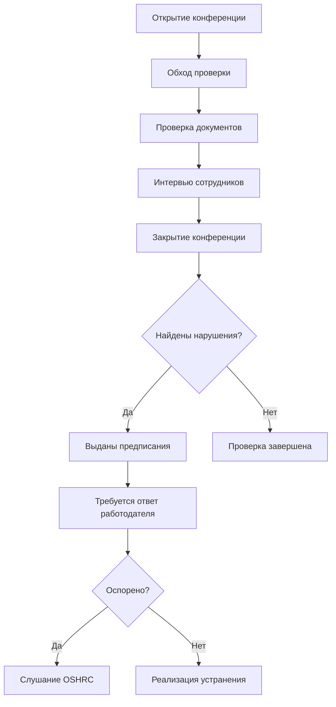

## Обзор

Обучение безопасности OSHA (Администрация по охране труда и здоровья) предоставляет техникам и подрядчикам HVAC необходимые знания об опасностях на рабочем месте, нормативных требованиях и безопасных рабочих практиках, установленных Законом об охране труда и здоровья 1970 года. Специалисты HVAC сталкиваются с уникальными рисками, охватывающими как стандарты строительства (29 CFR 1926), так и стандарты общей промышленности (29 CFR 1910), требующие комплексного обучения, которое охватывает монтажные, техническое обслуживание и сервисные работы в различных условиях.

Программы информирования о безопасности OSHA предоставляют стандартизированное обучение безопасности, признанное на всей территории страны, удовлетворяя многие требования государственных и муниципальных органов для доступа на объект, одновременно снижая показатели травматизма, расходы на страхование рабочих и нарушения нормативных требований.

## Нормативно-правовая база

### Полномочия OSHA и правоприменение

OSHA действует в соответствии с Общим положением об обязанностях, требующим от работодателей предоставлять рабочие места, "свободные от признанных опасностей, которые причиняют или могут причинить смерть или серьезный вред здоровью". Для операций HVAC это включает:

- Монтажные работы, регулируемые стандартами строительства (29 CFR 1926)
- Сервисные и техническое обслуживание работы в соответствии со стандартами общей промышленности (29 CFR 1910)
- Обращение с хладагентом в соответствии со стандартом ASHRAE Standard 15 (на который ссылается OSHA)
- Государственные нормативные требования в штатах с утвержденными OSHA государственными планами

### Процесс проверки и выдачи предписаний

OSHA проводит проверки на рабочих местах, вызванные несчастными случаями со смертельным исходом, катастрофами, жалобами рабочих, направлениями и плановыми проверками отраслей высокого риска. Процесс проверки следует определенной последовательности:

### Категории нарушений и штрафы

Нарушения OSHA влекут за собой постепенно увеличивающиеся штрафы на основе серьезности и истории работодателя:

| Тип нарушения | Определение | Диапазон штрафов | Примеры HVAC |
|----------------|------------|-------------------|---------------|
| **De Minimis** | Отсутствие прямой связи с безопасностью/здоровьем | Без штрафа | Незначительные проблемы с уборкой |
| **Other-Than-Serious** | Может вызвать травму, но маловероятно вызвать смерть/серьезный вред | 0–$16,131 | Отсутствующие паспорта безопасности материалов |
| **Serious** | Существенная вероятность смерти или серьезного вреда | $1,000–$16,131 | Отсутствие защиты от падения |
| **Willful** | Намеренное или сознательное нарушение | $11,524–$161,323 | Намеренное отключение устройств безопасности |
| **Repeat** | Нарушение ранее цитированного стандарта | 0–$161,323 | То же нарушение защиты от падения после предписания |
| **Failure to Abate** | Неисправление предыдущего нарушения | $16,131 в день после истечения срока устранения | Неустановка требуемых ограждений |

*Суммы штрафов ежегодно корректируются с учетом инфляции (данные 2024 года)*

## Программы информирования о безопасности OSHA

### Обучение в строительстве и общей промышленности

Специалисты HVAC требуют как знания строительства, так и общей промышленности в зависимости от вида деятельности:

**Стандарты строительства (29 CFR 1926) применяются при:**
- Установке новых систем HVAC в зданиях, находящихся в стадии строительства
- Выполнении крупных реконструкций или замене оборудования
- Работе на крышах при первоначальной установке
- Такелажных и монтажных работах с использованием кранов или воздушных подъемников
- Создании отверстий воздуховодов через структурные элементы

**Стандарты общей промышленности (29 CFR 1910) применяются при:**
- Обслуживании существующего оборудования HVAC в занятых зданиях
- Выполнении профилактического обслуживания и замены фильтров
- Диагностике и ремонте работающих систем
- Работе в установленных механических помещениях и пространстве оборудования
- Проведении плановых проверок и испытаний

Многие компании HVAC требуют как 10-часового обучения "Строительство", так и 10-часового обучения "Общая промышленность" для обеспечения комплексного охвата.

### Сравнение уровней обучения

| Характеристика | Курс на 10 часов | Курс на 30 часов |
|---------|----------------|----------------|
| **Целевая аудитория** | Рабочие начального уровня | Начальники, персонал по безопасности |
| **Длительность** | 10 часов контактного обучения | 30 часов контактного обучения |
| **Основные темы** | Введение, Focus Four | Все темы 10-часового курса плюс дополнительные модули |
| **Факультативные часы** | 4–6 часов | 16–18 часов |
| **Квалификация компетентного лица** | Нет | Частичная (требуется дополнительное обучение) |
| **Типичная стоимость** | $75–150 | $250–450 |
| **Период завершения** | 2 дня или 6 месяцев онлайн | 4 дня или 6 месяцев онлайн |
| **Действительность карточки** | Без срока истечения (рекомендуется повторное обучение каждые 5 лет) | Без срока истечения (рекомендуется повторное обучение каждые 5 лет) |

### HVAC-специфические категории опасностей

Обучение OSHA для специалистов HVAC должно охватывать специфичные для отрасли факторы воздействия, организованные по серьезности и частоте:

**Приоритет 1: Focus Four опасности (73% смертей в строительстве)**

1. **Падения** — работа с оборудованием на крыше, доступ по лестнице, возвышенные установки
2. **Поражение электрическим током** — высоковольтные подключения, работа с энергизированными цепями
3. **Удар предметом** — такелаж оборудования, движущаяся техника, падающие инструменты
4. **Зажатие/между предметами** — вращающееся оборудование, точки защемления, траншеи

**Приоритет 2: HVAC-критичные факторы воздействия**

5. **Замкнутые пространства** — механические помещения, пленумы, подвальные части оборудования
6. **Опасности хладагента** — удушье, химические ожоги, выброс давления
7. **Тепловой стресс** — тепловое истощение на крышах, холодное воздействие в холодильных системах
8. **Респираторные опасности** — газы сгорания, разложение хладагента, плесень
9. **Шумовое воздействие** — помещения с механическим оборудованием, области с компрессорами
10. **Эргономические нагрузки** — поднятие оборудования, надголовная работа, повторяющиеся движения

## Анализ опасностей на основе физики

### Расчеты энергии падения

Системы защиты от падения должны остановить падение до того, как рабочий коснется нижних уровней. Общее расстояние падения определяет требуемый зазор:

$$
D_{total} = D_{free} + D_{decel} + D_{harness} + D_{sag} + SF
$$

Где:
- $D_{free}$ = расстояние свободного падения перед активацией системы (максимум 1,8 м согласно OSHA)
- $D_{decel}$ = расстояние замедления (максимум 1,1 м для персональных систем защиты от падения)
- $D_{harness}$ = растяжение привязи и скольжение D-кольца (типично 0,3 м)
- $D_{sag}$ = провисание вертикальной линии или удлинение (варьируется в зависимости от системы)
- $SF$ = коэффициент безопасности (минимум 0,6 м рекомендуемо)

Для типичного техника HVAC (1,83 м ростом) работающего на крыше с 1,8-метровым амортизирующим тросом, прикрепленным к якорю на уровне работ:

$$
D_{total} = 1,8 + 1,1 + 0,3 + 0 + 0,6 = 3,8 \text{ м минимальный требуемый зазор}
$$

Этот расчет показывает, что работа на крышах часто требует повышенных точек крепления или более коротких тросов для предотвращения контакта с землей.

### Энергия электрической дуги

Инциденты с электрической дугой во время электротехнических работ HVAC выделяют тепловую энергию, пропорциональную току замыкания и времени отключения:

$$
E = \frac{4.184 \times C_f \times V \times I \times t}{D^2}
$$

Где:
- $E$ = энергия инцидента (кал/см²)
- $C_f$ = коэффициент расчета (варьируется в зависимости от оборудования, типично 1,0–1,5)
- $V$ = напряжение системы (В)
- $I$ = ток трехфазного короткого замыкания (кА)
- $t$ = длительность дуги/время отключения (сек)
- $D$ = расстояние работы от источника дуги (дюймы)

Для оборудования 480В трехфазного тока, распространенного в коммерческом HVAC:

$$
E = \frac{4.184 \times 1.5 \times 480 \times 25 \times 0.1}{18^2} = 23,3 \text{ кал/см}^2
$$

Этот уровень энергии требует PPE (средств индивидуальной защиты) категории 3, устойчивой к дуге (минимальный рейтинг 25 кал/см²), демонстрируя, почему обесточивание оборудования через блокировку/опломбирование остается предпочтительной безопасной рабочей практикой.

### Опасность вытеснения хладагента

Утечки хладагента в замкнутых пространствах вытесняют кислород из-за более высокого молекулярного веса. Минимальная необходимая скорость вентиляции для поддержания безопасных уровней кислорода (19,5%) следует уравнению:

$$
Q = \frac{\dot{m}_r \times \frac{MW_{air}}{MW_{ref}}}{0.21 \times \rho_{air}}
$$

Где:
- $Q$ = требуемая скорость вентиляции (м³/ч)
- $\dot{m}_r$ = скорость утечки хладагента (кг/мин)
- $MW_{air}$ = молекулярная масса воздуха (28,97 г/моль)
- $MW_{ref}$ = молекулярная масса хладагента (например, 86,2 г/моль для R-410A)
- $\rho_{air}$ = плотность воздуха (1,2 кг/м³ при стандартных условиях)

Для катастрофической утечки R-410A в размере 0,45 кг/мин в механическом помещении:

$$
Q = \frac{0,45 \times \frac{28,97}{86,2}}{0,21 \times 1,2} = \frac{0,151}{0,252} = 0,6 \text{ м}^3\text{/мин}
$$

ASHRAE Standard 15 требует механической вентиляции, когда количество хладагента превышает предел объема помещения (RVL), рассчитываемый как:

$$
RVL = \frac{m_{ref}}{h_c} \times 1000
$$

Где $m_{ref}$ — общий запас хладагента (кг) и $h_c$ — предел концентрации хладагента (кг/1000 м³).

## Компоненты программы обучения

### Требования к структуре курса

Авторизованное обучение OSHA должно включать:

**Обязательные элементы:**
- Введение в OSHA (минимум 2 часа для 10-часового, 4 часа для 30-часового)
- Ходящие-рабочие поверхности и защита от падения (минимум 2 часа)
- Электробезопасность (минимум 1 час)
- Средства индивидуальной защиты (минимум 1 час)

**Факультативные модули для HVAC:**
- Вход в замкнутое пространство (1–2 часа)
- Идентификация опасности и GHS (1–2 часа)
- Обращение с материалами и такелаж (1–2 часа)
- Защита органов дыхания (1 час)
- Защита машин (1 час)
- Патогены, передающиеся через кровь (для сервисных техников, входящих в жилые помещения)

### Компетентное лицо в сравнении с квалифицированным лицом

Стандарты OSHA часто требуют "компетентного" или "квалифицированного" лица для конкретных задач. Понимание этих обозначений критично:

**Компетентное лицо:**
- Способно выявлять существующие и предсказуемые опасности
- Имеет полномочия принимать своевременные корректирующие меры
- Назначается работодателем на основе подготовки и опыта
- Требуется для: надзора за защитой от падения, монтажа лесов, мониторинга замкнутого пространства, земляных работ

**Квалифицированное лицо:**
- Обладает степенью, сертификатом или профессиональным статусом
- Имеет обширные знания и подготовку по предмету
- Требуется для: работы с электрооборудованием под напряжением, управления кранами, структурных проверок

Обучение OSHA на 10 часов и 30 часов САМО ПО СЕБЕ НЕ квалифицирует лиц в качестве компетентного или квалифицированного лица. Требуется дополнительное обучение, специфичное для конкретной задачи, и назначение работодателя.

### Авторизация инструктора

Только авторизованные инструкторы информирования OSHA могут проводить 10-часовые и 30-часовые курсы и выдавать сертификаты об окончании. Авторизация требует:

1. Завершение курса инструктора OSHA для соответствующей области (строительство или общая промышленность)
2. Поддержание авторизации через повышение квалификации
3. Соблюдение требований и учебной программы курса OSHA
4. Использование актуальных учебных материалов, предоставленных OSHA

Подрядчики HVAC должны проверить учетные данные инструктора перед зачислением сотрудников.

## Реализация и документирование

### Записи об обучении

OSHA требует от работодателей ведения документации об обучении, демонстрирующей:

- Имя и идентификацию сотрудника
- Дату обучения и название курса
- Имя инструктора и его учетные данные
- Краткое содержание курса
- Доказательство понимания сотрудником (баллы тестов, записи участия)
- Даты переподготовки при необходимости

Записи должны храниться в течение всего периода трудоустройства плюс 30 лет для определенных воздействий (асбест, свинец, патогены, передающиеся через кровь).

### Триггеры повторного обучения

Хотя карточки информирования OSHA не имеют срока истечения, переподготовка требуется при:

- Демонстрация сотрудником неадекватных знаний во время надзора
- Изменения на рабочем месте делают предыдущее обучение неактуальным
- Новое оборудование или процессы вводят новые опасности
- Обновление нормативных стандартов
- После серьезного инцидента или близкого вызова

Лучшая практика рекомендует комплексное повторное обучение каждые 3–5 лет минимум.

### Интеграция с программами безопасности

Обучение информирования OSHA составляет основу комплексных программ безопасности, которые должны также включать:

## Ресурсы нормативного соответствия

**Первичные стандарты OSHA для HVAC:**

- 29 CFR 1926.501–503 — защита от падения (строительство)
- 29 CFR 1926.1200–1213 — замкнутые пространства в строительстве
- 29 CFR 1910.146 — требующие разрешения замкнутые пространства (общая промышленность)
- 29 CFR 1910.147 — блокировка/опломбирование опасной энергии
- 29 CFR 1926.416–417 — электробезопасность в строительстве
- 29 CFR 1910.132–138 — средства индивидуальной защиты
- 29 CFR 1926.1053 — лестницы (строительство)
- 29 CFR 1910.178 — моторизованные промышленные тележки (электрокары)

**Связанные отраслевые стандарты:**

- ANSI/ASHRAE Standard 15 — Стандарт безопасности для систем охлаждения
- ANSI/ASHRAE Standard 62.1 — Вентиляция для приемлемого качества внутреннего воздуха
- NFPA 70 — Национальный электротехнический кодекс
- ANSI Z359 Код защиты от падения
- ANSI/ASSE Z117.1 — Требования безопасности для замкнутых пространств

## Возврат инвестиций

Обучение OSHA обеспечивает измеримые финансовые выгоды помимо соответствия нормативным требованиям:

**Прямое снижение затрат:**
- Снижение страховых премий по страхованию рабочих (типично 5–15% снижения)
- Сокращение медицинских расходов и расходов на выплаты от травм
- Избежание цитирования и штрафов OSHA
- Снижение повреждения оборудования от инцидентов

**Косвенные выгоды:**
- Повышение производительности за счет эффективных безопасных рабочих практик
- Снижение отсутствий и текучести кадров
- Улучшенная репутация компании и преимущество при конкурсном назначении
- Снижение юридической ответственности

Исследования показывают, что комплексное обучение безопасности снижает показатели травматизма на 20–40% в течение первого года реализации, с постоянными улучшениями благодаря устойчивым программам.

## Компоненты

- Строительство OSHA 10-часов
- Строительство OSHA 30-часов
- Общая промышленность OSHA
- Требования по ведению отчетности
- Процедуры проверки
