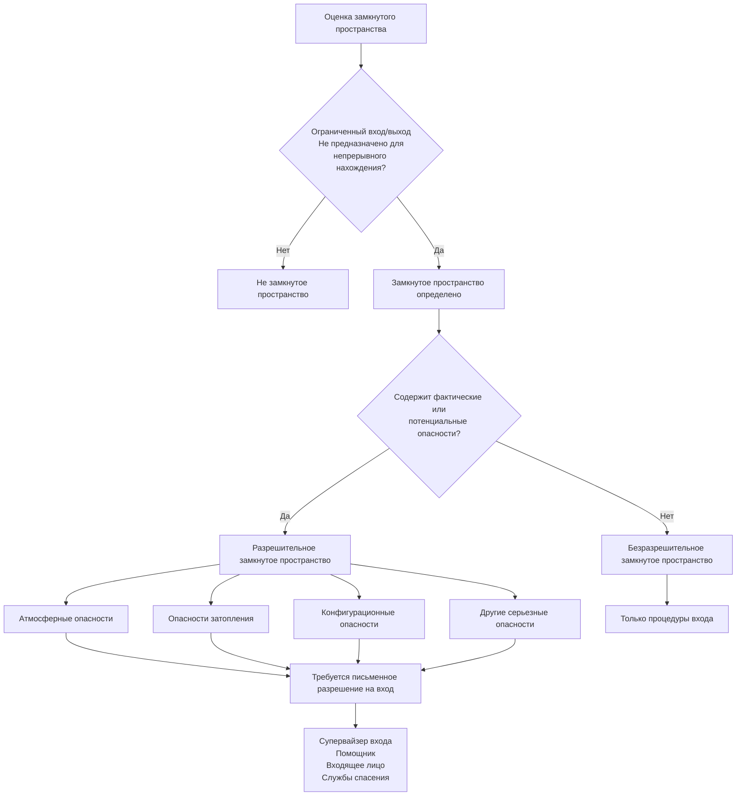
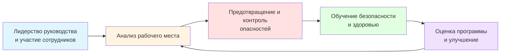

## Обзор

Обучение безопасности в строительстве OSHA 30 часов предоставляет продвинутое обучение для супервайзеров HVAC, прорабов, руководителей проектов и координаторов безопасности. Эта комплексная программа расширяет основополагающий 10-часовой курс, подчеркивая методы идентификации, избежания и контроля опасностей, необходимые для управления безопасностью на строительных объектах.

Разработанная для персонала с руководящей ответственностью, 30-часовая программа подготавливает специалистов HVAC к выполнению ролей "компетентного лица" и "квалифицированного лица", как определено в 29 CFR 1926. Обучение рассматривает сложные сценарии, возникающие при крупномасштабных установках HVAC, вводе в эксплуатацию механических систем и координации между профессиями на строительных объектах.

## Структура программы и продолжительность

30-часовой курс должен быть завершен в течение трех месяцев и доставлен авторизованным тренером OSHA. Содержание разделено между обязательными основными темами и факультативными модулями, адаптированными к операциям строительства HVAC.

### Обязательные основные темы (минимум 20 часов)

- Введение в OSHA и строительную промышленность (2 часа)
- Управление программами безопасности и здоровья (2 часа)
- Системы защиты от падения (расширенное освещение 4 часа)
- Электробезопасность (расширенное освещение 3 часа)
- Средства индивидуальной защиты (2 часа)
- Опасности для здоровья в строительстве (2 часа)
- Лестницы и трапы (1 час)
- Бетонные и каменные работы (1 час)
- Замкнутые пространства в строительстве (2 часа)
- Ведение записей и отчетность (1 час)

### Факультативные темы, релевантные для HVAC (минимум 10 часов)

- Земляные работы и отрывка траншей (системы подземного трубопровода)
- Монтаж стальных конструкций (конструктивные опоры оборудования)
- Сварка, резка и пайка (изготовление холодильных трубопроводов)
- Обработка и хранение материалов (такелаж оборудования)
- Краны, дерики и подъемные системы (размещение кровельного оборудования)
- Защита и предотвращение пожаров
- Системы лесов (приподнятые рабочие платформы)

## Продвинутые опасности строительства HVAC

### Безопасность земляных работ и отрывки траншей (29 CFR 1926 Подраздел P)

Подземные приложения HVAC требуют земляных работ для:
- Полей контуров геотермальных тепловых насосов
- Распределительных трубопроводов охлажденной воды
- Подземных холодильных линий между удаленными конденсаторами
- Паровых и трубопроводов конденсата
- Трубопроводов водоснабжения здания к охладительным градирням

**Классификация грунтов и системы защиты**

OSHA требует классификации грунта компетентным лицом перед входом в земляные работы глубиной ≥1,2 м. Три типа грунтов определяют конструкцию защитной системы:

| Тип грунта | Неограниченная прочность на сжатие | Максимально допустимый склон | Приложения HVAC |
|-----------|----------------------------------|-------------------------|-------------------|
| Тип A (глина, неветрящееся основание) | ≥73,2 кПа | 3/4:1 (53°) | Редко в земляных работах из-за трещинообразования |
| Тип B (ил, песчаный суглинок) | 24,2–73,2 кПа | 1:1 (45°) | Наиболее распространен в подземных коммуникационных траншеях |
| Тип C (гравий, песок, обводненный грунт) | <24,2 кПа | 1.5:1 (34°) | Области водоносного горизонта, засыпанные зоны |

**Выбор системы защиты**

Боковое давление грунта на стенки траншей соответствует:

$$P = \gamma \cdot z \cdot K_a$$

Где:
- $P$ = боковое давление грунта (кПа)
- $\gamma$ = удельный вес грунта (обычно 1570–2035 кПа/м)
- $z$ = глубина ниже поверхности (м)
- $K_a$ = коэффициент активного давления грунта (0,3–0,5 для зернистых грунтов)

Для траншеи глубиной 3 м в грунте типа B ($\gamma = 1885$ кПа/м, $K_a = 0,4$):

$$P = 1885 \times 3 \times 0,4 = 2262 \text{ кПа у дна траншеи}$$

Это давление требует использования траншейных ящиков, систем укрепления или откосов для предотвращения обрушений, которые ежегодно уносят жизни 40–50 рабочих.

**Обязанности компетентного лица для земляных работ HVAC**

- Ежедневные проверки перед входом рабочих и после дождя, промерзания или нарушения грунта
- Тестирование грунта с использованием портативного пенетрометра, сдвиговых лопаток или проверки большим пальцем
- Верификация расположения коммуникаций (вызов 811 минимум за 48 часов до копания)
- Атмосферное тестирование в траншеях >1,2 м глубиной (кислород 19,5–23,5%, взрывчатый газ <10% LEL)
- Размещение выхода в пределах 7,6 м бокового расстояния для траншей ≥1,2 м глубиной
- Размещение кучи грунта минимум на 0,6 м от края земляных работ
- Удаление скоплений воды и реализация защиты движения

### Управление программой замкнутых пространств (29 CFR 1926.1200–1213)

Стандарт OSHA 2015 года по замкнутым пространствам в строительстве различает разрешительные и безразрешительные замкнутые пространства на основе серьезности опасности. Супервайзеры HVAC должны установить письменные программы, определяющие все замкнутые пространства на объектах.

**Классификация замкнутых пространств HVAC**

**Разрешительные замкнутые пространства HVAC**

| Тип пространства | Атмосферные опасности | Физические опасности | Процедуры входа |
|------------|---------------------|------------------|------------------|
| Хранилища охладителя | Утечка R-123 (ПДК 10 ppm), недостаток кислорода | Ограниченный выход, потенциал затопления | Непрерывная принудительная вентиляция, мониторинг атмосферы |
| Котельные (закрытые) | Газы сгорания (CO, NO₂), истощение кислорода | Высокотемпературные поверхности (>60°C) | Предварительное тестирование атмосферы, разрешения на горячие работы |
| Крупные воздуховоды (>106 см диаметр) | Накопление пыли, низкий кислород | Захват, асфиксия конфигурацией | Блокировка/маркировка, непрерывная вентиляция |
| Резервуары охладительных башен | Бактерии легионеллы, сероводород из биопленки | Утопление, захват | Защита органов дыхания, система спасения |
| Механические комнаты на крыше (единственный вход) | Утечки холодильного агента, неадекватная вентиляция | Запутывание оборудования | Мониторинг помощником, системы связи |

**Протокол атмосферного тестирования**

Последовательность тестирования следует принципам физики стратификации газов на основе молекулярного веса относительно воздуха:

1. **Кислород** (МВ 32, тестируется первым, так как вытесняется более тяжелыми/легкими газами): требуется 19,5–23,5%
2. **Горючие газы** (тестируется вторым): <10% LEL для входа, >20% LEL вызывает эвакуацию
3. **Токсичные газы** (тестируется третьим): H₂S <10 ppm, CO <35 ppm, холодильные агенты ниже ПДК

Для выбросов холодильного агента вытеснение кислорода можно рассчитать:

$$\text{O}_2\% = 20.9\% \times \left(1 - \frac{M_{\text{ref}}}{V_{\text{space}} \times \rho_{\text{air}}}\right)$$

Где:
- $M_{\text{ref}}$ = масса выпущенного холодильного агента (кг)
- $V_{\text{space}}$ = объем замкнутого пространства (м³)
- $\rho_{\text{air}}$ = плотность воздуха (1,2 кг/м³ в стандартных условиях)

**Компоненты системы разрешений на вход**

Комплексное разрешение на вход документирует:
- Идентификацию и расположение пространства
- Цель и продолжительность входа
- Авторизованные входящие лица, помощников и супервайзера входа
- Результаты предварительного атмосферного тестирования
- Список оборудования (вентиляция, мониторинг, СИЗ, связь, спасение)
- Процедуры связи между входящим и помощником
- Уведомление службы спасения и верификация времени ответа 5 минут
- Условия истечения разрешения

### Монтаж стальных конструкций и конструктивные опоры (29 CFR 1926 Подраздел R)

Крупные установки HVAC требуют конструктивных стальных опор для:
- Платформ кровельного оборудования и бортиков
- Подвешенных воздухообрабатывающих агрегатов и воздуховодов
- Каркасов охладительных башен
- Оснований с виброизоляционными пружинами
- Сейсмических систем крепления (требуемых по ASCE 7 и IBC)

**Анализ пути нагрузки для опор оборудования**

Мертвые нагрузки оборудования и эксплуатационные нагрузки передаются через:

1. **База оборудования → Виброизоляционные пружины/прокладки**
   - Нагрузки вибрации компрессора: $F_{\text{vib}} = m \cdot e \cdot \omega^2$
   - Где $m$ = несбалансированная масса, $e$ = эксцентриситет, $\omega$ = частота вращения

2. **Система изоляции → Конструктивная рама**
   - Верификация прогиба рамы: $\delta < L/360$ по ASHRAE Applications

3. **Конструктивная рама → Конструкция здания**
   - Распределение точечной нагрузки через балки
   - Верификация сосредоточенной нагрузки против вместимости здания

**Защита от падения при установке оборудования на стали**

Работа на рамах стальных конструкций требует:
- Контролируемых зон доступа для рабочих, подключающих конструктивные элементы
- Систем личного предохранителя от падения для всех работ >4,6 м (исключение монтажа стальных конструкций выше 9 м применяется только к структурным рабочим, НЕ установщикам HVAC)
- Плана защиты от падения, когда обычные системы создают большую опасность
- Обозначенной зоны монтажных работ, ограничивающей персонал без необходимости

### Безопасность сварки, резки и пайки (29 CFR 1926 Подраздел J)

Изготовление холодильных трубопроводов включает:
- **Пайку медных трубок** (фосфор-медь-серебряные сплавы при 650–815°C)
- **Сварку стальных трубопроводов** (паровые, охлажденные водой, горячие водяные системы)
- **Операции резки** (резка факелом опор, модификация воздуховодов)

**Предотвращение пожаров в механических помещениях**

Источники воспламенения горячих работ представляют серьезные риски пожара в механических комнатах, содержащих:
- Горючие материалы изоляции (стекловолокно с крафт-облицовкой, эластомерная пена)
- Легковоспламеняющиеся холодильные агенты (R-290 пропан, R-32 с LFL 13,3%)
- Гидравлические жидкости и смазочные масла
- Деревянные распорки и материалы каркасов

**Требования разрешения на горячие работы**

OSHA требует письменных разрешений, когда горячие работы выполняются в местах, где:
- Оросители повреждены
- Горючие материалы находятся в пределах 10,7 м
- Стены с перегородками скрывают горючую конструкцию
- Присутствуют горючие воздуховоды или конвейерные системы с путями распространения пожара

Персонал пожарной охраны должен:
- Держать заряженный огнетушитель (минимум 20-BC рейтинг)
- Мониторить в течение 60 минут после завершения горячих работ
- Понимать процедуры активации пожарной сигнализации
- Верифицировать удаление или защиту горючего материала

**Опасности дымов пайки**

Кадмий-серебряные припои (в настоящее время в основном снятые с производства) генерировали токсичные дымы оксида кадмия. Современные фосфор-медь-серебряные сплавы все еще производят:
- Дымы оксида меди (ПДК OSHA 0,1 мг/м³ как Cu)
- Оксид серебра (ПДК OSHA 0,01 мг/м³ как Ag)
- Оксиды фосфора, вызывающие раздражение дыхательных путей

Адекватная вентиляция поддерживает воздействие ниже допустимых пределов, используя местный отвод или общее разбавление:

$$Q = \frac{403 \times G}{\text{ПДК}}$$

Где:
- $Q$ = скорость вентиляции (CFM (м³/ч))
- $G$ = скорость образования загрязнителя (мг/мин)
- ПДК = предельно допустимая концентрация (мг/м³)

### Управление программой безопасности и здоровья

Добровольные рекомендации OSHA по управлению программой безопасности и здоровья предоставляют основу для снижения производственных травм. Эффективные программы включают:

**Основные элементы программы**

**Компоненты программы, специфичные для HVAC**

1. **Лидерство руководства**
   - Письменная политика безопасности, подписанная старшим руководством
   - Выделенный координатор безопасности для многомесячных операций
   - Показатели эффективности безопасности в оценках супервайзера
   - Выделение ресурсов для СИЗ, обучения и инженерных управлений

2. **Анализ рабочего места**
   - Оценки опасностей, специфичные для каждой фазы проекта перед началом
   - Ежедневные брифинги по безопасности, рассматривающие опасности, специфичные для объекта
   - Системы отчетности о близких вызовах, поощряющие активное выявление
   - Анализ коренной причины для инцидентов и травм

3. **Предотвращение и контроль опасностей**
   - Инженерные управления (защита машин, системы вентиляции, якоря защиты от падения)
   - Административные управления (рабочие разрешения, процедуры блокировки, графики ротации)
   - Программы СИЗ с оценками опасностей и тестированием подгонки
   - Профилактическое обслуживание, исключающее опасности оборудования

4. **Программы обучения**
   - Ориентация новых сотрудников, охватывающая политики безопасности компании
   - Обучение, специфичное для задач, по замкнутым пространствам, защите от падения, электрическим работам
   - Инструктажи по безопасности, укрепляющие безопасные практики
   - Повторное обучение ежегодно или при обнаружении недостатков

5. **Оценка программы**
   - Ежемесячные проверки безопасности оборудования и рабочих мест
   - Ежегодный обзор программы, обновляющий процедуры и обучение
   - Анализ тренда травм/заболеваний, выявляющий системные проблемы
   - Интеграция обратной связи комитета безопасности сотрудников

### Ведение записей и отчетность OSHA (29 CFR 1904)

Подрядчики HVAC с 11+ сотрудниками должны вести записи о травмах и заболеваниях, используя формы OSHA 300, 300A и 301.

**Критерии регистрации инцидентов**

Связанные с работой травмы и заболевания регистрируются, если они приводят к:
- Смерти
- Дням отсутствия на работе
- Ограниченной работе или переводу должности
- Медицинскому лечению сверх первой помощи
- Потере сознания
- Значительной травме/заболеванию, диагностированному врачом

**Регистрируемые инциденты, специфичные для HVAC**

| Тип инцидента | Регистрируемость | Колонка OSHA |
|---------------|---------------|-------------|
| Химический ожог от холодильного агента, требующий рецептурного крема | Регистрируемо | Медицинское лечение |
| Разрез из листового металла, требующий швов | Регистрируемо | Медицинское лечение |
| Деформация спины, ограничивающая подъем на 3 дня | Регистрируемо | Ограниченная работа |
| Тепловое истощение, требующее внутривенных жидкостей | Регистрируемо | Медицинское лечение |
| Ампутация пальца от незащищенного вентилятора | Регистрируемо | Дни отсутствия на работе |
| Вызванная шумом потеря слуха (STS ≥10 дБ среднее значение при 2000, 3000, 4000 Гц) | Регистрируемо | Колонка потери слуха |

**Расчеты показателей инцидентов**

Общий показатель записываемых инцидентов (TRIR) определяет эффективность безопасности:

$$\text{TRIR} = \frac{\text{Количество записываемых случаев} \times 200,000}{\text{Общее количество часов, отработанных всеми сотрудниками}}$$

Коэффициент 200 000 представляет 100 сотрудников, работающих полный рабочий день, 40 часов/неделю на протяжении 50 недель.

Для подрядчика HVAC с 50 сотрудниками, отработавшими 100 000 часов ежегодно и имевшими 6 записываемых инцидентов:

$$\text{TRIR} = \frac{6 \times 200,000}{100,000} = 12.0$$

Этот показатель превышает среднее значение по строительной промышленности в 3,1, указывая на необходимость улучшения программы.

**Требования к отчетности**

В установленные сроки работодатели должны отчитаться перед OSHA:
- **8 часов**: Любая связанная с работой смертность
- **24 часа**: Любая связанная с работой госпитализация в стационар, ампутация или потеря зрения

Отчетность происходит через бесплатный номер OSHA (1-800-321-OSHA), онлайн-портал или в местный офис.

## Обозначения компетентного лица

Стандарты OSHA требуют "компетентных лиц" для конкретных видов деятельности с высокой опасностью. Компетентное лицо обладает:
- Знаниями для выявления существующих и предсказуемых опасностей
- Полномочиями предпринять своевременные корректирующие меры по устранению опасностей
- Обучением, специфичным для контролируемой операции

**Требования компетентного лица HVAC**

| Деятельность | Стандарт OSHA | Обязанности компетентного лица |
|----------|---------------|-------------------------|
| Земляные работы >1,2 м глубиной | 1926.651(k) | Ежедневные проверки, классификация грунта, выбор системы защиты |
| Системы защиты от падения | 1926.502 | Выявление опасностей падения, выбор соответствующих систем, проверка оборудования |
| Монтаж лесов | 1926.451 | Контроль сборки, проведение проверок, санкционирование использования |
| Вход в замкнутое пространство | 1926.1200 | Классификация пространств, тестирование атмосферы, санкционирование разрешений входа |
| Безопасность трапов | 1926.1053 | Проверка трапов, обеспечение правильного использования и позиционирования |

Обучение OSHA 30 часов предоставляет фундаментальные знания, но НЕ автоматически присваивает статус компетентного лица. Работодатели должны документировать дополнительное обучение и демонстрированную компетентность.

## Сертификация и повышение квалификации

По завершении всех требуемых модулей и сдаче выпускного экзамена участники получают:
- Удостоверение OSHA 30-часового строительства (неограниченная срок действия)
- Сертификат завершения курса DOL
- Подробную выписку охватываемых тем

**Рекомендации по переподготовке**

Хотя OSHA не требует повторного обучения, лучшие практики отрасли рекомендуют:
- 30-часовое повторное обучение каждые 4–5 лет для сохранения актуальных знаний
- Дополнительное обучение при изменении стандартов (например, обновление замкнутых пространств в 2015 году, сертификация оператора крана в 2018 году)
- Ежегодный обзор процедур безопасности компании и полученных уроков

## Интеграция со стандартами качества и безопасности HVAC

Строительные стандарты OSHA дополняют отраслевые требования:

- **ASHRAE 15**: Стандарт безопасности для холодильных систем (вентиляция механических помещений, обнаружение холодильного агента)
- **NFPA 70**: Национальный электротехнический кодекс (требования электроустановки)
- **NFPA 70E**: Электробезопасность на рабочем месте (защита от дугового разряда, процедуры работ под напряжением)
- **ASME B31.5**: Холодильные трубопроводы и компоненты теплопередачи (гидроиспытания, материалы)
- **SMACNA**: Стандарты проектирования и установки систем воздуховодов HVAC

## Возврат инвестиций от обучения безопасности

Комплексное обучение безопасности снижает прямые и косвенные затраты:

**Избежанные прямые затраты**
- Премии по страхованию работников (сниженный модификатор опыта)
- Штрафы нарушений OSHA ($15 625 за серьезное нарушение, $156 259 за умышленное/повторное)
- Медицинские расходы и замена заработной платы
- Гонорары адвокатов и расходы судебного разбирательства

**Избежанные косвенные затраты**
- Задержки производства от расследований и корректирующих действий
- Повреждение оборудования и замена
- Обучение и ориентация замещающих рабочих
- Репутационный ущерб, влияющий на предложения по ставкам
- Проблемы морального духа сотрудников и удержания

Исследования показывают, что каждый доллар, инвестированный в обучение безопасности, возвращает 3–6 долларов за счет снижения инцидентов и повышения производительности.

## Требования по внедрению после обучения

Выпускники OSHA 30 часов должны преобразовать знания в действия:

1. **Проведение оценки опасностей, специфичных для объекта**, перед каждой фазой проекта
2. **Разработка письменных планов безопасности**, рассматривающих выявленные опасности
3. **Проведение регулярных собраний по безопасности** со всеми членами команды
4. **Выполнение проверок рабочих мест**, документирующих условия и корректирующие действия
5. **Ведение записей обучения**, демонстрирующих квалификацию компетентного лица
6. **Расследование инцидентов**, выявляющих коренные причины и реализующих меры предотвращения
7. **Обновление процедур безопасности**, основанное на извлеченных уроках и пересмотрах стандартов

Знания и навыки, приобретенные при 30-часовом обучении в строительстве OSHA, позиционируют супервайзеров HVAC для создания более безопасных рабочих мест, снижения нормативного воздействия и защиты самого ценного актива: рабочих, безопасно возвращающихся домой каждый день.

## Компоненты

- Расширенные темы OSHA 10
- Земляные работы и отрывка траншей
- Бетонные и каменные работы
- Монтаж стальных конструкций
- Сварка, резка и пайка
- Замкнутые пространства в строительстве
- Управление программой безопасности и здоровья
- Ведение записей и отчетность
