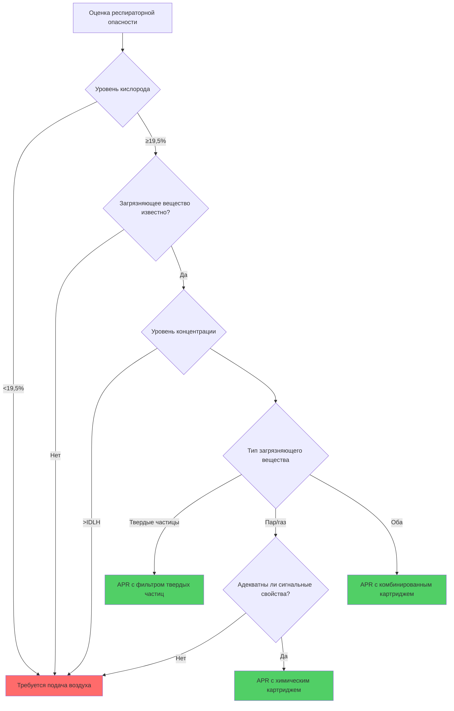

## Обзор респираторных опасностей при работе в системах HVAC

Техники HVAC сталкиваются с разнообразными респираторными опасностями, требующими надлежащей защиты: пары хладагентов, твердые частицы из теплоизоляции и сноса конструкций, споры плесени, продукты сгорания, атмосфера замкнутых пространств и химические пары от чистящих средств. Обучение защите органов дыхания гарантирует, что техники понимают оценку опасностей, выбор респиратора, правильное использование и физиологические ограничения.

Стандарт OSHA 1910.134 требует комплексных программ защиты органов дыхания на рабочих местах, где респираторные опасности невозможно устранить с помощью технических средств защиты. Работа в системах HVAC часто требует использования респираторов как основной или дополнительной защиты.

## Физика фильтрации и механизмы захвата частиц

Фильтры респиратора захватывают аэрозольные частицы посредством пяти различных физических механизмов, каждый из которых доминирует при разных размерах частиц:

**Перехват** происходит, когда частицы, следующие линиям потока воздуха, проходят в пределах одного радиуса частицы от волокна фильтра и прилипают благодаря силам Ван-дер-Ваальса. Этот механизм доминирует для частиц размером 0,3–1,0 мкм.

**Удар** захватывает более крупные частицы (>1,0 мкм), которые не могут следовать линиям потока воздуха вокруг волокон из-за инертности. Импульс частиц приводит их в контакт с волокнами.

**Диффузия** управляет захватом ультрамелких частиц (<0,1 мкм), проявляющих броуновское движение. Случайное тепловое движение заставляет частицы отклоняться от линий потока и контактировать с волокнами.

**Гравитационное осаждение** влияет на крупные частицы (>5 мкм), осаждающиеся на фильтрующий материал под действием силы тяжести при низкоскоростном потоке.

**Электростатическое притяжение** усиливает захват на всех размерах частиц, когда фильтры несут электростатический заряд, создавая кулоновские силы, которые притягивают частицы к волокнам.

**Наиболее проникающий размер частиц (MPPS)** возникает при примерно 0,3 мкм, где механизмы перехвата и диффузии наименее эффективны. Рейтинги эффективности фильтра нацелены на этот критический размер:

| Класс фильтра | Минимальная эффективность при MPPS | Типичные применения |
|--------------|----------------------------|----------------------|
| N95 | 95% | Общее воздействие твердых частиц |
| N99 | 99% | Высокие концентрации твердых частиц |
| N100 | 99,97% | Токсичные пыли, асбест |
| P95 | 95% (устойчивый к маслу) | Окружающая среда с масляным туманом |
| P100 | 99,97% (устойчивый к маслу) | Максимальная защита от твердых частиц |

## Типы респираторов и критерии выбора

### Воздухоочищающие респираторы (APR)

APR удаляют загрязняющие вещества из окружающего воздуха через фильтры или картриджи с сорбентом. Выбор зависит от типа загрязняющего вещества, его концентрации и наличия кислорода.

**Респираторы для защиты от твердых частиц** используют механическую фильтрацию для защиты от пыли, туманов и дымов. Перепад давления на фильтре увеличивается с загрузкой:

$$\Delta P = \frac{128 \mu L Q}{\pi d^4 N} + \rho \frac{Q^2}{2 A^2}$$

Где:
- $\Delta P$ = перепад давления на фильтре (Па)
- $\mu$ = динамическая вязкость воздуха (Па·с)
- $L$ = толщина фильтра (м)
- $Q$ = объемный расход (м³/с)
- $d$ = средний диаметр волокна (м)
- $N$ = количество пор
- $\rho$ = плотность воздуха (кг/м³)
- $A$ = площадь входного отверстия фильтра (м²)

**Респираторы с химическими картриджами** используют активированный уголь или химические сорбенты для удаления паров/газов. Время прорыва зависит от емкости картриджа и концентрации загрязняющего вещества:

$$t_b = \frac{W \cdot \eta}{C \cdot Q}$$

Где:
- $t_b$ = время прорыва (мин)
- $W$ = масса сорбента (г)
- $\eta$ = эффективность адсорбции (безразмерная)
- $C$ = концентрация загрязняющего вещества (г/м³)
- $Q$ = частота дыхания (м³/мин)

### Респираторы со вспомогательной подачей воздуха (SAR)

SAR подают дыхательный воздух из незагрязненного источника, обеспечивая более высокие коэффициенты защиты. Типы включают:

- **Респираторы с воздушной линией**: Непрерывный поток или система с избыточным давлением от источника сжатого воздуха
- **Автономный дыхательный аппарат (SCBA)**: Портативный запас воздуха для атмосфер IDLH

## Назначенные коэффициенты защиты и проверка герметичности

**Назначенный коэффициент защиты (APF)** представляет собой уровень защиты дыхания на рабочем месте, который надлежащим образом функционирующий респиратор обеспечивает надлежащим образом подогнанным и обученным пользователям:

$$APF = \frac{C_{ambient}}{C_{inhaled}}$$

Где:
- $C_{ambient}$ = концентрация загрязняющего вещества вне респиратора
- $C_{inhaled}$ = концентрация загрязняющего вещества внутри лицевой части

| Тип респиратора | APF | Максимальная концентрация использования |
|-----------------|-----|---------------------------|
| Полумаска APR | 10 | 10 × PEL |
| Полнолицевая маска APR | 50 | 50 × PEL |
| APR с электроприводом (свободная лицевая часть) | 25 | 25 × PEL |
| APR с электроприводом (прилегающая лицевая часть) | 50–1000 | Варьируется по типам |
| Подача воздуха (система с избыточным давлением) | 1000 | 1000 × PEL |
| SCBA (система с избыточным давлением) | 10 000 | Условия IDLH |

**Количественная проверка герметичности** измеряет реальное прилегание лицевой части к лицу с использованием подсчета частиц или контролируемого отрицательного давления:

$$FF = \frac{C_{ambient}}{C_{facepiece}}$$

Где $FF$ = коэффициент герметичности (безразмерный). OSHA требует минимальные коэффициенты герметичности 100 для полумасок и 500 для полнолицевых масок.

## Физиология дыхания и работа дыхания

Респираторы создают дополнительное сопротивление дыханию, влияющее на дыхательную механику. Работа дыхания увеличивается с сопротивлением фильтра:

$$W = \int P \, dV$$

Где:
- $W$ = работа дыхания (Дж)
- $P$ = дифференциальное давление (Па)
- $V$ = объем перемещаемого воздуха (м³)

Стандарты максимального сопротивления вдоху ограничивают нагрузку на рабочего:

- **Начальное сопротивление**: ≤35 мм вод.ст. при 85 л/мин для полумасок
- **Начальное сопротивление**: ≤45 мм вод.ст. при 85 л/мин для полнолицевых масок
- **Сопротивление в конце срока службы**: Не должно превышать эти значения более чем на 25%

**Метаболические потребности** при работе в системах HVAC значительно варьируются:

| Вид деятельности | Метаболическая мощность | Частота дыхания | Минутный объем |
|----------|----------------|----------------|---------------|
| Легкая работа (диагностика) | 150–200 Вт | 15–20 вдохов/мин | 20–30 л/мин |
| Умеренная работа (установка) | 200–350 Вт | 20–30 вдохов/мин | 30–50 л/мин |
| Тяжелая работа (обращение с оборудованием) | 350–500 Вт | 30–40 вдохов/мин | 50–75 л/мин |

## Медицинское обследование и ограничения

OSHA требует медицинского обследования перед использованием респиратора. Физиологические факторы, влияющие на переносимость респиратора, включают:

**Сердечно-сосудистая способность**: Респираторы увеличивают нагрузку на сердце на 5–15% из-за сопротивления дыханию. Работники с сердечными заболеваниями требуют медицинского разрешения.

**Функция легких**: Сниженная жизненная емкость легких (FVC <80% от прогнозируемого) может исключить использование прилегающих респираторов. Спирометрическое тестирование оценивает дыхательный резерв.

**Психологические факторы**: Клаустрофобия влияет на приблизительно 10% рабочих. Респираторы со свободной лицевой частью и электроприводом могут обеспечить альтернативы.

**Тепловой стресс**: Респираторы снижают испарительное охлаждение и повышают внутреннюю температуру. В высокотемпературных условиях:

$$Q_{stored} = M - W - E - C - R - K$$

Где использование респиратора в основном снижает $E$ (испарительная теплопотеря), увеличивая риск теплового стресса.

## Элементы программы и документация

Комплексные программы защиты органов дыхания включают:

1. **Письменная программа**: Процедуры выбора респиратора, медицинского обследования, проверки герметичности, использования и техническое обслуживание
2. **Оценка опасностей**: Документированная оценка респираторных опасностей на рабочем месте
3. **Выбор респиратора**: Надлежащие устройства для выявленных опасностей
4. **Медицинское обследование**: Оценка врачом перед первоначальным использованием и периодическая переоценка
5. **Проверка герметичности**: Ежегодное количественное или качественное тестирование прилегающих респираторов
6. **Обучение**: Первоначальное и ежегодное повторное обучение, охватывающее правильное использование, ограничения и процедуры в чрезвычайных ситуациях
7. **Техническое обслуживание**: Процедуры осмотра, очистки, дезинфекции, хранения и ремонта
8. **Оценка программы**: Регулярная оценка эффективности программы

## Аспекты, относящиеся к хладагентам

Воздействие хладагентов представляет уникальные проблемы. Многие хладагенты тяжелее воздуха и вытесняют кислород в замкнутых пространствах. R-744 (CO₂) при концентрациях >3% вызывает респираторный дистресс даже при достаточном содержании кислорода.

**Пределы воздействия** для распространенных хладагентов:

| Хладагент | 8-часовое ПДК | STEL | Требование к респиратору |
|-------------|----------|------|------------------------|
| R-134a | 1000 ppm | — | APR если >1000 ppm |
| R-410A | 1000 ppm | — | APR если >1000 ppm |
| R-717 (аммиак) | 25 ppm | 35 ppm | APR если >25 ppm, SAR если >300 ppm |
| R-744 (CO₂) | 5000 ppm | 30 000 ppm | Мониторинг O₂, SAR если <19,5% O₂ |

Методы прямого обнаружения паров хладагентов информируют о требованиях к защите. Портативные анализаторы реального времени позволяют проводить реальную оценку уровней воздействия и выбора респиратора.

## Замкнутые пространства и среды IDLH

Работа HVAC в механических помещениях, ямах и корпусах оборудования часто включает разрешенные замкнутые пространства. Тестирование атмосферы предшествует входу:

1. **Кислород**: Должно быть 19,5–23,5% по объему
2. **Воспламеняемость**: Должно быть <10% от нижнего предела взрывоопасности (LEL)
3. **Токсичность**: Должно быть ниже PEL для выявленных загрязняющих веществ

**Немедленно опасные для жизни или здоровья (IDLH)** атмосферы требуют респираторов со вспомогательной подачей воздуха или SCBA с предусмотрением эвакуации. Условия IDLH существуют, когда концентрации загрязняющих веществ могут вызвать необратимые последствия для здоровья или смерть в течение 30 минут или могут помешать эвакуации.

## Техническое обслуживание и срок службы

Срок службы респиратора зависит от концентрации загрязняющего вещества, рабочей нагрузки, температуры и влажности. Индикаторы конца срока службы включают:

- **Повышенное сопротивление дыханию**: Указывает на загрузку фильтра
- **Запах/вкус загрязняющего вещества**: Сигнализирует о прорыве картриджа (ненадежно для многих веществ)
- **Физические повреждения**: Трещины, разрывы или деформация, нарушающие герметичность
- **Сроки истечения**: Указанный производителем срок хранения компонентов

Процедуры очистки после каждого использования предотвращают микробный рост и деградацию материала. Компоненты требуют проверки на повреждения, деформацию, трещины или деградацию перед каждым использованием.

Документирование выдачи респиратора, проверки герметичности, обучения и технического обслуживания обеспечивает соответствие программе и обеспечивает правовую защиту. Записи должны храниться согласно требованиям OSHA (медицинские записи: 30 лет; записи обучения: 3 года).
