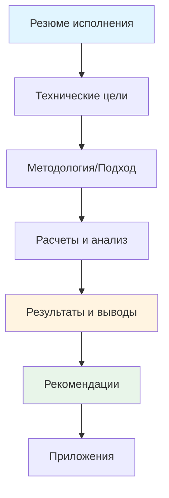
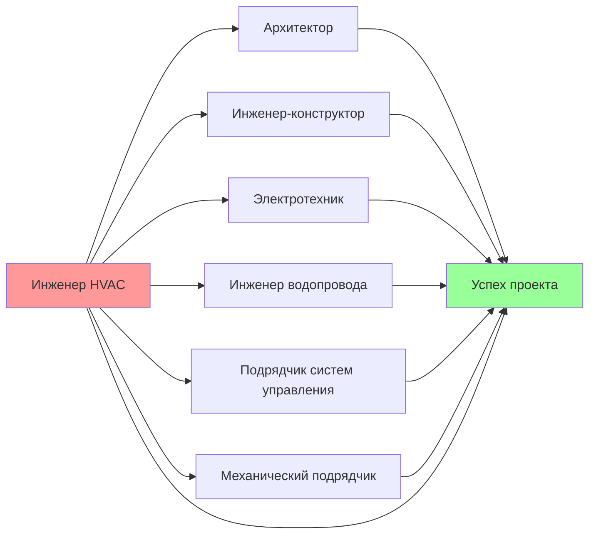
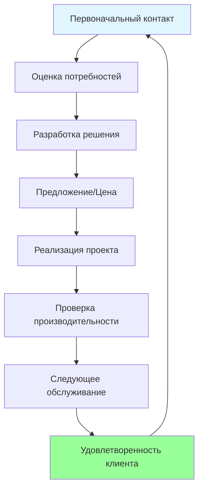
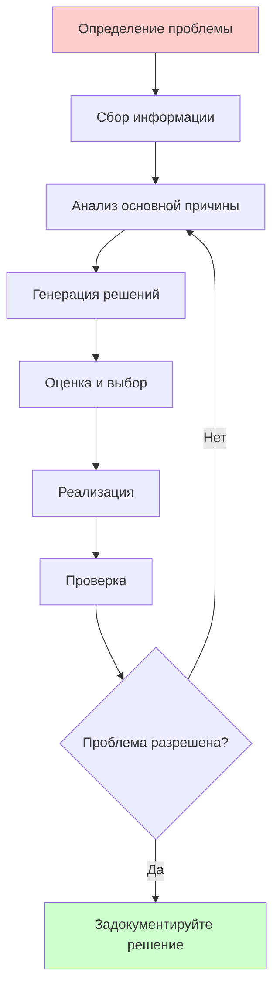

Развитие гибких навыков представляет собой критически важное дополнение к техническому мастерству HVAC. Хотя принципы термодинамики и знание оборудования формируют основу практики HVAC, профессиональный успех в равной степени зависит от эффективного общения, способности к лидерству и результативности межличностного взаимодействия. Исследования показывают, что технические специалисты с сильными гибкими навыками продвигаются быстрее, достигают более высокой удовлетворенности клиентов и более эффективно способствуют достижению организационного успеха.

## Навыки общения для технических специалистов

Специалисты HVAC должны переводить сложные технические концепции на язык, соответствующий разнообразной аудитории, включая владельцев зданий, управляющих объектами, архитекторов, подрядчиков и должностных лиц нормативных органов. Эффективность общения напрямую влияет на результаты проекта, взаимоотношения с клиентами и профессиональную репутацию.

### Принципы технического общения

Эффективное техническое общение требует анализа аудитории, структурирования сообщения и оптимизации ясности. Сложность общения обратно пропорциональна уровню технических знаний аудитории, требуя адаптивных стратегий.

**Модель сложности общения:**

Эффективность передачи информации ($\eta_{comm}$) может быть концептуализирована как:

$$\eta_{comm} = \frac{I_{received}}{I_{transmitted}} \times \frac{1}{1 + C_{technical}/K_{audience}}$$

Где:
- $I_{received}$ = информация, понимаемая аудиторией
- $I_{transmitted}$ = общая представленная информация
- $C_{technical}$ = техническая сложность контента
- $K_{audience}$ = уровень технических знаний аудитории

Эта зависимость демонстрирует, что эффективность общения снижается по мере того, как техническая сложность превышает знания аудитории, что требует упрощенных объяснений для неподготовленных заинтересованных лиц.

### Стратегии общения, ориентированные на конкретную аудиторию

| Тип аудитории | Техническая глубина | Области фокуса | Подход к общению |
|---------------|-----------------|-------------|------------------------|
| Владельцы зданий | Минимальная | Стоимость, комфорт, надежность | Бизнес-результаты, рентабельность инвестиций, простые аналогии |
| Управляющие объектами | Средняя | Эксплуатация, обслуживание, эффективность | Практические последствия, процедуры, метрики |
| Архитекторы/инженеры | Высокая | Параметры проектирования, спецификации | Технические детали, расчеты, нормативы |
| Подрядчики | Высокая | Установка, координация, графики | Конструктивность, последовательность, интерфейсы |
| Должностные лица нормативных органов | Средняя-высокая | Соответствие нормам, безопасность, разрешения | Ссылки на нормативы, документация, проверка |
| Конечные пользователи | Минимальная | Комфорт, управление, устранение неполадок | Простая эксплуатация, регулировка комфорта, когда обращаться в сервис |

### Методы устного общения

**Структурированная схема объяснения:**

1. **Установление контекста** — четко определите проблему или ситуацию
2. **Техническая база** — объясните соответствующие принципы на надлежащей глубине
3. **Применение** — свяжите принципы с конкретной ситуацией
4. **Рекомендация** — представьте четкие пункты действия или выводы
5. **Проверка** — подтвердите понимание аудитории через вопросы

**Пример применения:** объяснение преимуществ частотного преобразователя владельцу здания

- **Контекст**: «Ваша текущая система с насосом постоянной скорости работает на полной мощности независимо от требований здания»
- **Основа**: «Частотные преобразователи регулируют скорость двигателя в соответствии с фактическими требованиями»
- **Применение**: «В вашей системе требования варьируются от 30% до 100% в течение дня»
- **Рекомендация**: «Установка частотных преобразователей снизит потребление энергии насоса примерно на 45%»
- **Проверка**: «Соответствует ли этот подход вашим целям по снижению энергопотребления?»

## Техническое письмо и документирование

Навыки технического письма позволяют специалистам HVAC создавать четкие спецификации, комплексные отчеты, эффективные предложения и точную документацию. Письменное общение создает постоянные записи, требующие точности и ясности.

### Структура технического отчета

### Типы документов и области применения

| Тип документа | Назначение | Ключевые компоненты | Техническая глубина |
|---------------|---------|----------------|-----------------|
| Расчеты проектирования | Инженерная документация | Предположения, уравнения, результаты, ссылки | Высокая |
| Предложения | Развитие бизнеса | Область охвата, подход, ценообразование, квалификация | Средняя |
| Руководства по эксплуатации и обслуживанию | Руководство по эксплуатации | Процедуры, графики, устранение неполадок | Средняя |
| Отчеты об испытаниях | Проверка производительности | Процедуры испытаний, данные, анализ, выводы | Высокая |
| Спецификации | Требования строительства | Критерии производительности, продукты, установка | Высокая |
| Отчеты об обслуживании | Коммуникация с клиентом | Выводы, действия, рекомендации, затраты | Низко-средняя |

### Лучшие практики технического письма

**Принципы ясности:**

- Используйте активный залог для прямых и четких утверждений
- Определяйте аббревиатуры при первом использовании (стандарт ASHRAE 62.1 требует вентиляции наружным воздухом...)
- Включайте единицы измерения со всеми числовыми значениями (расход воздуха на выходе = 4500 CFM (7650 м³/ч))
- Ссылайтесь на применимые нормативы (в соответствии со стандартом ASHRAE 90.1-2019, раздел 6.4.3.1)
- Используйте согласованную терминологию во всем документе
- Включите методологию расчета для проверки

**Представление данных:**

Представляйте числовые данные в таблицах для сравнения, графиках для тенденций и диаграммах для взаимосвязей. Каждый рисунок должен включать четкое название, обозначения осей с единицами измерения и ссылку в основном тексте.

## Навыки презентации и публичного выступления

Специалисты HVAC регулярно презентуют техническую информацию на проектных совещаниях, презентациях клиентам, учебных сессиях и конференциях отрасли. Эффективность презентации определяет профессиональное влияние и возможности продвижения по карьере.

### Структура презентации

**Введение (10% времени):**
- Установите достоверность и контекст
- Укажите четкие цели
- Предварительно представьте основные моменты

**Основная часть (75% времени):**
- Представьте 3–5 ключевых моментов с вспомогательными доказательствами
- Используйте визуальные пособия для укрепления концепций
- Включите релевантные примеры и приложения

**Заключение (15% времени):**
- Кратко изложите ключевые выводы
- Представьте четкие рекомендации
- Пригласите вопросы и обсуждение

### Принципы визуальной коммуникации

Технические презентации выигрывают от эффективных визуальных пособий, включая системные диаграммы, кривые производительности, сравнительные таблицы и сводки расчетов. Каждый визуальный элемент должен служить определенной цели и быть сразу понятным.

**Рекомендации по проектированию визуальных элементов:**

- Ограничьте текст до 6 строк на слайде с максимум 6 словами в строке
- Используйте графики вместо таблиц для данных о тенденциях
- Включите системные схемы для показа связей между компонентами
- Выделите критическую информацию цветом или подсказками
- Убедитесь, что размер шрифта читаем с максимального расстояния аудитории

## Командное сотрудничество и лидерство

Проекты HVAC требуют координации между несколькими дисциплинами, включая механическую, электрическую, водопроводную, конструктивную и архитектурную команды. Навыки эффективного сотрудничества обеспечивают успех проекта и продвижение по карьере.

### Модель взаимодействия проектной команды

### Развитие лидерства

Лидерство выходит за рамки формальной власти и включает техническое влияние, мотивацию команды и продвижение проекта. Специалисты HVAC развивают лидерство через прогрессивную ответственность и демонстрируемую компетентность.

**Прогрессия компетенции лидерства:**

1. **Техническое совершенство** — овладейте основами и приложениями HVAC
2. **Обмен знаниями** — наставляйте младший персонал и документируйте решения
3. **Координация проекта** — управляйте интерфейсами и разрешайте конфликты
4. **Стратегическое видение** — способствуйте направлению организации и инновациям
5. **Развитие команды** — создавайте возможности и повышайте производительность команды

### Разрешение конфликтов в технической среде

Технические конфликты возникают из конкурирующих целей, ограничений ресурсов и различий в интерпретации. Эффективное разрешение требует разделения технических фактов от мнений и сосредоточения внимания на целях проекта.

**Структура разрешения конфликтов:**

1. **Определите суть проблемы** — отделите симптомы от основной причины
2. **Соберите факты** — соберите объективные данные и расчеты
3. **Поймите позиции** — определите ограничения и цели каждой стороны
4. **Создайте варианты** — разработайте несколько подходов к решению
5. **Оцените объективно** — применяйте технические критерии и требования проекта
6. **Достигните согласия** — задокументируйте разрешение и план реализации

## Управление отношениями с клиентами

Специалисты HVAC в консалтинге, подряде и производстве зависят от эффективных отношений с клиентами для успеха бизнеса. Удовлетворенность клиентов способствует повторным заказам, рекомендациям и профессиональной репутации.

### Цикл коммуникации с клиентом

### Принципы превосходного обслуживания

**Управление ожиданиями клиента:**

Удовлетворенность клиента зависит от соотношения между ожиданиями и доставленной производительностью. Уровень удовлетворенности ($S$) можно представить как:

$$S = P_{actual} - E_{customer}$$

Где:
- $P_{actual}$ = фактически доставленная производительность
- $E_{customer}$ = ожидания клиента

Положительная удовлетворенность требует либо превышения ожиданий, либо установления реалистичных ожиданий с самого начала. Как техническая производительность, так и качество общения влияют на восприятие клиентом.

### Управление сложными ситуациями с клиентами

Технические специалисты сталкиваются с недовольством клиентов из-за отказов оборудования, превышения затрат, задержек графика и проблем производительности. Эффективный ответ требует сочувствия, четкого общения и фокуса на решение.

**Протокол ответа:**

1. **Активное слушание** — позвольте клиенту полностью объяснить проблему без перебивания
2. **Признание влияния** — признайте перспективу клиента и обоснованность проблемы
3. **Тщательное расследование** — соберите факты перед тем, как предлагать решения
4. **Четкое объяснение** — представьте выводы с вспомогательными техническими доказательствами
5. **Предложите решения** — предоставьте варианты с преимуществами, недостатками и последствиями для затрат
6. **Выполните обещанное** — реализуйте согласованное решение и проверьте удовлетворенность клиента

## Управление временем и производительность

Специалисты HVAC управляют конкурирующими приоритетами, включая сроки проектирования, обращения в сервис, совещания, непрерывное образование и административные задачи. Эффективное управление временем обеспечивает профессиональную производительность и баланс между работой и личной жизнью.

### Структура управления приоритетами

| Категория задач | Срочность | Важность | Стратегия действия | Распределение времени |
|---------------|---------|------------|-----------------|-----------------|
| Критические сроки | Высокая | Высокая | Немедленное внимание, выделение временных блоков | 40–50% |
| Важные проекты | Низкая | Высокая | Планируйте выделенное время | 30–35% |
| Срочные запросы | Высокая | Низкая | Делегируйте или минимизируйте время | 10–15% |
| Административные | Низкая | Низкая | Обработайте эффективно партиями | 5–10% |

### Методы повышения производительности

**Стратегия блочного планирования времени:**

Выделяйте определенные временные блоки для различных категорий деятельности, включая работу над проектами, расчеты, совещания, коммуникацию и профессиональное развитие. Защищайте время на проектирование и расчеты от прерываний для поддержания концентрации и точности.

**Эффективность инженерных расчетов:**

Сложные расчеты HVAC требуют устойчивой концентрации. Исследования показывают, что прерывания повышают вероятность ошибок и снижают эффективность. Планируйте непрерывные блоки от 2 до 4 часов для расчетов нагрузки, определения размеров воздуховодов, определения размеров труб и выбора оборудования.

## Критическое мышление и решение проблем

Устранение неполадок HVAC, оптимизация проектирования и анализ производительности требуют систематических подходов к решению проблем. Навыки критического мышления обеспечивают эффективную диагностику проблем и разработку решений.

### Систематический процесс решения проблем

### Методы анализа основных причин

**Метод пяти почему:**

Последовательный вопрос для определения основных причин, а не симптомов. Пример применения для жалобы на емкость чиллера:

1. Почему в здании слишком тепло? — Температура охлажденной воды высокая
2. Почему охлажденная вода теплая? — Чиллер не достигает заданного значения
3. Почему чиллер не достигает заданного значения? — Низкий уровень хладагента
4. Почему низкий уровень хладагента? — Небольшая утечка в конденсаторе
5. Почему есть утечка в конденсаторе? — Коррозия от неадекватной обработки воды

Основная причина: дефицит обработки воды, а не неисправность чиллера

### Принятие решений в условиях неопределенности

Проектирование HVAC предполагает принятие решений с неполной информацией, включая будущие затраты на энергию, паттерны занятости и климатические условия. Структурированное принятие решений снижает риск и улучшает результаты.

**Применение матрицы решений:**

| Вариант проектирования | Начальная стоимость | Затраты на эксплуатацию | Надежность | Сложность | Взвешенный балл |
|---------------|-----------|----------------|-------------|------------|----------------|
| Стандартная эффективность | 8 | 4 | 7 | 9 | 6.4 |
| Высокая эффективность | 5 | 9 | 8 | 6 | 7.1 |
| Премиум-система | 3 | 10 | 9 | 4 | 6.8 |

Коэффициенты взвешивания применяются в зависимости от приоритетов проекта (затраты на эксплуатацию 40%, надежность 30%, начальная стоимость 20%, сложность 10%)

## Эмоциональный интеллект в профессиональной практике

Эмоциональный интеллект охватывает самосознание, саморегуляцию, эмпатию и управление взаимоотношениями. Технические специалисты с высоким эмоциональным интеллектом более эффективно навигируют по производственной динамике и строят более прочные профессиональные отношения.

### Компоненты эмоционального интеллекта

**Самосознание:**
- Распознавайте личные эмоциональные состояния и триггеры
- Поймите, как эмоции влияют на производительность и решения
- Объективно определяйте области сильных и развития

**Саморегуляция:**
- Управляйте стрессом при требовательных проектах и сроках
- Поддерживайте профессиональное спокойствие при конфликтах
- Адаптируйте стиль общения к требованиям ситуации

**Эмпатия:**
- Поймите разочарование клиента при отказах оборудования
- Признайте нагрузку и емкость членов команды
- Оцените различные перспективы в технических разногласиях

**Управление взаимоотношениями:**
- Развивайте доверие через последовательную, надежную работу
- Общайтесь четко и профессионально во всех ситуациях
- Развивайте сотруднические отношения с коллегами и клиентами

## Стратегия профессионального развития

Развитие гибких навыков требует целенаправленной практики, интеграции обратной связи и непрерывного совершенствования. Стратегическое развитие ускоряет продвижение по карьере и профессиональную результативность.

### Путь развития навыков

1. **Самооценка** — определите текущие уровни способностей и приоритеты развития
2. **Обучение** — участвуйте в программах и семинарах по развитию гибких навыков
3. **Практика** — применяйте навыки в профессиональных условиях с целенаправленным фокусом
4. **Обратная связь** — ищите рекомендации от руководителей, коллег и клиентов
5. **Рефлексия** — анализируйте результаты и корректируйте подход в зависимости от результатов
6. **Итерация** — продолжайте цикл развития с прогрессирующими вызовами

### Ресурсы для развития гибких навыков

Профессиональные организации, включая ASHRAE, ACCA и RSES, предлагают программы развития гибких навыков наряду с техническим обучением. Темы включают развитие лидерства, навыки общения, превосходное обслуживание клиентов и управление бизнесом. Многие программы квалифицируются как кредиты непрерывного образования для профессиональных сертификатов.

Учебные заведения предоставляют курсы профессионального развития по технической коммуникации, управлению проектами и лидерству. Онлайн-платформы предлагают гибкие варианты обучения для навыков общения, техники презентации и результативности межличностного взаимодействия.

Развитие гибких навыков отличает исключительных специалистов HVAC от просто компетентных техников и инженеров. Стратегические инвестиции в навыки общения, лидерства и межличностного взаимодействия ускоряют продвижение по карьере, одновременно повышая техническую результативность и профессиональную удовлетворенность.

*Версия: 2.0_enhanced*
