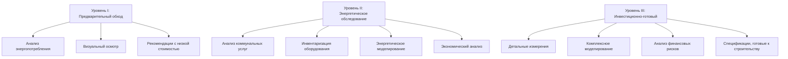
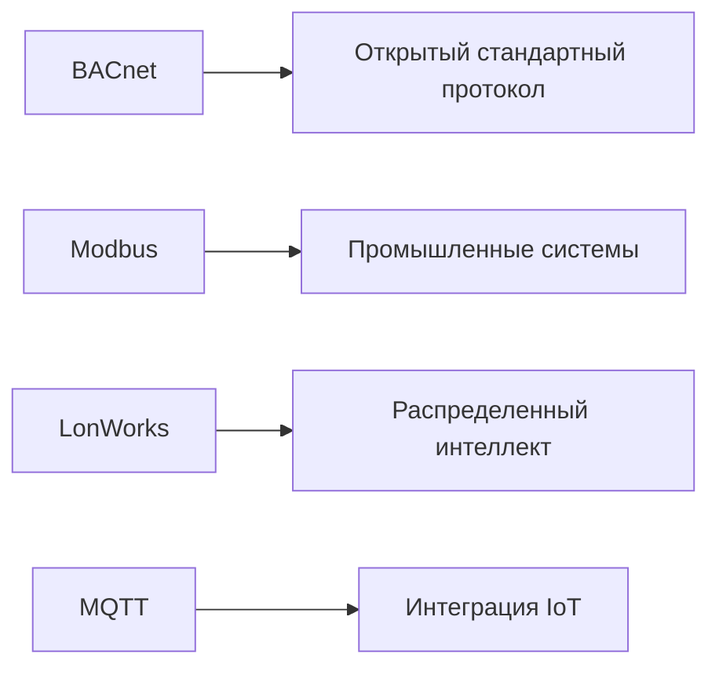

# Специализированное техническое обучение

Программы специализированного технического обучения предоставляют специалистам HVAC расширенные компетенции, выходящие за рамки фундаментальных навыков установки и обслуживания. Эти программы охватывают сложное проектирование систем, проверку производительности, оптимизацию энергопотребления и новые технологии, определяющие современную практику HVAC.

## Основные области обучения

### Обучение наладке

Наладка зданий представляет собой систематический процесс обеспечения соответствия систем HVAC проектному замыслу и требованиям владельца. Обучение наладке развивает компетенции в следующих областях:

**Проверка функциональной производительности**

Протоколы верификации проверяют поведение системы при рабочих условиях:

$$Q_{actual} = \dot{m} c_p (T_{leaving} - T_{entering})$$

Где измеренные значения расхода воздуха и температурных дифференциалов подтверждают подачу проектной мощности.

**Верификация интеграции систем**

Современные здания требуют координации между механическими системами, системами автоматизации зданий и последовательностями управления. Обучение подчеркивает:

- Валидацию последовательности операций
- Настройку и оптимизацию контуров управления
- Верификацию блокировок и безопасности
- Проверку программирования системы энергетического менеджмента

**Документирование и отчетность**

Наладка требует детального документирования:

| Тип документа | Назначение | Ключевые элементы |
|---|---|---|
| План наладки | Дорожная карта проекта | Объем, график, ответственность |
| Процедуры функциональных испытаний | Верификация производительности | Условия испытаний, критерии приемки |
| Журнал проблем | Отслеживание недостатков | Описание, приоритет, разрешение |
| Итоговый отчет | Резюме проекта | Результаты, рекомендации, обучение О&М |

Программы обучения, согласованные с ASHRAE Guideline 0 и Guideline 1.1, предоставляют стандартизированные рамки для практики наладки как в новом строительстве, так и в существующих зданиях.

### Обучение энергоаудиту

Обучение энергоаудиту дает специалистам навыки выявления, количественной оценки и приоритизации возможностей энергосбережения в системах зданий.

**Уровни и методологии аудита**

ASHRAE Standard 211 определяет три уровня аудита с возрастающей глубиной анализа:

**Измерение и верификация**

Количественная оценка энергосбережения требует строгих протоколов измерения согласно IPMVP или ASHRAE Guideline 14:

$$\text{Экономия} = \text{Энергия базовой линии} - \text{Энергия после внедрения} \pm \text{Поправки}$$

Поправки учитывают нормализацию по погоде, изменения в занятости и производственные вариации.

**Компетенции в экономическом анализе**

Обучение развивает навыки в методах финансовой оценки:

| Метрика | Расчет | Применение |
|---|---|---|
| Простой период окупаемости | Стоимость внедрения / Годовая экономия | Быстрый скрининг |
| ЧПС | $\sum_{t=0}^{n} \frac{CF_t}{(1+r)^t}$ | Долгосрочная ценность |
| ВВР | Решение ЧПС = 0 | Сравнение доходности |
| СПИ | Текущая стоимость экономии / Текущая стоимость затрат | Приоритизация |

### Обучение автоматизации и управлению зданием

Системы автоматизации зданий (BAS) управляют производительностью HVAC через интегрированные стратегии управления.

**Основы теории управления**

Эффективное программирование BAS требует понимания режимов управления:

**Пропорционально-интегрально-дифференциальное (ПИД) управление**

$$u(t) = K_p e(t) + K_i \int_0^t e(\tau)d\tau + K_d \frac{de(t)}{dt}$$

Где выход контроллера реагирует на величину ошибки, накопленную ошибку и скорость изменения. Обучение подчеркивает настройку параметров для стабильной, отзывчивой производительности без колебаний и перерегулирования.

**Продвинутые стратегии управления**

Современные системы используют сложные последовательности:

- **Стратегии сброса**: Сброс температуры приточного воздуха и статического давления на основе требований зон
- **Управление вентиляцией по требованию**: Модуляция наружного воздуха на основе CO₂ согласно ASHRAE Standard 62.1
- **Оптимальный старт/стоп**: Предиктивные алгоритмы минимизирующие время работы при соответствии графикам занятости
- **Оптимизация свободного охлаждения**: Интеграция экономайзера и водяного экономайзера

**Сетевые протоколы и интеграция**

Обучение охватывает протоколы связи, обеспечивающие совместимость систем:

### Обучение системам охлаждения

Продвинутое обучение системам охлаждения охватывает промышленные, коммерческие и специализированные приложения, выходящие за рамки базового комфортного охлаждения.

**Проектирование и расчет системы**

Обучение развивает навыки оценки нагрузок охлаждения и выбора оборудования:

$$Q_{refrigeration} = Q_{product} + Q_{transmission} + Q_{infiltration} + Q_{equipment} + Q_{lights} + Q_{people}$$

Каждый компонент требует специальной методологии расчета на основе требований приложения.

**Продвинутые холодильные циклы**

Специализированные приложения используют модифицированные циклы для повышения эффективности или удовлетворения температурных требований:

- **Каскадные системы**: Несколько холодильных контуров достигающие сверхнизких температур
- **Двухступенчатое сжатие**: Циклы экономайзера повышающие эффективность при высокой разности температур
- **Системы с несколькими испарителями**: Один компрессор обслуживающий несколько температурных зон

### Обучение гидравлическим системам

Обучение гидравлическим системам охватывает проектирование, балансирование и устранение неисправностей водяных систем отопления и охлаждения.

**Гидравлика системы**

Распределение потока требует понимания соотношений давление-расход:

$$\Delta P = \frac{8 f L \rho Q^2}{\pi^2 D^5}$$

Где коэффициент трения, длина трубопровода, диаметр и расход определяют перепад давления через сеть распределения.

**Методологии балансирования**

Обучение охватывает процедуры пропорционального балансирования обеспечивающие подачу проектного расхода всем терминалам при минимизации энергии насоса.

## Методы доставки обучения

### Практическое лабораторное обучение

Объекты практического обучения предоставляют опыт с:

- Сценарии устранения неисправностей оборудования в реальных условиях
- Программирование и наладка управления
- Калибровка и использование измерительных приборов
- Процедуры пуска и остановки системы

### Обучение на основе моделирования

Компьютерные симуляции позволяют исследовать:

- Отклик системы на изменения управления
- Сценарии диагностики неисправностей
- Стратегии оптимизации энергопотребления
- Калькуляции и выбор оборудования

### Программы обучения на местах

Обучение на месте в действующих объектах предоставляет реальный опыт при фактических условиях эксплуатации и ограничениях.

## Оценка компетентности

Строгая оценка подтверждает эффективность обучения через:

- Письменные экзамены проверяющие теоретические знания
- Практические демонстрации технических навыков
- Оценки на основе проектов прикладных компетенций
- Требования непрерывного образования поддерживающие актуальность

Специализированное техническое обучение предоставляет продвинутые компетенции, требуемые для современной практики HVAC, позволяя профессионалам проектировать, наладывать и оптимизировать высокопроизводительные системы зданий.
