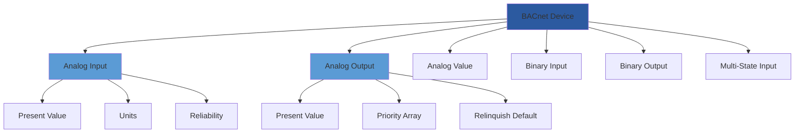
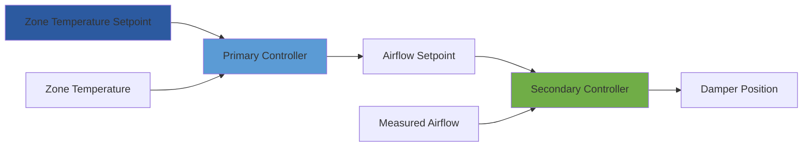

Системы автоматизации зданий (BAS) представляют собой интеграцию элементов управления HVAC, освещения, безопасности и управления энергией в единые цифровые платформы. Профессиональное обучение BAS позволяет техникам и инженерам овладеть навыками проектирования, программирования, наладки и оптимизации этих все более сложных систем.

## Фундаментальная теория управления

Автоматизация зданий основана на обратных связях управления для поддержания условий окружающей среды. Наиболее распространенная реализация использует алгоритмы пропорционально-интегрально-дифференциального (PID) управления.

### Математика управления PID

Выход контроллера PID рассчитывается следующим образом:

$$u(t) = K_p e(t) + K_i \int_0^t e(\tau) d\tau + K_d \frac{de(t)}{dt}$$

Где:
- $u(t)$ = сигнал выхода контроллера
- $e(t)$ = сигнал ошибки (заданное значение - переменная процесса)
- $K_p$ = коэффициент пропорционального усиления
- $K_i$ = коэффициент интегрального усиления
- $K_d$ = коэффициент дифференциального усиления

В дискретных системах времени (типичные для контроллеров DDC) это становится:

$$u[n] = K_p e[n] + K_i \sum_{k=0}^n e[k] \Delta t + K_d \frac{e[n] - e[n-1]}{\Delta t}$$

### Пропорциональная полоса и смещение

Пропорциональная полоса (PB) представляет диапазон изменения входного сигнала, необходимого для полного ответа выхода:

$$PB = \frac{100\%}{K_p}$$

Чистое пропорциональное управление производит смещение в установившемся состоянии:

$$\text{Смещение} = \frac{\text{Изменение нагрузки}}{K_p}$$

Интегральный член устраняет это смещение путем непрерывного накопления ошибки до достижения заданного значения.

## Сетевые протоколы и связь

Современные реализации BAS требуют знания нескольких протоколов связи.

| Протокол | Скорость | Топология | Прикладной уровень | Доля рынка |
|----------|----------|-----------|-------------------|-----------|
| BACnet/IP | 10-1000 Мбит/с | Ethernet | BACnet | 45% |
| BACnet MS/TP | 9,6-76,8 кбит/с | RS-485 | BACnet | 30% |
| Modbus TCP | 10-1000 Мбит/с | Ethernet | Modbus | 15% |
| LonWorks | 78 кбит/с | FT-10 | LonTalk | 5% |
| Proprietary | Варьируется | Варьируется | Проприетарно | 5% |

### Объектная модель BACnet

BACnet структурирует данные, используя стандартизированные объекты. Обучение подчеркивает понимание типов объектов и свойств:

## Архитектура контроллера DDC

Системы прямого цифрового управления (DDC) обрабатывают входные данные датчиков, выполняют алгоритмы управления и управляют исполнительными механизмами с регулярными интервалами.

### Время выполнения контура управления

Частота выполнения контура влияет на устойчивость системы. Критерий Найквиста требует:

$$f_s \geq 2f_{max}$$

Где $f_s$ — частота выборки, а $f_{max}$ — наивысшая частотная составляющая процесса. Для приложений HVAC:

| Процесс | Постоянная времени | Минимальная частота сканирования |
|---------|-------------------|----------------------------------|
| Температура помещения | 15-30 мин | 1 минута |
| Температура подаваемого воздуха | 1-3 мин | 10 секунд |
| Статическое давление в воздуховоде | 5-15 сек | 2 секунды |
| Температура смешанного воздуха | 30-60 сек | 5 секунд |

## Продвинутые стратегии управления

Профессиональное обучение BAS охватывает стратегии, выходящие за рамки базового управления с обратной связью.

### Каскадное управление

Каскадное управление использует несколько вложенных контуров. Для системы VAV:

Первичный контур работает медленно (сканирование в 1 минуту), в то время как вторичный контур реагирует быстро (сканирование в 5 секунд), что улучшает общее время отклика и устойчивость.

### Упредительное управление

Упредительное управление предвосхищает возмущения. Для управления экономайзером изменение температуры наружного воздуха предсказывает влияние:

$$\dot{Q}_{anticipated} = \dot{m}_a c_p \frac{dT_{oa}}{dt}$$

Контроллер регулирует положение заслонки экономайзера до значительного отклонения температуры помещения.

## Разработка последовательности операций

Написание последовательностей требует понимания физических процессов и их перевода в логические операторы управления.

### Ступенчатое включение установки охлажденной воды

Ступенчатое включение чиллера минимизирует энергопотребление при удовлетворении нагрузки:

$$\text{PLR} = \frac{\dot{Q}_{load}}{\dot{Q}_{capacity}}$$

Где PLR — коэффициент частичной нагрузки. Оптимальное ступенчатое включение поддерживает каждый работающий чиллер в диапазоне 40-80% PLR, балансируя эффективность против избыточной емкости.

Логика ступенчатого включения:
1. Если PLR > 0,85 в течение 15 минут → запустить следующий чиллер
2. Если PLR < 0,35 в течение 30 минут → остановить один чиллер
3. Последовательное включение чиллеров для выравнивания времени работы
4. Предотвращение частого переключения с минимальным таймером работы (20 минут)

## Оптимизация энергии через BAS

Обучение подчеркивает количественную оценку экономии энергии от стратегий управления.

### Оптимальный старт/остановка

Оптимальный старт рассчитывает время, необходимое для приведения помещения из неиспользуемого в используемое заданное значение:

$$t_{start} = \frac{C_A (T_{occ} - T_{unocc})}{UA(T_{sa} - T_{unocc}) + \dot{Q}_{internal}}$$

Где:
- $C_A$ = тепловая емкость здания (кДж/°C)
- $UA$ = коэффициент передачи тепла зданием (кВт/°C)
- $T_{sa}$ = температура подаваемого воздуха (°C)

Алгоритмы самообучения уточняют этот расчет с течением времени, сокращая энергию предварительной подготовки на 10-30%.

### Управление вентиляцией в зависимости от спроса

DCV модулирует наружный воздух на основе занятости:

$$\dot{V}_{oa} = N_{people} \times V_{per\ person} + A_{floor} \times V_{per\ area}$$

Датчики CO₂ определяют занятость косвенно. При каждом снижении наружного воздуха на 10% энергия отопления/охлаждения снижается примерно на 3-5%.

## Наладка и устранение неполадок

Систематическая наладка проверяет производительность BAS в соответствии с ASHRAE Guideline 0 и Guideline 1.1.

### Функциональное испытание производительности

Испытание проверяет:
1. Точность датчика (±0,6°C для температуры, ±10% для воздушного потока)
2. Устойчивость контура управления (минимальное перерегулирование/колебания)
3. Выполнение логики последовательности (корректные переходы между состояниями)
4. Ответ на тревогу (надлежащее уведомление и регистрация)
5. Возможность тренда (минимум 1 год хранения)

### Методология настройки PID

Настройка Зиглера-Николса предоставляет начальные параметры:

1. Установить $K_i = 0$ и $K_d = 0$
2. Увеличивать $K_p$ до достижения устойчивого колебания (предельный коэффициент усиления $K_u$)
3. Измерить период колебания $T_u$
4. Рассчитать окончательные параметры:

$$K_p = 0.6 K_u$$
$$K_i = 1.2 \frac{K_u}{T_u}$$
$$K_d = 0.075 K_u T_u$$

Тонкая настройка на основе наблюдаемого отклика, обычно снижение $K_i$ на 50% для приложений HVAC для предотвращения интегрального насыщения.

## Интеграция с управлением энергией

Современное обучение BAS включает интеграцию управления энергией на уровне предприятия в соответствии со стандартом ASHRAE Standard 201.

Программы обучения должны охватывать основы сетей, теорию управления, языки программирования (обычно графические или структурированный текст IEC 61131-3 специфичные для поставщика), методология устранения неполадок, основы кибербезопасности (руководящие принципы ASHRAE/NIST) и стратегии оптимизации энергии. Практические лабораторные упражнения с реальным оборудованием DDC, живое устранение неполадок сети и программирование последовательностей значительно улучшают запоминание и профессиональную компетентность.
