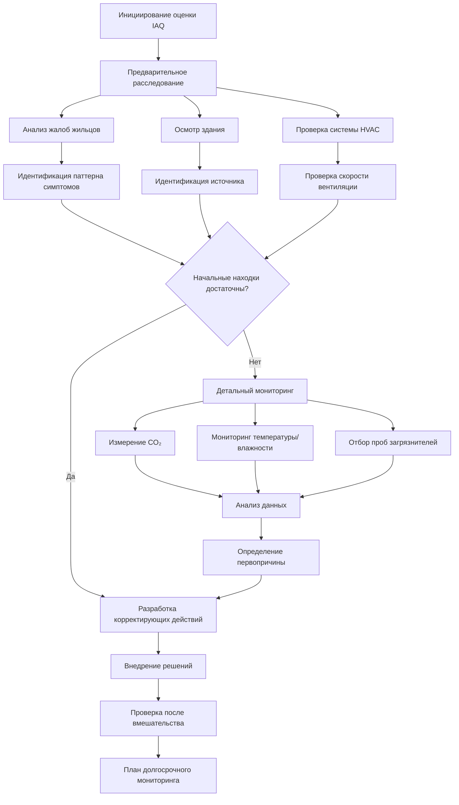

Обучение качеству воздуха в помещениях оснащает специалистов HVAC знаниями и навыками для оценки, проектирования и обслуживания систем, обеспечивающих здоровую внутреннюю среду. Это специализированное обучение интегрирует принципы контроля загрязнителей, эффективности вентиляции, технологии фильтрации и оценки воздействия для решения сложных взаимодействий между системами зданий и здоровьем жильцов.

## Основные компоненты обучения IAQ

### Идентификация и контроль источников загрязнения

Эффективное управление IAQ начинается с понимания источников загрязнения и внедрения надлежащих стратегий контроля. Иерархия контроля расставляет приоритеты на исключение источника, затем локальное удаление выходящего воздуха, разбавляющую вентиляцию и очистку воздуха.

**Основные категории загрязнителей внутри помещений:**

| Тип загрязнителя | Типичные источники | Стратегия контроля | Целевая концентрация |
|------------------|-------------------|-------------------|----------------------|
| Твердые частицы (PM2.5) | Горение, наружный воздух, активность жильцов | Фильтрация MERV 13-16 | <12 мкг/м³ |
| Углекислый газ (CO₂) | Дыхание жильцов | Регулировка скорости вентиляции | <1000 ppm |
| Летучие органические соединения (VOCs) | Строительные материалы, мебель, чистящие средства | Контроль источника, активированный уголь | <500 мкг/м³ всего VOCs |
| Формальдегид (HCHO) | Композитная древесина, клеи | Материалы с низким выбросом, вентиляция | <16 ppb (100 мкг/м³) |
| Диоксид азота (NO₂) | Газовые приборы, наружный воздух | Надлежащая вентиляция, фильтрация наружного воздуха | <53 ppb годовой |
| Биологические загрязнители | Влага, системы HVAC, жильцы | Контроль влажности, фильтрация | Зависит от вида |

Уравнение массового баланса для концентрации загрязнителя в помещении является основой анализа IAQ:

$$\frac{dC}{dt} = \frac{S}{V} + \frac{Q_{oa}C_{oa}}{V} - \frac{QC}{V} - kC$$

Где:
- C = концентрация загрязнителя в помещении (мкг/м³ или ppm)
- S = скорость образования загрязнителя (мкг/ч или м³/ч)
- V = объем здания (м³)
- Q = общая скорость потока воздуха (м³/ч)
- Q_oa = скорость потока наружного воздуха (м³/ч)
- C_oa = концентрация загрязнителя на улице
- k = постоянная скорости распада/удаления загрязнителя (ч⁻¹)

При стационарных условиях (dC/dt = 0) концентрация в помещении становится:

$$C_{ss} = \frac{S/V + (Q_{oa}/V)C_{oa}}{Q/V + k}$$

Эта взаимосвязь демонстрирует, как концентрации в помещении зависят от силы источника, скорости вентиляции, концентрации на улице и механизмов удаления.

### Определение скорости вентиляции

Стандарт ASHRAE 62.1 предоставляет основу для определения минимальных скоростей вентиляции с использованием процедуры скорости вентиляции (VRP). Поток наружного воздуха в дыхательной зоне рассчитывается как:

$$V_{bz} = R_p P_z + R_a A_z$$

Где:
- V_bz = поток наружного воздуха в дыхательной зоне (CFM или л/с)
- R_p = норма наружного воздуха на человека (CFM/человека или л/с·человека)
- P_z = численность населения зоны (люди)
- R_a = норма наружного воздуха на площадь (CFM/м² или л/с·м²)
- A_z = площадь пола зоны (м²)

Для многозонных систем эффективность системной вентиляции (E_v) учитывает эффективность распределения воздуха:

$$V_{ot} = \frac{\sum_{all zones} V_{oz}}{E_v}$$

Эффективность системной вентиляции зависит от эффективности распределения воздуха в зоне (E_z), разнообразия занятости (D) и максимальной доли первичного потока воздуха зоны.

### Фильтрация и очистка воздуха

Эффективность фильтрации твердых частиц следует кинетике первого порядка. Проникновение через фильтр составляет:

$$P = e^{-\eta L}$$

Где:
- P = доля проникновения (безразмерная)
- η = коэффициент фильтра (м⁻¹)
- L = глубина фильтра (м)

Эффективность однопроходного фильтра:

$$E = 1 - P = 1 - e^{-\eta L}$$

Для систем рециркуляции стационарное снижение концентрации частиц по сравнению с отсутствием фильтрации составляет:

$$\frac{C_{filtered}}{C_{unfiltered}} = \frac{1}{1 + \frac{Q_{recir}E}{Q_{oa} + kV}}$$

Это демонстрирует, что как эффективность фильтра, так и скорость рециркуляции определяют общее снижение частиц.

## Методология оценки IAQ

### Контроль влажности и содержания влаги

Поддержание надлежащего уровня влажности предотвращает как микробный рост, так и дискомфорт жильцов. Зависимость между абсолютной влажностью и относительной влажностью:

$$RH = \frac{W}{W_s(T)} \times 100\%$$

Где:
- RH = относительная влажность (%)
- W = коэффициент влажности (кг воды/кг сухого воздуха)
- W_s = коэффициент насыщенной влажности при температуре T

Для предотвращения роста плесени относительная влажность поверхности должна оставаться ниже 80% и предпочтительно ниже 60%. Температура поверхности, при которой происходит конденсация (точка росы), составляет:

$$T_{dp} = \frac{c\gamma(T,RH)}{b - \gamma(T,RH)}$$

Где γ(T,RH) = ln(RH/100) + bT/(c+T), с эмпирическими постоянными b = 17,67 и c = 243,5°C для типичных условий.

## Показатели эффективности вентиляции

Эффективность воздушного обмена (ε_a) количественно определяет эффективность замены воздуха в помещении подаваемым воздухом:

$$\varepsilon_a = \frac{\tau_n}{\tau} = \frac{\tau_n V}{Q}$$

Где:
- τ_n = номинальная постоянная времени (V/Q)
- τ = фактический средний возраст воздуха в занятой зоне
- V = объем помещения
- Q = скорость вентиляции

Для идеально смешанных условий ε_a = 1,0. Вытесняющая вентиляция обычно достигает ε_a = 1,2–1,5, тогда как плохо спроектированные системы могут иметь ε_a < 1,0.

Эффективность удаления загрязнителя (ε_c) оценивает удаление загрязняющих веществ:

$$\varepsilon_c = \frac{C_e - C_s}{C_r - C_s}$$

Где:
- C_e = концентрация выходящего воздуха
- C_s = концентрация подаваемого воздуха
- C_r = концентрация в занятой зоне

## Структура программы обучения

**Уровень 1: Основы (16 часов)**
- Основные принципы IAQ и воздействие на здоровье
- Требования вентиляции ASHRAE 62.1
- Типичные источники загрязнения
- Методы осмотра зданий
- Базовые приборы (мониторы CO₂, счетчики частиц)

**Уровень 2: Продвинутая оценка (24 часа)**
- Психрометрия и анализ влаги
- Тестирование трассирующего газа для определения скоростей вентиляции
- Отбор проб и интерпретация биоаэрозолей
- Измерение и анализ VOC
- Диагностика соотношения давлений
- Основы вычислительной гидродинамики

**Уровень 3: Проектирование систем и устранение проблем (32 часа)**
- Продвинутое проектирование системы фильтрации
- Применение систем с выделенным наружным воздухом (DOAS)
- Рекуперация энергии с учетом IAQ
- Инженерия контроля источника
- Управление проектами по устранению проблем
- Анализ примеров и решение проблем

## Приборы и методы измерения

**Необходимое оборудование для измерения IAQ:**

| Параметр | Тип прибора | Типичный диапазон | Требование точности |
|----------|------------|------------------|----------------------|
| CO₂ | Датчик NDIR | 0–5000 ppm | ±50 ppm или 3% |
| Температура | Термистор/RTD | -20 до 70°C | ±0,5°C |
| Относительная влажность | Емкостной датчик | 0–100% | ±3% RH |
| Поток воздуха | Анемометр горячей проволоки | 0–50 м/с | ±3% показания |
| Частицы | Оптический счетчик частиц | 0,3–10 мкм | Разрешение размера ±5% |
| Давление | Дифференциальный манометр | 0–2500 Па | ±1 Па или 1% |

Надлежащие интервалы калибровки поддерживают точность измерений: датчики CO₂ требуют ежегодной калибровки, а приборы для измерения воздушного потока требуют проверки перед каждым использованием по сравнению со стандартом, имеющим отслеживаемость.

## Нормативно-правовая база и стандарты

Программы обучения IAQ ссылаются на несколько стандартов и рекомендаций:

- **Стандарт ASHRAE 62.1**: Вентиляция для приемлемого качества воздуха в помещениях
- **Стандарт ASHRAE 62.2**: Вентиляция для маловысотных жилых зданий
- **Стандарт ASHRAE 55**: Тепловые условия окружающей среды для занятости людей
- **Стандарт ASHRAE 180**: Практика инспекции и обслуживания коммерческих систем HVAC в зданиях
- **Инструменты EPA для качества воздуха в школах**: Руководство для объектов образования
- **Рекомендации OSHA по качеству воздуха в помещениях**: Пределы профессионального воздействия

Понимание взаимодействия между этими стандартами позволяет разработать комплексную программу IAQ, которая одновременно обеспечивает соответствие нормативным требованиям и защиту здоровья жильцов.

## Возникающие проблемы IAQ

Недавние программы обучения все чаще занимаются подготовкой к пандемиям, подчеркивая роль системы HVAC в контроле воздушно-капельных инфекций. Эквивалентный чистый воздушный поток (Q_e) объединяет наружный воздух, фильтрацию и другую очистку воздуха:

$$Q_e = Q_{oa} + Q_{recir}E_{filter} + Q_{UV}E_{UV} + Q_{other}E_{other}$$

Целевые скорости доставки эквивалентного чистого воздуха для контроля инфекций обычно колеблются от 4–6 воздухообменов в час для обычных пространств до 12+ ACH для высокорисковых областей.

Обучение подчеркивает, что комплексное управление IAQ требует интегрированного мышления в области вентиляции, фильтрации, контроля влажности, управления источниками и эксплуатации зданий для создания здоровых и продуктивных внутренних помещений.
