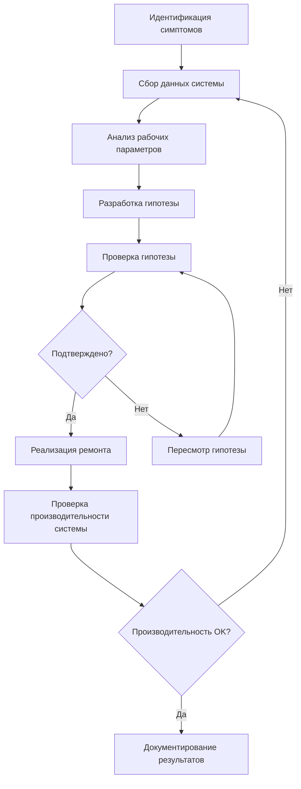

# Обучение диагностике и устранению неисправностей HVAC

Эффективное устранение неисправностей требует систематической методологии диагностики, основанной на принципах термодинамики, электротехнической теории и механике жидкостей. Это обучение развивает аналитическую базу, необходимую для быстрой локализации неисправностей и экономичных стратегий ремонта.

## Систематическая методология диагностики

### Процесс диагностики

Структурированное устранение неисправностей следует логической последовательности, минимизирующей время диагностики при максимальной точности:

### Критические измерения и интерпретация

Точная диагностика зависит от правильного измерения и интерпретации ключевых параметров:

| Параметр | Место измерения | Нормальный диапазон | Диагностическое значение |
|-----------|---------------------|--------------|------------------------|
| Давление всасывания | Вход компрессора | Зависит от хладагента | Низкое: проблемы с потоком воздуха/зарядом; Высокое: перезарядка/высокая нагрузка |
| Давление нагнетания | Выход компрессора | Зависит от хладагента | Высокое: проблемы конденсатора; Низкое: низкий заряд/отказ компрессора |
| Перегрев | Выход испарителя | 4,4-6,7°C типично | Низкий: избыточное питание; Высокий: недостаточное питание/низкий заряд |
| Переохлаждение | Выход конденсатора | 5,6-8,3°C типично | Низкое: недостаточный заряд; Высокое: перезарядка/ограничение |
| Разность температур воздуха | Подача vs. возврат воздуха | 10-12°C охлаждение | Низкая: проблемы потока/мощности; Высокая: ограниченный поток воздуха |
| Статическое давление | Воздуховоды подачи/возврата | По ACCA Manual D | Высокое: ограничение воздуховода; Несбалансированное: проблемы конструкции |

## Диагностика холодильного цикла

### Анализ перегрева

Перегрев определяет степень нагрева пара сверх температуры насыщения на выходе испарителя:

$$
\text{Перегрев} = T_{\text{линия всасывания}} - T_{\text{насыщения при давлении всасывания}}
$$

Правильный перегрев обеспечивает полное испарение жидкости при предотвращении затопления компрессора. Низкий перегрев указывает на избыточное питание хладагентом из-за:

- Увеличенного или неисправного TXV
- Чрезмерного заряда хладагента
- Ограниченного жидкостного трубопровода, уменьшающего перепад давления
- Проблем с креплением чувствительного элемента на установках TXV

Высокий перегрев сигнализирует о недостаточном питании, вызванном:

- Уменьшенным или ограниченным TXV
- Недостаточным зарядом хладагента
- Ограниченным фильтром-осушителем или жидкостным трубопроводом
- Потерей заряда чувствительного элемента TXV

### Анализ переохлаждения

Переохлаждение измеряет температуру жидкого хладагента ниже насыщения на выходе конденсатора:

$$
\text{Переохлаждение} = T_{\text{насыщения при давлении нагнетания}} - T_{\text{жидкостной трубопровод}}
$$

Переохлаждение обеспечивает жидкостной затвор, предотвращающий образование паровых пробок в жидкостном трубопроводе. Отклонение от спецификаций производителя указывает на:

**Низкое переохлаждение (< 2,8°C):**
- Недостаточный заряд хладагента
- Избыточные некондиционируемые газы
- Ограничение потока воздуха через конденсатор
- Неэффективность компрессора

**Высокое переохлаждение (> 11°C):**
- Перезарядка хладагента
- Ограниченное устройство дозирования
- Ограничение жидкостного трубопровода
- Чрезмерный размер конденсатора

### Анализ производительности компрессора

Эффективность компрессора определяет производительность и энергопотребление системы. Степень сжатия влияет на оба параметра:

$$
\text{Степень сжатия} = \frac{P_{\text{нагнетание абсолютное}}}{P_{\text{всасывание абсолютное}}}
$$

Оптимальные степени сжатия находятся в диапазоне от 3:1 до 7:1. Степени, превышающие 10:1, указывают на серьезные проблемы системы, вызывающие:

- Повышенные температуры нагнетания
- Снижение объемной эффективности
- Сокращение срока службы компрессора
- Повышение энергопотребления

## Электрическая диагностика

### Анализ двигателя

Диагностика трёхфазного двигателя требует измерения напряжения и тока на всех фазах:

| Измерение | Допустимое отклонение | Диагностическое действие |
|-----------|-------------------|-------------------|
| Дисбаланс напряжения | < 2% | Проверить электроснабжение и соединения |
| Дисбаланс тока | < 10% | Проверить обмотки двигателя и подшипники |
| Напряжение к паспорту | ±10% | Проверить ответвления трансформатора и размер провода |
| Ток vs. RLA | < 110% | Проверить механическую нагрузку и напряжение |

Расчет процента дисбаланса напряжения:

$$
\text{Дисбаланс напряжения} = \frac{\text{Максимальное отклонение от среднего напряжения}}{\text{Среднее напряжение}} \times 100\%
$$

Даже 2% дисбаланс напряжения вызывает 8% дисбаланс тока, что приводит к перегреву и сокращению срока службы двигателя.

### Тестирование конденсаторов

Отказ конденсатора представляет распространённую неисправность HVAC. Тестируйте конденсаторы под нагрузкой когда возможно, так как они могут показать нормальные результаты при отключении, но отказать при работающих условиях.

Измеренная емкость должна находиться в пределах ±6% номинального значения в соответствии со стандартом ASHRAE 37. Расчет допустимого диапазона емкости:

$$
\text{Допустимый диапазон} = C_{\text{номинальная}} \times (1 \pm 0.06)
$$

## Диагностика потока воздуха

### Метод повышения температуры

Расчет потока воздуха печи с использованием повышения температуры через теплообменник:

$$
\text{CFM (м³/ч)} = \frac{\text{Входная мощность кДж/ч} \times \eta}{1.08 \times \Delta T}
$$

Где:
- Входная мощность кДж/ч = Скорость подачи газа
- η = КПД сгорания (обычно 0,80 для стандартных печей)
- ΔT = Повышение температуры (подача - возврат воздуха)
- 1.08 = Константа для воздуха (0,24 кДж/кг·°C × 4,5 кг/CFM)

### Диагностика статического давления

Измерение внешнего статического давления определяет ограничения системы воздуховодов в соответствии с рекомендациями ACCA Manual D:

| Показание ESP | Состояние системы | Требуемое действие |
|-------------|------------------|-----------------|
| < 50 Па | Недостаточный размер воздуховода | Проверить CFM оборудования |
| 50-125 Па | Нормальная работа | Контролировать производительность |
| 125-200 Па | Ограниченный поток воздуха | Проверить фильтры и заслонки |
| > 200 Па | Серьёзное ограничение | Немедленное расследование требуется |

## Передовые диагностические инструменты

### Анализаторы хладагента

Современные анализаторы хладагента идентифицируют загрязнения, содержание влаги и чистоту хладагента. Обнаружение перекрёстного загрязнения предотвращает повреждение компрессора от несовместимых смесей хладагентов.

### Анализаторы сгорания

Анализ сгорания измеряет:
- Концентрации O₂ и CO₂
- Уровни окиси углерода
- КПД сгорания
- Процент избыточного воздуха
- Температуру дымовой трубы

Правильное сгорание производит 8-9% CO₂ с минимальным CO (< 100 ppm без воздуха).

## Обнаружение и диагностика неисправностей (FDD)

Автоматизированные системы FDD используют алгоритмы для обнаружения деградации производительности до катастрофического отказа. Распространённые правила FDD включают:

**Неисправность заряда хладагента:**
- Переохлаждение вне нормального диапазона
- Отклонение перегрева от целевого значения
- Деградация мощности > 10%

**Обнаружение загрязнения катушки:**
- Повышенная температура приближения
- Увеличенный перепад давления
- Снижение эффективности теплопередачи

**Деградация компрессора:**
- Снижение эффективности степени сжатия
- Повышенная температура нагнетания
- Увеличение энергопотребления

## Анализ первопричин

Эффективное устранение неисправностей определяет первопричины, а не устраняет симптомы. Применяйте методологию "Пять почему" для предотвращения повторяющихся отказов:

1. **Симптом:** Компрессор работает с коротким циклом
2. **Почему?** Активирована защита по высокому давлению нагнетания
3. **Почему?** Катушка конденсатора загрязнена, повышенное давление в голове
4. **Почему?** Техническое обслуживание не проводилось
5. **Почему?** Не установлен контракт на обслуживание
6. **Первопричина:** Неадекватная программа технического обслуживания

## Документирование и отчётность

Полная документация предоставляет исторический контекст для будущих диагностик. Записывайте:

- Начальные симптомы и жалобы клиентов
- Все измерения, выполненные во время диагностики
- Выполненные тесты и результаты
- Заменённые детали со спецификациями
- Производительность системы после ремонта
- Рекомендации по профилактическому обслуживанию

Надлежащее документирование развивает диагностический опыт и поддерживает гарантийные требования, соответствие нормативным требованиям и инициативы непрерывного совершенствования.

---

*Систематическая методология устранения неисправностей в сочетании с анализом на основе физики позволяет быстро локализовать неисправности и применять экономичные стратегии ремонта во всех типах систем HVAC.*
