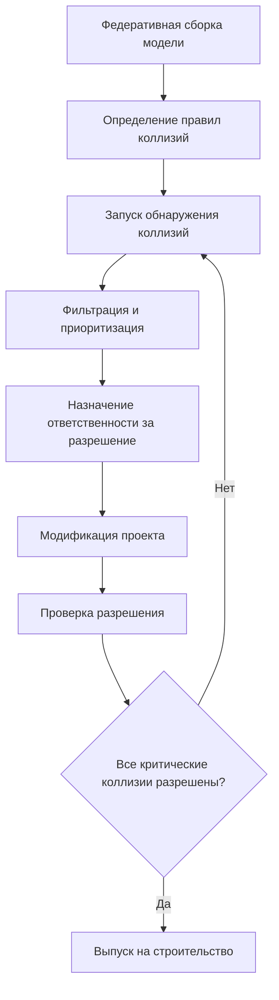

Информационное моделирование зданий (BIM) преобразует проектирование, координацию и строительство HVAC систем благодаря интеллектуальному трёхмерному моделированию, которое интегрирует геометрические, пространственные и эксплуатационные данные. BIM обеспечивает многодисциплинарную координацию, обнаружение коллизий и изготовление на этапе строительства с точностью, недостижимой при традиционном двумерном проектировании.

## Основы BIM для систем МЭП

BIM представляет строительные компоненты как параметрические объекты, содержащие:

- **Геометрические данные:** трёхмерное пространственное расположение, размеры, ориентация
- **Эксплуатационные характеристики:** тепловые свойства, расходы потоков, перепады давления
- **Информация о связности:** отношения систем, топология сети
- **Данные спецификации:** производитель, модель, свойства материалов
- **Стоимость и график:** единичное ценообразование, последовательность установки

Для систем HVAC объекты BIM включают приточно-вытяжные агрегаты, воздуховоды, диффузоры, трубопроводы, насосы, котлы, холодильные машины и устройства управления—каждое с встроенными инженерными свойствами, позволяющими выполнять автоматические расчёты и анализ производительности.

## Координация МЭП и обнаружение коллизий

Основная ценность BIM в проектах HVAC вытекает из пространственной координации между механическими, электрическими, сантехническими, противопожарными и конструктивными системами в ограниченных потолочных и шахтовых пространствах.

### Процесс обнаружения коллизий

Программное обеспечение координации выявляет геометрические конфликты:

**Жёсткие коллизии:** физическое пересечение твёрдых объектов (воздуховод, пересекающий балку)
**Мягкие коллизии:** объекты, нарушающие зоны безопасности (диффузор в пределах минимального расстояния до оросителя)
**Процессные коллизии:** временные конфликты в последовательности строительства

Рабочий процесс обнаружения коллизий:

### Метрики координации

Количественная оценка эффективности координации через:

$$\text{Плотность коллизий} = \frac{\text{Количество коллизий}}{\text{Объём здания (м}^3\text{)}}$$

Целевое значение: < 0,1 коллизий/м³ для скоординированных моделей перед изготовлением

$$\text{Процент разрешения} = \frac{\text{Разрешённые коллизии}}{\text{Всего выявленных коллизий}} \times 100\%$$

Целевое значение: > 95% разрешения перед выпуском рабочей документации

## Уровень разработки (LOD)

LOD определяет геометрическую детальность и информационную полноту элементов BIM на этапах проекта:

| LOD | Геометрическая детальность | Информационное содержание | Применение в HVAC |
|-----|-------------------------|---------------------------|--------------------|
| **100** | Концептуальное массирование | Нагрузки по площади | Программирование помещений, предварительное определение размеров |
| **200** | Приблизительная геометрия | Типовые системы | Схемное проектирование, оценка сметы |
| **300** | Специфические узлы | Точные размеры/производительность | Разработка проекта, координация |
| **350** | Данные о помехах | Детальные соединения | Рабочие документы, обнаружение коллизий |
| **400** | Детали изготовления | Данные уровня цеха | Предварительное изготовление, установка |
| **500** | Проверка фактического состояния | Эксплуатационные параметры | Управление объектом, наладка |

Системы HVAC обычно переходят от LOD 200 (схемное проектирование) к LOD 350 (рабочие документы) к LOD 400 (координация изготовления). LOD 500 представляет фактические условия для эксплуатации и обслуживания.

## Применение BIM в проектах HVAC

### Применение на этапе проектирования

**Интеграция энергетического моделирования:** передача геометрии BIM в инструменты энергетического моделирования (EnergyPlus, IES-VE, TRACE) для расчёта нагрузок и определения размеров системы

**Анализ воздушных потоков:** CFD-моделирование с использованием пространственных данных BIM для оценки картины распределения, теплового комфорта и эффективности вентиляции

**Определение размеров и выбор систем:** автоматическое определение размеров воздуховодов и трубопроводов на основе расчётных расходов и расчётов перепада давления:

$$\Delta P = f \frac{L}{D} \frac{\rho V^2}{2}$$

Где: $f$ = коэффициент трения, $L$ = длина, $D$ = диаметр, $\rho$ = плотность, $V$ = скорость

### Применение на этапе строительства

**Моделирование для изготовления:** модели LOD 400, содержащие:
- точные конфигурации фитингов (радиус, углы)
- местоположение опор и креплений
- детали соединений (фланец, сварка, соединение)
- толщина изоляции и защитные кожухи

**4D-планирование:** связь объектов BIM с действиями графика строительства, визуализация последовательности установки и выявление конфликтов использования пространства

**Автоматизированный расчёт объёмов:** извлечение материалов:
  - погонный метраж воздуховода/трубопровода по размеру и типу
  - количество оборудования по спецификации
  - площадь изоляции
  - количество опор и вспомогательного оборудования

### Применение на этапе эксплуатации

**Цифровое управление объектом:** BIM как справочный документ, содержащий:
- спецификации оборудования и графики обслуживания
- распределение помещений и данные об использовании
- энергопотребление по системам и зонам
- местоположение датчиков и контрольных точек

**Поддержка наладки:** проверка фактически установленных условий в соответствии с проектным замыслом, интеграция с системами автоматизации зданий

## Экосистема программного обеспечения BIM

Рабочие процессы HVAC BIM используют специализированные платформы:

**Инструменты разработки:** Autodesk Revit MEP, Bentley AECOsim, ArchiCAD MEP—создание интеллектуальных трёхмерных моделей с параметрическими компонентами

**Платформы координации:** Autodesk Navisworks, Solibri Model Checker, BIM 360 Glue—федеративные многодисциплинарные модели, обнаружение коллизий

**Инструменты анализа:** Carrier HAP, Trane TRACE, IES-VE—энергетическое моделирование; Autodesk CFD—моделирование воздушных потоков

**Инструменты изготовления:** Autodesk Fabrication CADmep, SysQue—создание рабочих чертежей и файлов для ЧПУ для воздуховодов и трубопроводов

## Рекомендации по внедрению BIM

**Требования к точности модели:** определение стандартов допусков (± 10 мм типично для координации МЭП)

**Протоколы обмена данными:** IFC (Industry Foundation Classes) для независимого от поставщика взаимодействия, проприетарные форматы (RVT, DWG) для нативных рабочих процессов

**Частота координации:** еженедельные сеансы обнаружения коллизий во время разработки проекта, ежедневно при подготовке рабочей документации

**Управление файлами:** централизованное размещение модели (BIM 360, ProjectWise) с контролем версий и отслеживанием изменений

**Метрики контроля качества:**
- количество элементов модели и полнота
- частота запусков обнаружения коллизий и процент разрешения
- согласованность модели от проектирования к изготовлению
- проверка точности модели фактического состояния

## ROI и преимущества производительности

Внедрение BIM в проектах HVAC обеспечивает измеримые преимущества:

- **Эффективность координации:** сокращение RFI на 40-60% во время строительства
- **Сжатие графика:** сокращение продолжительности установки МЭП на 10-20% за счёт предварительного изготовления
- **Снижение затрат:** сокращение потерь материалов на 3-5%, сокращение полевых работ на 5-10%
- **Улучшение качества:** сокращение полевых конфликтов, требующих переделки, на 80-90%

Инвестиции в программное обеспечение BIM, обучение и моделирование обычно обеспечивают положительную окупаемость в течение 2-3 проектов благодаря сокращению времени координации, меньшему количеству проблем при строительстве и повышенной ценности для клиента.

---

*Содержание продолжается в подразделах, охватывающих планирование выполнения BIM, программные платформы, стандарты и протоколы, а также применение на различных этапах проекта.*
