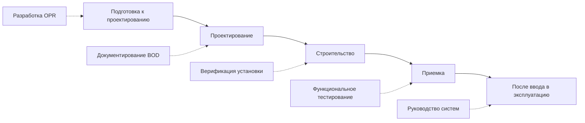
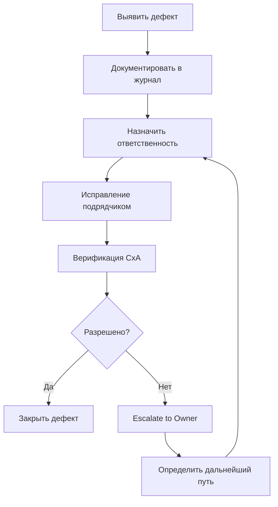

Наладка (Cx) интегрирует процессы, ориентированные на качество, на протяжении всего проектного цикла для проверки того, что системы HVAC соответствуют требованиям собственника и назначению проекта. Эффективная наладка требует раннего планирования, непрерывной верификации и систематической документации от программирования до введения в эксплуатацию.

## Обзор процесса наладки

ASHRAE Guideline 0-2019 определяет наладку как ориентированный на качество процесс достижения, верификации и документирования производительности систем в соответствии с Требованиями проекта собственника (OPR) в рамках бюджета и графика проекта.

### Этапы наладки

**Этап подготовки к проектированию:**
- Разработка Требований проекта собственника (OPR)
- Определение объема и бюджета наладки
- Выбор органа наладки (CxA)

**Этап проектирования:**
- Создание Основы проектирования (BOD)
- Разработка плана наладки
- Проверка проектных материалов на соответствие OPR
- Разработка предварительных процедур испытаний

**Этап строительства:**
- Верификация установки согласно строительной документации
- Контроль заводского тестирования и запуска
- Выполнение функциональных испытаний производительности
- Документирование дефектов и верификация их устранения

**Этап приемки:**
- Завершение итоговых испытаний и верификации
- Составление руководства систем с документацией по эксплуатации и обслуживанию
- Обучение собственника
- Выпуск итогового отчета о наладке

**Этап после ввода в эксплуатацию (продолжающаяся наладка):**
- Мониторинг производительности в течение 10–12 месяцев после ввода в эксплуатацию
- Верификация сезонной работы
- Оптимизация последовательностей управления
- Переподготовка персонала объекта по мере необходимости

## Требования проекта собственника (OPR)

OPR документирует цели, критерии и ожидания собственника в отношении производительности проекта — основу для всех работ по проектированию и наладке.

### Требования к содержанию OPR

**Цели и задачи проекта:**
- Тип здания и режим работы
- Критические требования к производительности (температура, влажность, качество воздуха)
- Целевые показатели энергоэффективности (EUI, уровень сертификации LEED)
- Предпочтения в отношении ремонтопригодности и простоты эксплуатации

**Требования к системам HVAC:**

**Критерии кондиционирования помещений:**

| Тип помещения | Диапазон температуры | Диапазон влажности | Интенсивность вентиляции | Специальные требования |
|-----------|-------------------|----------------|------------------|---------------------|
| Офис | 21–24°C | 30–60% ОВ | 8 м³/(ч·чел) | Нет |
| Лаборатория | 20–24°C | 30–60% ОВ | 20–40 м³/(ч·м²) | Вытяжка вытяжного шкафа |
| Центр обработки данных | 18–27°C | 40–60% ОВ | Переменная | Избыточность N+1 |
| Операционная | 20–23°C | 30–60% ОВ | 12 м³/(ч·м²) минимум | Фильтрация HEPA, положительное давление |

**Надежность и избыточность системы:**
- Требования к готовности (%, часы допустимого отключения)
- Уровень избыточности (N, N+1, 2N)
- Требования к резервному питанию
- Окна обслуживания и ограничения по графику

**Энергия и устойчивость:**
- Энергетический бюджет (кДж/(м²·год) или кВт·ч/(м²·год))
- Целевые показатели использования возобновляемых источников энергии
- Цели по экономии воды
- Ограничения по воздействию хладагента на окружающую среду (GWP, ODP)

**Измерение и верификация:**
- Гранулярность учета (здание в целом, система, оборудование)
- Требования к мониторингу и регистрации данных
- Показатели производительности и частота отчетности

### Процесс разработки OPR

**Семинары со стейкхолдерами:**
1. **Персонал эксплуатации:** Возможности обслуживания, потребности в обучении, доступ к запасным частям
2. **Управление объектом:** Энергетические бюджеты, эксплуатационные расходы, жизненный цикл системы
3. **Конечные пользователи:** Ожидания комфорта, допустимый уровень шума, предпочтения управления
4. **Руководство:** Капитальный бюджет, бюджет на эксплуатацию, обязательства в области устойчивости

**Формат документации OPR:**
- Описательные требования, организованные по системам
- Количественные критерии с измеримыми показателями
- Приоритизация (необходимое и желаемое)
- Ограничения по бюджету и соображения жизненного цикла

**Обновления OPR:**
- Проверка на ключевых этапах проектирования (SD, DD, CD) для утверждения собственником
- Документирование изменений и причин
- Ведение контроля версий и журнала изменений

## Основа проектирования (BOD)

BOD документирует предположения проекта, критерии и методологию, демонстрирующие, как проект удовлетворяет требованиям OPR.

### Структура содержания BOD

**Предположения проектирования:**
- Климатические данные (расчетные температуры, влажность)
- Плотность и расписание заполняемости
- Теплоприход от освещения и оборудования
- Инфильтрация и производительность оболочки здания

**Расчеты тепловых нагрузок:**
- Методология (метод теплового баланса ASHRAE, эквивалентная разность температур)
- Максимальные нагрузки отопления и охлаждения по зонам
- Коэффициенты разнообразия и коэффициенты безопасности
- Программное обеспечение для расчета нагрузок и входные данные

**Обоснование выбора системы:**

**Основная система HVAC:**

$$\text{System EUI} = \frac{\sum(\text{Мощность оборудования кВ} \times \text{Часы работы})}{1000 \times \text{Площадь здания}}$$

Сравнительная матрица оценки альтернатив:

| Тип системы | Первоначальная стоимость | Эксплуатационные расходы | Энергопотребление | Обслуживание | Занимаемая площадь |
|------------|-----------|----------------|------------|-------------|-----------|
| VAV с переотопом | Базовый уровень | Базовый уровень | Базовый уровень | Среднее | Компактная |
| DOAS + радиационное | +25% | –15% | –20% | Низкое | Увеличенная |
| Охлаждаемый потолок | +15% | –10% | –12% | Низкое | Компактная |
| Вентиляторные доводчики | –10% | +5% | +8% | Высокое | Распределённая |

**Подбор и выбор оборудования:**
- Номинальные мощности с анализом запаса прочности
- Рассмотрение производительности при частичной нагрузке
- Рейтинги эффективности (EER, COP, IPLV)
- Критерии выбора производителя

**Проектирование системы управления:**
- Архитектура управления (централизованная или распределённая)
- Описание последовательности операций
- Расположение датчиков и требования к точности
- Пользовательский интерфейс и уровни доступа

**Документирование соответствия:**
- Соответствие энергетическому кодексу (ASHRAE 90.1, IECC)
- Соответствие кодексу вентиляции (ASHRAE 62.1, IMC)
- Специальные требования кодекса (здравоохранение, лаборатория)

### Процесс проверки BOD

**Проверки на ключевых этапах проектирования:**
- 30% SD: Подтверждение выбора системы в соответствии с OPR
- 60% DD: Верификация подбора, спецификации производительности
- 90% CD: Проверка деталей, управления, полнота спецификаций
- 100% CD: Итоговая верификация соответствия

**Основное внимание при проверке CxA:**
- Верификация выравнивания по OPR
- Обоснованность предположений проектирования
- Адекватность спецификаций производительности оборудования
- Управляемость и тестируемость итогового проекта
- Ремонтопригодность и сложность эксплуатации

**Реестр проблем проектирования:**
- Документирование расхождений между OPR и BOD
- Отслеживание разрешения в итерациях проектирования
- Получение решений собственника по конфликтам (производительность или стоимость)

## План наладки

План наладки определяет объем, расписание, ответственность и процедуры, регулирующие мероприятия по наладке.

### Определение объема наладки

**Системы, включенные в наладку:**

**Полная наладка (тестирование и верификация):**
- Центральные установки обогрева и охлаждения
- Приточно-вытяжные установки и распределительные системы
- Концевое оборудование и управление
- Система автоматизации зданий
- Системы учета и мониторинга

**Ограниченная наладка (только верификация):**
- Системы подготовки горячей хозяйственной воды
- Сантехнические системы
- Системы пожарной защиты (отдельный орган испытания)

**Исключенные системы:**
- Внешние коммунальные системы (вне оболочки здания)
- Временные системы HVAC
- Оборудование, поставляемое собственником (если не указано иное)

### График наладки

Интеграция с графиком проекта:

| Этап проекта | Мероприятия по наладке | Продолжительность | Зависимости |
|--------------|-------------------------|----------|--------------|
| **Проектирование** | Проверка BOD, разработка плана испытаний | 2–4 недели за этап | Проектные материалы |
| **Поставки** | Проверка оборудования, координация | Постоянно | Обновления журнала поставок |
| **Установка** | Наблюдения на площадке, проверки установки | Еженедельно | Ход строительства |
| **Запуск** | Контроль запуска, начальные испытания | 2–4 недели | Существенное завершение |
| **Функциональное тестирование** | Выполнение процедур испытаний | 4–8 недель | Запуск завершен |
| **Обучение** | Сеансы обучения по эксплуатации и обслуживанию | 1–2 недели | Системы в работе |

**Критические пути:**
- Завершение программирования BAS позволяет проводить тестирование управления
- Запуск охладителя требует операционности градирни и насосов
- Балансировка воздуха — предусловие для итоговых функциональных испытаний
- Сезонные испытания (отопление требует зимних условий)

### Роли и ответственность

**Ответственность собственника:**
- Предоставить OPR и утвердить обновления
- Проверить и утвердить план наладки
- Участвовать в совещаниях по наладке
- Участвовать в сеансах обучения
- Принять наладенные системы

**Ответственность органа наладки (CxA):**
- Разработать план наладки и процедуры испытаний
- Проверить проектные материалы на соответствие OPR
- Участвовать в совещаниях строительства
- Контролировать запуск и проводить функциональные испытания
- Составить руководство систем и итоговый отчет

**Ответственность инженера-проектировщика:**
- Разработать BOD в соответствии с OPR
- Поддержать проверки проектирования CxA
- Разработать детальные последовательности управления
- Ответить на замечания по наладке
- Участвовать в функциональном тестировании

**Ответственность подрядчика:**
- Установить системы согласно строительной документации
- Предоставить услуги по запуску и участвовать в испытаниях
- Устранить дефекты, выявленные при наладке
- Предоставить документацию по эксплуатации и обслуживанию
- Поддержать мероприятия по обучению

**Ответственность агента по испытаниям (если отличается от CxA):**
- Провести балансировку воздуха и воды
- Документировать измерения расходов и производительности
- Устранить дефекты в пределах своей компетенции
- Предоставить сертифицированные отчеты TAB

## Наладка на этапе строительства

Активная верификация во время строительства гарантирует правильность установки систем и их способность к испытанию.

### Верификация установки

**Предварительные контрольные списки:**
Формы проверки, специфичные для оборудования, подтверждающие:
- Модель соответствует спецификациям
- Ориентация и расположение установки верны
- Соединения (электрические, трубопроводные, воздуховодные) завершены
- Устройства безопасности и блокировки функциональны
- Проводка управления и питание проверены
- Изоляция и маркировка завершены

**Методология выборки:**

Для повторяющегося оборудования (VAV-ящики, вентиляторные доводчики):

$$\text{Размер выборки} = \max\left(10\%\text{ от совокупности}, 10\text{ единиц}\right)$$

Пример: 75 VAV-ящиков → минимум 10 единиц для выборки

**Частота наблюдений на площадке:**
- Еженедельно на этапе подготовительных работ
- Раз в две недели при расстановке оборудования
- Ежедневно на этапах запуска и тестирования

### Процедуры запуска

**Услуги производителя по запуску:**
- Оборудование центральной установки (охладители, котлы, крупные приточно-вытяжные установки)
- Специализированное оборудование (рекуперация энергии, автоматизация зданий)
- Выполняется подготовленными на заводе техниками
- Документируется на формах запуска производителя

**Услуги подрядчика по запуску:**
- Стандартное оборудование (насосы, маленькие вентиляторы, электрокалориферы)
- Выполняется согласно инструкциям производителя
- Верифицируется органом наладки
- Документируется в отчетах о запуске подрядчика

**Критерии верификации запуска:**
- Оборудование работает без ненормального шума и вибрации
- Рабочие параметры в пределах лимитов производителя
- Устройства безопасности работают правильно
- Последовательности управления выполняются как спроектировано

### Функциональное тестирование производительности

Функциональные испытания верифицируют интегрированную производительность системы при фактических и смоделированных условиях нагрузки.

**Компоненты процедуры испытаний:**
1. **Предусловия:** Условия, требуемые перед испытанием (TAB завершена, управление запрограммировано)
2. **Требуемое оборудование:** Приборы и инструменты, необходимые для испытания
3. **Процедуры:** Пошаговые инструкции выполнения испытания
4. **Ожидаемые результаты:** Критерии производительности, определяющие успех/отказ
5. **Фактические результаты:** Документированные наблюдения и измерения
6. **Дефекты:** Выявленные проблемы, требующие устранения

**Пример функционального испытания: VAV терминал с переотопом**

| Шаг испытания | Действие | Ожидаемый результат | Критерии приемки |
|-----------|--------|----------------|---------------------|
| 1 | Проверить минимальный расход | BAS отображает установку мин. расхода | ±10% от проектного минимума |
| 2 | Команда зоне на отопление | Заслонка модулирует в мин. положение, клапан переотопа открывается | Заслонка ≤ мин. + 5%, клапан > 0% |
| 3 | Удовлетворить температуру зоны | Клапан переотопа закрывается | Клапан = 0% |
| 4 | Команда зоне на охлаждение | Заслонка модулирует к макс. положению | Положение заслонки увеличивается |
| 5 | Проверить максимальный расход | BAS отображает установку макс. расхода | ±10% от проектного максимума |
| 6 | Симулировать температуру зоны выше уставки | Заслонка остается в макс., переотоп блокирован | Заслонка = макс., клапан = 0% |

**Стратегия последовательности испытаний:**
1. Тестирование на уровне компонентов (отдельное оборудование)
2. Тестирование на уровне системы (интегрированная работа)
3. Тестирование интерфейсов (координация между системами)
4. Сезонные испытания (режимы, недоступные при начальном тестировании)

### Управление дефектами

**Классификация дефектов:**
- **Критический:** Система не может работать, проблема безопасности, нарушение кодекса
- **Основной:** Производительность значительно деградирована, повторяющиеся отказы
- **Незначительный:** Производительность слегка нарушена, косметические проблемы

**Рабочий процесс разрешения дефектов:**

**Метрики отслеживания разрешения:**
- Возраст дефекта (дни в открытом состоянии)
- Производительность ответственной стороны
- Паттерны повторяющихся дефектов
- Выдающиеся критические проблемы, препятствующие приемке

## Результаты работ по наладке

**Содержание итогового отчета о наладке:**
- Резюме процесса наладки и результатов
- Документирование OPR и BOD с окончательными изменениями
- План наладки и расписание
- Контрольные списки верификации установки
- Процедуры функциональных испытаний и результаты
- Журнал дефектов с документацией разрешения
- Записи об обучении и списки участников
- Рекомендации для продолжающейся наладки

**Руководство систем:**
- Документация оборудования (поставки, руководства по эксплуатации и обслуживанию)
- Чертежи состояния «как построено» (архитектурные, механические, электрические, управление)
- Последовательность операций (окончательная, с программированием)
- Отчеты о тестировании и балансировке
- Документация гарантии
- Рекомендуемые графики обслуживания
- Списки запасных частей и источники

**Результаты обучения:**
- Учебная программа и материалы
- Завершенные практические демонстрации
- Верификация компетентности (если требуется)
- Видеозаписи сеансов обучения

Комплексная интеграция наладки обеспечивает работу систем HVAC в соответствии с замыслом, сокращая энергопотребление на 10–20%, снижая жалобы на комфорт на 50–80% и продлевая срок службы оборудования благодаря надлежащей эксплуатации и обслуживанию.

---

*Подразделы предоставляют подробное руководство по разработке OPR, документированию основы проектирования, созданию плана наладки и процедурам наладки на этапе строительства.*
