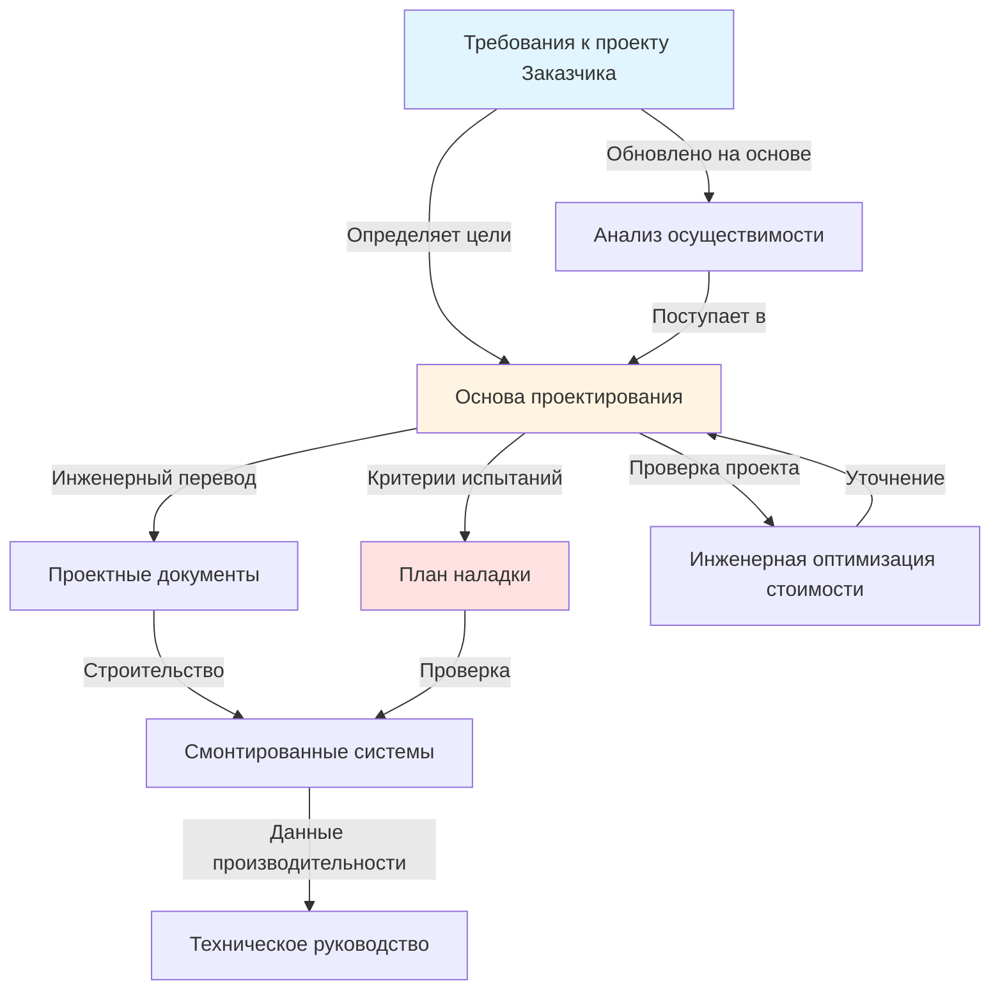

Основа проектирования (BOD) — это фундаментальный инженерный документ, который преобразует Требования к проекту Заказчика (OPR) в технические проектные решения. BOD обеспечивает обоснование, предположения, расчеты и методологии, которые оправдывают все выборы и конфигурации HVAC-систем на протяжении процесса наладки.

## Роль BOD в наладке

BOD служит техническим мостом между требованиями владельца и смонтированными системами. Согласно ASHRAE Guideline 0-2019, документация BOD должна разрабатываться на ранних стадиях проектирования и обновляться на всех этапах проекта для сохранения соответствия эволюции OPR. Орган по наладке использует BOD для проверки того, что проектные решения удовлетворяют целям владельца, и для разработки процедур испытаний функциональной производительности.

BOD отличается от проектных документов тем, что объясняет инженерную логику, а не предписывает конструктивные детали. В то время как чертежи определяют, что строить, BOD раскрывает, почему были выбраны именно эти системы и как они достигают целевые показатели производительности.

## Связь BOD-OPR

OPR устанавливает измеримые цели, такие как допуски температуры, диапазоны влажности, частоты воздухообмена и целевые показатели энергетической производительности. BOD реагирует, документируя технический подход, выбранный для достижения каждого требования, включая рассмотренные альтернативные системы и обоснование их отклонения.

## Структура документации BOD

### Предположения проектирования

Предположения проектирования устанавливают основные параметры, на которых основаны все расчеты и выборы. К ним относятся плотности занятости, графики работы, оценки нагрузок подключенного оборудования, плотности мощности освещения, скорости инфильтрации и коэффициенты безопасности, применяемые к расчетам нагрузок.

Документируйте предположения с достаточной степенью детализации, чтобы обеспечить независимую проверку. Укажите, получены ли значения из стандартов ASHRAE, требований местных кодексов, фактических измерений или инженерного суждения. Определите предположения, требующие подтверждения владельца или проверки во время строительства.

### Климатические условия проектирования

Установите наружные и внутренние условия проектирования в соответствии с ASHRAE Fundamentals. Документируйте температуры по сухому термометру, температуры по влажному термометру, коэффициенты влажности и значения энтальпии для дней проектирования охлаждения и отопления. Включите условия проектирования осушения для приложений, чувствительных к влажности.

Укажите процентильное основание для наружных условий (обычно 0,4% для охлаждения, 99,6% для отопления). Документируйте любые отклонения от стандартных условий на основе анализа рисков или требований владельца для повышенной надежности.

### Методология расчета нагрузок

Опишите подход к расчетам, используемые программные инструменты и применяемые стандарты. Для нагрузок охлаждения укажите, использовались ли методы CLTD/CLF, метод лучистого временного ряда (RTS) или метод теплового баланса. Документируйте коэффициенты диверсификации, анализ одновременных нагрузок и стратегии расчета по блокам или по отдельным помещениям.

Включите предположения о внутренних нагрузках с вспомогательными источниками данных. Документируйте расчеты нагрузки вентиляции в соответствии со стандартом ASHRAE 62.1, включая наружный воздушный поток в дыхательную зону, эффективность распределения воздуха в зоне и эффективность вентиляции системы.

## Документация по проектированию систем

### Описания систем

Предоставьте описания каждой основной системы, объясняющие конфигурацию, производительность и характеристики работы. Опишите стратегии распределения воздуха, подходы к зонированию и последовательности включения оборудования. Объясните, как системы взаимодействуют и какие компоненты обеспечивают резервное копирование или резервирование.

Рассмотрите рекуперацию энергии, работу экономайзера, управляемую по потребности вентиляцию и другие меры повышения эффективности. Опишите интеграцию управления между механическими системами, освещением и системами управления зданием.

### Критерии выбора оборудования

| Фактор выбора | Критерий | Основание обоснования |
|---------------|----------|----------------------|
| Производительность | Пиковая нагрузка + коэффициент безопасности | Расчеты нагрузок, анализ диверсификации |
| Эффективность | Минимальный порог производительности | Энергокодекс, анализ стоимости жизненного цикла |
| Производительность при частичной нагрузке | Метрики IPLV, IEER | Профиль эксплуатации, годовое энергетическое моделирование |
| Надежность | Показатели MTBF, условия гарантии | Доступность обслуживания, опыт владельца |
| Акустика | Критерии NC/RC | Функция помещения, стандарты владельца |
| Занимаемая площадь | Пространственные ограничения | Координация с архитектурой, удобство обслуживания |
| Стоимость жизненного цикла | NPV на период анализа | Затраты на энергию, затраты на обслуживание, замена |

Документируйте весовые коэффициенты, применяемые при конфликте нескольких критериев. Объясните любые выборы оборудования, которые отдают приоритет критериям, отличным от первоначальной стоимости.

### Стратегии управления

Опишите последовательности управления на концептуальном уровне, а не с точки зрения деталей по отдельным точкам. Объясните стратегии сброса для температуры подаваемого воздуха, температуры охлажденной воды и температуры горячей воды. Документируйте графики пониженного и повышенного режима, алгоритмы оптимального старта и подходы к ограничению спроса.

Рассмотрите интеграцию с системами управления зданием, указав протоколы связи и требования к регистрации данных. Опишите возможности переопределения и доступ к ручному управлению для операторов.

## Интеграция энергетического анализа

Документируйте предположения энергетического моделирования, включая источники данных о погоде, графики занятости, нагрузки процессов и эффективность системы. Опишите базовые системы в соответствии с Приложением G стандарта ASHRAE 90.1 для соответствия коду или сертификации LEED.

Сообщите годовое потребление энергии по видам использования, профили пиковых нагрузок и прогнозы затрат на энергию. Объясните, как предлагаемые системы достигают целевых показателей энергетической производительности, установленные в OPR.

## Требования к содержанию BOD

| Раздел BOD | Требуемое содержание | Частота обновления |
|-----------|---------------------|-------------------|
| Обзор проекта | Область, цели, ограничения | Начальное + крупные изменения |
| Критерии проектирования | Коды, стандарты, требования владельца | Начальное + обновления кодов |
| Расчеты нагрузок | Пиковые нагрузки, методология расчета | Разработка проекта + пересмотры |
| Описания систем | Конфигурация, производительность, управление | Каждый этап проектирования |
| Выбор оборудования | Технические характеристики производительности, обоснование выбора | Разработка проекта + подстановки |
| Энергетический анализ | Прогнозы потребления, подход моделирования | Разработка проекта + финальное |
| Журнал предположений | Все предположения проектирования со статусом валидации | Постоянные обновления |

## Процесс разработки BOD

Начните разработку BOD на этапе концептуального проекта, как только будет доступен предварительный OPR. Расширьте содержание BOD на этапе разработки проекта после завершения расчетов и финализации выбора оборудования. Обновите BOD, чтобы отразить результаты инженерной оптимизации стоимости, уточнения толкования кодов и изменения требований владельца.

Представьте BOD органу по наладке на рассмотрение на каждом этапе проектирования. Адресуйте замечания по наладке путем пересмотра проекта или документирования обоснования сохранения текущего подхода. Включите BOD в проектные руководства в качестве постоянного документа проектных намерений для персонала по эксплуатации и будущих модификаций.

Завершенный BOD обеспечивает техническую основу для процедур испытаний наладки и проверки производительности. Без тщательной документации BOD наладка становится субъективной оценкой, а не объективной проверкой на соответствие установленным инженерным критериям.
