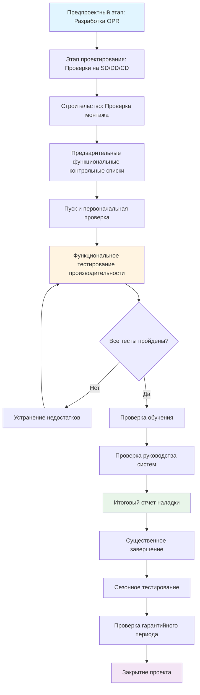

План наладки устанавливает стратегию проверки того, что системы HVAC соответствуют требованиям владельца проекта (OPR) и замыслу проектирования. В соответствии с ASHRAE Guideline 0-2019 и Guideline 1.1-2007 данный живой документ определяет объем работ, ответственность, расписание и поставляемые материалы на протяжении всех этапов проекта.

## Этапы наладки

ASHRAE Guideline 0 определяет наладку как пятиэтапный процесс, охватывающий период от предпроектной фазы до занятости и эксплуатации.

### Предпроектный этап

Инженер-наладчик (CxA) проводит анализ требований владельца, разрабатывает структуру плана наладки и подготавливает документацию основания для проектирования (BOD). На этом этапе закладывается основа для всех последующих действий. CxA оценивает существующие условия объекта, инженерную инфраструктуру и операционные ограничения, влияющие на выбор системы и критерии производительности.

**Основные поставляемые материалы:**
- Документация требований владельца проекта (OPR)
- Исходный план наладки
- Бюджет наладки на этап проектирования
- Предварительный список систем для наладки

### Этап проектирования

CxA проводит проверку проекта на стадиях схемного проектирования (SD), разработки проекта (DD) и рабочей документации (CD). Каждая проверка верифицирует соответствие между OPR, BOD и проектной документацией. CxA разрабатывает детальные процедуры тестирования и определяет оборудование, требующее проверки наладки.

**Основные поставляемые материалы:**
- Отчеты проверки проекта (SD, DD, CD)
- Обновленный план наладки с подробным объемом работ
- Спецификации наладки для контрактной документации
- Предварительные процедуры функционального тестирования
- Журнал проверки поставок оборудования

### Этап строительства

CxA проверяет качество монтажа, рассматривает поставки, при необходимости наблюдает заводское тестирование и координирует наблюдения при пуске. Деятельность на этапе строительства обеспечивает установку систем в соответствии с замыслом проектирования и их готовность к функциональному тестированию производительности.

**Основные поставляемые материалы:**
- Отчеты об обследовании строительной площадки
- Комментарии по рассмотрению поставок
- Журнал проблем с отслеживанием недостатков
- Обновленные процедуры функционального тестирования
- Отчеты проверки предварительных функциональных контрольных списков

### Этап приемки

Функциональное тестирование производительности подтверждает, что системы работают согласно проекту при различных режимах нагрузки и последовательностях управления. CxA выполняет процедуры тестирования, документирует результаты и отслеживает устранение недостатков. Этот этап завершается передачей систем владельцу.

**Основные поставляемые материалы:**
- Отчеты функционального тестирования производительности
- Документация отслеживания и устранения недостатков
- Отчеты анализа журнала тенденций
- Комментарии по проверке руководства систем
- Проверка плана обучения
- Итоговый отчет наладки

### Этап после ввода в эксплуатацию

CxA проводит сезонное тестирование и проверку по истечении гарантийного срока для подтверждения продолжения надлежащей работы. На этом этапе решаются проблемы, выявленные при фактических нагрузках и режимах эксплуатации, которые не были очевидны при первоначальной приемке.

**Основные поставляемые материалы:**
- Отчеты сезонного функционального тестирования
- Отчет о проверке гарантийного периода
- Обновленное руководство систем
- Рекомендации по постоянной наладке

## Рабочий процесс наладки

## Ответственность команды наладки

Команда наладки включает несколько сторон с отчетливыми ролями и ответственностью. Четкое распределение ответственности предотвращает пропуски в деятельности по проверке.

| Роль | Организация | Ответственность |
|------|-------------|------------------|
| **Владелец** | Владелец/Управление объектом | Определение OPR; утверждение плана наладки; участие в ключевых встречах; обеспечение доступа; рассмотрение поставляемых материалов; приемка завершенных систем |
| **Инженер-наладчик** | Независимая фирма CxA | Разработка и управление планом наладки; проверка проектирования; проверка монтажа; разработка и выполнение функциональных тестов; документирование недостатков; подготовка отчетов |
| **Проектный инженер** | Фирма проектирования MEP | Разработка BOD; включение спецификаций наладки; ответ на комментарии проверки проекта; участие в совещаниях наладки; устранение дефектов, связанных с проектированием |
| **Генеральный подрядчик** | ГК/Менеджер строительства | Планирование деятельности наладки; координирование поддержки субподрядчиков; устранение дефектов строительства; обеспечение доступа на площадку и соблюдение безопасности |
| **Подрядчик MEP** | Механический/электрический субподрядчик | Выполнение предварительных функциональных контрольных списков; выполнение пуска; предоставление технических специалистов для функционального тестирования; устранение дефектов монтажа; проведение обучения |
| **Подрядчик управления** | Подрядчик управления | Программирование и проверка последовательностей управления; предоставление доступа к интерфейсу оператора; поддержка функционального тестирования; устранение дефектов управления; предоставление обучения по управлению |
| **Подрядчик тестирования и балансировки** | Агентство TAB | Выполнение процедур TAB в соответствии с ASHRAE Standard 111; предоставление отчетов TAB; координирование с CxA; внесение регулировок при функциональном тестировании |

## График поставки ключевых результатов

Поставляемые материалы наладки совпадают с ключевыми этапами проекта для обеспечения своевременного потока информации и принятия решений.

| Этап проекта | Поставляемый материал наладки | Сроки |
|-------------------|---------------------------|----------|
| Присуждение контракта | План наладки (исходный) | В течение 30 дней |
| Схемное проектирование | Отчет проверки SD | В течение 15 дней после подачи SD |
| Разработка проекта | Отчет проверки DD | В течение 15 дней после подачи DD |
| Рабочая документация (90%) | Отчет проверки CD; окончательные спецификации Cx | В течение 15 дней после подачи CD |
| Торги/Присуждение | Обновленный план наладки | До начала строительства |
| Первая поставка MEP | Журнал проверки поставок | В течение 15 дней после поставки |
| Завершение скрытых работ | Отчет об обследовании строительства | Постоянно во время строительства |
| Существенное завершение - за 60 дней | Предварительные функциональные контрольные списки завершены | За 60 дней до ЭЗ |
| Существенное завершение - за 30 дней | Функциональное тестирование 80% завершено | За 30 дней до ЭЗ |
| Существенное завершение | Функциональное тестирование 100% завершено; обучение проверено | В момент ЭЗ |
| Окончательное завершение | Итоговый отчет наладки; проверка руководства систем | В течение 30 дней после ОЗ |
| 10 месяцев после ввода в эксплуатацию | Отчет сезонного тестирования | Противоположный сезон приемке |
| Конец гарантии - за 60 дней | Отчет о проверке гарантийного периода | До истечения гарантии |

## Требования к документации

План наладки определяет стандарты документирования для обеспечения постоянной, прослеживаемой проверки. Все отчеты ссылаются на конкретные критерии OPR и BOD, подлежащие проверке. Журналы проблем отслеживают недостатки от выявления до устранения с указанием ответственности и целевых дат.

Процедуры функционального тестирования определяют исходные условия, пошаговые последовательности тестирования, критерии приемки и методы записи данных. Процедуры тестирования проходят проверку проектным инженером и монтажной организацией перед выполнением для выявления потенциальных проблем и обеспечения возможности реализации.

Журналы тенденций предоставляют объективные данные, демонстрирующие отклик системы при функциональном тестировании. План наладки определяет требования к точкам тренда, интервалам логирования и минимальную продолжительность для захвата переходных процессов и стабильности управления.

## Интеграция с методом реализации проекта

План наладки адаптируется к методу реализации проекта, сохраняя строгость проверки. Проекты, реализованные по методу «конкурс-ставка-строительство», обычно привлекают независимого CxA, подотчетного владельцу. Модели проектирования-строительства и интегрированной реализации проектов могут встроить наладку в команду реализации, но должны сохранять объективность через определенные структуры отчетности и независимую проверку тестирования.

Раннее привлечение CxA на предпроектном этапе приносит максимальную ценность, влияя на выбор системы, возможности упрощения и критерии производительности до того, как проект будет зафиксирован. Позднее привлечение ограничивает CxA тестированием приемки без входных данных по проектированию, снижая эффективность и потенциально требуя переработки стоимости, если системы окажутся сложными для наладки.

Бюджет наладки обычно составляет от 0,5% до 1,5% стоимости строительства механических и электрических систем, варьируясь в зависимости от сложности проекта, типов систем и охвата этапов. Это инвестирование приносит ценность через снижение операционных проблем, повышение понимания владельцем и верифицированную производительность вместо предполагаемого соответствия.
