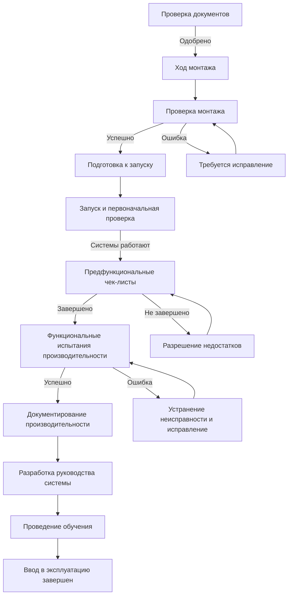

Ввод в эксплуатацию на этапе строительства представляет наиболее интенсивный период процесса ввода в эксплуатацию, когда документирование переходит к физической верификации и валидации производительности оборудования. Этот этап подтверждает, что установленные системы соответствуют проектному замыслу и работают согласно спецификациям до заселения здания.

## Процесс ввода в эксплуатацию на этапе строительства

## Проверка монтажа

Проверка монтажа подтверждает, что оборудование и системы установлены в соответствии с утвержденной проектной документацией и требованиями производителя. Инженер по вводу в эксплуатацию (CxA) проводит осмотр площадки на критических этапах монтажа для выявления и документирования отклонений до их встраивания в конструкцию здания.

**Критические точки верификации:**

- Расположение оборудования, ориентация и зазоры
- Маршрутизация труб и воздуховодов, их размеры и изоляция
- Размещение датчиков управления и их калибровка
- Электрические соединения и проверка напряжения
- Виброизоляция и сейсмические крепления
- Данные на паспортной табличке оборудования в сравнении со спецификациями
- Установка защитных устройств и доступ к ним

Проверка монтажа проводится постепенно по мере продвижения строительства. Раннее выявление дефектов монтажа минимизирует затраты на переделку и влияние на график. CxA координирует деятельность по верификации с графиками подрядчиков, чтобы избежать задержек строительства при сохранении тщательного надзора.

## Требования к запуску и первоначальной проверке

Запуск устанавливает базовую работу системы в контролируемых условиях. Каждое оборудование требует систематических процедур запуска в соответствии с инструкциями производителя и промышленными стандартами. ASHRAE Guideline 1.1 подчеркивает необходимость запуска под надзором производителя для сложного оборудования, включая холодильные машины, котлы и системы управления зданием.

### Требования к запуску по типам систем

| Тип системы | Требования к запуску | Критические проверки | Документирование |
|-------------|---------------------|---------------------|------------------|
| **Холодильные машины** | Технический специалист, авторизованный заводом; анализ масла; проверка заряда хладагента | Ток компрессора; температуры приближения; срабатывание защитных устройств | Отчет о запуске; результаты анализа масла |
| **Котлы** | Анализ горения; проверка давления газа; испытание безопасности | CO/CO₂ в дымовых газах; тяга; срабатывание датчика пламени | Отчет об анализе горения; чек-лист безопасности |
| **Воздухообрабатывающие установки** | Натяжение ремня; смазка подшипников; проверка вращения | Ток двигателя; измерение расхода воздуха; перепад давления на фильтре | Данные производительности вентилятора; результаты балансировки |
| **Насосы** | Проверка вращения; осмотр уплотнений; испытание давлением | Ток двигателя; перепад давления; работа уплотнений | Верификация кривой производительности |
| **Градирни** | Установка оросителей; проверка форсунок; выравнивание вентилятора | Распределение воды; деэмульсаторы; химия воды в бассейне | Базовая обработка воды |
| **BAS/DDC** | Проверка соответствия точек; программирование контроллеров; тестирование сети | Калибровка датчиков; последовательности управления; функции сигналов тревоги | Поточечная проверка; верификация последовательности |

## Предфункциональные чек-листы

Предфункциональные чек-листы систематически проверяют, что все компоненты системы готовы к интегрированному функциональному тестированию. Эти статические и динамические проверки подтверждают правильный монтаж, завершение запуска и базовую готовность к работе перед выполнением функциональных испытаний производительности.

**Компоненты предфункционального чек-листа:**

1. **Статические осмотры** – визуальная верификация полноты монтажа, правильной проводки, корректных моделей оборудования и соответствия спецификациям
2. **Функциональные испытания компонентов** – работа отдельных устройств, включая заслонки, клапаны, датчики и защитные устройства в изолированных условиях
3. **Верификация калибровки** – проверка точности датчиков с использованием калиброванных приборов с документированными допусками
4. **Блокировки и защиты** – верификация того, что защитные устройства срабатывают при корректных уставках и предотвращают небезопасные условия
5. **Верификация логики управления** – подтверждение того, что последовательности управления выполняются запрограммированным образом в моделируемых условиях

Предфункциональные чек-листы заполняют пробел между запуском и функциональными испытаниями производительности. Все пункты чек-листа должны быть удовлетворительно завершены перед переходом к ФПТ. Неразрешенные недостатки задерживают функциональное тестирование и удлиняют графики ввода в эксплуатацию.

## Процедуры функционального тестирования производительности

Функциональное тестирование производительности валидирует, что системы и сборки работают как предусмотрено в различных режимах и условиях эксплуатации. Процедуры ФПТ следуют письменным протоколам испытаний, которые определяют условия тестирования, критерии приемки и требования к документированию. ASHRAE Guideline 1.1 требует, чтобы инженер по вводу в эксплуатацию разработал процедуры ФПТ и присутствовал при всех испытаниях.

**Методология ФПТ:**

1. **Подготовка к тестированию** – анализ проектного замысла, последовательностей управления и критериев приемки вместе с проектной группой и подрядчиками
2. **Начальные условия** – установление стабильных базовых условий перед введением тестовых сценариев
3. **Режимы работы** – тестирование нормальной работы, неиспользуемого режима, прогрева, охлаждения, работы с преобладанием наружного воздуха и режимов чрезвычайной ситуации
4. **Тестирование уставок** – верификация реакции управления на изменения уставок по всему диапазону управления
5. **Верификация последовательности** – подтверждение надлежащей ступенчатости, первичной-вторичной работы, блокировок и взаимосвязей
6. **Тестирование безопасности** – верификация того, что защитные устройства предотвращают небезопасные условия и повреждение оборудования
7. **Интегрированная работа** – тестирование взаимодействия между системами, включая координацию воздушной и водяной части
8. **Анализ тенденций** – захват данных тенденций BAS во время тестирования для верификации надлежащей работы датчиков и реакции управления
9. **Документирование** – запись условий тестирования, наблюдений, измеренных значений, определения соответствия/несоответствия и примечания о недостатках

### Требования к документированию ФПТ

| Элемент испытания | Требуемые данные | Критерии приемки | Действия при недостатках |
|------------------|-----------------|------------------|--------------------------|
| **Верификация расхода воздуха** | CFM на терминалах, статические давления, коэффициенты разнообразия | ±10% от проектного согласно ASHRAE 90.1 | Перебалансировка; регулировка заслонок; верификация скорости вентилятора |
| **Управление температурой** | Температуры помещений; температура выходящего воздуха; сигналы управления | ±1,1°C от уставки при проектных условиях | Калибровка датчиков; настройка контуров управления; регулировка последовательностей |
| **Работа с наружным воздухом** | Положение заслонок НА/РА; температура смешанного воздуха; точка переключения | Надлежащее модулирование; корректное переключение согласно коду | Ремонт приводов; перепрограммирование логики; верификация датчиков энтальпии |
| **Система охлажденной воды** | Температуры подачи/возврата; расходы; дельта-T; скорости насосов | Проектная дельта-T ±10%; расход в пределах 5% | Регулировка балансировочных клапанов; оптимизация регулирующих клапанов; верификация стратегии насосов |
| **Система отопления** | Температуры подачи/возврата; эффективность горения; ступенчатость | Эффективность согласно паспортной табличке; надлежащая последовательность ступенчатости | Настройка горелки; регулировка производительности; перепрограммирование логики ступенчатости |
| **Реакция системы DDC** | Журналы тенденций; настройка контуров управления; функции сигналов тревоги | Управление P+I; уведомление о сигнале тревоги в течение 5 минут | Перенастройка контуров; верификация маршрутизации сигналов тревоги; регулировка мертвых зон |

## Разрешение недостатков и повторное тестирование

Недостатки, выявленные во время проверки монтажа, предфункциональных чек-листов или функционального тестирования, требуют формального отслеживания и разрешения. CxA ведет журнал недостатков с документированием каждой проблемы, ответственной стороны, необходимого исправления и статуса разрешения. Недостатки классифицируются по степени серьезности для приоритизации усилий по разрешению.

**Категории недостатков:**

- **Критические** – препятствуют работе системы или создают опасность для безопасности; требуют немедленного исправления
- **Основные** – значительно снижают производительность или нарушают требования кодекса; исправление перед заселением
- **Незначительные** – ограниченное влияние на производительность; исправление перед окончательной приемкой

После исправления недостатков затронутые системы проходят повторное тестирование с использованием тех же процедур испытаний и критериев приемки. Только системы, демонстрирующие удовлетворительную производительность во всех тестовых сценариях, достигают приемки при вводе в эксплуатацию. Неразрешенные недостатки на момент существенного завершения передаются в список отложенного/сезонного тестирования или остаются открытыми, ожидая окончательного исправления.

Интенсивность ввода в эксплуатацию на этапе строительства напрямую коррелирует с успехом проекта. Тщательная проверка монтажа, систематические процедуры запуска, комплексные предфункциональные чек-листы и строгое функциональное тестирование производительности обеспечивают, что системы здания соответствуют ожиданиям владельца и обеспечивают надежную долгосрочную работу. Инвестиция в ввод в эксплуатацию на этапе строительства дает измеримые выгоды через сокращение обратных вызовов, снижение потребления энергии и улучшение комфорта жильцов.
