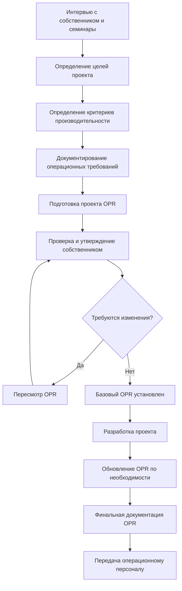

## Основа и назначение OPR

Документ "Требования собственника к проекту" (OPR) служит базовым документом пусконаладки, который определяет цели собственника, ожидания по производительности и операционные требования к инженерным системам здания. В соответствии с рекомендациями ASHRAE 0, OPR предоставляет измеримые критерии, по которым оцениваются все решения по проектированию и строительству на протяжении всего жизненного цикла проекта.

OPR устанавливает четкую систему, ориентированную на производительность, которая переводит ожидания собственника в количественные показатели. Этот документ определяет разработку "Основы для проектирования" (BOD) и направляет проверочное тестирование во время пусконаладки. Без комплексной документации OPR процесс пусконаладки лишен объективных критериев подтверждения успеха.

## Процесс разработки OPR

## Основные категории содержания OPR

| Категория | Ключевые элементы | Назначение |
|-----------|-------------------|-----------|
| Видение проекта | Миссия, стратегические цели, назначение здания | Устанавливает общие цели |
| Требования к производительности | Диапазоны температур, уровни влажности, показатели качества воздуха, целевые показатели энергии | Определяет измеримые критерии успеха |
| Операционные параметры | График работы, характеристики занятости, профили нагрузок | Направляет выбор размера системы и стратегии управления |
| Философия обслуживания | Подход к обслуживанию, доступность оборудования, ожидаемый срок службы | Информирует выбор оборудования и планировку |
| Экологические цели | Производительность энергии, сохранение воды, стандарты качества внутреннего воздуха | Устанавливает критерии устойчивости |
| Бюджетные рамки | Ограничения первоначальной стоимости, целевые показатели стоимости жизненного цикла, ограничения бюджета коммунальных услуг | Ограничивает варианты проектирования |
| Ограничения по графику | Даты занятости, требования к фазированию, критические вехи | Влияет на выбор оборудования и поэтапность |
| Положения об расширении | Будущие потребности в емкости, зарезервированные пространства, перенаряжение инфраструктуры | Обеспечивает адаптируемость |

## Определение критериев производительности

Критерии производительности должны быть количественными и проверяемыми путем тестирования. Уставки температуры требуют точности: укажите 22 °C ± 1,1 °C вместо "комфортных температур". Контроль влажности требует аналогичной строгости: 40–60 % относительной влажности при расчетных условиях с явно определенными допустимыми отклонениями при экстремальных погодных условиях.

Целевые показатели энергопроизводительности должны ссылаться на конкретные показатели, соответствующие возможностям измерения. Целевые показатели годового энергопотребления (EUI) в кДж/м²/год предоставляют четкие ориентиры. Ограничения пиковой нагрузки в кВт определяют требования к электрической инфраструктуре. Когда это применимо, целевые показатели возобновляемой энергии или интенсивности углеродных выбросов определяют ожидания по устойчивости.

Требования к вентиляции должны указывать скорость подачи наружного воздуха в соответствии со стандартом ASHRAE 62.1, с учетом категорий занятости и использования помещений. Параметры качества внутреннего воздуха помимо скорости вентиляции — такие как ограничения концентрации CO₂, пороги содержания твердых частиц или ограничения VOC — требуют явной документации, когда целевые показатели проекта превышают требования кодекса.

Критерии акустической производительности определяют максимальные уровни шума в занятых помещениях, обычно указываемые как оценки NC или RC. Вклад механической системы в фоновый шум требует отделения от общего уровня окружающего шума для установления целевых показателей проектирования для выбора оборудования и мер по изоляции.

## Определение операционных требований

Операционные требования переводят ожидания собственника в спецификации поведения системы. График работы должен детально описывать периоды занятости, отсутствия и пониженных установок с точностью, достаточной для программирования управления. Сезонные вариации, расписание праздников и расположение специальных мероприятий требуют документирования, когда они отклоняются от стандартных схем.

Профили занятости обеспечивают основу для расчетов нагрузок и определения размера системы. Пиковые числа занятости, коэффициенты разнообразия и вариации плотности занятости в различных зонах устанавливают параметры проектирования. Скорость метаболизма для конкретных видов деятельности, выделение тепла оборудованием и плотность мощности освещения получаются из документации операционных требований.

Полномочия управления и возможности переопределения отражают операционную философию. Укажите, какие параметры остаются фиксированными в сравнении с регулируемыми пользователем. Определите ограничения по времени переопределения, возможности сброса и условия блокировки. Задокументируйте требования к удаленному мониторингу, протоколы уведомления о сигналах тревоги и уровни доступа к системе автоматизации зданий.

Требования к доступу для обслуживания влияют на размещение оборудования и распределение пространства. Минимальные зазоры для обслуживания и замены должны соответствовать фактическим размерам оборудования плюс рабочее пространство. Частота замены фильтров, протоколы очистки катушек и потребности в обслуживании хладагента определяют стандарты доступности.

## Структура и формат документации

Документ OPR требует организации, которая облегчает ссылку во время проектирования и строительства. Иерархическая структура с пронумерованными разделами позволяет точно ссылаться в документах BOD и процедурах проверочного тестирования. Каждое требование должно иметь уникальный идентификатор для отслеживания при проверочном тестировании.

Формулировки требований должны использовать четкий, однозначный язык. Обязательные требования используют "должно", а рекомендации используют "следует". Избегайте неопределенных терминов, таких как "адекватный", "достаточный" или "подходящий", без количественной оценки. Замените качественные утверждения измеримыми критериями: "панели доступа для обслуживания должны обеспечивать минимальный зазор 0,9 м" вместо "адекватный доступ для обслуживания".

| Раздел документа | Типичное содержание | Уровень детализации |
|------------------|---------------------|---------------------|
| Резюме | Обзор проекта, основные цели | Высокоуровневое повествование |
| Описание проекта | Тип здания, размер, занятость, расположение | Фактические параметры |
| Требования к производительности | Конкретные измеримые критерии | Количественные спецификации |
| Операционные требования | Расписания, занятость, схемы использования | Детальные операционные данные |
| Требования к обслуживанию | Философия обслуживания, доступность, потребности в обучении | Качественные и количественные |
| Требования к устойчивости | Целевые показатели энергии, цели сертификации, экологические критерии | Измеримые ориентиры |
| Требования к документации | Спецификации результатов, требования к формату | Явные стандарты |

## Интеграция OPR с процессом проектирования

OPR служит ориентиром, по которому проектировщики разрабатывают "Основу для проектирования". Каждое решение BOD должно отслеживаться до конкретных требований OPR, создавая подотчетность за выбор проектирования. Когда решения по проектированию не могут соответствовать указанным критериям OPR, формальное одобрение собственника становится необходимым для модификации требований.

Обновления OPR происходят по мере развития понимания проекта, но изменения требуют формального контроля версий. Отслеживание версий с временными метками и описаниями пересмотров сохраняет управление конфигурацией. Распространяйте пересмотры OPR среди всех членов команды проекта одновременно, чтобы предотвратить работу с устаревшими критериями.

Процедуры проверочного тестирования пусконаладки получаются непосредственно из критериев производительности OPR. Каждое проверяемое требование в OPR генерирует соответствующие процедуры функционального теста производительности. Эта прямая связь обеспечивает, что пусконаладка подтверждает фактические потребности собственника, а не произвольные последовательности тестов.

## Использование OPR после вступления в эксплуатацию

OPR переходит из инструмента проектирования и строительства в операционный справочный документ. Менеджеры объектов используют критерии OPR для оценки производительности системы во время занятости. Когда операционная производительность отклоняется от спецификаций OPR, задокументированные требования предоставляют объективные доказательства для претензий по гарантии или запросов на корректирующие действия.

Долгосрочное планирование капиталовложений ссылается на цели устойчивости OPR и положения об расширении. Решения по замене оборудования должны сохранять или улучшать исходные критерии производительности OPR. OPR становится базовой линией для измерения деградации производительности и обоснования инвестиций в реновацию.
