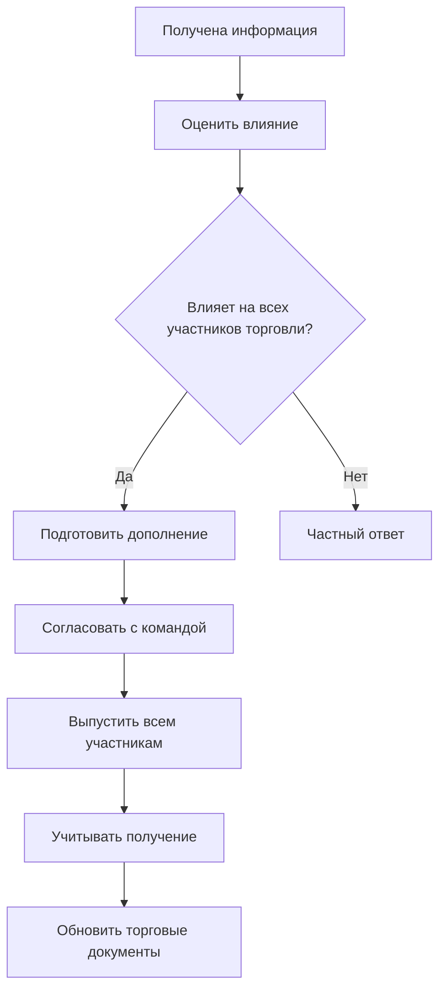
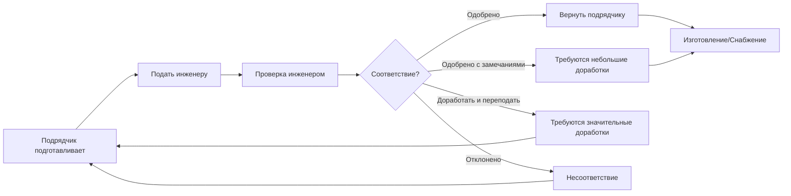
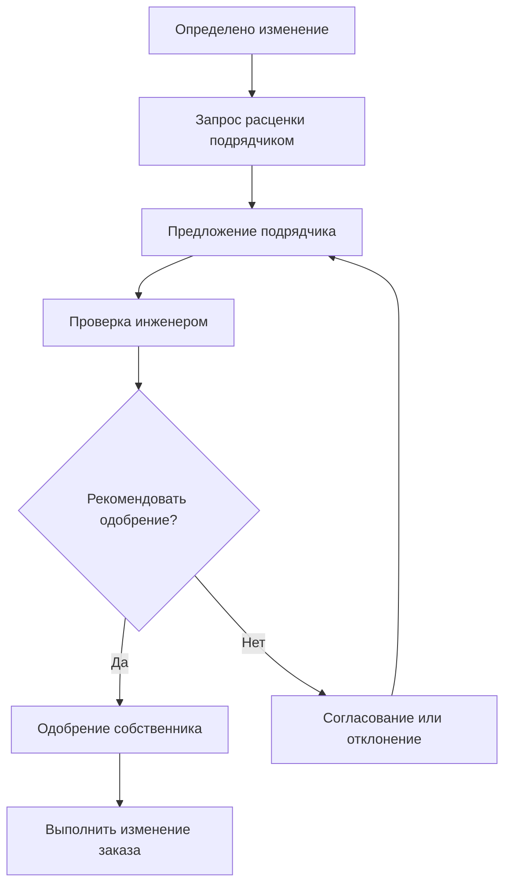

Администрирование при строительстве (АПС) охватывает инженерные услуги на этапах торговли и строительства, обеспечивая соответствие HVAC систем контрактным документам и соответствие замыслу проекта. Эффективное АПС требует систематических процессов управления документами, координации подрядчиков и проверки качества.

## Объем работ при администрировании строительства

Ответственность инженера при администрировании строительства связывает завершение проектирования и принятие систем, обеспечивая техническое руководство и надзор качества.

### Стандартные услуги АПС (AIA B101)

**Этап торговли:**
- Выпуск дополнений, уточняющих замысел проекта
- Ответы на вопросы перед торгами
- Участие в предварительных совещаниях
- Проверка предложений на техническое соответствие
- Помощь собственнику в выборе контрактора

**Этап строительства:**
- Проверка и одобрение представляемых документов
- Ответы на Запросы информации (РИ)
- Обработка платежных ведомостей подрядчика
- Проведение надзорных посещений объекта
- Проверка и одобрение изменений заказов
- Участие в совещаниях о ходе работ
- Проверка отчетов о тестировании и балансировке
- Участие в процедурах пусконаладки

**Этап сдачи-приемки:**
- Проверка закрывающей документации
- Проверка выполнения списка доработок
- Выдача сертификата существенного завершения
- Компиляция чертежей "как построено"
- Поддержка в гарантийный период

### HVAC-специфичные мероприятия АПС

**Координация систем:**
- Проверка координационных чертежей МЭС
- Проверка доступности оборудования и зазоров
- Подтверждение достаточности конструктивной поддержки
- Проверка интеграции системы управления

**Проверка производительности:**
- Участие в пуске оборудования
- Проверка результатов функциональных тестов
- Проверка расходов воздуха и воды
- Подтверждение измерений температуры и давления

**Соответствие требованиям по энергоэффективности:**
- Проверка рейтингов энергоэффективности установленного оборудования
- Проверка последовательностей управления при программировании
- Подтверждение установки счетчиков
- Проверка завершения пусконаладки

## Администрирование этапа торговли

Надлежащее администрирование этапа торговли устанавливает ясные требования контракта и обеспечивает конкурентный отбор квалифицированных подрядчиков.

### Подготовка торговых документов

**Полнота строительных документов:**
- Чертежи на 100% согласованы со спецификациями
- Расписания оборудования полные с данными о производительности
- Последовательности управления полностью документированы
- Соответствие кодексам проверено

**Организация спецификаций (CSI MasterFormat):**

| Раздел | Подраздел | Содержание HVAC |
|--------|-----------|-----------------|
| 01 | Общие требования | Представляемые документы, контроль качества, сдача-приемка |
| 22 | Сантехника | Трубопроводы, оборудование, принадлежности |
| 23 | HVAC | Воздуховоды, распределение воздуха, центральные установки, управление |
| 26 | Электроэнергия | Электрические подключения, пускатели, питание |

**Требования к формам торговли:**
- Базовая ставка с полным объемом HVAC
- Альтернативные ставки для вариантов систем
- Сметы для оборудования, выбираемого собственником
- Единичные цены для возможных дополнений

### Процесс дополнений

Дополнения информируют об уточнениях проекта и изменениях в период торговли.

**Рабочий процесс выпуска дополнений:**

**Требования к содержанию дополнения:**
- Последовательная нумерация (Дополнение № 1, 2, 3...)
- Дата выпуска с требованием подтверждения получения
- Четкое описание изменений или уточнений
- Затронутые листы чертежей и разделы спецификаций
- Инструкции по изменению торговой ставки

**Типичные вопросы дополнений:**
- Запросы и одобрения замены оборудования
- Уточнения проекта (маршрут трубопроводов, размеры воздуховодов)
- Вопросы соответствия кодексам
- Конфликты спецификаций или двусмысленности
- Изменения графика

### Предварительные совещания перед торгами

Предварительные совещания знакомят подрядчиков с требованиями проекта и условиями площадки.

**Повестка совещания:**
1. **Обзор проекта:** Задачи собственника, график, бюджет
2. **Проверка объема:** Основные системы, требования к производительности, особые условия
3. **Условия площадки:** Ограничения доступа, существующие коммуникации, этапность работ
4. **Требования торговли:** Квалификация, альтернативы, обеспечение торговли
5. **Вопросы:** Технические уточнения, процедурные вопросы

**Документирование:**
- Протокол совещания распределяется всем участникам торговли
- Вопросы, требующие письменного ответа, выпускаются через дополнения
- Список участников отслеживает участие подрядчиков

### Оценка торговых предложений

Техническая оценка обеспечивает соответствие перед сравнением цен.

**Контрольный список проверки торговой ставки:**
- Обеспечение торговли подано (залог или заверенный чек)
- Подтверждение всех дополнений
- Документация о квалификации полная
- Спецификации оборудования соответствуют требованиям
- Альтернативы оценены согласно инструкциям
- Математическая точность итоговых ставок

**Проверка технического соответствия:**

$$\text{Оцениваемая стоимость} = \text{Базовая ставка} + \text{Обязательные альтернативы} + \text{Корректировки несоответствия}$$

**Примеры несоответствия:**
- Эффективность оборудования ниже установленного минимума (+корректировка стоимости)
- Отсутствующие элементы объема (+предполагаемая стоимость)
- Несанкционированные замены (отклонение или корректировка)

**Рекомендация собственнику:**
- Определение самой низкой конкурентоспособной и ответственной ставки
- Краткое изложение технического соответствия
- Анализ сравнения стоимости
- Оценка квалификации
- Рекомендация по выбору с условиями (если есть)

## Управление представляемыми документами

Представляемые документы содержат подробную информацию об оборудовании и материалах для проверки и одобрения инженером.

### Процесс представления документов

**Рабочий процесс подачи:**

**Действия при проверке:**
- **Одобрено:** Полное соответствие, приступить к изготовлению
- **Одобрено с замечаниями:** Отмечены небольшие отклонения, приступить с внесением исправлений
- **Доработать и переподать:** Значительные проблемы требуют переподачи
- **Отклонено:** Несоответствие, подать соответствующий продукт

### Типы представляемых документов

**Документы с данными о продукции:**
- Литература производителя и спецификации
- Кривые производительности (вентиляторы, насосы, холодильные машины)
- Требования к размерам и зазорам
- Электрические характеристики
- Рейтинги шума

**Заводские чертежи:**
- Чертежи изготовления воздуховодов и трубопроводов
- Планы размещения оборудования и детали подключения
- Детали конструктивной поддержки
- Схемы систем управления и списки точек

**Образцы материалов:**
- Физические образцы материалов (изоляция, отделка)
- Макеты узлов (конфигурация воздушного терминала)

**Закрывающие документы:**
- Руководства по эксплуатации и техническому обслуживанию
- Документация о гарантиях
- Чертежи "как построено"
- Учебные материалы

### Критерии проверки представляемых документов

**Соответствие производительности:**
- Пропускная способность соответствует или превышает требования проекта
- Рейтинги эффективности удовлетворяют спецификации
- Рабочие параметры находятся в пределах условий проекта

**Физическая совместимость:**
- Размеры соответствуют выделенному пространству
- Подключения совпадают с чертежами
- Вес совместим с конструктивным проектом
- Зазоры доступа достаточны для обслуживания

**Соответствие кодексам:**
- Сертификация UL и маркировки
- Стандарты эффективности (ASHRAE 90.1, IECC)
- Устройства безопасности и управление
- Тип хладагента и ограничения по заряду

**Интеграция управления:**
- Совместимость протокола связи БАС
- Точки управления совпадают с требованиями последовательности
- Спецификации точности датчиков и диапазона
- Требования к кабелю интерфейса и питанию

**Типичные сроки проверки:**
- Стандартное оборудование: 7-10 рабочих дней
- Сложные системы (холодильные машины, приточные установки): 14 рабочих дней
- Управление и БАС: 14-21 рабочный день (проверка программирования)
- Переподачи: 5-7 рабочих дней

## Управление запросами информации (РИ)

РИ запрашивает уточнение контрактных документов или условий площадки.

### Процесс РИ

**Подготовка РИ подрядчиком:**
- Конкретный вопрос со ссылкой на чертежи/спецификации
- Соответствующая справочная информация
- Предлагаемое решение или варианты
- Влияние на график, если не разрешено

**Протокол проверки инженером:**
- Подтверждение получения в течение 24 часов
- Ответ в установленные сроки (обычно 5-7 рабочих дней)
- Координация с командой проектирования, если требуется
- Документирование ответа и распределение всем сторонам

**Формат ответа на РИ:**
- Прямой ответ на конкретный вопрос
- Ссылка на применимые контрактные документы
- Обеспечение эскизов или отмеченных чертежей, если необходимо
- Указание любых последствий для стоимости или графика
- Уточнение, составляет ли ответ изменение

### Категории РИ

| Тип РИ | Пример | Типичное разрешение |
|--------|--------|-------------------|
| **Уточнение** | Конфигурация фитингов воздуховода при тесном зазоре | Предоставить деталь эскиза |
| **Конфликт** | Трубопровод конфликтует со строительной балкой | Согласовать переукладку |
| **Отсутствует информация** | Размер регулирующего вентиля не указан | Выпустить расписание клапанов |
| **Запрос замены** | Предложить альтернативное оборудование | Проверить и одобрить/отклонить |
| **Методы и средства** | План подъема кровельного блока | Ответственность подрядчика, без ответа |

**Влияние ответов РИ:**

Если ответ требует изменения проекта:

$$\text{Изменение заказа} = \Delta\text{Труд} + \Delta\text{Материал} + \Delta\text{Оборудование} + \text{Накладные} + \text{Прибыль}$$

**Метрики отслеживания РИ:**
- Всего поданных РИ
- Среднее время ответа
- РИ, результатом которых являются изменения
- Стоимость уточнения проекта

Чрезмерное количество РИ (> 0,5 на 100 000 дол. стоимости строительства) указывает на неполные контрактные документы.

## Управление изменениями заказов

Изменения заказов модифицируют объем контракта, стоимость или график через официальное документирование.

### Типы изменений заказов

**Изменения, запрашиваемые собственником:**
- Дополнения или исключения из объема
- Улучшения производительности
- Ускорение графика

**Изменения из-за ошибок проекта:**
- Конфликты, обнаруженные при строительстве
- Пропуски, требующие исправления
- Проблемы соответствия кодексам

**Изменения в полевых условиях:**
- Непредвиденные условия площадки
- Несоответствия существующего здания
- Конфликты с коммуникациями

**Изменения в целях оптимизации стоимости:**
- Экономичные альтернативы, предложенные подрядчиком
- Замены, нейтральные по производительности

### Процесс изменения заказа

**Определение изменения:**

**Проверка стоимости:**
- Разумность часов труда и ставок
- Проверка стоимости материалов с проверкой наценки
- Обоснование ставок аренды оборудования
- Проверка котировок субподрядчиков
- Оценка влияния на график

**Компоненты изменения заказа:**
- Описание изменения и причина
- Ссылки на контрактные документы
- Разбор стоимости (труд, материал, оборудование)
- Влияние на график (продление времени, если применимо)
- Совокупная стоимость контракта после изменения

### Снижение риска изменений заказов

**Превентивные стратегии:**
- Полный согласованный проект перед торговлей
- Тщательный пересмотр конструктивности
- Обнаружение конфликтов BIM
- Своевременные решения собственника по дополнительным элементам

**Цель: < 5% всего изменения заказов относительно первоначального контракта**

## Надзорные посещения площадки

Периодические посещения площадки проверяют соответствие строительства контрактным документам.

**Частота посещений:**
- Ежемесячно во время этапа подрубки
- Два раза в неделю во время установки оборудования
- Еженедельно во время пуска и тестирования

**Фокус надзора:**
- Прогресс работ согласен графику
- Материалы и оборудование соответствуют представленным документам
- Качество работы соответствует промышленным стандартам
- Соблюдаются процедуры безопасности
- Доступность и зазоры поддерживаются

**Отчет о надзорном посещении:**
- Дата и участники
- Описание хода работ
- Наблюдаемые недостатки
- Требуемый ответ подрядчика
- Фотографии, документирующие условия

Надзорные посещения обеспечивают общую оценку, а не исчерпывающую проверку. Подрядчик сохраняет ответственность за контроль качества.

## Контроль качества и обеспечение качества

Программы качества обеспечивают соответствие HVAC систем спецификациям и надежную работу.

**Контроль качества подрядчика (КК):**
- Самопроверка перед запросом проверки инженером
- Проверка электричества трехфазного
- Испытание под давлением систем трубопроводов
- Испытание утечки воздуховодов по SMACNA
- Испытание утечки хладагента
- Калибровка точек управления

**Обеспечение качества инженером (ОК):**
- Проверка и одобрение представляемых документов
- Надзорное посещение ключевых установок
- Проверка очевидности тестирования
- Проверка отчета о тестировании и балансировке
- Поддержка при пусконаладке

**Метрики качества:**

Испытание утечки воздуховодов (требования SMACNA):

$$CL_a = \frac{CL_m \times P_s^{0.65}}{P_t^{0.65}}$$

Где: $CL_a$ = допустимая утечка, $CL_m$ = класс утечки, $P_s$ = давление испытания, $P_t$ = рабочее давление системы

Типичное требование: Класс утечки 6 для приточных воздуховодов, Класс 3 для возвратных/вытяжных

## Закрытие строительства

Процедуры сдачи-приемки проверяют завершение и передачу операционных систем собственнику.

**Существенное завершение:**
- Все системы операционные
- Остаются только небольшие доработки
- Разрешение на занятие получено
- Обучение собственника запланировано

**Окончательное завершение:**
- Элементы списка доработок исправлены и проверены
- Вся закрывающая документация подана
- Гарантии переданы собственнику
- Окончательный платеж обработан

**Закрывающая документация:**
- Чертежи "как построено", показывающие полевые изменения
- Руководства по эксплуатации и техническому обслуживанию
- Сертификаты гарантии и контакты
- Отчеты о тестировании и балансировке
- Отчеты о пусконаладке
- Запасные части и специальные инструменты
- Учебные материалы и видео

**Гарантийный период:**
- Стандартное оборудование: 1 год со дня существенного завершения
- Продленные гарантии: Согласно спецификации (5-10 лет для основного оборудования)
- Сезонное оборудование: Покрытие распространяется на один полный операционный сезон

Эффективное администрирование при строительстве снижает проблемы этапа строительства на 60-80%, обеспечивает достижение замысла проекта и создает основу для успешной долгосрочной работы.

---

*Подразделы предоставляют подробные процедуры для администрирования этапа торговли, управления представляемыми документами, обработки РИ, контроля изменений заказов, надзорных посещений, программ качества и процедур сдачи-приемки.*
