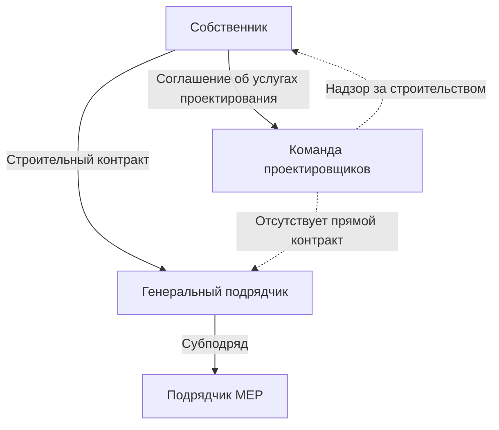
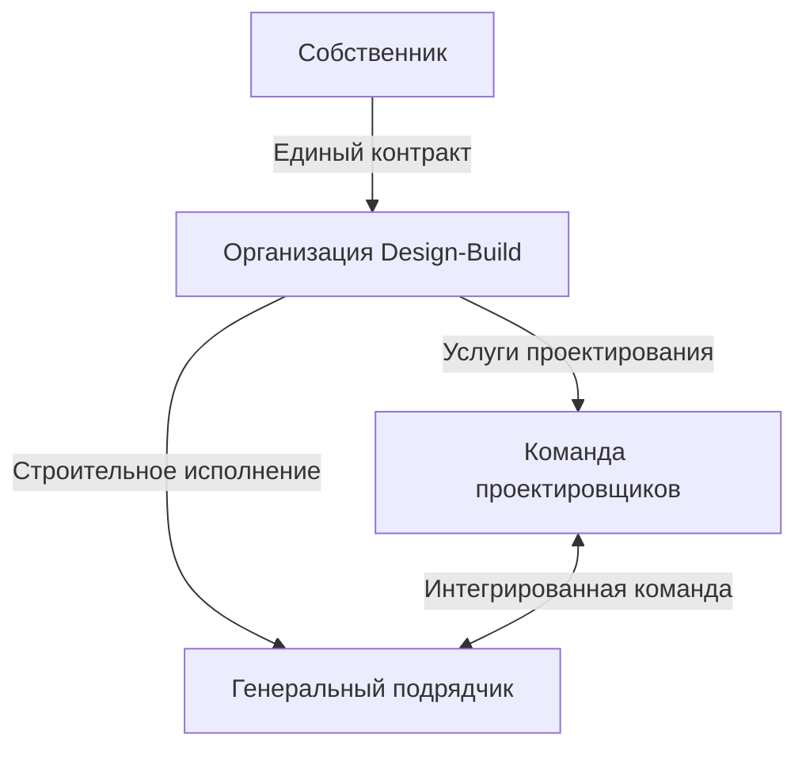
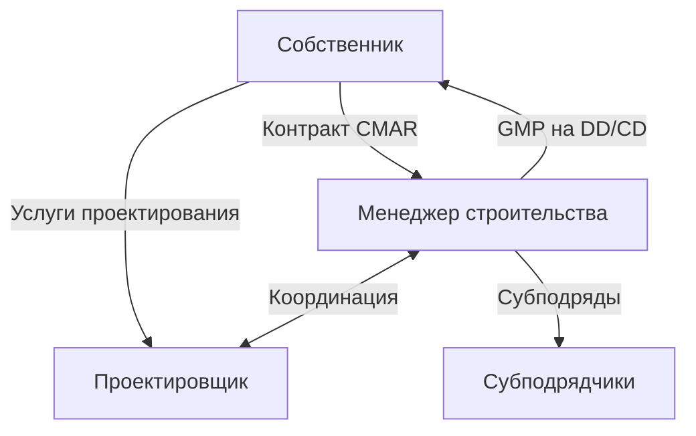
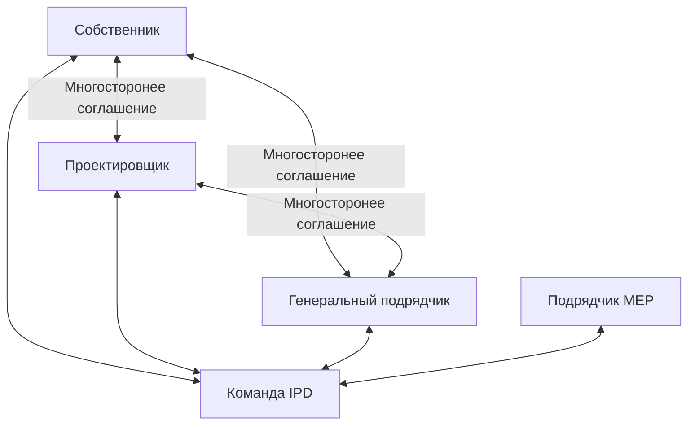

Выбор метода доставки проекта принципиально определяет договорные отношения, распределение рисков и структуры сотрудничества, которые управляют проектированием и строительством системы HVAC. Каждый метод доставки имеет различные последствия для инженерного объема работ, ответственности за координацию и результатов проекта.

## Основы методов доставки

Методы доставки проектов определяют три критических отношения:

**Отношение собственник-проектировщик:** объем инженерных услуг, проектная власть, структура ответственности

**Отношение собственник-подрядчик:** тип строительного контракта, гарантия цены, гарантии графика

**Отношение проектировщик-подрядчик:** время сотрудничества, ответственность за координацию, распределение рисков

Традиционная доставка разделяет проектирование и строительство; интегрированная доставка объединяет эти функции в единые контракты, способствующие раннему сотрудничеству.

## Design-Bid-Build (DBB)

Традиционный метод доставки с последовательными этапами: полное проектирование, конкурентные торги, строительное исполнение.

### Структура контракта

**Ключевые характеристики:**
- Собственник имеет отдельные контракты с проектировщиком и подрядчиком
- Отсутствует договорное отношение между проектировщиком и подрядчиком
- Проектировщик предоставляет услуги надзора за строительством собственнику
- Конкурентные торги на основе документов 100% готовности

### Объем инженерных работ HVAC

**Доставляемые результаты на этапе проектирования:**
- Расчет нагрузок и подбор оборудования (схематичный дизайн)
- Выбор системы и предварительные планировки (разработка дизайна)
- Полный набор строительной документации со спецификациями (100% CD)
- Поддержка торгов: изменения, уточнения, предварительные совещания

**Доставляемые результаты на этапе строительства:**
- Проверка и одобрение представленных документов
- Ответ на запросы информации и уточнения дизайна
- Наблюдение на месте и совещания по прогрессу
- Проверка тестирования, наладки и балансировки
- Поддержка пусконаладки и приемки системы

### Распределение рисков

| Категория риска | Собственник | Проектировщик | Подрядчик |
|-----------------|-------------|----------------|-----------|
| Ошибки/пропуски в проектировании | Совместно | Основной | Нет |
| Увеличение стоимости | Основной | Нет | Нет (после торгов) |
| Задержки графика | Основной | Ограничено | Штрафные санкции |
| Дефектность производительности | Нет | Профессиональная ответственность | Гарантия |
| Проблемы конструктивности | Совместно | Частично | Потенциал претензий |

### Преимущества для проектов HVAC

**Независимость проектирования:** инженер выбирает оптимальные системы без влияния подрядчика, обеспечивая производительность перед минимизацией стоимости

**Конкурентное ценообразование:** несколько участников торгов создают ценовую конкуренцию, обычно приводящую к экономии 5-10% по сравнению с согласованными контрактами

**Четкая ответственность:** раздельные ответственности за проектирование и строительство упрощают разрешение споров

**Контроль собственника:** собственник сохраняет прямые отношения и полномочия принятия решений на протяжении проекта

### Недостатки для проектов HVAC

**Ограниченный вход по конструктивности:** подрядчик проверяет дизайн только после завершения, упуская возможности для инженерной оценки стоимости

**Последовательная временная шкала:** линейный процесс расширяет общую продолжительность проекта на 15-25% по сравнению с методами быстрого отслеживания

**Риск изменения заказов:** модификации дизайна во время строительства генерируют изменение заказов, неблагоприятно влияя на стоимость и график

**Враждебные отношения:** разделение проектирования и строительства создает конфликтующие стимулы, снижая сотрудничество

### Оптимальные применения

DBB подходит для проектов, требующих:
- соответствия государственному сектору с конкурентными торгами по закону
- хорошо определенных объемов с минимальными ожидаемыми изменениями
- стандартных систем HVAC с проверенными технологиями
- максимальной ценовой конкуренции между квалифицированными подрядчиками
- четкого разделения ответственности за проектирование и строительство

## Design-Build (DB)

Единый метод доставки, при котором единая организация несет ответственность за проектирование и строительство по одному контракту.

### Структура контракта

**Ключевые характеристики:**
- Собственник заключает контракт с единой организацией design-build
- Проектировщик и подрядчик сотрудничают с начала проекта
- Интегрированная команда делит риски и стимулы
- Ранняя оценка цены и гарантия графика

### Интеграция инженерных работ HVAC

**Преимущества раннего сотрудничества:**
- подрядчик предоставляет отзывы о стоимости в реальном времени во время проектирования
- сроки поставки оборудования информируют разработку графика
- проверки конструктивности происходят одновременно с проектированием
- инженерная оценка стоимости оптимизирует установленную стоимость в сравнении с производительностью

**Прогрессия проектирования:**
- собственник предоставляет требования по производительности (этап RFP)
- команда DB предлагает системы и ценообразование (этап предложения)
- разработка дизайна продолжается с вводом подрядчика (30-60% CD)
- строительство начинается, пока дизайн завершается (быстрое отслеживание)

### Распределение рисков

| Категория риска | Собственник | Организация Design-Build |
|-----------------|-------------|--------------------------|
| Ошибки/пропуски в проектировании | Нет | Полная ответственность |
| Увеличение стоимости | Нет (GMP) | Совместно (cost-plus) |
| Задержки графика | Ограничено | Основной |
| Дефектность производительности | На основе спецификации | Гарантия и ответственность |
| Проблемы конструктивности | Нет | Внутреннее разрешение |

### Преимущества для проектов HVAC

**Ускоренная доставка:** перекрывающееся проектирование и строительство сокращают продолжительность проекта на 20-30%

**Гарантия стоимости:** гарантированная максимальная цена (GMP) установлена ранее, обычно на 60% завершения проектирования

**Интеграция конструктивности:** ввод подрядчика во время проектирования улучшает эффективность установки и снижает проблемы в поле

**Единственная точка ответственности:** собственник получает пользу от единой ответственности за производительность проектирования и строительства

**Возможность инноваций:** интегрированная команда может предложить альтернативные системы HVAC, предлагающие превосходную стоимость

### Недостатки для проектов HVAC

**Сниженный контроль собственника:** решения проектирования включают соображения стоимости подрядчика, потенциально компрометируя производительность в пользу цены

**Ограниченная конкуренция:** ценообразование происходит до завершения проектирования, снижая конкурентное давление

**Озабоченность качеством дизайна:** стимул подрядчика минимизировать стоимость установки может ограничить оптимизацию проектирования

**Сложная закупка:** разработка RFP требует детальных спецификаций по производительности для обеспечения качества

### Оптимальные применения

DB отлично подходит когда:
- быстрый график обеспечивает значительную ценность для собственника
- объем проекта позволяет спецификации на основе производительности
- инновационные решения HVAC предлагают конкурентное преимущество
- собственник частного сектора может вести переговоры с квалифицированными командами
- сложные системы получают пользу от ввода подрядчика во время проектирования

## Construction Manager at Risk (CMAR)

Гибридная доставка, привлекающая менеджера строительства на ранних этапах предпроектных услуг, затем преобразуемая в подрядчика at-risk.

### Структура контракта

**Поэтапное заключение контрактов:**
- Этап 1: услуги предпроектной подготовки (плата на основе)
- Этап 2: услуги строительства (GMP или cost-plus)

### Услуги предпроектной подготовки

**Менеджер строительства предоставляет:**
- проверки конструктивности на этапах SD, DD, CD
- оценку стоимости и инженерную оценку стоимости
- разработку графика и планы разбиения по этапам
- квалификацию субподрядчиков и поставщиков
- планирование закупки оборудования с длительными сроками доставки

**Услуги специфичные для HVAC:**
- анализ времени доставки оборудования
- определение возможностей предварительного производства
- логистика площадки для подъема и установки оборудования
- оценка энергетического анализа затрат и выгод

### Преимущества для проектов HVAC

**Поддерживаемая независимость проектирования:** инженер проектирует оптимальные системы при получении отзывов подрядчика

**Управление стоимостью:** оценка стоимости в реальном времени выявляет проблемы бюджета до завершения проектирования

**Оптимизация графика:** ранняя закупка оборудования сокращает критический путь продолжительности

**Совместная среда:** все стороны работают в направлении успеха проекта без враждебных контрактов

### Недостатки для проектов HVAC

**Сложность структуры платежей:** услуги предпроектной подготовки добавляют 1-2% к стоимости проекта

**Переговоры GMP:** менеджер строительства может согласовать высокий резерв в отсутствие конкурентного давления

**Зависимость отношений:** успех требует доверия и сотрудничества; конфликты снижают эффективность

### Оптимальные применения

CMAR подходит для:
- сложных институциональных проектов (больницы, университеты)
- проектов, требующих ранней гарантии стоимости с качеством проектирования
- быстрых графиков с поэтапным строительством
- опытных собственников, способных управлять отношениями с менеджером строительства

## Integrated Project Delivery (IPD)

Совместный метод доставки, выравнивающий все стороны посредством распределения риска/вознаграждения и многосторонних контрактов.

### Структура контракта

**Принципы IPD:**
- многосторонее соглашение, связывающее собственника, проектировщика, подрядчиков
- совместный пул рисков: сбережения/перерасходы распределяются по соглашению
- совместное принятие решений (собственник, архитектор, инженер, подрядчики)
- открытое управление стоимостью с прозрачностью
- раннее вовлечение всех ключевых участников

### Инженерные работы HVAC в IPD

**Интегрированный процесс проектирования:**
- подрядчик MEP присоединяется к команде во время схематичного дизайна
- инженер и подрядчик совместно разрабатывают концепции систем
- проверка стоимости в реальном времени направляет решения по проектированию
- предварительное производство и модульность планируются с начала

**Target Value Design (TVD):**

$$\text{Целевая стоимость} = \text{Рыночная стоимость} - \text{Требуемая прибыль}$$

Команда проектирования работает для доставки проекта на уровне целевой стоимости или ниже, делит достигнутые сбережения.

### Структура риска/вознаграждения

**Совместные результаты:**
- экономия стоимости: разделение по соглашению (например, 50% собственник, 30% подрядчик, 20% проектировщик)
- перерасход стоимости: совместная боль снижает прибыль, но исключает прибыль если превышает порог
- стимулы производительности: энергетическая производительность, вехи графика, показатели качества

### Преимущества для проектов HVAC

**Оптимальные решения:** совместное проектирование достигает лучшей стоимости во всех первых затратах, стоимости жизненного цикла и производительности

**Снижение рисков:** совместные стимулы исключают враждебное поведение и культуру претензий

**Инновация:** команда изучает передовые технологии HVAC без традиционных барьеров закупки

**Интеграция lean:** IPD естественно включает принципы lean construction (система последнего планировщика, pull planning)

### Недостатки для проектов HVAC

**Сложность контрактов:** многосторонние соглашения требуют сложных юридических и финансовых структур

**Ограниченный опыт:** IPD остается редким; поиск опытных партнеров затруднен

**Требования культуры:** успех требует доверия, прозрачности и сотрудничества—трудно поддерживать под давлением

**Непригодно для государственного сектора:** многосторонние соглашения и согласованное ценообразование конфликтуют с требованиями государственных торгов

### Оптимальные применения

IPD уместен когда:
- опытный собственник частного сектора ценит сотрудничество и инновацию
- сложные системы HVAC получают пользу от интегрированной оптимизации
- команда проекта имеет опыт IPD и культурное выравнивание
- результаты производительности (энергия, качество воздуха в помещении) оправдывают совместные инвестиции

## Матрица выбора метода доставки

| Фактор | DBB | DB | CMAR | IPD |
|--------|-----|----|----|-----|
| **Приоритет графика** | Низкий | Высокий | Средний-высокий | Высокий |
| **Время гарантии стоимости** | Позднее (торги) | Раннее (GMP) | Среднее (60% CD) | Раннее (целевое) |
| **Контроль качества проектирования** | Высокий | Средний | Высокий | Совместный |
| **Потенциал инноваций** | Низкий | Средний | Средний | Высокий |
| **Квалификация собственника** | Низкая | Средняя | Высокая | Очень высокая |
| **Пригодность государственного сектора** | Высокая | Средняя | Средняя | Низкая |
| **Сложность HVAC** | Стандартная | Стандартная | Сложная | Очень сложная |

## Progressive Design-Build

Появляющийся вариант этапирования привлечения DB: раннее совместное проектирование, сопровождаемое установлением GMP при завершении DD.

**Преимущества перед традиционным DB:**
- собственник участвует в разработке дизайна до обязательства по цене
- конкурентный выбор на основе квалификаций и гонораров, не предварительного дизайна
- качество дизайна поддерживается посредством надзора собственника во время разработки

**Процесс:**
1. выбор команды DB на основе квалификаций (лучшая стоимость)
2. совместное проектирование до 30-60% завершения
3. установление GMP на основе разработанного дизайна
4. полное завершение проектирования и исполнение строительства

Progressive DB объединяет скорость DB с привлечением дизайна собственника и проверкой стоимости.

## Рекомендации стратегии закупок

**Стандартная коммерческая офисная система HVAC:** DBB для конкурентного ценообразования на проверенные системы

**Быстро отслеживаемая корпоративная штаб-квартира:** DB или CMAR для ускорения графика с качеством HVAC

**Сложное медицинское учреждение:** CMAR для ввода конструктивности на критические системы (вентиляция ОР, медицинские газы)

**Высокопроизводительное учреждение здание:** IPD для интегрированной оптимизации оболочки и систем HVAC

**Проекты государственного сектора:** DBB (требуемый) или CMAR (если правила позволяют) для ввода подрядчика в рамках конкурентных рамок

Выбор метода доставки значительно влияет на результаты системы HVAC—график, стоимость, производительность и удовлетворение собственника зависят от выравнивания стратегии закупок с целями проекта и ограничениями.

---

*Подробные разделы изучают специфичные методы доставки, структуры контрактов, стратегии распределения рисков и соображения реализации специфичные для HVAC.*
