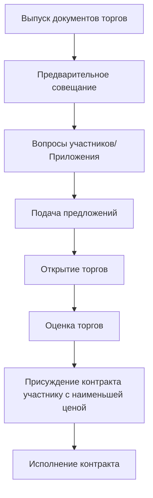

Стратегия закупок и выбор типа контракта определяют структуру ценообразования, распределение рисков и методологию выбора подрядчика для конструкции HVAC. Эффективные закупки сбалансированы между ценовой конкуренцией, гарантией качества, определенностью сроков и управлением рисками.

##框架закупок

Закупки HVAC охватывают два критических решения:

**Метод выбора подрядчика:**
- Конкурентные торги (несколько подрядчиков оценивают полный проект)
- Согласованные закупки (один подрядчик выбран до оценки стоимости)
- Предварительная квалификация (ограничить участников торгов квалифицированными фирмами)

**Структура ценообразования контракта:**
- Твердая цена (фиксированная цена для определенного объема работ)
- Гарантированная максимальная цена (GMP с распределением сэкономленных средств)
- Стоимость плюс комиссия (возмещаемые затраты плюс фиксированная или процентная комиссия)
- Единичная цена (ставки, применяемые к измеренным объемам)
- Время и материалы (почасовые ставки плюс материалы по стоимости)

## Конкурентные торги

Традиционный метод закупок, при котором несколько подрядчиков независимо оценивают полные документы контракта.

### Процесс конкурентных торгов

**Период торгов:** Обычно 3-4 недели для механических конструкций

**Минимальное количество участников:** Рекомендуется 3-5 участников для обеспечения конкурентного ценообразования

### Преимущества конкурентных торгов

**Ценовая конкуренция:**
Исследования показывают, что конкурентные торги дают 5-12% сокращение затрат по сравнению с согласованными контрактами на аналогичных проектах.

**Прозрачность:**
Процесс публичных торгов защищен перед заинтересованными сторонами и аудиторами

**Проверка рынка:**
Несколько независимых смет подтверждают обоснованность проекта и точность бюджета

**Проверка квалификации:**
Предварительная квалификация гарантирует, что торги подают только компетентные подрядчики

### Недостатки конкурентных торгов

**Ограничения по срокам:**
Требует 100% завершенного проекта перед расчетом стоимости, удлиняя продолжительность проекта

**Ограниченное сотрудничество:**
Подрядчик не может предоставить информацию о возможности строительства во время разработки проекта

**Потенциальное состояние противостояния:**
Участник торгов с наименьшей ценой стимулирован максимизировать приказы об изменениях и минимизировать качество

**Давление замещения:**
Подрядчики предлагают более дешевые альтернативы на этапе торгов

### Оптимальные приложения

Конкурентные торги целесообразны, когда:
- Закупки государственного сектора требуют конкурентный процесс
- Хорошо определенный объем работ со стандартными системами HVAC
- График позволяет полный проект перед строительством
- Владелец ценит ценовую конкуренцию выше раннего сотрудничества подрядчиков
- На рынке доступны несколько квалифицированных подрядчиков

## Согласованные закупки

Один подрядчик выбран до расчета стоимости, согласовывает условия контракта после выбора.

### Методологии выбора

**Выбор на основе квалификации (QBS):**
1. Оценить квалификацию подрядчика, опыт, подход
2. Выбрать наиболее квалифицированного подрядчика
3. Согласовать объем и комиссию
4. Исполнить контракт по справедливой и разумной цене

**Выбор наилучшей стоимости:**
1. Оценить квалификацию и предварительное ценообразование
2. Оценить предложения по:
   - Технический подход и квалификация (60-70%)
   - Цена (30-40%)
3. Выбрать участника с наивысшим баллом
4. Согласовать окончательные условия

### Процесс переговоров

**Определение объема:**
- Рассмотреть документы проекта и уточнить требования
- Определить оборудование с длительным сроком поставки и стратегию закупок
- Установить критерии производительности и стандарты качества
- Определить позиции, предоставляемые владельцем, и позиции подрядчика

**Разработка ценообразования:**
- Подробное разбиение затрат: труд, материалы, оборудование, субподряды
- Накладные расходы и прибыль
- Эскалация и резервные допуски
- График стоимостей для авансовых платежей

**Согласование условий:**
- Тип контракта (GMP, стоимость плюс, твердая цена)
- Условия оплаты и удержание
- Расписание и ликвидированные убытки
- Положения об гарантии
- Процедуры приказов об изменении

### Преимущества согласованных закупок

**Раннее сотрудничество:**
Подрядчик предоставляет информацию о возможности строительства во время разработки проекта (30-60% завершены)

**Ускорение расписания:**
Ускоренное строительство пересекает завершение проекта

**Возможность инноваций:**
Подрядчик предлагает оптимизацию стоимости и альтернативные системы

**Отношения на основе доверия:**
Доверие и сотрудничество в сравнении с противостоящими торгами

### Недостатки согласованных закупок

**Ограниченная ценовая конкуренция:**
Ценообразование от одного источника снижает конкурентное давление (потенциальная 8-15% премия на стоимость)

**Сложные переговоры:**
Требует изощренного владельца, способного оценить справедливое ценообразование

**Риск фаворитизма:**
Процесс выбора должен сохранять прозрачность и честность

**Потенциал расширения объема:**
Согласованные контракты уязвимы для расширения объема, увеличивающего стоимость

### Оптимальные приложения

Согласованные закупки подходят для:
- Ускоренные расписания, требующие раннее строительство
- Сложные системы HVAC, которые выигрывают от информации подрядчика
- Методы доставки Design-Build или CMAR
- Владельцы частного сектора с гибкостью закупок
- Рынки с ограниченным количеством квалифицированных подрядчиков

## Предварительная квалификация

Процесс скрининга, ограничивающий участников торгов квалифицированными подрядчиками перед приглашением к торгам.

### Критерии предварительной квалификации

**Требования к опыту:**
- Годы в бизнесе (минимум 5-10 лет типично)
- Опыт в аналогичных проектах (тип, размер, сложность)
- Ссылки на проекты с проверкой производительности
- Квалификация ключевого персонала

**Финансовые возможности:**
- Пропускная способность облигаций, адекватная размеру проекта
- Текущая задолженность и доступная емкость
- Финансовые отчеты, демонстрирующие стабильность
- Кредитный рейтинг и рекомендации банков

**Технические возможности:**
- Внутренняя рабочая сила в сравнении с аутсорсингом
- Инвентарь оборудования и инструментов
- Показатель безопасности (целевой коэффициент EMR < 1.0)
- Процедуры контроля качества

**Географическое присутствие:**
- Локальный офис и возможность обслуживания
- Расстояние от площадки проекта
- Региональные знания рынка
- Доступность услуг гарантии

### Процесс предварительной квалификации

**Шаг 1: Выпуск объявления о предварительной квалификации**
- Описание проекта и объем работ
- Идентификация владельца и команды проектирования
- Критерии предварительной квалификации и требования подачи
- Срок подачи

**Шаг 2: Оценить представления**
- Количественно оценить каждый критерий
- Проинтервьюировать лучших кандидатов, если необходимо
- Проверить ссылки и прошлую производительность
- Проверить лицензирование, облигации, страховку

**Шаг 3: Уведомить квалифицированных участников торгов**
- Обычно квалифицировано 5-7 подрядчиков
- Предоставить обратную связь неудачным кандидатам
- Выпустить документы торгов квалифицированному списку

### Преимущества предварительной квалификации

**Гарантия качества:**
Исключает неквалифицированных участников торгов, снижая риск неудачи подрядчика или плохой производительности

**Сокращенная оценка торгов:**
Все участники торгов соответствуют минимальным стандартам; присуждение участнику с наименьшей ценой

**Конкурентный баланс:**
Достаточная конкуренция (5-7 участников) без чрезмерных отходов на подготовку торгов (15+ участников)

**Защита владельца:**
Облигации производительности и платежа требуются только от квалифицированных подрядчиков

### Типичные требования

Порог государственного сектора: Проекты > 1,5 млн. м² обычно требуют предварительной квалификации

Действительность предварительной квалификации: 1-2 года, требующие годового обновления

## Типы контрактов

### Твердая цена (фиксированная цена)

Подрядчик соглашается завершить определенный объем работ по фиксированной цене, независимо от фактических затрат.

**Структура контракта:**

$$\text{Цена контракта} = \text{Сметная стоимость} + \text{Накладные расходы} + \text{Прибыль} + \text{Резерв}$$

**Распределение рисков:**
- Подрядчик принимает на себя риск затрат (эскалация материалов, производительность, непредвиденные условия)
- Владелец принимает на себя риск объема (изменения требуют приказов об изменении)

**Преимущества:**
- Определенность цены для владельца при исполнении контракта
- Подрядчик стимулирован эффективностью (сэкономленные средства увеличивают прибыль)
- Простое администрирование контракта
- Конкурентные торги обеспечивают наименьшую цену

**Недостатки:**
- Требует 100% завершенный проект для точного ценообразования
- Подрядчик включает резерв на неизвестные факторы (5-10% типично)
- Дорогие приказы об изменении (подрядчик в сильной позиции переговоров)
- Потенциал состояния противостояния (подрядчик максимизирует изменения, минимизирует качество)

**Оптимальные приложения:**
- Хорошо определенный объем работ с полным проектом
- Стандартные системы HVAC с предсказуемыми затратами
- Фиксированный бюджет, требующий определенность цены
- Конкурентная среда торгов

### Гарантированная максимальная цена (GMP)

Подрядчик гарантирует не превышающую цену при работе на основе возмещения затрат, часто разделяя сэкономленные средства.

**Структура контракта:**

$$\text{GMP} = \text{Сметная стоимость} + \text{Комиссия} + \text{Резерв}$$

**Категории затрат:**
- **Возмещаемые затраты:** Труд, материалы, оборудование, субподряды (фактические затраты)
- **Общие условия:** Надзор на площадке, временные сооружения, коммунальные услуги
- **Комиссия:** Фиксированная сумма или процент за накладные расходы и прибыль
- **Резерв:** Резерв для неизвестных объемов (5-15% в зависимости от завершения проекта)

**Распределение сэкономленных средств:**
Если окончательная стоимость < GMP, сэкономленные средства обычно распределяются:
- 50% владелец / 50% подрядчик
- 60% владелец / 40% подрядчик
- 75% владелец / 25% подрядчик

Превышения стоимости выше GMP берут на себя подрядчик (стимул для контроля затрат)

**Преимущества:**
- Потолок цены защищает владельца при завершении проекта
- Прозрачность затрат (открытая бухгалтерия)
- Стимул распределения сэкономленных средств для эффективности затрат
- Раннее вовлечение подрядчика (GMP при 60-80% проекта)

**Недостатки:**
- Согласование GMP сложно, требует проверки данных о затратах
- Подрядчик может завышать GMP при отсутствии конкурентного давления
- Резерв часто исчисляется независимо от необходимости
- Требуется мониторинг владельцем для предотвращения смещения затрат

**Оптимальные приложения:**
- Проекты с ускоренным графиком, требующие раннее строительство
- Доставка CMAR или Design-Build
- Сложные системы, где полный проект невозможен перед строительством
- Изощренный владелец, способный контролировать затраты

### Стоимость плюс комиссия

Подрядчик возмещается за все фактические затраты плюс комиссия за накладные расходы и прибыль.

**Структуры комиссии:**

**Стоимость плюс фиксированная комиссия:**

$$\text{Стоимость контракта} = \sum(\text{Фактические затраты}) + \text{Фиксированная комиссия}$$

Комиссия предопределена, независима от окончательной стоимости (стимулирует эффективность)

**Стоимость плюс процент:**

$$\text{Стоимость контракта} = \sum(\text{Фактические затраты}) + (\text{Фактические затраты} \times \text{Процент комиссии})$$

Процент комиссии от затрат (отговаривает эффективность—подрядчик получает прибыль от более высоких затрат)

**Стоимость плюс комиссия с GMP:**
Объединяет гибкость стоимость плюс с защитой GMP (гибридный подход)

**Преимущества:**
- Максимальная гибкость для изменения объема и ускоренного строительства
- Без резерва (затраты возмещаются по мере выполнения)
- Выбор подрядчика на основе квалификации, не цены
- Прозрачная бухгалтерия затрат

**Недостатки:**
- Отсутствие определенности цены для владельца (окончательная стоимость неизвестна до завершения)
- Процентная комиссия отговаривает контроль затрат
- Требует обширный надзор владельцем и аудит затрат
- Трудно установить справедливый процент комиссии

**Оптимальные приложения:**
- Аварийные или ускоренные проекты с неопределенным объемом
- Работы по ремонту с обширными неизвестными
- Владелец с возможностью контроля затрат
- Отношения на основе доверия с квалифицированным подрядчиком

### Контракт с единичной ценой

Подрядчик указывает ставки за единицу количества; оплата основана на измеренной установке.

**Структура ценообразования:**

$$\text{Стоимость контракта} = \sum(\text{Единичная цена}_i \times \text{Количество}_i)$$

**Пример единичных цен HVAC:**

| Позиция | Единица | Единичная цена |
|---------|---------|-----------------|
| Оцинкованный воздуховод | кг | 4,50 руб./кг |
| Изолированная медная труба, 5 см | м | 28,00 руб./м |
| Терминальный блок VAV | шт. | 850,00 руб./шт. |
| Труба холодной воды, 15 см | м | 95,00 руб./м |
| Точка управления BAS | точка | 450,00 руб./точка |

**Измерение и оплата:**
- Ежемесячное измерение установленных объемов
- Заявка на оплату на основе фактических объемов × единичные цены
- Окончательная оплата скорректирована для построенных объемов

**Преимущества:**
- Справедливое ценообразование для переменных объемов (ремонт, коммунальные услуги)
- Владелец платит за фактическую установку, не оценки
- Риск подрядчика снижен для неопределенности объема
- Простое ценообразование приказов об изменении (использовать установленные единичные цены)

**Недостатки:**
- Подрядчик стимулирован максимизировать установленные объемы
- Проверка единичной цены сложна (объединенный труд и материал)
- Потенциал споров о измерении
- Не подходит для новой конструкции с фиксированным объемом

**Оптимальные приложения:**
- Проекты ремонта и модернизации с неопределенными объемами
- Подземные коммунальные услуги и трубопроводы на площадке
- Поэтапное строительство с переменным объемом
- Долгосрочные соглашения об обслуживании (единичные цены для предполагаемых работ)

### Время и материалы (T&M)

Подрядчику платят за фактические рабочие часы по согласованным почасовым ставкам плюс материалы по стоимости.

**Структура ценообразования:**

$$\text{Платеж} = \sum(\text{Рабочие часы} \times \text{Почасовая ставка}) + \text{Стоимость материалов} + \text{Надбавка}$$

**Типичные почасовые ставки труда HVAC:**

| Специалист | Почасовая ставка (включая нагрузку) |
|-------------|--------------------------------------|
| Сертифицированный трубопроводчик | 85-110 руб./ч |
| Сертифицированный кровельщик из листового металла | 80-105 руб./ч |
| Техник HVAC | 75-95 руб./ч |
| Ученик | 50-70 руб./ч |
| Бригадир | 95-120 руб./ч |

Надбавка материалов: 10-20% для покрытия закупок, обработки, хранения

**Преимущества:**
- Максимальная гибкость для неопределенного объема
- Не требуется оценка затрат перед авторизацией работ
- Простое исполнение контракта для небольших проектов
- Прозрачная бухгалтерия затрат

**Недостатки:**
- Отсутствие определенности стоимости или контроля бюджета
- Подрядчик отговаривается от эффективности (прибыль от большего количества часов)
- Потенциал для злоупотребления без надзора
- Не подходит для больших, определенных проектов

**Оптимальные приложения:**
- Небольшие работы по обслуживанию и ремонту
- Экстренное реагирование и поиск неисправностей
- Улучшение арендуемых помещений с минимальным определением объема
- Работа специального назначения короткой продолжительности

## Матрица выбора контракта

| Характеристика проекта | Рекомендуемый тип контракта |
|------------------------|---------------------------|
| Полный проект, фиксированный объем | Твердая цена |
| 60-80% проекта, ускоренный график | GMP |
| Сложный ремонт, неизвестные условия | Стоимость плюс с GMP |
| Переменные объемы (коммунальные услуги на площадке) | Единичная цена |
| Небольшие работы по обслуживанию, неопределенный объем | Время и материалы |
| Государственный сектор, конкурентные торги | Твердая цена (конкурентная) |
| Частный сектор, раннее вовлечение подрядчика | GMP (согласованная) |
| Высокое доверие, изощренный владелец | Стоимость плюс фиксированная комиссия |

## Оптимизация стратегии закупок

**Определенность цены в сравнении с гибкостью:**

**Рекомендации по закупкам:**

**Стандартная коммерческая офисная HVAC:** Конкурентные торги твердой цены для оптимизации затрат

**Ускоренная корпоративная штаб-квартира:** Согласованная GMP с квалифицированным подрядчиком для сжатия графика

**Сложное медицинское учреждение:** CMAR с GMP после разработки проекта для качества и сотрудничества

**Ремонт и модернизация:** Единичная цена или стоимость плюс для размещения неопределенности объема

**Аварийная замена:** Время и материалы для немедленного развертывания

Оптимальная стратегия закупок согласует тип контракта и метод выбора с целями проекта, допуском к риску, ограничениями графика и условиями рынка, сбалансировав конкурентность затрат с гарантией качества и гибкостью.

---

*Разделы детально описывают методы торгов, типы контрактов, процедуры предварительной квалификации и стратегии закупок субподрядчиков для конструкции HVAC.*
