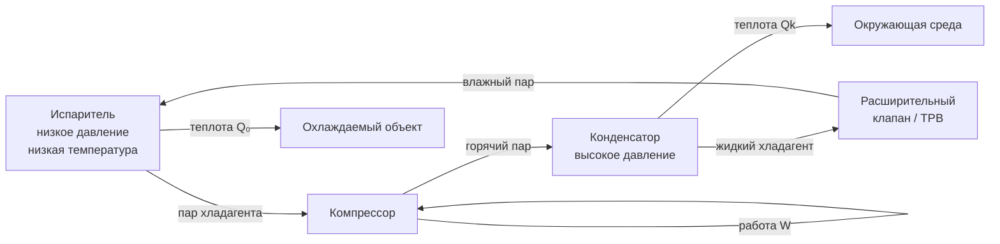

# Системы холодоснабжения

Холодоснабжение — целенаправленный перенос теплоты от низкотемпературного объекта к высокотемпературному стоку с затратой внешней энергии. Этот процесс нарушает естественное направление теплопередачи и требует соблюдения второго начала термодинамики: реальный цикл всегда производит меньше холода на единицу затраченной энергии, чем идеальный обратный цикл Карно.

Системы холодоснабжения применяются в сохранении пищевых продуктов, технологическом охлаждении промышленных производств, кондиционировании воздуха, криогенике и медицине. Диапазон рабочих температур охватывает от +15 °C в системах комфортного кондиционирования до −170 °C в установках сжижения природного газа.

## Термодинамические основы

### Обратный цикл Карно

Теоретический предел эффективности холодильной машины задаётся обратным циклом Карно, работающим между двумя тепловыми резервуарами:


\text{COP}_{\text{Carnot}} = \frac{T_L}{T_H - T_L}


где $T_L$ — абсолютная температура охлаждаемого пространства (К), $T_H$ — абсолютная температура отвода теплоты (К).

**Числовой пример.** Холодильная камера поддерживает температуру $-18\ °C$ ($T_L = 255{,}15$ К), конденсатор отвергает теплоту при $+40\ °C$ ($T_H = 313{,}15$ К):


\text{COP}_{\text{Carnot}} = \frac{255{,}15}{313{,}15 - 255{,}15} = \frac{255{,}15}{58{,}0} = 4{,}40


Реальные компрессионные машины достигают 40–65 % этого значения из-за необратимостей в компрессоре, конечных перепадов температур в теплообменниках и потерь давления в трубопроводах.

Формула показывает принципиальную закономерность: COP резко падает при увеличении температурного перепада $(T_H - T_L)$. Снижение температуры испарения с 0 °C до −40 °C при неизменной температуре конденсации 40 °C уменьшает $\text{COP}_{\text{Carnot}}$ с 6,8 до 2,3, то есть почти в три раза. Это объясняет высокое удельное энергопотребление низкотемпературных промышленных холодильных установок.

### Цикл парового сжатия

Цикл парового сжатия (vapor compression cycle) является основой коммерческого и промышленного холодоснабжения. Цикл включает четыре последовательных термодинамических процесса:

1. **Испарение** (низкое давление, низкая температура): хладагент поглощает теплоту из охлаждаемого объекта и переходит из жидкости в пар.
2. **Сжатие**: компрессор повышает давление и температуру пара, затрачивая механическую работу.
3. **Конденсация** (высокое давление): пар отдаёт теплоту окружающей среде или теплоносителю и переходит в жидкость.
4. **Дросселирование**: расширительное устройство снижает давление и температуру жидкого хладагента.

Холодопроизводительность на единицу массового расхода хладагента (удельный холодильный эффект):


q_0 = h_1 - h_4


где $h_1$ — энтальпия пара на выходе из испарителя (кДж/кг), $h_4$ — энтальпия жидкости на входе в испаритель после дросселирования (кДж/кг).

Реальный COP цикла парового сжатия:


\text{COP} = \frac{h_1 - h_4}{h_2 - h_1}


где $h_2$ — энтальпия пара на выходе из компрессора.


| Область применения | Температура испарения | Хладагент | COP |
|---|---|---|---|
| Кондиционирование воздуха | +5…+10 °C | R-410A, R-32 | 3,0–5,5 |
| Коммерческое охлаждение (среднетемпературное) | −10…−5 °C | R-449A, R-448A | 2,5–4,0 |
| Коммерческое замораживание | −35…−28 °C | R-404A, R-449A | 1,2–2,0 |
| Промышленное (аммиак) | −10…+5 °C | NH₃ (R-717) | 3,5–6,0 |
| Промышленное низкотемпературное | −50…−35 °C | NH₃/CO₂ каскад | 1,0–1,8 |
| CO₂ транскритический | −10…+5 °C | CO₂ (R-744) | 2,0–3,5 |


Значения 40–60 % от COP Карно типичны для хорошо спроектированных промышленных установок. Отклонение от идеала объясняется перегревом всасывания, переохлаждением жидкости, потерями давления и механическим КПД компрессора.

## Выбор хладагента

Термодинамические, экологические и токсикологические свойства хладагента принципиально определяют конструкцию системы, её безопасность и экологический след.

**Термодинамические критерии:**
- Давление насыщения в диапазоне рабочих температур должно быть умеренным: слишком низкое давление требует сложного уплотнения вакуумных контуров, слишком высокое — толстостенных сосудов давления.
- Высокая удельная теплота парообразования сокращает массовый расход хладагента и уменьшает диаметры трубопроводов.
- Благоприятные транспортные свойства (вязкость, теплопроводность) снижают необходимую поверхность теплообмена.

**Экологические показатели:**
- Потенциал разрушения озонового слоя (ODP, ozone depletion potential): хладагенты группы HFC имеют ODP = 0; ХФУ и ГХФУ выведены из оборота в соответствии с Монреальским протоколом.
- Потенциал глобального потепления (GWP, global warming potential): Кигалийская поправка к Монреальскому протоколу требует поэтапного отказа от хладагентов с GWP > 150 в большинстве применений к 2035–2040 гг.

**Классификация безопасности по ASHRAE Standard 34:**
- Группа A1: низкая токсичность, невоспламеняемые (R-134a, R-410A, R-744)
- Группа A2L: низкая токсичность, слабовоспламеняемые (R-32, R-452B, R-454B)
- Группа B2L: более высокая токсичность, слабовоспламеняемые (NH₃)
- Группа A3: низкая токсичность, легковоспламеняемые (пропан R-290, изобутан R-600a)

Требования к размещению оборудования, вентиляции машинных отделений и системам обнаружения утечек устанавливаются ASHRAE Standard 15 (Safety Standard for Refrigeration Systems) и EN 378 (Refrigerating systems and heat pumps — Safety and environmental requirements).

## Сравнение типов холодильных циклов


| Тип цикла | COP (типовой) | Диапазон температур испарения | Источник энергии | Хладагент | Основное применение |
|---|---|---|---|---|---|
| Паровое сжатие | 2,0–6,0 | −60…+15 °C | Электроэнергия | HFC, NH₃, CO₂, HC | Универсальное |
| Абсорбционный одноступенчатый | 0,6–0,72 | −5…+10 °C | Теплота 80–120 °C | LiBr-H₂O, NH₃-H₂O | Утилизация теплоты |
| Абсорбционный двухступенчатый | 1,0–1,25 | 0…+15 °C | Теплота 140–180 °C | LiBr-H₂O | ТЭЦ, прямое сжигание |
| Абсорбционный трёхступенчатый | 1,4–1,7 | 0…+15 °C | Теплота 200–250 °C | LiBr-H₂O | Крупные СЦТ |
| Адсорбционный | 0,3–0,6 | +5…+15 °C | Теплота 50–95 °C | Силикагель-H₂O, цеолит-H₂O | Солнечное охлаждение |
| CO₂ транскритический | 2,0–3,5 | −35…+10 °C | Электроэнергия | CO₂ (R-744) | Торговля, транспорт |
| Каскадный NH₃/CO₂ | 1,5–2,5 | −55…−30 °C | Электроэнергия | NH₃ + CO₂ | Глубокое замораживание |


## Диаграмма Мурфри и анализ цикла

Анализ реального цикла парового сжатия выполняется в координатах давление–энтальпия (p–h диаграмма, диаграмма Молье для холодильных агентов). На диаграмме отображаются:
- Кривая насыщения (линии кипения и конденсации)
- Рабочие точки цикла (1 — выход испарителя, 2 — выход компрессора, 3 — выход конденсатора, 4 — выход расширительного устройства)
- Изотермы, изобары, изоэнтропы





Тепловой баланс цикла:


Q_k = Q_0 + W


где $Q_k$ — теплота, отвергаемая конденсатором (кВт), $Q_0$ — холодопроизводительность (кВт), $W$ — мощность компрессора (кВт). Это соотношение имеет практическое значение: при COP = 3 конденсатор должен рассеивать теплоту в 1,33 раза больше холодопроизводительности, что определяет размер градирен и конденсаторов.

## Нормативная база

Проектирование систем холодоснабжения в России и странах ЕАЭС регулируется следующими основными документами:

- **ASHRAE Standard 15** — международный стандарт безопасности холодильных систем, применяемый во всём мире как технический эталон
- **ASHRAE Standard 34** — классификация и обозначение хладагентов
- **EN 378** — европейский стандарт безопасности холодильных систем (части 1–4)
- **ISO 5149** — международный стандарт безопасности для стационарных холодильных установок
- **СП 60.13330** — Отопление, вентиляция и кондиционирование воздуха (Россия)
- **ГОСТ 28547** — Установки холодильные. Методы испытаний
- **IIAR 2** — стандарт безопасности аммиачных холодильных установок

Выбор нормативного документа определяется типом хладагента, мощностью установки, категорией объекта и географией применения.

---

*Принципы термодинамики, изложенные в этом разделе, являются основой для детального рассмотрения каждого типа цикла, компонентов оборудования, хладагентов и конкретных областей применения в последующих разделах базы знаний.*
