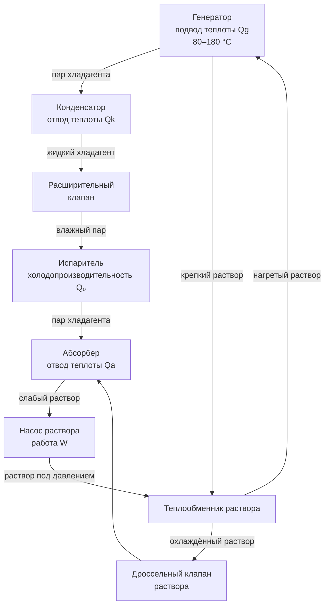

## Принцип теплового сжатия

Абсорбционный холодильный цикл (absorption refrigeration cycle) заменяет механический компрессор тепловым компрессором. Тепловой компрессор состоит из трёх элементов: абсорбера, насоса раствора и генератора-десорбера. Пар хладагента из испарителя поглощается жидким абсорбентом при низком давлении, перекачивается насосом в жидком виде на высокое давление (при минимальных затратах механической работы), затем в генераторе подводом теплоты снова выделяется из раствора.

Насос перекачивает жидкость, а не пар, поэтому затраты механической работы составляют менее 1–2 % от теплового ввода в генератор. Этим объясняется главное практическое достоинство технологии: при наличии дешёвой или бросовой теплоты абсорбционная машина может быть экономичнее компрессионной даже при более низком COP.





Цикл работает на двух уровнях давления. На низком давлении расположены испаритель и абсорбер, на высоком — генератор и конденсатор. Хладагент совершает полный контур испаритель → абсорбер → генератор → конденсатор → испаритель, тогда как абсорбент циркулирует только между абсорбером и генератором.

## Рабочие пары

Требования к рабочей паре хладагент–абсорбент:
- значительно более высокое давление насыщения хладагента по сравнению с абсорбентом при рабочих температурах (высокая относительная летучесть);
- высокая растворимость хладагента в абсорбенте в широком диапазоне температур;
- химическая стабильность при длительной эксплуатации;
- низкая вязкость раствора для эффективной теплоотдачи и массообмена.

### Бромид лития — вода (LiBr–H₂O)

В системах LiBr–H₂O вода является хладагентом, а водный раствор бромида лития — абсорбентом. Пары воды над раствором LiBr имеют давление, близкое к давлению чистой воды, тогда как давление паров самого LiBr пренебрежимо мало — разделение компонентов происходит практически без ректификации.

Система работает полностью под вакуумом: давление в испарителе 0,7–1,2 кПа абс. при температуре испарения 4–7 °C, давление в конденсаторе 6,2–10,3 кПа абс. при температуре конденсации 35–43 °C. Вакуумная эксплуатация требует абсолютной герметичности корпуса и непрерывной работы системы удаления неконденсируемых газов.

Нижний предел температуры испарителя — около +4 °C — определён точкой замерзания воды. По этой причине LiBr–H₂O применяется исключительно в системах кондиционирования воздуха и охлаждения воды (chilled water systems), но не для технологического замораживания.

Риск кристаллизации LiBr возникает при превышении концентрации раствора сверх предела растворимости. При 35 °C этот предел составляет около 64 % LiBr по массе. Рабочий запас до границы кристаллизации поддерживается на уровне 5–10 °C во всех режимах нагрузки.

### Аммиак — вода (NH₃–H₂O)

В системах NH₃–H₂O аммиак является хладагентом, вода — абсорбентом. Оба компонента имеют заметное давление насыщения, поэтому из генератора выходит смесь паров NH₃ и H₂O; для очистки пара аммиака необходима ректификационная колонна. Ректификатор поддерживает концентрацию NH₃ в паровой фазе выше 99,5 %, предотвращая накопление воды в испарителе.

Система работает при положительных давлениях: давление испарителя 200–400 кПа абс. при −10…0 °C, давление конденсатора 1200–1800 кПа абс. Отсутствие вакуума исключает проблемы инфильтрации воздуха, но требует расчёта корпуса на внутреннее давление.

Диапазон температур испарения от −60 до +10 °C делает NH₃–H₂O незаменимым для промышленного холодоснабжения, производства льда и процессов замораживания, недостижимых для систем LiBr–H₂O.

Аммиак классифицируется ASHRAE Standard 34 как группа B2L (более высокая токсичность, слабовоспламеняемый). Требования к безопасности: системы обнаружения утечек, аварийная вентиляция, ограниченный доступ в машинное отделение согласно IIAR 2 и EN 378.

## Коэффициент производительности

COP абсорбционной машины определяется отношением холодопроизводительности к тепловому вводу в генератор:


\text{COP} = \frac{Q_0}{Q_g}


где $Q_0$ — холодопроизводительность испарителя (кВт), $Q_g$ — тепловой ввод в генератор (кВт). Работа насоса раствора составляет менее 2 % от $Q_g$ и в инженерных расчётах часто не учитывается.

Теоретический максимальный COP для трёхтемпературного цикла (испаритель при $T_e$, окружающая среда при $T_a$, генератор при $T_g$):


\text{COP}_{\max} = \frac{T_e}{T_a - T_e} \cdot \frac{T_g - T_a}{T_g}


**Числовой пример.** Одноступенчатый чиллер LiBr–H₂O: $T_e = 7\ °C = 280$ К, $T_a = 32\ °C = 305$ К, $T_g = 95\ °C = 368$ К.


\text{COP}_{\max} = \frac{280}{305 - 280} \cdot \frac{368 - 305}{368} = \frac{280}{25} \cdot \frac{63}{368} = 11{,}2 \times 0{,}171 = 1{,}92


Реальный COP одноступенчатого чиллера составит 0,60–0,72, то есть около 35–40 % от теоретического предела.


| Тип | COP (номинальный) | Источник теплоты | Температура источника |
|---|---|---|---|
| LiBr–H₂O одноступенчатый | 0,60–0,72 | Пар, горячая вода, теплота отходов | 80–120 °C |
| LiBr–H₂O двухступенчатый | 1,00–1,25 | Пар высокого давления, прямое сжигание | 140–180 °C |
| LiBr–H₂O трёхступенчатый | 1,40–1,70 | Прямое сжигание, высокотемпературный пар | 200–250 °C |
| NH₃–H₂O одноступенчатый | 0,40–0,55 | Пар, горячая вода | 100–160 °C |


Сравнение с компрессионными машинами (COP 3–6) методически некорректно без учёта качества энергии. При КПД электростанции 35 % затраты первичной энергии на производство 1 кВт·ч электроэнергии составляют 2,86 кВт·ч теплоты. Поэтому компрессионная машина с COP = 4 и абсорбционная с COP = 0,65 на утилизируемой теплоте могут оказаться равноценными по первичной энергии в зависимости от источника теплоты.

## Многоступенчатые конфигурации

### Одноступенчатый цикл

Тепловой ввод используется один раз в единственном генераторе. Требует источника теплоты 80–120 °C. Применяется при утилизации отходящей теплоты, в солнечном охлаждении и при наличии низконапорного пара (0,5–1,5 бар изб.). Нормируемый ASHRAE 90.1 минимальный COP = 0,60 для одноступенчатых чиллеров LiBr при условиях AHRI 560.

### Двухступенчатый цикл

Пар хладагента из генератора высокого давления (ГВД, 150–180 °C) конденсируется в генераторе низкого давления (ГНД, 85–95 °C), обеспечивая тепловой ввод для второй ступени. Эффективно используется один тепловой ввод дважды. COP = 1,00–1,25 — улучшение на 50–70 % по сравнению с одноступенчатым циклом. Нормируемый ASHRAE 90.1 минимальный COP = 1,00 для двухступенчатых чиллеров LiBr. Типично применяется в прямообогреваемых чиллерах на природном газе и в системах с паром высокого давления 8–12 бар.

### Трёхступенчатый цикл

Каскад из трёх генераторов при 200–250 °C, 150–180 °C и 80–110 °C. COP = 1,40–1,70. Требует источников теплоты очень высокой температуры (горелки природного газа, выхлоп газовых турбин). Применяется в крупных системах централизованного теплохолодоснабжения (СЦТ).

## Требования к источнику теплоты


| Конфигурация | Температура источника | Типичный тип источника |
|---|---|---|
| Одноступенчатый | 80–120 °C | Горячая вода, пар 0,5–1,5 бар, теплота ТЭЦ, солнечные коллекторы |
| Двухступенчатый | 140–180 °C | Пар 8–12 бар, прямое сжигание газа, выхлоп двигателей |
| Трёхступенчатый | 200–250 °C | Прямое сжигание газа, выхлоп газовых турбин, пар >15 бар |


Стабильность источника теплоты критична: колебания температуры более ±5 °C вызывают снижение холодопроизводительности и риск кристаллизации в системах LiBr. Конструкция теплообменника генератора должна учитывать коэффициенты загрязнения по ASHRAE Standard 90.1: 0,0001–0,0002 м²·К/Вт для закрытых контуров горячей воды, 0,00009 м²·К/Вт для пара.

## Работа при частичной нагрузке

Абсорбционные чиллеры сохраняют относительно постоянный COP в диапазоне нагрузок 50–100 % за счёт пропорционального снижения теплового ввода в генератор. Ниже 50 % нагрузки эффективность снижается, так как фиксированные паразитные затраты (мощность насоса раствора, тепловые потери в режиме ожидания) занимают возрастающую долю суммарного энергопотребления. Минимальная устойчивая нагрузка — 10–15 % от номинала.

Температура охлаждающей воды оказывает на производительность более сильное влияние, чем в компрессионных машинах: каждый 1 °C роста температуры подачи охлаждающей воды снижает холодопроизводительность на 3–5 % и пропорционально увеличивает тепловой ввод. Градирни с уменьшенным аппроачем (2–3 °C к температуре мокрого термометра) значительно повышают эффективность системы.

## Требования к площади и размещению

Удельная площадь основания абсорбционных чиллеров в 2–3 раза больше, а высота в 1,5–2 раза больше, чем у компрессионных машин той же мощности. Это определяется более низкой объёмной эффективностью теплового сжатия и дополнительными теплообменниками. При проектировании машинного зала необходимо предусматривать пространство для выдвижения трубных пучков, равное длине корпуса чиллера.

## Экология и нормативные требования

Системы LiBr–H₂O и NH₃–H₂O используют природные хладагенты (воду и аммиак) с ODP = 0 и GWP ≈ 0, что полностью соответствует требованиям Монреальского протокола и Кигалийской поправки. При анализе совокупного эквивалентного потенциала глобального потепления (TEWI) необходимо учитывать косвенные выбросы от сжигания топлива в прямообогреваемых агрегатах.

Стандарт ASHRAE 90.1 устанавливает нормируемые значения COP для абсорбционных чиллеров по пути A (LiBr–H₂O) и пути B (NH₃–H₂O). Испытания — в соответствии с AHRI Standard 560 при следующих условиях: температура охлаждённой воды на выходе 6,7 °C, температура охлаждающей воды на входе в конденсатор 29,4 °C.

---

*Детальные инженерные расчёты конкретных компонентов, режимов работы и экономического анализа приведены в подразделах: Компоненты, Одноступенчатый цикл, Двухступенчатый цикл, Трёхступенчатый цикл, Рабочие пары.*
