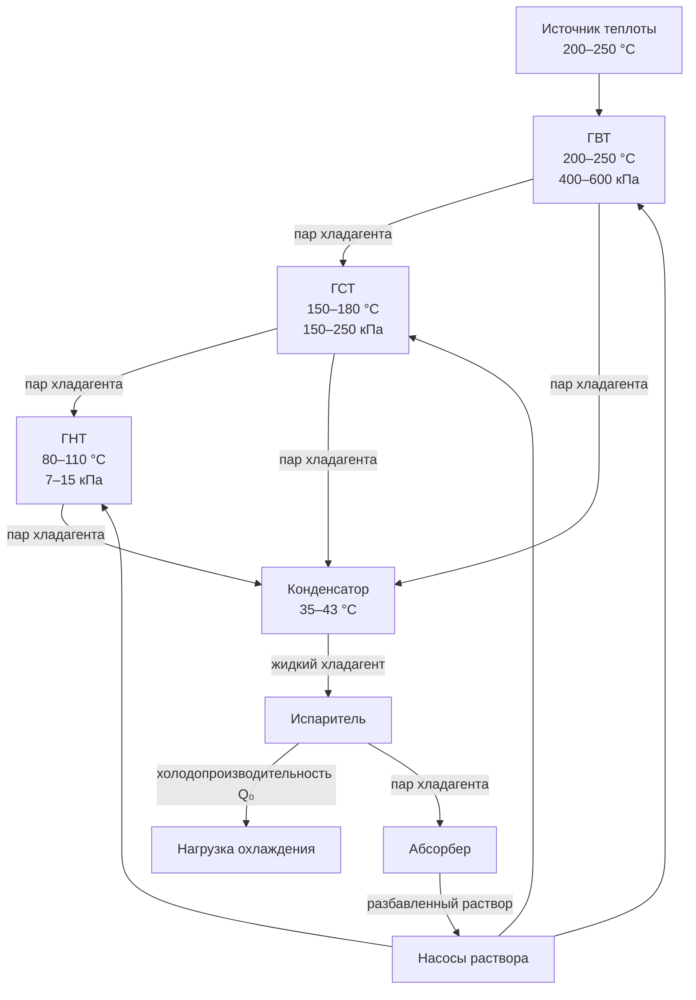

## Принцип тройного эффекта

Трёхступенчатый (triple-effect) абсорбционный чиллер реализует тепловой каскад из трёх генераторов, работающих при прогрессивно снижающихся уровнях температуры и давления. Каждая последующая ступень получает теплоту за счёт конденсации пара хладагента из предыдущей. Таким образом, один тепловой ввод высокой температуры используется трижды, обеспечивая значительно большее производство пара хладагента на единицу вложенной теплоты.

Это позволяет достичь COP 1,40–1,70 против 0,60–0,72 для одноступенчатых и 1,00–1,25 для двухступенчатых чиллеров. Однако необходимость источника теплоты при 200–250 °C ограничивает применение системами с прямым сжиганием топлива или высокотемпературной утилизацией тепловых отходов.

## Конфигурация трёх генераторов

### Генератор высокой температуры (ГВТ)

- Рабочая температура раствора: 200–250 °C
- Давление: 400–600 кПа абс.
- Источник теплоты: горелка природного газа, выхлоп газовой турбины (>400 °C), промышленные дымовые газы
- Концентрация LiBr: 64–68 % на выходе
- Тепловой поток в поверхность нагрева: 50–70 кВт/м²

Рабочая температура ГВТ диктует применение специальных конструкционных материалов: высоколегированных нержавеющих сталей для корпуса и трубных пучков, стойких к концентрированному LiBr при высоких температурах. Риск коррозионного растрескивания под напряжением возрастает, если концентрация ингибитора коррозии опускается ниже 2,0 % мас. или pH выходит из диапазона 10,5–11,0.

### Генератор средней температуры (ГСТ)

- Рабочая температура раствора: 150–180 °C
- Давление: 150–250 кПа абс.
- Источник теплоты: конденсирующийся пар хладагента из ГВТ
- Производит пар хладагента промежуточного давления

### Генератор низкой температуры (ГНТ)

- Рабочая температура раствора: 80–110 °C
- Давление: 7–15 кПа абс.
- Источник теплоты: конденсирующийся пар хладагента из ГСТ
- Параметры близки к обычному одноступенчатому циклу





## Анализ COP

### Теоретический предел

Теоретический COP трёхступенчатого цикла приближается к 1,8–2,0 в идеализированном рассмотрении. Практические установки достигают 1,40–1,70 из-за конечных температурных перепадов в теплообменниках (5–10 °C на каждой ступени), потерь давления в межступенчатых трубопроводах, запасов по кристаллизации и тепловых потерь компонентов высокой температуры (3–5 % от теплового ввода).

**Числовой пример.** Трёхступенчатый чиллер: $Q_0 = 10\,000$ кВт, $\text{COP} = 1{,}60$.


Q_g = \frac{Q_0}{\text{COP}} = \frac{10\,000}{1{,}60} = 6\,250\ \text{кВт}


Сравнение с одноступенчатым вариантом ($\text{COP} = 0{,}70$): $Q_g = 14\,286$ кВт. Экономия теплового ввода: 14 286 − 6 250 = 8 036 кВт (56 % снижение потребления теплоты).

При стоимости природного газа 4 руб./кВт·ч тепл. и 7000 ч/год:

| Показатель | Одноступ. | Двухступ. (COP = 1,10) | Трёхступ. (COP = 1,60) |
|---|---|---|---|
| Тепловой ввод, кВт | 14 286 | 9 091 | 6 250 |
| Стоимость теплоты, млн руб./год | 400 | 255 | 175 |
| Экономия vs одноступ., млн руб./год | — | 145 | 225 |


| Параметр | Одноступенчатый | Двухступенчатый | Трёхступенчатый |
|---|---|---|---|
| COP | 0,70 | 1,10 | 1,60 |
| Тепловой ввод, кВт | 14 286 | 9 091 | 6 250 |
| Температура источника, °C | 80–120 | 140–180 | 200–250 |
| Относительная капитальная стоимость | 1,0 | 1,4–1,6 | 2,5–3,0 |
| Число теплообменников генератора | 1 | 2 | 3 |


### Влияние условий эксплуатации на COP

При температуре охлаждённой воды 7 °C и охлаждающей воды 32 °C типичный трёхступенчатый чиллер работает при COP 1,65. Снижение температуры охлаждённой воды с 7 до 4 °C уменьшает COP примерно до 1,45 из-за снижения давления испарителя и уменьшения рабочего диапазона концентраций раствора.

## Требования к источнику теплоты

Потребность в источнике с температурой 200–250 °C ограничивает применение трёхступенчатых чиллеров следующими сценариями:

**Прямое сжигание природного газа.** Горелки с КПД 98–99 % обеспечивают температуру дымовых газов 220–270 °C на входе в ГВТ. Требования к горелке: соотношение регулирования не менее 5:1 для устойчивой работы; выбросы NOₓ менее 40 мг/м³ при 3 % O₂ (горелки с ультранизким NOₓ).

**Выхлоп газовых турбин.** Газовая турбина мощностью 20 МВт производит 25–30 МВт тепловой мощности выхлопных газов при 500–550 °C. После утилизационного котла-парогенератора (HRSG) на уровне 200–250 °C доступно достаточно теплоты для трёхступенчатого чиллера холодопроизводительностью 12–15 МВт.

**Пар очень высокого давления.** Насыщенный пар давлением более 20 бар (температура насыщения выше 212 °C) применим, если объект располагает соответствующей паровой инфраструктурой.

**Промышленные дымовые газы.** Печи термообработки, цементные заводы и другие высокотемпературные производства генерируют дымовые газы при 400–700 °C, из которых теплота может быть рекуперирована на уровне 200–250 °C.

## Сложность системы и эксплуатация

### Системная сложность

Трёхступенчатый чиллер включает:
- три ступени генератора с взаимосвязанными трубными пучками теплообмена;
- 5–7 теплообменников раствора (рекуперация между ступенями);
- сложную сеть распределения пара хладагента между генераторами;
- 20–30 точек измерения температуры и давления для управления тепловым каскадом.

Соответственно возрастают требования к системе управления, квалификации обслуживающего персонала и программе технического обслуживания.

### Капитальные затраты и окупаемость

Трёхступенчатые чиллеры стоят в 2,5–3,0 раза дороже одноступенчатых аналогичной мощности и в 1,8–2,2 раза дороже двухступенчатых. Экономическое обоснование требует:
- холодопроизводительности не менее 3000 кВт;
- годовой наработки более 3000 ч;
- приемлемого срока окупаемости (горизонт 10+ лет).

### Техническое обслуживание

- Ежегодная очистка трубных пучков всех 7–10 теплообменников.
- Анализ раствора каждые 6 месяцев (концентрация ингибитора коррозии критична).
- Ежеквартальная проверка горелки и регулировка (прямообогреваемые исполнения).
- Замена высокотемпературных уплотнений — раз в 2–3 года.
- Полугодовая калибровка системы управления.

## Применение в системах централизованного теплохолодоснабжения

Трёхступенчатые абсорбционные чиллеры находят основное применение в крупных системах централизованного теплохолодоснабжения (СЦТ, district cooling systems), где сочетание высоких нагрузок охлаждения, непрерывной работы и доступных высокотемпературных источников теплоты оправдывает капитальные вложения.

### Характеристики применения в СЦТ

- Единичная мощность чиллера: 7 000–17 500 кВт.
- Число машин в составе установки: 3–6 (резервирование N+1).
- Годовая наработка: 6000–8000 ч.
- Интеграция с тепловым аккумулятором.
- Комплексирование с ТЭЦ для тригенерации.

### Тригенерация на базе газовой турбины

В тригенерационном комплексе трёхступенчатые абсорбционные чиллеры используют теплоту выхлопных газов газовых турбин, создавая высокоэффективные системы с одновременным производством электроэнергии, теплоты и холода. Суммарный КПД по первичной энергии превышает 75–85 %.

Оптимальная стратегия нагрузки СЦТ: трёхступенчатые абсорбционные чиллеры — базовая нагрузка (60–70 % пикового спроса), электрические центробежные чиллеры — пиковая нагрузка и резерв. Такой гибридный подход обеспечивает наилучший баланс между эффективностью теплового сжатия и гибкостью центробежных машин.

## Направления развития технологии

Передовые разработки трёхступенчатых чиллеров включают:
- встроенные тепловые аккумуляторы на нескольких температурных уровнях;
- переключаемый режим двух/трёх ступеней для адаптации к переменному источнику теплоты;
- материалы нового поколения, допускающие температуру ГВТ 270–300 °C и COP 1,8–2,0;
- цифровые двойники для предиктивного обслуживания и оптимизации режима.

---

*Проектирование трёхступенчатых абсорбционных чиллеров ведётся в соответствии с ASHRAE Standard 15, EN 378, IIAR (при применении с аммиаком), требованиями к сосудам давления по ASME Section VIII или ГОСТ Р 52630, а также нормами пожарной безопасности и промышленной безопасности по российскому законодательству (Технический регламент Таможенного союза ТР ТС 010/2011).*
