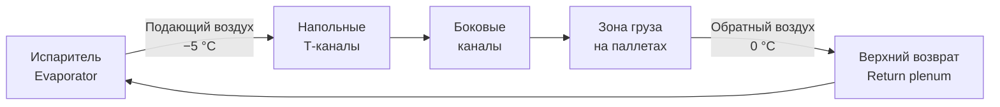

## Обзор

Системы распределения воздушного потока (airflow distribution systems) в рефрижераторных контейнерах (reefer containers) — критический элемент транспортной холодильной цепи (cold chain). В контейнерах длиной 6–12 м без надлежащей циркуляции неизбежно возникают локальные зоны перегрева, приводящие к порче груза и нарушению температурного контроля. Современные reefer-контейнеры проектируются в соответствии с ISO 1496-2 и рекомендациями ASHRAE TC 10.9, определяющими требования к скоростям воздуха, объёмным расходам и градиентам температуры в грузовом отсеке.

Охлаждённый воздух подаётся через напольные Т-образные каналы (T-bar floor channels) и возвращается в испаритель (evaporator) через верхний вентиляционный проём. Типовой объёмный расход в 40-футовом контейнере составляет 3 000–5 000 м³/ч при скорости в напольных каналах 0,3–0,6 м/с.

---

## Физические принципы циркуляции воздуха

Движение воздуха в контейнере подчиняется законам конвективного теплообмена (convective heat transfer). Разность давлений, создаваемая вентилятором испарителя, преодолевает аэродинамическое сопротивление трассы по уравнению:


\Delta P = \rho g h + \lambda \frac{L}{D_h} \frac{v^2}{2}


где:
- $\rho$ — плотность воздуха, кг/м³ (≈ 1,2 кг/м³ при 0 °C);
- $g$ — ускорение свободного падения, 9,81 м/с²;
- $h$ — высота подъёма потока, м;
- $\lambda$ — коэффициент гидравлического трения (Darcy friction factor);
- $L$ — эквивалентная длина участка, м;
- $D_h$ — гидравлический диаметр сечения, м;
- $v$ — скорость воздуха, м/с.

Конвективный коэффициент теплоотдачи (convective heat transfer coefficient) рассчитывается из корреляции Дитуса–Больтера (Dittus–Boelter), применимой при развитом турбулентном течении (Re > 10 000):


Nu = 0{,}023 \cdot Re^{0{,}8} \cdot Pr^{0{,}4}


где $Nu$ — число Нусcельта, $Re$ — число Рейнольдса, $Pr$ — число Прандтля. Для воздуха при −5 °C: $Pr \approx 0{,}72$.

---

## Конструкция системы воздухораспределения

### Напольные Т-образные каналы

Напольные распределители (T-bar floor ducts) — первичный элемент раздачи охлаждённого воздуха. Алюминиевые или оцинкованные Т-профили обеспечивают:

- равномерное распределение расхода по продольной оси контейнера;
- минимизацию местных сопротивлений (коэффициент $\zeta$ = 0,3–0,5);
- свободный въезд паллетов (pallets) шириной до 1 200 мм.

Типовые геометрические параметры: высота профиля 80–120 мм, ширина секции 600–800 мм. Коэффициент свободного сечения (free area ratio) — 60–70 %.

### Продольное распределение

Воздуховод, расположенный по центру или по боковым стойкам контейнера, осуществляет продольное распределение через регулируемые отверстия диаметром 30–50 мм с шагом 0,5–1,0 м. Такая конструкция обеспечивает равномерный удельный расход на погонный метр длины.

### Боковые каналы

Боковые воздушные каналы (side ducts) в угловых стойках позволяют воздуху выходить на полную высоту груза. Скорость в боковых каналах — 0,4–0,8 м/с. Стойки соответствуют угловым фитингам (corner castings) по ISO 1161.

### Система возврата воздуха

Нагретый воздух, поглотивший тепловую нагрузку от груза, возвращается в испаритель через верхний вентиляционный проём (return air plenum) на высоте 2,5–2,7 м. Балансировочная решётка (balancing damper) поддерживает оптимальный баланс давления в контуре.

---

## Расчёт и оптимизация воздухораспределения

### Требуемый объёмный расход

Объёмный расход определяется из уравнения теплового баланса (heat balance):


\dot{V} = \frac{Q_{\text{груза}}}{c_p \cdot \rho \cdot \Delta T}


где:
- $Q_{\text{груза}}$ — суммарная тепловая нагрузка на груз (product load), кВт;
- $c_p$ — удельная теплоёмкость воздуха ≈ 1,005 кДж/(кг·K);
- $\rho$ — плотность воздуха при рабочей температуре, кг/м³;
- $\Delta T$ — температурный перепад между подающим и обратным потоком, K.

**Пример (SI).** 40-футовый контейнер, тепловая нагрузка $Q_{\text{груза}} = 15$ кВт, $\Delta T = 5$ K, $\rho = 1{,}25$ кг/м³:


\dot{V} = \frac{15}{1{,}005 \times 1{,}25 \times 5} \approx 2 388 \text{ м}^3/\text{ч}


Холодильный агрегат рассчитывается на 3 000–4 000 м³/ч с запасом 25–30 % для преодоления гидравлических сопротивлений системы.

### Нормативные требования к скоростям воздуха

Согласно ASHRAE TC 10.9 и ISO 1496-2:2021:


| Зона | Минимум, м/с | Оптимум, м/с | Максимум, м/с |
|---|---|---|---|
| Напольные каналы | 0,15 | 0,25–0,50 | 0,80 |
| Боковые воздуховоды | 0,30 | 0,40–0,80 | 1,00 |
| Зона груза | 0,05 | 0,15–0,30 | 0,50 |


Скорости свыше 1,0 м/с в зоне груза приводят к обезвоживанию (dehydration) продукции и механическому повреждению нежной тары.

### Предотвращение локальных зон перегрева

Критические зоны (hot spots) возникают:
1. в дальних углах контейнера (наибольшее расстояние от испарителя);
2. на верхних паллетах (возврат нагретого воздуха);
3. в центре плотно упакованного груза с низкой воздухопроницаемостью.

Корректирующие меры:
- увеличение доли расхода в задней четверти контейнера до 30 % от общего;
- установка направляющих вкладышей (air deflectors);
- ограничение коэффициента заполнения объёма (fill factor) — не более 80–85 %.

---

## Воздушные зазоры при штабелировании груза


| Параметр | Минимум, мм | Оптимум, мм | Максимум, мм |
|---|---|---|---|
| Зазор паллет–пол | 50 | 100–150 | 200 |
| Межпаллетный зазор по высоте | 30 | 50–100 | 150 |
| Боковой отступ от стенки | 30 | 50–100 | 150 |
| Скорость воздуха в грузе, м/с | 0,05 | 0,15–0,30 | 0,50 |


Высота паллеты с грузом: типично 1,4–1,8 м (максимум 2,4 м в High Cube контейнере).

---

## Приборный контроль и мониторинг

Современные reefer-контейнеры оснащаются:

- **датчиком температуры обратного воздуха** (return air sensor, Pt100) — на входе в испаритель; управляет компрессором по ПИД-алгоритму;
- **датчиком температуры подающего воздуха** (supply air sensor) — контроль переохлаждения;
- **датчиками груза** (cargo probes) — до 6 точек для мониторинга локальных зон;
- **дифференциальным манометром** — контроль засорения фильтров и проходимости каналов.

Аварийные уставки (для свежих бананов, +13 °C):
- верхний предел температуры груза: +14 °C;
- допустимый перепад температур по объёму: не более 2–3 K;
- перепад давления в системе: сигнал при превышении 100 Па (признак засора).

---

## Согласование мощности холодильного агрегата с системой воздухораспределения

Холодопроизводительность агрегата (refrigeration capacity) подбирается с учётом:
- начального охлаждения груза от $T_{\text{нач}}$ до уставки;
- стационарной тепловой нагрузки (теплопроводность ограждений, дыхание груза, инфильтрация);
- резерва +15–20 % от базовой нагрузки.

Типовые стационарные нагрузки 40-футового контейнера:
- предварительное охлаждение ($\Delta T_{\text{груза}} = 20$ K за 24 ч): 12–18 кВт;
- поддержание режима: 8–12 кВт.

Массовый расход хладагента (R-134a или R-452A) через испаритель:


\dot{m}_{\text{хл}} = \frac{Q_0}{h_{\text{исп}} - h_{\text{жидк}}}


где $h_{\text{исп}}$ и $h_{\text{жидк}}$ — энтальпии пара на выходе из испарителя и переохлаждённой жидкости на входе в расширительный вентиль (expansion valve), кДж/кг.

---

## Особенности эксплуатации в различных климатических зонах

### Тропический климат (T_окр > +30 °C)

- требуемая холодопроизводительность возрастает на 25–30 %;
- изоляция воздуховодов — минимум 50 мм пенополиуретана (PUR foam);
- расход воздуха — до 5 000–6 000 м³/ч.

### Умеренный климат (+10…+20 °C)

- стандартная мощность агрегата 10–12 кВт для 40-футовика;
- оптимальный расход воздуха 3 500–4 000 м³/ч.

### Арктический климат (T_окр < 0 °C)

- риск переохлаждения груза; применяется электронный расширительный вентиль (EEV — electronic expansion valve) с плавным регулированием;
- минимальная циркуляция 2 500–3 000 м³/ч для предотвращения локального льдообразования на поверхности испарителя.

---

## Нормативная база


| Документ | Содержание |
|---|---|
| ISO 1496-2:2021 | Рефрижераторные контейнеры серии 1: конструкция и испытания; разд. 5 — циркуляция воздуха и температурные поля |
| ASHRAE TC 10.9 | Рекомендации по воздухораспределению в рефрижераторных контейнерах |
| ASHRAE 41.2 | Методология измерения температурных полей в охлаждаемых объёмах |
| EN 12969 | Испытания холодильного оборудования для грузовых контейнеров |
| СП 60.13330.2020 | Отопление, вентиляция и кондиционирование воздуха (нормирование расходов воздуха) |
| ГОСТ 30494-2016 | Параметры микроклимата в помещениях; методы контроля |


---

## Схема воздушного контура reefer-контейнера





---

## Практические рекомендации

1. **Проектирование:** допустимый перепад температур по объёму — не более 2–3 K для критичного груза (свежие фрукты, мясо, цветы).

2. **Типовые расходы воздуха:**
   - 20-футовый контейнер (TEU): 2 000–2 500 м³/ч;
   - 40-футовый контейнер (FEU): 3 500–4 500 м³/ч;
   - High Cube: 4 000–5 000 м³/ч.

3. **Проверка проходимости:** после загрузки — испытание статического давления напольного канала; норма не более 50–80 Па при номинальном расходе.

4. **Предотвращение конденсации:** поддерживать относительную влажность 85–95 % для свежей продукции; обеспечить дренаж конденсата из поддона испарителя.

5. **Техническое обслуживание:** очистка напольных решёток и воздушного фильтра каждые 500 ч работы; ежеквартальная проверка уплотнителей дверей на герметичность.

6. **Документирование:** все данные температурных датчиков архивировать в соответствии с требованиями HACCP (ISO 22000) с интервалом записи не реже 15 мин.
