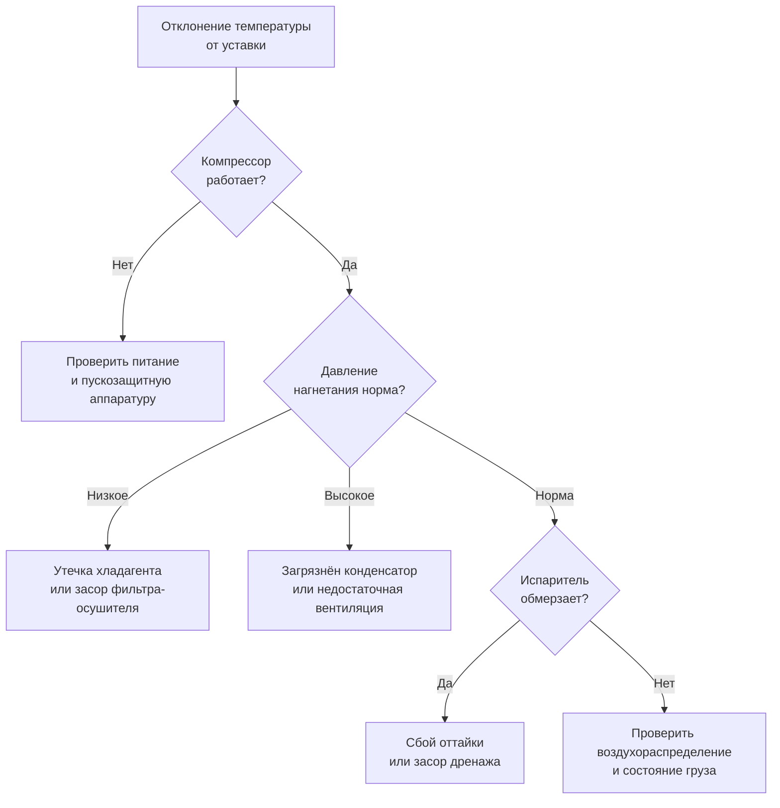

## Обзор

Контейнерные рефрижераторные установки (Container Refrigeration Units, CRU) — автономные холодильные системы, предназначенные для поддержания заданной температуры внутри ISO-контейнеров при транспортировке скоропортящихся грузов морским, железнодорожным и автомобильным транспортом. Диапазон регулирования температуры: от −30 до +10 °C в зависимости от груза (замороженное мясо, рыба, свежие фрукты, овощи, фармацевтические препараты). Проектирование CRU регламентируется ISO 1496-2, ISO 6785 и рекомендациями ASHRAE Handbook — Refrigeration.

Рефрижераторные установки составляют основу интермодальных холодоснабжающих цепей (cold chain): они обеспечивают независимость от стационарной инфраструктуры при межмодальных переходах (судно, терминал, железная дорога, автомагистраль) и соответствие санитарным и таможенным нормам.

---

## Физические принципы и термодинамика

CRU работают по обратному циклу Ренкина (vapour compression refrigeration cycle). Холодопроизводительность испарителя (evaporator capacity):


Q_{\text{исп}} = \dot{m} \cdot (h_2 - h_1)


где $Q_{\text{исп}}$ — тепловой поток испарения, Вт; $\dot{m}$ — массовый расход хладагента, кг/с; $h_1$, $h_2$ — удельные энтальпии на входе и выходе из испарителя, кДж/кг.

Коэффициент производительности (COP — Coefficient of Performance):


\text{COP} = \frac{Q_0}{W_{\text{комп}}}


где $Q_0$ — холодопроизводительность, Вт; $W_{\text{комп}}$ — электрическая мощность привода компрессора, Вт. Для контейнерных CRU типовые значения COP = 2,0–3,5 в зависимости от температурного режима.

Суммарный теплоприток в контейнер:


Q_{\text{вн}} = U \cdot A \cdot (T_{\text{внеш}} - T_{\text{внутр}}) + q_{\text{сол}} + q_{\text{груза}}


где $U$ — коэффициент теплопередачи ограждения, Вт/(м²·K); $A$ — площадь поверхности, м²; $q_{\text{сол}}$ — тепловой поток от солнечного излучения, Вт; $q_{\text{груза}}$ — дыхание груза и тепло упаковки, Вт.

---

## Компоненты и конструктивные решения

### Типы монтажа установки

**Напольные (floor-mounted) CRU** устанавливаются на салазках внутри контейнера рядом с дверью и занимают 1,5–2,5 м³ полезного объёма. Обеспечивают оптимальную циркуляцию воздуха и простой демонтаж.

**Встроенные (integral) CRU** интегрируются в несущий каркас при производстве контейнера, минимизируя потерю объёма, однако усложняя сервисный доступ.

**Навесные (top-mounted) CRU** крепятся на торцевую стенку или крышу, сохраняя весь внутренний объём при упрощённой установке.

**Подвесные (overhead) CRU** размещаются под потолком на кронштейнах, обеспечивая оптимальное воздухораспределение без занятия площади пола.

### Компрессоры

Герметичные спиральные компрессоры (hermetic scroll compressors) обеспечивают COP = 2,5–3,2 при частоте вращения 1 450–3 600 об/мин. Уровень вибрации — 65–75 дБ. Инверторный привод (variable frequency drive, VFD) позволяет регулировать производительность в диапазоне 30–100 %, снижая энергопотребление при частичных нагрузках на 15–25 %.

Хладагенты — R-134a (GWP = 1 430, класс A1 по ASHRAE 34) и R-452A (GWP = 2 140, класс A1) — применяются в соответствии с Regulation (EU) 517/2014 (F-Gas Regulation) и ГОСТ 28547-90. Масса заряда в CRU: 1,5–4,0 кг.

### Теплообменники

Микроканальные конденсаторы и испарители (microchannel heat exchangers, MCHE) с диаметром каналов 0,8–1,2 мм обеспечивают коэффициент теплоотдачи $h$ = 5 000–8 000 Вт/(м²·K) на стороне воздуха при площади поверхности 2–4 м² при компактных габаритах 500×300×150 мм. По сравнению с круглотрубными теплообменниками содержание хладагента снижается на 40–50 %.

### Системы оттайки

**Оттайка горячим газом (hot gas defrost)** использует пар высокого давления с нагнетания компрессора, направляя его в испаритель. Продолжительность цикла — 8–15 мин, энергозатраты — 5–10 % от холодопроизводительности.

**Оттайка реверсированием цикла (reverse cycle defrost)** осуществляется через четырёхходовой реверсивный клапан (four-way reversing valve): испаритель становится конденсатором. Время цикла — 10–20 мин, энергопотребление — 7–12 % от $Q_0$.

### Системы с фазовым переходом

Эвтектические пластины (eutectic plates) заполнены смесью NaCl с водой с точкой замерзания −18 °C или −27 °C. При замораживании поглощают 160–200 кДж/кг теплоты кристаллизации, обеспечивая пассивное охлаждение без электропитания на 36–72 ч. Требуют предварительной заморозки (pull-down) перед рейсом.

---

## Электроснабжение


| Регион | Напряжение, В | Частота, Гц | Фазность | Потребляемая мощность, кВт |
|---|---|---|---|---|
| Европа (IEC) | 400 | 50 | 3-фазное | 5–15 |
| Северная Америка (NEMA) | 460 | 60 | 3-фазное | 5–15 |
| Азия/Австралия | 415 | 50 | 3-фазное | 5–15 |


Резервный дизель-генератор (genset) мощностью 15–25 кВА обеспечивает автономность на 24–48 ч при работе на портовом терминале или таможенном посту.

---

## Расчёт холодопроизводительности

### Тепловой баланс


Q_0 = Q_{\text{кондукция}} + Q_{\text{инфильтрация}} + Q_{\text{сол}} + Q_{\text{груза}}


Кондуктивный теплоприток через ограждение (conductive heat gain):


Q_{\text{кондукция}} = U \cdot A \cdot \Delta T_m


**Пример (SI).** 20-футовый контейнер (TEU): $A = 120$ м², $U = 0{,}30$ Вт/(м²·K), $\Delta T_m = 40$ K (снаружи +35 °C, внутри −5 °C):


Q_{\text{кондукция}} = 0{,}30 \times 120 \times 40 = 1\,440 \text{ Вт}


Тепловая нагрузка от солнечного излучения (в тропическом климате, белое покрытие, $\alpha = 0{,}3$): 400–600 Вт. При чёрном покрытии ($\alpha = 0{,}9$): 800–1 200 Вт.

Дыхание свежих фруктов (respiration heat): 50–200 Вт в зависимости от массы и вида товара.

### Мощность компрессора


W_{\text{комп}} = \frac{Q_0}{\text{COP}}


При $Q_0 = 8$ кВт и COP = 2,8: $W_{\text{комп}} = 8 / 2{,}8 \approx 2{,}9$ кВт. Номинальная мощность CRU выбирается с запасом 15–20 % для компенсации деградации и пиковых нагрузок.

---

## Температурные режимы для различных грузов


| Груз | Температура, °C | Влажность, % | COP | Мощность, кВт |
|---|---|---|---|---|
| Замороженное мясо | −25 до −18 | 85–95 | 2,0–2,3 | 12–15 |
| Свежая рыба (охлаждённая) | −5 до 0 | 90–95 | 3,0–3,5 | 8–10 |
| Тропические фрукты | +10 до +15 | 85–90 | 3,2–3,8 | 6–8 |
| Листовые овощи | +4 до +8 | 90–95 | 3,0–3,3 | 7–9 |
| Фармацевтика (GDP) | +2 до +8 | 40–60 | 3,2–3,6 | 5–7 |


---

## Применение в холодовых цепях

### Морские контейнеровозы

На судах контейнеры подключаются к судовым розеткам (power receptacles) 440 В / 60 Гц. На борту Ultra Large Container Vessel (ULCV) может быть до 3 000 reefer-контейнеров. Мониторинг температуры, влажности и состояния агрегата ведётся по ATP (Соглашение о международной перевозке скоропортящихся грузов, ISO 6785) через IoT-телеметрию и GPS.

### Железнодорожный и автомобильный транспорт

При наземных перевозках CRU работают от локальных генераторов 380 В / 50 Гц (20 А, 3-фазное питание). Вибрация от дорожного покрытия и рельсовых стыков требует усиленной виброизоляции компрессора (резиновые антивибрационные крепления, класс ISO 10816).

---

## Нормативная база


| Документ | Применение |
|---|---|
| ISO 1496-2:2021 | Конструкция и испытания рефрижераторных контейнеров серии 1 |
| ISO 6785:2015 | ATP-соглашение; термические испытания ±5 K |
| ASHRAE Handbook — Refrigeration (2022) | Расчёт холодопроизводительности и выбор хладагентов |
| ASHRAE 34 | Классификация хладагентов (R-134a — класс A1) |
| EN 14825:2022 | Сезонное энергопотребление; классы эффективности |
| Regulation (EU) 517/2014 | F-Gas Regulation; ограничение фторированных хладагентов |
| ГОСТ 28547-90 | Хладагенты; требования к качеству |
| СП 60.13330.2020 | Отопление, вентиляция и кондиционирование воздуха |


---

## Диагностика состояния CRU





---

## Практические рекомендации

1. **Выбор мощности:** для TEU (20 ft) — 8–10 кВт; для FEU (40 ft) — 14–16 кВт; для High Cube FEU — 16–20 кВт.

2. **Заряд хладагента:** R-134a или R-452A, 1,5–4,0 кг; проверка герметичности методом течеискателя (leak detector) ≤ 0,5 г/год согласно EU 517/2014.

3. **Периодичность обслуживания:** очистка микроканальных теплообменников — каждые 500 ч; замена фильтра-осушителя (filter drier) — ежегодно или при вскрытии контура.

4. **Контроль изоляции:** коэффициент теплопередачи ограждения $U \leq 0{,}35$ Вт/(м²·K) при приёмке нового контейнера; деградация ППУ (polyurethane foam) при промерзании — 30–40 % за 5–7 лет.

5. **Цикл оттайки:** при работе ниже −15 °C запуск оттайки каждые 12–24 ч; превышение интервала снижает теплообмен в испарителе на 15–25 %.

6. **Энергоэффективность:** белое покрытие контейнера ($\alpha = 0{,}25$–$0{,}30$) снижает солнечную нагрузку на 50 % и экономит 8–12 % электроэнергии; инверторный привод компрессора экономит 10–20 % в режиме поддержания.
