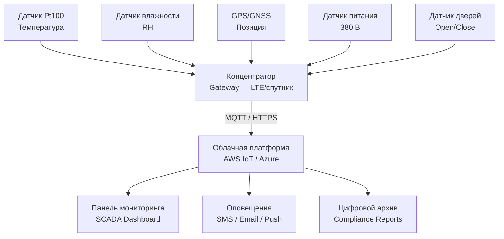

## Обзор

Мониторинг рефрижераторных контейнеров — неотъемлемая составляющая системы управления холодовой цепью (cold chain management) для скоропортящихся грузов: фармацевтики, продуктов питания, биологических материалов, цветов. Непрерывная регистрация и анализ параметров микроклимата (температура, влажность, давление, статус питания) обеспечивают соответствие требованиям HACCP (ISO 22000), FDA 21 CFR Part 11, WHO Guidelines и ГОСТ 30494-2016.

Потеря температурного режима даже на 1–2 ч может привести к порче груза стоимостью десятки тысяч долларов и юридической ответственности перевозчика. Поэтому проектирование систем мониторинга требует комплексного подхода: выбор метрологически аттестованной аппаратуры, валидация температурного картирования (temperature mapping), стандартизированные процедуры документирования.

---

## Метрологические основы измерения температуры

### Датчики сопротивления Pt100/Pt1000 (RTD)

Сопротивление платинового термометра сопротивления (Resistance Temperature Detector, RTD) описывается уравнением Калленандера–ван Дюзена:


R(T) = R_0\bigl[1 + \alpha T + \beta T^2 + \gamma(T - 100)T^3\bigr]


где $R_0 = 100$ Ом (для Pt100 при 0 °C), $\alpha = 3{,}9083 \times 10^{-3}$ K⁻¹, $\beta = -5{,}775 \times 10^{-7}$ K⁻², $\gamma = -4{,}183 \times 10^{-12}$ K⁻⁴ (при T < 0 °C). Нормируется по IEC 60751 и ГОСТ 6651-2009.

### Термисторы NTC

Зависимость сопротивления NTC-термистора (Negative Temperature Coefficient thermistor) от температуры описывается уравнением Стейнхарта–Харта (Steinhart–Hart):


\frac{1}{T} = A + B \ln R + C (\ln R)^3


где $A$, $B$, $C$ — индивидуальные калибровочные константы. Чувствительность: −5…−6 % на °C (против +0,4 % у Pt100), что обеспечивает высокое разрешение, но требует индивидуальной калибровки каждого датчика.

### Классы точности датчиков по IEC 60751


| Класс | Допуск | Применение |
|---|---|---|
| AA | ±(0,10 + 0,0017·|T|) °C | Лабораторные эталоны |
| A | ±(0,15 + 0,0020·|T|) °C | Критические грузы (фармацевтика, вакцины) |
| B | ±(0,30 + 0,0050·|T|) °C | Пищевые продукты; допустимо для reefer |


Для холодовой цепи фармацевтики требуется минимум класс A. Калибровка — ежегодно по ISO/IEC 17025 с использованием эталонного термометра и не менее трёх реперных точек (тройная точка воды, ледяная баня, паровая точка).

---

## Аппаратура систем мониторинга

### Автономные регистраторы данных (data loggers)

Портативные устройства с интегрированными датчиками температуры и влажности. Типовые характеристики:


| Параметр | Значение |
|---|---|
| Габариты | 50–80 × 30–40 × 15–25 мм |
| Объём памяти | 32–256 кБ (2 000–20 000 записей) |
| Автономность батареи | 3–5 лет |
| Интерфейс | USB, Bluetooth 5.0, NFC |
| Погрешность | ±0,5…±1,0 °C |
| Рабочий диапазон | −40…+70 °C |
| Сертификация | ISO/IEC 17025, FDA 21 CFR Part 11 |


Примеры: Lascar EL-USB-2, LogTag UTRICS-16, Sensitech TempTale 4.

### Встраиваемые зонды

Датчики Pt100 в герметичном нержавеющем корпусе (диаметр 8–12 мм, класс защиты IP67) подключаются через экранированный кабель длиной 3–10 м. Применяются для точечного мониторинга критичных зон: полки с грузом, зона возврата воздуха, угловые зоны.

### Беспроводные многоканальные системы

Модульные решения с 4–16 удалёнными датчиками, передающими данные по ZigBee, LoRaWAN или LTE-M (NB-IoT) на центральный концентратор (gateway). Параметры:
- частота опроса: 1 запись/мин — 1 запись/ч;
- задержка передачи: 5–15 мин;
- интеграция с облачными SCADA-платформами (AWS IoT, Microsoft Azure).

---

## Системы позиционирования и дополнительные датчики

### GPS-трекинг

GNSS-приёмник (GPS + ГЛОНАСС) определяет координаты с точностью ±3–10 м, обновление 1–5 мин. Интеграция с картографическими сервисами позволяет прогнозировать время доставки и выявлять несанкционированные остановки. Потребление: 100–500 мА·ч в час.

### Датчики открытия дверей

Магнитные или механические переключатели фиксируют момент и длительность открытия грузовых дверей с временной меткой. Критично для выявления несанкционированного доступа и оценки инфильтрационных потерь холода.

### Датчики безопасности

- **Акселерометры (3-осевые):** обнаружение ударов и вибраций (порог 0,5–2,0 g), опасных для хрупкого груза;
- **Гироскопы:** контроль наклона контейнера (актуально для грузов, требующих строго горизонтального положения);
- **Датчики влажности:** ёмкостные или резистивные, диапазон 0–100 % RH, погрешность ±2–3 %.

### Мониторинг электропитания

Контроль напряжения сети 380 В и токовая защита компрессора. Отключение питания фиксируется с временной меткой; немедленная отправка экстренного оповещения по SMS/Email/push-уведомлению.

---

## Методология валидации и температурного картирования

Перед вводом контейнера в эксплуатацию для фармацевтических грузов проводится **температурное картирование (temperature mapping)** согласно EU Annex 15 GMP, ISTA 7D и FDA 21 CFR Part 11.

### Процедура валидации

1. Установка 12–16 датчиков в характерные точки: углы, центр, вблизи воздухораспределителя, на поверхности груза.
2. Повторные циклы охлаждения и нагрузки при различных внешних температурах: −5, +25, +35 °C.
3. Регистрация данных с интервалом 5–10 мин в течение 24–72 ч (не менее 3 повторных испытаний).
4. Анализ градиентов: максимальная разность между точками в установившемся режиме — не более 2–3 °C.
5. Определение наиболее уязвимых и наименее уязвимых точек для постоянного размещения датчиков.

### Протокол квалификации OQ/PQ

- **OQ (Operational Qualification):** проверка работы оборудования в полном диапазоне рабочих условий;
- **PQ (Performance Qualification):** подтверждение стабильного поддержания температуры в течение заявленного времени с запасом +20 %.

---

## Нормативная база и стандарты


| Документ | Область применения |
|---|---|
| ISO 22000:2018 | HACCP; управление безопасностью пищевых продуктов |
| ASHRAE 33-2023 | Методология испытаний рефрижераторного оборудования |
| FDA 21 CFR Part 11 | Электронные записи и электронные подписи (фармацевтика) |
| EU Annex 15 GMP | Валидация и квалификация в фармацевтическом производстве |
| WHO Guidelines (2011) | Управление холодовой цепью при доставке вакцин |
| ГОСТ 30494-2016 | Параметры микроклимата; методы измерения |
| ISO/IEC 17025:2017 | Требования к компетентности калибровочных лабораторий |
| ТР ЕАЭС 021/2011 | Технический регламент о безопасности пищевых продуктов |


---

## Аварийные уставки и регламент оповещений


| Тип груза | Рабочий диапазон, °C | Аварийный порог, °C | Стандарт |
|---|---|---|---|
| Замороженные продукты | −18…−25 | > −15 | ГОСТ 32271, EN 441 |
| Охлаждённые продукты | 0…+4 | > +7 | ISO 13100 |
| Фармацевтика GDP | +2…+8 | > +10 или < 0 | EudraLex Vol. 4, WHO |
| Вакцины (традиционные) | +2…+8 | > +8 или < 0 | WHO PQS |
| мРНК-вакцины | −80…−60 | > −60 | EMA Guidelines |


Рекомендуемые условия активации оповещений:
- превышение допуска более чем на 2 °C в течение ≥ 15 мин → немедленное оповещение оператору;
- отсутствие сигнала GPS более 6 ч → критический алерт диспетчеру;
- открытие дверей вне зон выгрузки → уведомление службы безопасности.

---

## Интервал регистрации данных


| Тип маршрута | Интервал записи | Обоснование |
|---|---|---|
| Внутригородской (< 4 ч) | 5 мин | Быстрое выявление нарушений |
| Внутриконтинентальный (< 24 ч) | 10–15 мин | Стандарт HACCP |
| Трансокеанский (> 5 сут) | 30–60 мин | Оптимальный объём данных |
| Критические грузы (вакцины, цитостатики) | 1–5 мин | Требования GDP и WHO |


---

## Архитектура IoT-системы мониторинга





---

## Документирование и архивирование

Все записи регистраторов архивируются в цифровом виде с электронной подписью отправителя и получателя (ГОСТ Р 34.10-2012, FDA 21 CFR Part 11). Отчёты генерируются в форматах PDF/XML с:
- графиком температуры за весь период рейса;
- статистикой: среднее, минимум, максимум, MKT (Mean Kinetic Temperature);
- перечнем аварийных событий с временными метками;
- заключением о соответствии требованиям нормативной документации.

Срок хранения: в России — 5 лет (ТР ЕАЭС 021/2011); для фармацевтики — до конца срока годности препарата плюс 1 год.

---

## Практические рекомендации

1. **Калибровка:** ежегодная поверка датчиков в аккредитованной лаборатории (ISO/IEC 17025); промежуточная проверка по эталонной точке льда (0,0 °C) перед каждым рейсом.

2. **Размещение датчиков:** минимум 2 стационарных точки — возврат воздуха (return air) и наиболее тёплая зона по результатам картирования.

3. **Тестирование сигнализации:** не реже 1 раза в квартал — имитация превышения уставки и проверка получения оповещений.

4. **Батарейный резерв:** для data loggers без внешнего питания — батарея должна обеспечивать работу на весь рейс плюс 50 % запаса.

5. **Защита данных:** шифрование AES-128 при хранении и передаче данных; доступ с двухфакторной аутентификацией для соответствия FDA 21 CFR Part 11.

6. **Аудит поставщиков систем мониторинга:** проверять наличие сертификата ISO/IEC 17025 и сертификации CE (для Европы) или EAC (для ЕАЭС).
