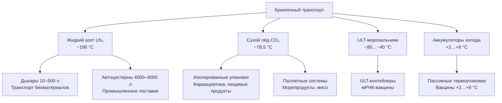

## Обзор

Системы криогенного транспорта поддерживают температуры ниже −101 °C для грузов, требующих ультранизкотемпературного консервирования: биологических материалов, вакцин (включая мРНК-препараты при −70 °C и ниже), клеточных терапий, научных образцов и криогенно законсервированных тканей. В качестве хладагентов используются жидкий азот (LN₂, −196 °C), твёрдый диоксид углерода — сухой лёд (−78,5 °C) или механические ультранизкотемпературные морозильники (ULT freezers).

В отличие от паровых компрессионных систем, криогенный транспорт не использует механическую рефрижерацию в процессе транспортировки: охлаждение обеспечивается за счёт испарения криогена (жидкий азот) или сублимации (сухой лёд), что исключает электромеханические отказы, но требует точного расчёта запаса хладагента и строгого соблюдения норм безопасности.

---

## Системы транспорта на жидком азоте

### Конструкция Дьюаров и криогенных контейнеров

Транспортные Дьюары (Dewar vessels) — вакуумно-изолированные контейнеры с двустенной конструкцией: внутренний и внешний сосуды разделены вакуумным межстенным пространством (residual pressure 0,01–1 Па). Многослойная изоляция (Multi-Layer Insulation, MLI) состоит из чередующихся слоёв алюминиевой фольги и низкотеплопроводящих прокладок (нетканые материалы); минимизирует лучистый теплообмен.

Скорость испарения (Boil-Off Rate, BOR) для транспортных Дьюаров: 1,5 % объёма/сут в статических условиях; при активной транспортировке (вибрация) BOR возрастает до 3–5 %.

### Расчёт времени удержания температуры


t_{\text{уд}} = \frac{m_{\text{LN}_2} \cdot h_{fg}}{Q_{\text{total}}}


где:
- $t_{\text{уд}}$ — время удержания температуры, ч;
- $m_{\text{LN}_2}$ — масса жидкого азота, кг;
- $h_{fg}$ — скрытая теплота парообразования LN₂ = 199 кДж/кг при 77 K;
- $Q_{\text{total}}$ — суммарный тепловой поток, кВт.

**Пример (SI).** Дьюар 100 л, заряд 80 л LN₂ (плотность 806 кг/м³, масса 64,5 кг), тепловой поток $Q = 3$ Вт = 0,003 кВт:


t_{\text{уд}} = \frac{64{,}5 \times 199}{0{,}003 \times 3600} \approx 1185 \text{ ч} \approx 49 \text{ сут}


Практическое время удержания составляет 60–75 % от теоретического из-за потерь в свободном объёме и открытий крышки — около 30–37 сут для данного примера.

### Активные системы распределения LN₂

Распылительные коллекторы (spray manifolds) равномерно распределяют азотный пар по объёму груза на основе обратной связи от датчиков температуры. Точность управления: ±3 °C при надлежащем размещении датчиков и плавной модуляции потока через электромагнитные клапаны.

---

## Системы транспорта сухого льда

### Физика сублимации

Сухой лёд (твёрдый CO₂) сублимирует при −78,5 °C и атмосферном давлении. Энтальпия сублимации: $h_{\text{sub}} = 571$ кДж/кг. Скорость сублимации прямо пропорциональна тепловому потоку через стенки контейнера:


\dot{m}_{\text{sub}} = \frac{Q}{h_{\text{sub}}} = \frac{U \cdot A \cdot \Delta T}{h_{\text{sub}}}


Для контейнера с PUR-изоляцией 100 мм ($\lambda = 0{,}028$ Вт/(м·K)), $A = 0{,}88$ м², $\Delta T = 100$ K (от −78,5 °C до +21,5 °C):


Q = \frac{0{,}028 \times 0{,}88 \times 100}{0{,}10} \approx 24{,}6 \text{ Вт}



\dot{m}_{\text{sub}} = \frac{24{,}6}{571\,000} \approx 4{,}3 \times 10^{-5} \text{ кг/с} \approx 3{,}7 \text{ кг/сут}


Типовые скорости сублимации в изолированных транспортных упаковках: 0,9–4,5 кг/сут.

### Требования к вентиляции

1 кг сублимированного CO₂ даёт ~509 л газа при 20 °C. Герметичные контейнеры требуют вентиляционных отверстий для сброса давления. Минимальная площадь вентиляции из условия максимальной скорости сублимации:


A_{\text{вент}} = \frac{\dot{m}_{\text{sub}} \cdot R \cdot T}{P \cdot C_d \cdot \sqrt{2 \rho \Delta P}}


где $C_d \approx 0{,}6$ — коэффициент расхода, $\rho$ — плотность газа CO₂, $\Delta P$ — допустимый перепад давления. В практике применяют отверстия диаметром 4–8 мм (4–8 шт.) на контейнер.

Нормативы: 49 CFR 173.217 (DOT США) запрещает герметичное уплотнение упаковок с сухим льдом массой > 200 кг.

---

## Транспорт фармацевтики и вакцин

### Требования по типам препаратов


| Тип продукта | Требуемая температура, °C | Криоагент | Нормативный документ |
|---|---|---|---|
| мРНК-вакцины | −80…−60 | Сухой лёд / ULT | EMA, FDA |
| Традиционные вакцины | +2…+8 | Гелевые аккумуляторы | WHO PQS |
| Клеточные терапии | −196 | LN₂ | ICH Q5C |
| Плазма крови | −25…−18 | Сухой лёд / ULT | Директива 2002/98/EC |
| Контролируемая комнатная T° | +15…+25 | Нет | ICH Q1 |


### Валидация термоупаковки

Квалификация упаковки проводится по ISTA 7D и WHO PQS. Протокол включает:
- летнее тестирование: окружающая среда от +4 до +43 °C;
- зимнее тестирование: от −25 до +20 °C;
- экстремальное тестирование: выход за ожидаемые границы.

Требуется минимум 3 повторных профиля; температура продукта должна оставаться в пределах спецификации в течение заявленного времени плюс 20 % запас прочности.

### Регистрация данных и мониторинг

Калиброванные регистраторы (NIST-traceable, ±0,5 °C) записывают данные с интервалом 1–15 мин. Многоточечные зонды выявляют температурное расслоение (temperature stratification). Беспроводные IoT-системы передают данные в режиме реального времени, обеспечивая упреждающее вмешательство при отклонениях.

---

## Безопасность при криогенном транспорте

### Основные опасности


| Опасность | Механизм | Превентивная мера |
|---|---|---|
| Удушье (асфиксия) | Вытеснение O₂ газообразным N₂ или CO₂ | Вентиляция ≥ 6 ACH; O₂-монитор |
| Криогенные ожоги | Контакт кожи с LN₂ (−196 °C) | Криогенные перчатки, защитный экран |
| Избыточное давление | Расширение газа при нарушении вентиляции | Предохранительные клапаны; открытые упаковки |
| Хрупкость материалов | Переход металлов в хрупкое состояние < −150 °C | Применение 9 % Ni-стали или нержавеющей стали 304L |


Пороги безопасности в грузовых отсеках:
- концентрация CO₂ ≤ 5 000 ppm (0,5 %) по среднесменному значению;
- содержание O₂ ≥ 19,5 % по объёму.

---

## Нормативная база


| Документ | Применение |
|---|---|
| IATA DGR (Dangerous Goods Regulations) | Авиатранспорт криогенных материалов |
| 49 CFR Parts 172–180 (DOT США) | Упаковка, маркировка; UN1977 (LN₂), UN1845 (сухой лёд) |
| ADR 2023 (МАДИ) | Наземный транспорт опасных грузов в Европе |
| ISO 11372:2011 | Криогенные системы и оборудование; безопасность |
| ASHRAE 15-2022 | Нормы безопасности холодильных систем |
| ГОСТ 12.0.003-2015 | Классификация опасностей производственной среды |
| СП 60.13330.2020 | Нормы вентиляции помещений с криогенными веществами |


---

## Архитектура систем криогенного транспорта





---

## Практические рекомендации

1. **Расчёт запаса криоагента:** добавлять 25–50 % к теоретическому расчёту времени удержания с учётом вибрации при транспорте и неизбежных потерь при открытии.

2. **Кондиционирование (pre-conditioning):** для аккумуляторов холода (gel packs) — выдержка при целевой температуре ≥ 24 ч до упаковки.

3. **Процедура открытия Дьюара в замкнутом пространстве:** перед открытием — проверить O₂-монитором уровень кислорода; при < 19,5 % — не входить без СИЗОД.

4. **Маркировка:** UN-номер, класс опасности, масса криоагента и дата упаковки должны быть нанесены несмываемым способом согласно IATA DGR Section 7.

5. **Поверка оборудования:** регистраторы температуры — ежегодно в ISO 17025-аккредитованной лаборатории; O₂-мониторы — каждые 6 мес.
