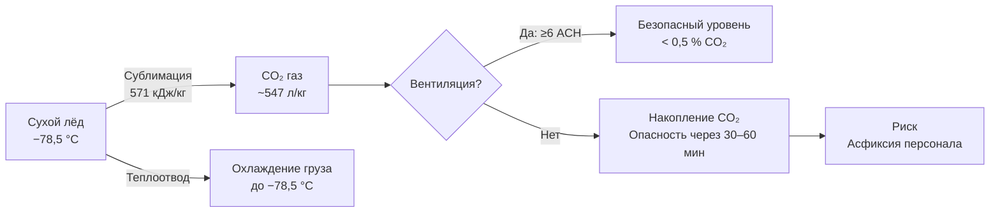

## Обзор

Перевозка сухого льда (твёрдого диоксида углерода, CO₂) — распространённый метод пассивного охлаждения в холодовых цепях фармацевтики, биомедицины и пищевой промышленности. Сухой лёд сублимирует непосредственно из твёрдой фазы в газообразную при −78,5 °C и атмосферном давлении (101,325 кПа), обеспечивая стабильное охлаждение без выделения жидкого конденсата.

Критические особенности эксплуатации: необходимость управления накоплением газообразного CO₂ (риск асфиксии в замкнутых пространствах), потери массы 5–15 % за 24–48 ч в зависимости от изоляции и климата, жёсткие требования IATA DGR и DOT 49 CFR к упаковке, маркировке и перевозке.

---

## Физические свойства и механизм охлаждения

### Фазовая диаграмма CO₂

При атмосферном давлении CO₂ существует только в двух стабильных агрегатных состояниях — твёрдом и газообразном. Тройная точка: 216,6 K (−56,5 °C), 518 кПа. Критическая точка: 304,2 K (+31,1 °C), 7,38 МПа. При $P$ < 518 кПа жидкая фаза CO₂ невозможна, поэтому сухой лёд сублимирует без промежуточного плавления.

Энтальпия сублимации:


h_{\text{sub}} = 571 \text{ кДж/кг}


что значительно превышает теплоту плавления воды (334 кДж/кг), обеспечивая высокую удельную охлаждающую способность.

Из 1 кг сухого льда при сублимации образуется:


V_{\text{CO}_2} = \frac{m_{\text{CO}_2} \cdot R \cdot T}{M \cdot P} = \frac{1 \times 8{,}314 \times 293}{0{,}044 \times 101\,325} \approx 0{,}547 \text{ м}^3 = 547 \text{ л (при 20 °C)}


### Скорость сублимации

Скорость потери массы определяется тепловым потоком через стенки контейнера:


\dot{m}_{\text{sub}} = \frac{Q}{h_{\text{sub}}} = \frac{U \cdot A \cdot \Delta T}{h_{\text{sub}}}


Плотность твёрдого CO₂: $\rho = 1\,562$ кг/м³. Удельная теплоёмкость газообразного CO₂ при $P = \text{const}$: $c_p = 0{,}846$ кДж/(кг·K).

---

## Конструкция изолированных контейнеров

### Изоляционные материалы


| Материал | λ, Вт/(м·K) | Толщина стенки | Применение |
|---|---|---|---|
| EPS (пенополистирол) | 0,035–0,040 | 25–100 мм | Одноразовые упаковки |
| PUR (пенополиуретан) | 0,025–0,030 | 25–75 мм | Многоразовые контейнеры |
| PIR (полиизоцианурат) | 0,022–0,027 | 25–50 мм | Авиаперевозки |
| Минеральная вата | 0,045–0,055 | 50–100 мм | Редко; гигроскопична |


Конструкция типового контейнера: двустенная коробка с полостью PUR или EPS; внутренняя поверхность — полиэтиленовый барьер или алюминиевая фольга для разделения груза и сухого льда.

---

## Расчёт требуемого количества сухого льда

### Методика расчёта


m_{\text{CO}_2} = \frac{Q \cdot t}{h_{\text{sub}}}


где $Q$ — тепловой поток, Вт; $t$ — длительность доставки, с; $h_{\text{sub}} = 571\,000$ Дж/кг.

Тепловой поток через стенки:


Q = U \cdot A \cdot \Delta T_{\text{ln}}


**Пример (SI).** Контейнер 60×40×40 см ($A \approx 0{,}88$ м²), PUR-изоляция 50 мм ($\lambda = 0{,}028$ Вт/(м·K), $U = \lambda / d = 0{,}028 / 0{,}05 = 0{,}56$ Вт/(м²·K)), $T_{\text{окр}} = +25$ °C, $T_{\text{груза}} = -60$ °C [$\Delta T = 85$ K], доставка 48 ч:


Q = 0{,}56 \times 0{,}88 \times 85 \approx 41{,}9 \text{ Вт}



m_{\text{CO}_2} = \frac{41{,}9 \times 48 \times 3\,600}{571\,000} \approx 12{,}7 \text{ кг}


С резервом 25 %: $m_{\text{CO}_2} \approx 15{,}9 \text{ кг}$ — округляем до 16 кг.

### Эмпирическое соотношение

Для быстрых оценок:


m_{\text{CO}_2} [\text{кг}] = \frac{t_{\text{транзит}} [\text{ч}]}{24} \times \dot{m}_{\text{base}} \times k_{\text{безоп}}


где $\dot{m}_{\text{base}}$ — базовая скорость сублимации (кг/сут) по характеристике конкретного контейнера; $k_{\text{безоп}} = 1{,}5$–$2{,}5$ в зависимости от климата и класса груза.

---

## Накопление CO₂ и требования к вентиляции

ПДК CO₂ в рабочей зоне: 5 000 мг/м³ (ГОСТ 12.1.005-88) — 0,5 % по объёму. Концентрация выше 4 % вызывает гиперкапнию; выше 10 % — потерю сознания.

**Расчёт нарастания концентрации CO₂ в закрытом фургоне (SI):**

Фургон объёмом 50 м³, 20 кг сухого льда, скорость сублимации $\dot{m} = 0{,}5$ кг/ч:


\dot{V}_{\text{CO}_2} = 0{,}5 \times 547 \text{ л/кг} = 273{,}5 \text{ л/ч} = 0{,}2735 \text{ м}^3/\text{ч}



\Delta c_{\text{CO}_2} = \frac{0{,}2735}{50} \approx 0{,}547 \text{ %/ч}


За 1 ч концентрация превысит ПДК (0,5 %) при отсутствии вентиляции. Допускаемое пребывание персонала без дыхательного аппарата при такой скорости нарастания — не более 30–40 мин.

### Требования к вентиляции

- фургоны с сухим льдом: кратность воздухообмена ≥ 6–12 ч⁻¹ (механическая вытяжка);
- перед вскрытием кузова — проветривание в течение 5 мин при открытых дверях;
- при хранении > 4 ч: непрерывный контроль CO₂-анализатором;
- обучение персонала: признаки гиперкапнии — головная боль, учащённое дыхание, головокружение.

---

## Упаковка, маркировка и нормативные требования

### Классификация по IATA DGR и DOT 49 CFR


| Параметр | IATA DGR (авиа) | DOT 49 CFR (авто/ж/д США) | ADR 2023 (Европа) |
|---|---|---|---|
| UN-номер | UN 1845 | UN 1845 | UN 1845 |
| Класс опасности | 9 (прочие опасные) | 9 (прочие опасные) | 9 (прочие опасные) |
| Вентиляция упаковки | Обязательна | Обязательна | Обязательна |
| Макс. масса на упаковку (авиа) | 200 кг | — | — |
| Маркировка | Ромб класса 9 + «DRY ICE» | Ромб + UN1845 | Ромб + UN1845 |


### Конструкция упаковки

- изолированный контейнер EPS или PUR, стенки ≥ 25 мм;
- перфорационные отверстия диаметром 4–8 мм (4–8 шт.) на стенках и крышке — предотвращают давление CO₂;
- внутренняя полиэтиленовая вкладка для разделения сухого льда и груза;
- наружная картонная коробка с дополнительной маркировкой.

### Маркировка

Контейнеры с сухим льдом должны иметь:
- ромб опасного груза (250×250 мм): «CLASS 9», изображение снежинки и волн;
- этикетку «DRY ICE» / «ТВЁРДЫЙ CO₂» с указанием массы в кг;
- предупреждение на русском языке: «Опасность удушья в замкнутом пространстве. Избегать контакта с незащищённой кожей. Использовать только в хорошо вентилируемых помещениях»;
- дату упаковки и прогнозируемый срок исчерпания сухого льда.

---

## Применение в холодовых цепях

### Фармацевтика

- мРНК-вакцины (−70 °C): требуют сухого льда + ULT-упаковки; EU GDP Annex и ВОЗ требуют валидированных термоупаковок;
- традиционные вакцины и биологические препараты при −20 °C: сухой лёд в стандартных изотермических контейнерах;
- биообразцы (кровь, ткани, ДНК): при −20…−80 °C.

### Пищевая промышленность

- морепродукты, мясо, мороженое: сухой лёд обеспечивает температуры ниже −18 °C без риска разморозки;
- кулинарные блюда быстрой заморозки: первичное замораживание в CO₂-туннелях.

### Наука и исследования

- экстракция и транспортировка биологических образцов;
- реакции, требующие ультрабыстрого замораживания (quench cooling).

---

## Нормативная база


| Документ | Содержание |
|---|---|
| IATA DGR (ежегодное издание) | Авиатранспорт; UN1845; требования к упаковке и маркировке |
| DOT 49 CFR Part 172–180 | Наземный транспорт в США; упаковка, маркировка, документация |
| ADR 2023, Class 9 | Европейское соглашение о перевозке опасных грузов автомобильным транспортом |
| ГОСТ 12.1.005-88 ССБТ | ПДК вредных веществ в воздухе рабочей зоны; CO₂ — 5 000 мг/м³ |
| СП 60.13330.2020 | Нормы вентиляции помещений и транспортных средств |
| ASHRAE Handbook — Refrigeration (2022), гл. 47 | Холодильные системы с хладагентами и криогенными веществами |
| EU GDP Annex (EudraLex Vol. 4) | Надлежащая дистрибьюторская практика фармацевтических препаратов |


---

## Схема воздушного контура при перевозке сухого льда





---

## Практические рекомендации

1. **Выбор толщины изоляции:** для рейсов > 48 ч — PUR 50–75 мм ($\lambda \approx 0{,}028$ Вт/(м·K)); для < 24 ч допустимо EPS 50 мм.

2. **Резерв сухого льда:** +25–30 % к теоретическому расчёту (неопределённость климатических условий, потери при открытии, неравномерность укладки).

3. **Схема укладки:** нижняя или «бутербродная» (сухой лёд снизу и сверху груза) — равномерное температурное поле; избегать прямого контакта сухого льда с замораживаемым (не замораживаемым) грузом.

4. **Контроль вентиляции в складе:** при хранении > 50 кг сухого льда в помещении площадью 100 м² — механическая вытяжка с кратностью ≥ 10 ч⁻¹ (СП 60.13330.2020).

5. **СИЗ:** криогенные перчатки (кожаные, не синтетические), защитные очки, при работе в закрытом помещении — СИЗОД при концентрации CO₂ > 0,5 %.

6. **Мониторинг остатка:** фиксировать начальную массу сухого льда и дату упаковки; при получении груза проверять остаток и состояние вентиляционных отверстий упаковки.

7. **Хранение до отправки:** специализированные изолированные контейнеры в вентилируемом помещении; избегать запечатывания более чем на 2–3 ч.
