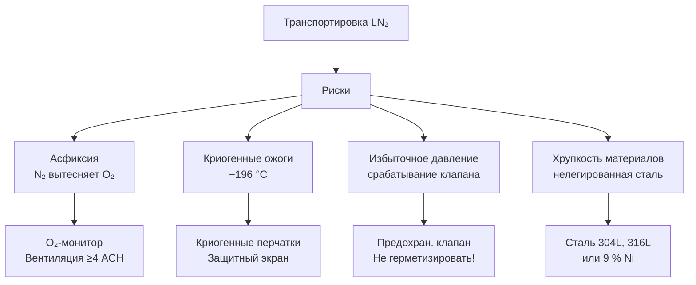

## Обзор

Транспортировка жидкого азота (Liquid Nitrogen, LN₂) — базовая операция криогенного снабжения в медицине, биомедицинских исследованиях, электронной промышленности, металлургии и пищевой промышленности. LN₂ кипит при 77,36 K (−195,8 °C) и атмосферном давлении, что требует специализированных вакуумно-изолированных сосудов для минимизации тепловых потерь (boil-off). Проектирование таких систем регламентируется ASHRAE 41.7, ISO 21903, EN 286-1 и EN 13341, а безопасность — ГОСТ Р 52856, СП 60.13330.2020 и ГОСТ 10696.

Эффективность транспорта LN₂ определяется тремя факторами: качеством вакуума в межстенном пространстве, типом изоляции (MLI или перлит) и правильной калибровкой предохранительных систем.

---

## Физические принципы

### Теплоперенос и скорость испарения

Суммарный тепловой поток к жидкому азоту включает вклады кондукции, конвекции и лучистого теплообмена. В хорошо вакуумированных системах доминирует лучистый перенос. Скорость испарения (Boil-Off Rate, BOR):


\dot{m}_{\text{evap}} = \frac{Q_{\text{total}}}{L_v}


где $Q_{\text{total}}$ — суммарный тепловой поток, Вт; $L_v = 199$ кДж/кг — теплота парообразования LN₂ при 77 K.

Тепловой поток через вакуумную изоляцию:


Q = U_{\text{eff}} \cdot A \cdot \Delta T


где $U_{\text{eff}}$ — эффективный коэффициент теплопередачи вакуумной изоляции, 0,5–2,0 Вт/(м²·K); $A$ — площадь внешней поверхности сосуда, м²; $\Delta T = T_{\text{окр}} - T_{\text{LN}_2} = 293 - 77 = 216$ K.

**Пример (SI).** Дьюар объёмом 160 л, $A \approx 4$ м², $U_{\text{eff}} = 1{,}0$ Вт/(м²·K):


Q = 1{,}0 \times 4 \times 216 = 864 \text{ Вт}
\quad\Rightarrow\quad
\dot{m}_{\text{evap}} = \frac{0{,}864}{199} \approx 4{,}3 \times 10^{-3} \text{ кг/с} \approx 372 \text{ г/ч} \approx 0{,}46 \text{ л/ч}


Это соответствует BOR ≈ 11 л/сут — реальное значение для Дьюара без MLI. С MLI (150 слоёв): $U_{\text{eff}} \approx 0{,}05$–$0{,}10$ Вт/(м²·K), BOR ≈ 0,5–1,0 л/сут.

### Давление насыщения и предохранительные системы

LN₂ при 77,36 K кипит при давлении 101,3 кПа. При герметизации сосуда без вентиляции давление нарастает экспоненциально согласно уравнению Клаузиуса–Клапейрона:


\frac{dP}{dT} = \frac{L_v \cdot P}{R_{\text{уд}} \cdot T^2}


где $R_{\text{уд}} = 0{,}297$ кДж/(кг·K) — удельная газовая постоянная азота. Предохранительные клапаны настраиваются на 110–130 кПа избыточного давления.

---

## Конструкция вакуумно-изолированных сосудов

### Типоразмеры Дьюаров для LN₂


| Объём, л | Масса порожнего, кг | BOR, л/сут (MLI) | P_макс, кПа | Применение |
|---|---|---|---|---|
| 10 | 2,5 | 0,05–0,10 | 110 | Лабораторный; криотерапия |
| 50 | 8 | 0,15–0,25 | 110 | Биохранилища; транспорт образцов |
| 160 | 18 | 0,40–0,60 | 110 | Промышленный транспорт |
| 500 | 45 | 1,0–1,5 | 120 | Производственные поставки |
| 4 000–9 000 | 1 500–4 000 | 10–30 | 150 | Автоцистерна |


Конструкция двустенного сосуда:
- **Внутренний резервуар:** нержавеющая сталь 304L или 316L (ASTM A312); рабочее давление до 1,6 МПа;
- **Вакуумный межстенный зазор:** давление 0,01–1 Па; геттерный сорбент для удержания остаточных газов;
- **Внешний корпус:** нержавеющая или углеродистая сталь.

---

## Изоляционные системы

### Многослойная изоляция (Multi-Layer Insulation, MLI)

MLI — чередующиеся слои алюминиевой фольги (10–50 мкм, степень черноты $\varepsilon \approx 0{,}02$–$0{,}04$) и разделителей из нетканого полиэстера или фибергласа. Эффективный коэффициент теплопередачи:


U_{\text{MLI}} = \frac{\varepsilon \cdot \sigma \cdot (T_{\text{out}}^2 + T_{\text{in}}^2)(T_{\text{out}} + T_{\text{in}})}{N}


где $\sigma = 5{,}67 \times 10^{-8}$ Вт/(м²·K⁴); $N$ — число слоёв (100–200 для транспортных сосудов).

При $N = 150$, $T_{\text{out}} = 293$ K, $T_{\text{in}} = 77$ K:


U_{\text{MLI}} \approx \frac{0{,}03 \times 5{,}67 \times 10^{-8} \times (293^2 + 77^2)(293 + 77)}{150} \approx 0{,}07 \text{ Вт/(м}^2\text{·K)}


что в 15–30 раз лучше перлитовой изоляции.

### Перлитовая изоляция

Вспученный перлит ($\rho = 50$–$150$ кг/м³, $\lambda = 0{,}03$–$0{,}08$ Вт/(м·K) при 77 K):


U_{\text{perlit}} = \frac{\lambda}{d}


При $\lambda = 0{,}06$ Вт/(м·K) и $d = 0{,}08$ м: $U \approx 0{,}75$ Вт/(м²·K). Перлит применяется в сосудах большого объёма (автоцистерны), где стоимость MLI неоправдана.

---

## Предохранительные системы

### Предохранительные клапаны (Relief Valves)

- Тип: пружинные, полностью герметичные (full-lift safety valves);
- Нормирование: ASME PG-58.1 (США); EN 286-1 (ЕС); ГОСТ Р 52857 (РФ);
- Давление открытия: 110–130 кПа (для транспортных Дьюаров) или 150–1 700 кПа (для автоцистерн);
- Пропускная способность: 40–500+ м³/ч.

### Разрывные мембраны (Burst Discs)

Устанавливаются перед предохранительным клапаном:
- давление разрыва: 150–160 кПа;
- функция: защита основного клапана от коррозии и засорения льдом;
- обязательная замена после срабатывания.

---

## Расчёт времени выдержки

Время, за которое давление в герметичном сосуде достигает уставки срабатывания клапана:


t_h = \frac{V_{\text{пар}} \cdot \Delta P \cdot \rho_{\text{нас}}}{Q_{\text{total}}}


где $V_{\text{пар}}$ — объём паровой фазы, м³; $\Delta P$ — допустимый прирост давления (от начального до открытия клапана), Па; $\rho_{\text{нас}}$ — плотность насыщенного пара при начальных условиях, кг/м³.

**Пример (SI).** Дьюар 160 л, начальное давление 101,3 кПа, уставка клапана 110 кПа ($\Delta P = 8\,700$ Па), объём паровой фазы 20 л = 0,020 м³, $\rho_{\text{нас}} \approx 4{,}6$ кг/м³, $Q_{\text{total}} = 300$ Вт:


t_h = \frac{0{,}020 \times 8\,700 \times 4{,}6}{300} \approx 2{,}7 \text{ ч}


При закрытии клапана вентиляции — предохранительный клапан откроется через ~3 ч. Для транспортных операций это достаточно; для длительного хранения рекомендуется постоянно приоткрытый вентиляционный клапан.

---

## Автоцистерны для LN₂

Автоцистерны вместимостью 4 000–9 000 л оснащаются:
- MLI (100–150 слоёв) + перлит в межстенном пространстве;
- вакуумными интерфейсами для загрузки/выгрузки (dry-break couplings);
- насосами низкого давления (центробежного типа, погружной вариант);
- измерителями уровня (дифференциальный манометр) и давления;
- системами безопасности: предохранительные клапаны + разрывные мембраны + обратные клапаны.

BOR автоцистерны: 0,5–1,5 % объёма/сут (2–10 л/сут). Транспорт на 500 км (10 ч) при BOR 0,5 л/ч: потери ≈ 5–8 л.

---

## Применение LN₂ в системах ОВК и холодоснабжения


| Применение | Объём Дьюара | BOR норматив | Особенности |
|---|---|---|---|
| Криохранилища биоматериалов | 10–50 л | < 0,2 л/сут | Сосуды серии CX, заправка раз в 7–14 сут |
| Охлаждение электроники | 10–100 л | < 0,5 л/сут | Закрытые системы; точный контроль давления |
| Холодильные камеры (пищепром) | Автоцистерна | < 1 %/сут | Открытые системы; обязательна вентиляция |
| Криотерапия (медицина) | 1–5 л | — | Ручные пульверизаторы; BOR 0,2–0,5 л/ч |
| Хладагент в суперпроводниках | 50–500 л | < 0,1 л/сут | Специальные системы с рекуперацией |


---

## Безопасность при работе с LN₂





### Требования по охране труда

- кратность воздухообмена в помещении с LN₂: ≥ 4 ч⁻¹ для исключения гипоксии (O₂ < 19,5 %);
- вытяжка располагается на высоте ≥ 1,5 м: азотный газ тяжелее воздуха ($\rho_{\text{N}_2} = 1{,}17$ кг/м³ при 20 °C vs $\rho_{\text{воздух}} = 1{,}20$ кг/м³) — скапливается в приземном слое;
- при транспортировке в закрытых грузовых отсеках — O₂-монитор с сигнализацией при O₂ < 19,5 %;
- температура кожи при кратком контакте с LN₂ снижается до −60…−100 °C за 1–3 с; холодный ожог III степени за < 5 с.

---

## Нормативная база


| Документ | Содержание |
|---|---|
| ASHRAE 41.7-2006 | Методика измерения BOR криогенных сосудов |
| ISO 21903:2020 | Вакуумно-изолированные криогенные сосуды; требования и испытания |
| EN 286-1:2015 | Простые сосуды под давлением — сосуды для воздуха и азота |
| EN 13341:2016 | Криогенные сварные сосуды; конструкция и испытания |
| ASME PG-58.1 | Проектирование и испытание криогенного оборудования (США) |
| ГОСТ Р 52856-2007 | Сосуды криогенные стационарные; общие технические требования |
| ГОСТ 10696-2014 | Азот жидкий технический; технические условия |
| СП 60.13330.2020 | Нормы вентиляции помещений с криогенными веществами |
| IATA DGR Class 2.2 | Авиатранспорт невоспламеняющихся сжатых газов; UN1977 |
| ADR 2023 | Наземный транспорт класса 2 (сжатые и сжиженные газы) |


---

## Типовые физические параметры LN₂


| Параметр | Значение | Единица |
|---|---|---|
| Температура кипения | 77,36 (−195,8 °C) | K |
| Плотность жидкой фазы | 806 | кг/м³ |
| Теплота парообразования | 199 | кДж/кг |
| Удельная теплоёмкость жидкой фазы | 2,04 | кДж/(кг·K) |
| Динамическая вязкость | 0,16 × 10⁻³ | Па·с |
| Поверхностное натяжение | 8,85 × 10⁻³ | Н/м |
| Скорость звука в жидкости | 850 | м/с |
| Коэффициент объёмного расширения | 1,88 × 10⁻³ | K⁻¹ |


---

## Практические рекомендации

1. **Качество вакуума:** поддерживать давление в межстенном пространстве ≤ 0,1 Па; проверять каждые 2–3 года методом остаточного давления или масс-спектрометрии.

2. **Предотвращение переохлаждения при загрузке:** при быстрой подаче LN₂ в тёплый сосуд возникает интенсивное плёночное кипение (Leidenfrost effect) с резким скачком давления на 10–20 кПа — выполнять прекуль (pre-cool) плавной подачей.

3. **Расположение вытяжки:** локальная вытяжка от поверхности пола (≤ 30 см) для удаления скапливающегося холодного азота; не использовать только потолочный воздухообмен.

4. **Маркировка и документация:** сосуд должен иметь паспорт с датой последнего испытания, рабочим давлением, объёмом и аттестацией по EN 286-1 или ГОСТ Р 52856.

5. **Типичные ошибки:**
   - **Недооценка BOR при транспорте:** расчёт без учёта динамики (качки, вибрации) приводит к переполнению и срабатыванию клапанов; закладывать запас +30 %.
   - **Неверное расположение вытяжки:** вытяжка на уровне потолка не удаляет тяжёлый холодный азот; требуется нижнее расположение или комбинированная система.
   - **Игнорирование переходных режимов:** при быстрой загрузке холодного LN₂ в тёплый сосуд давление скачкообразно возрастает на 10–20 кПа — предохранительный клапан должен быть настроен с соответствующим запасом.

**Итог.** Надёжный транспорт LN₂ достигается комбинацией высококачественной MLI/вакуумной изоляции, многоуровневой системы предохранительных клапанов и строгой операционной дисциплины. Соблюдение указанных параметров позволяет снизить BOR до 0,3–0,6 л/сут на Дьюар объёмом 160 л, обеспечивая как экономическую эффективность, так и безопасность персонала.
