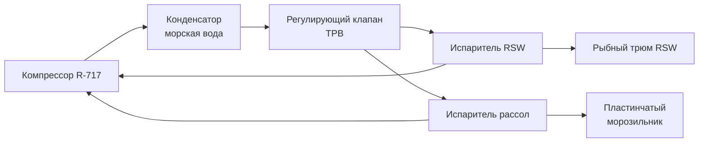

Рефрижерация рыболовных судов — совокупность технических решений для консервации улова путём охлаждения и замораживания в условиях открытого моря. Система должна обеспечивать быстрое снижение температуры рыбы с момента подъёма улова до температуры хранения: −1...0 °C для свежей рыбы (RSW-режим) или −18...−25 °C для замороженной продукции. Потери от порчи при отсутствии или неправильной работе рефрижерации достигают 20–30 % улова. На промысловых судах длиной более 24 м применяются активные механические системы с аммиаком (R-717), CO₂ или галогенуглеводородами; на малых судах — пассивные системы со льдом и рассолом.

## Физические основы охлаждения рыбы

Охлаждение рыбы основано на отводе тепла тремя методами:
- **Испарение хладагента** в испарителях при давлении 200–350 кПа (для аммиака), температуре кипения −20...−30 °C;
- **Теплообмен** между охлаждённым рассолом или льдом и рыбой через стенки контейнеров;
- **Отвод тепла** в морскую воду через конденсатор при температуре морской воды 5–25 °C.

Холодопроизводительность рефрижерационного контура:


Q_0 = \dot{G}_{\text{хл}} \cdot (h_1 - h_2)


где $Q_0$ — холодопроизводительность, кВт; $\dot{G}_{\text{хл}}$ — массовый расход хладагента, кг/с; $h_1$, $h_2$ — удельные энтальпии на входе и выходе испарителя, кДж/кг.

Суточная потребность в холоде для замораживания улова:


Q_{\text{сут}} = m_{\text{рыбы}} \cdot c_p \cdot (T_{\text{нач}} - T_{\text{кон}}) + Q_{\text{потерь}}


где $m_{\text{рыбы}}$ — суточный улов, кг; $c_p \approx 3{,}5$ кДж/(кг·°C); $T_{\text{нач}} \approx +3$ °C; $T_{\text{кон}} = -18$ °C; $Q_{\text{потерь}}$ — теплопритоки через стенки трюма и биологическое тепловыделение (5–10 % от $Q_{\text{сут}}$).

**Пример:** Суточный улов 60 т, $\Delta T = 21$ °C:


Q_{\text{сут}} = 60\,000 \cdot 3{,}5 \cdot 21 = 4{,}41\;\text{ГДж/сут} \approx 184\;\text{кВт} \cdot \text{ч}


При работе системы 18 ч/сут: $Q_0 = 184/18 = 10{,}2$ кВт. Это минимальная холодопроизводительность без учёта запаса и тепловых потерь; расчётная мощность с коэффициентом 1,25 составит около 13 кВт.

## Системы охлаждённой морской воды RSW

Система RSW (Refrigerated Sea Water) циркулирует морскую воду, охлаждённую до −1...+2 °C, через изолированные рыбные трюмы. Пластинчатый или кожухотрубный теплообменник охлаждает воду с помощью аммиачного контура или хладагента R-404A.

**Преимущества RSW:** быстрое охлаждение за 4–8 часов, минимальные механические повреждения рыбы, сохранение органолептических свойств, простота обслуживания. Расход морской воды: 5–20 м³/ч на 100 т улова в сутки.

Требования к холодопроизводительности системы RSW:


Q_{\text{RSW}} = \frac{m_{\text{рыбы}} \cdot c_p \cdot \Delta T}{t_{\text{охл}}} + Q_{\text{дыхания}}


где $Q_{\text{дыхания}} \approx 930...1400$ кДж/(т·сут) — биологическое тепловыделение в зависимости от вида рыбы.

## Ледяная каша (ice slurry)

Смесь воды, льда (40–60 %) и криопротектора (хлорид натрия или кальция) со средней плотностью 920–950 кг/м³ и температурой −5...−8 °C наносится непосредственно на рыбу в контейнерах. Лучший контактный теплообмен по сравнению с твёрдым льдом обеспечивает более быстрое охлаждение. Бортовой ледогенератор производительностью 2–10 т/сут встраивается в охлаждаемый трюм или надстройку.

## Пластинчатые морозильники

Горизонтальные и вертикальные пластинчатые морозильники (plate freezers) с двумя стальными пластинами, между которыми циркулирует аммиак или рассол, обеспечивают прямое контактное замораживание. Рыба или филе укладываются в полиэтиленовые пакеты между пластинами.

**Основные характеристики:**
- Температура хладагента между пластинами: −30...−35 °C;
- Время заморозки слоя толщиной 25 мм: 20–40 минут при $\Delta T = 30...35$ °C;
- Холодопроизводительность одного аппарата: 50–5000 кВт;
- Применение: суда среднего и крупного тоннажа (более 40 м).

## Аммиачные системы R-717

Аммиачные системы наиболее эффективны для крупных промысловых судов с холодопроизводительностью 1000–10 000 кВт. R-717 (аммиак): GWP = 0, ODP = 0, высокая удельная холодопроизводительность. Требует замкнутых герметичных контуров, аварийной вентиляции и специальной подготовки персонала (допуск по ГОСТ 12.3.019).


| Параметр | Значение |
|---|---|
| Давление конденсации | 1,2–1,5 МПа |
| Давление кипения (испаритель) | 150–300 кПа |
| Температура кипения | −20...−30 °C |
| Объёмная производительность компрессора | 50–500 м³/ч |
| Холодопроизводительность (крупные суда) | 1000–10 000 кВт |


## Отвод тепла в морскую воду

Конденсатор охлаждается забортной водой через кингстоны в корпусе судна. Расход охлаждающей воды: 30–50 м³/ч на 1 МВт холодопроизводительности при перепаде температур $\Delta T = 3...5$ °C. Медно-никелевые трубки (CuNi 90/10) или катодная защита предотвращают биологическое обрастание, способное снизить КПД на 10–20 %.

## Системы рассольного охлаждения

Вторичный хладоноситель — спиртовой или гликолевый рассол с температурой замерзания −20...−25 °C — циркулирует в замкнутом контуре при скорости 1,5–2,5 м/с и давлении 300–800 кПа. Рассол используется для охлаждения трюмов и подачи холода к пластинчатым морозильникам, исключая прямой контакт аммиака с рыбопродукцией. Концентрация раствора: 20–30 % по массе.

## Типология судов по мощности рефрижерации


| Класс судна | Длина | Тип системы | Холодопроизводительность |
|---|---|---|---|
| Малые суда | < 24 м | Пассивный лёд (2–5 т на 10 т улова) | Нет механической рефрижерации |
| Суда среднего тоннажа | 24–40 м | RSW + ледяная каша, R-134a или R-404A | 50–200 кВт |
| Крупные промысловые суда | > 40 м | Аммиак (R-717), каскадные схемы | 500–3000 кВт |


В тропических водах ($T_{\text{МВ}} = 25...30$ °C) мощность конденсатора требуется увеличить на 30–50 % относительно расчётной при умеренном климате.

## Диаграмма принципиальной схемы





## Типовые параметры и нормативы


| Параметр | Типовой диапазон | Норматив |
|---|---|---|
| Температура хранения мороженой рыбы | −18...−20 °C | ISO 8862 |
| Время охлаждения в системе RSW | 4–8 ч | — |
| Время заморозки в пластинчатом аппарате (25–40 мм) | 20–45 мин | — |
| Холодопроизводительность на 1 т суточного улова | 10–15 кВт | Расчётная норма |
| Расход морской воды на конденсаторе | 30–50 м³/(ч·МВт) | При ΔT = 4 °C |
| COP системы | 2,5–4,5 | Зависит от режима |


## Стандарты и нормативная база

- **ASHRAE 15 / ASHRAE 34** — безопасность холодильных систем, требования к герметизации аммиачных контуров, классификация хладагентов;
- **ASHRAE Handbook Refrigeration** — методики расчёта для морских применений, RSW-системы, пластинчатые морозильники;
- **ISO 8862:2016** — холодильные системы на судах, параметры и испытания;
- **ISO 5149** — системы охлаждения, требования безопасности;
- **EN 378** — безопасность и экологические требования к холодильным системам;
- **SOLAS** — требования к безопасности, герметичности и аварийной вентиляции аммиачных систем;
- **ГОСТ 12.3.019-83** — допуск и требования к специалистам по холодильным установкам с аммиаком;
- **ГОСТ 28547** — рефрижераторные суда; требования к системам охлаждения;
- **СП 60.13330** — расчётные методы вентиляции и охлаждения (применяется при проектировании судовых систем);
- **IMO MARPOL Приложение VI** — нормы выбросов для вспомогательных двигателей (встроенные генераторы контейнеров).

## Типовые ошибки проектирования

1. **Недооценка потерь через стенки трюма** — при $U > 0{,}3$ Вт/(м²·К) система работает на предельной нагрузке без резерва.
2. **Игнорирование влияния качки** — при крене более 10° циркуляция рассола ухудшается, возможно нарушение возврата масла в аммиачных системах.
3. **Применение пресной воды вместо морской в конденсаторе** — накипь снижает КПД на 20–30 % уже через месяц эксплуатации.
4. **Единственный компрессорный агрегат без резерва** — отказ в море приводит к полной потере улова; SOLAS требует резервирования критических компонентов.

Системы рефрижерации промысловых судов должны иметь дублирование критических компонентов (два компрессора, два контура охлаждения), автоматику аварийного отключения и регулярную сертификацию по требованиям SOLAS и классификационных обществ.
