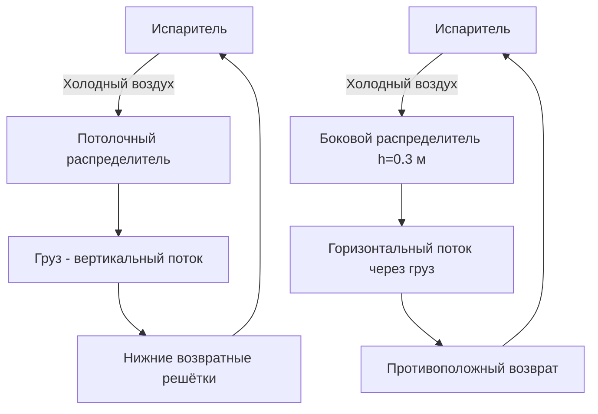

Температурная стратификация в грузовых трюмах рефрижераторных судов — явление, при котором в вертикальном направлении формируются зоны с различными температурами: тёплый воздух скапливается у подволока, холодный — у настила. Это приводит к локальному перегреву грузов в верхних ярусах и рискам переохлаждения в нижних. Для скоропортящихся грузов (рыба, мясо, фрукты), требующих допуска ±0,5...±1,0 °C по нормам SOLAS и FTP Code, устойчивая стратификация недопустима. Цель проектирования системы воздухораспределения — создание воздушного потока, подавляющего естественную конвекцию и поддерживающего однородность температурного поля с вариацией не более ±0,5 °C между любыми точками отсека.

## Физические механизмы стратификации

Стратификация в закрытом объёме возникает под действием архимедовой силы. Разность давлений между слоями холодного и тёплого воздуха:


\Delta P_{\text{Архимед}} = (\rho_{\text{хол}} - \rho_{\text{тёп}}) \cdot g \cdot h


где $\rho$ — плотность воздуха, кг/м³; $h$ — высота слоя, м. При $\Delta T = 10$ °C и $h = 5$ м разность плотностей составляет ~0,04 кг/м³, создавая устойчивый вертикальный градиент без активной циркуляции.

### Критерий стратификации — число Ричардсона


Ri = \frac{g \cdot \beta \cdot \Delta T \cdot h}{V^2}


где $\beta = 1/T_{\text{абс}}$ — коэффициент объёмного расширения воздуха, К⁻¹; $V$ — характерная скорость воздушного потока, м/с.

- При $Ri < 0{,}1$: вынужденная конвекция подавляет стратификацию (хорошее перемешивание);
- При $Ri > 1{,}0$: естественная конвекция доминирует, стратификация устойчива.

### Уравнение теплового баланса отсека


Q_{\text{теп}} = \dot{m}_{\text{воз}} \cdot c_p \cdot (T_{\text{вых}} - T_{\text{вх}})


где $\dot{m}_{\text{воз}}$ — массовый расход воздуха, кг/с; $c_p \approx 1{,}005$ кДж/(кг·К); $Q_{\text{теп}}$ — суммарное тепловыделение в отсеке от стенок и груза, Вт.

## Схемы воздухораспределения

В морских рефрижераторах применяются три основные схемы:





**1. Надпотолочная подача с нижним возвратом (потолок-пол)**
Холодный воздух подаётся через щелевые или перфорированные распределители в потолке со скоростью 0,5–1,0 м/с; возврат — через решётки в нижней части противоположной стены. Обеспечивает минимальное количество застойных зон и глубокое перемешивание. Расход воздуха: 3–6 ч⁻¹.

**2. Боковая подача с противоположным возвратом**
Подача и возврат на противоположных бортах трюма на высоте 0,3–0,5 м от настила. Применяется при сложной геометрии отсека; менее эффективна для больших объёмов.

**3. Комбинированная схема**
Первичная подача в потолок плюс вспомогательные вентиляторы циркуляции внутри отсека и местный возврат в холодильную машину. Используется в крупных контейнеровозах с независимыми трюмами.

## Компоненты системы

### Вентиляторы циркуляции


| Тип вентилятора | Производительность, м³/ч | Давление, Па | Мощность, кВт | Область применения |
|---|---|---|---|---|
| Осевой (пропеллерный) | 5000–15 000 | 20–80 | 1,5–5 | Малые и средние трюмы |
| Центробежный | 3000–10 000 | 100–300 | 3–8 | Трюмы с высоким аэродинамическим сопротивлением |
| Крыльчатый (перемешивающий) | 1000–5000 | 50–150 | 0,5–2 | Микроциркуляция в верхних слоях |


### Воздухораспределители

В потолке трюма устанавливают:
- **Щелевые решётки** (ширина 20–50 мм) с направляющими лопатками, создающими веерный поток;
- **Перфорированный потолок** (диаметр отверстий 8–12 мм, плотность 15–25 отв./100 см²);
- **Сопла Coanda** — для направленной струи вдоль потолочной конструкции с углом 30–45° для максимального перемешивания.

Скорость воздуха на выходе из распределителей: 2–4 м/с; в магистральных воздуховодах: 3–5 м/с; в раздаточных ветвях: 1–2 м/с.

### Система возврата воздуха

Возвратные воздуховоды (диаметр 200–350 мм) устанавливают в нижней части отсека на высоте 0,3–0,5 м от настила по периметру с шагом 2–3 м. Площадь сечения возвратных решёток должна превышать площадь приточных на 30–50 % для поддержания скорости возвратного потока не более 1,5–2,0 м/с и предотвращения подпора. В отсеке размером 10×6×2,5 м (150 м³) устанавливают 4–6 возвратных решёток площадью 0,15–0,25 м² каждая.

### Оптимальные скорости воздуха в отсеке

Рекомендуемый диапазон скоростей в свободном объёме (между поддонами и стенками): **0,3–0,6 м/с**. При скоростях ниже 0,3 м/с недостаточно эффективно разрушаются конвективные ячейки; при скоростях выше 0,8 м/с возникает обезвоживание чувствительного груза и повреждение упаковки. По ASHRAE TC 10.7, рекомендуемое соотношение расходов приток/возврат: 0,95–1,05 для нейтрального давления в отсеке.

## Мониторинг температурной однородности

Необходимое число датчиков для отсека объёмом $V$:


N_{\text{датч}} = \left\lceil \frac{V}{30} \right\rceil


Для отсека 150 м³: $N \geq 5$ датчиков. Расположение:
- **По высоте:** у настила (0,3 м), в середине (1,2–1,5 м), у верхнего яруса груза (2,0–2,2 м);
- **По горизонтали:** у стен, в центре, в углах.

Данные регистрируются с интервалом 5–15 минут. Допустимое отклонение между любыми двумя датчиками: ±0,5 °C для стандартных грузов; ±0,2 °C для особо чувствительных.

### Индекс однородности температурного поля


I_{\text{одн}} = \frac{\sigma_T}{|T_{\text{зад}}|} \times 100\%


где $\sigma_T$ — среднеквадратичное отклонение температуры по точкам измерения, °C; $T_{\text{зад}}$ — заданная температура, °C.

Требование: $I_{\text{одн}} < 0{,}5...1{,}0\%$ (т. е. $\sigma_T < 0{,}05...0{,}1$ °C при $T_{\text{зад}} = -18$ °C).

## Расчёт требуемого расхода воздуха

Минимальный расход воздуха для подавления естественной конвекции:


\dot{V}_{\text{мин}} = k \cdot \sqrt{\frac{\Delta T \cdot g \cdot h}{\Delta T_{\text{доп}}} \cdot S}


где $k \approx 0{,}15...0{,}25$ — эмпирический коэффициент; $\Delta T_{\text{доп}}$ — допустимый градиент температуры, К; $S$ — площадь поперечного сечения отсека, м².

**Пример расчёта:**
- Объём отсека: $V = 120$ м³, высота $h = 2{,}4$ м, сечение $S = 50$ м²
- Допустимый градиент: $\Delta T_{\text{доп}} = 1$ °C
- Разность температур между слоями: $\Delta T = 10$ °C


\dot{V}_{\text{мин}} = 0{,}20 \cdot \sqrt{\frac{10 \cdot 9{,}81 \cdot 2{,}4}{1} \cdot 50} \approx 950\;\text{м}^3/\text{ч}


Практический расход с запасом 1,5–2,0: $\dot{V}_{\text{практ}} = 1500...2000$ м³/ч (6–8 ч⁻¹).

## Тепловой баланс отсека


Q_{\text{холод}} = Q_{\text{теп}} + Q_{\text{дых}} + Q_{\text{загр}}


где $Q_{\text{теп}} = U \cdot A \cdot (T_{\text{окр}} - T_{\text{вн}})$ — теплопередача через ограждающие конструкции; $Q_{\text{дых}}$ — тепловыделение от дыхания груза; $Q_{\text{загр}}$ — технологическая нагрузка при загрузке.

## Требования по типам груза


| Тип груза | Оптимальная температура, °C | Допуск, °C | Критичность стратификации |
|---|---|---|---|
| Мороженая рыба (пелагическая) | −18...−20 | ±1,0 | Средняя |
| Мороженое мясо, субпродукты | −18...−25 | ±0,5 | Высокая |
| Охлаждённое мясо, птица | +2...+4 | ±0,5 | Критическая |
| Тропические фрукты (бананы) | +13...+15 | ±0,5 | Средняя |
| Цитрусовые | +5...+8 | ±1,0 | Низкая |
| Свежие овощи | +2...+4 | ±0,5 | Высокая |


## Типовые расходы воздуха по размерам отсека


| Размер отсека | Расход воздуха, м³/ч | Кратность воздухообмена, ч⁻¹ |
|---|---|---|
| Малые (до 50 м³) | 300–600 | 4–6 |
| Средние (50–200 м³) | 800–2500 | 4–7 |
| Крупные (200–500 м³) | 2500–6000 | 3–5 |


## Типовые ошибки проектирования

- **Недостаточное число датчиков** или их концентрация в центре отсека при отсутствии угловых и пристеночных точек.
- **Завышенная скорость воздуха** (выше 1,0 м/с в свободном объёме), приводящая к усушке груза.
- **Плохая балансировка приточно-вытяжных потоков** — подпор или разрежение нарушают схему циркуляции.
- **Отсутствие резервных вентиляторов** — отказ единственного агрегата при длительном рейсе приводит к необратимой порче груза.
- **Игнорирование дыхания груза** при расчёте холодопроизводительности на рейсах более 10 суток.

## Стандарты и нормативная база

- **SOLAS** — требует поддержания температурной однородности грузовых помещений; регламент испытаний при приёмке;
- **FTP Code (International Code for Application of Fire Test Procedures)** — требования к вентиляции и пожарной безопасности рефрижераторных отсеков;
- **ASHRAE 15 / ASHRAE 34** — безопасность холодильных систем, нормы воздухораспределения;
- **ASHRAE Handbook Refrigeration** — методики расчёта и проектирования морских холодильных установок;
- **ISO 5149** — требования безопасности для холодильных систем судов;
- **ISO 23355:2020** — требования к проектированию и эксплуатации судовых холодильных установок, критерии однородности температуры;
- **EN 378** — безопасность и экологические требования к холодильным системам;
- **СП 60.13330** — расчётные методы отопления, вентиляции и кондиционирования; применяется при проектировании судовых систем;
- **ГОСТ 28547** — рефрижераторные суда; требования к системам охлаждения и мониторинга.
