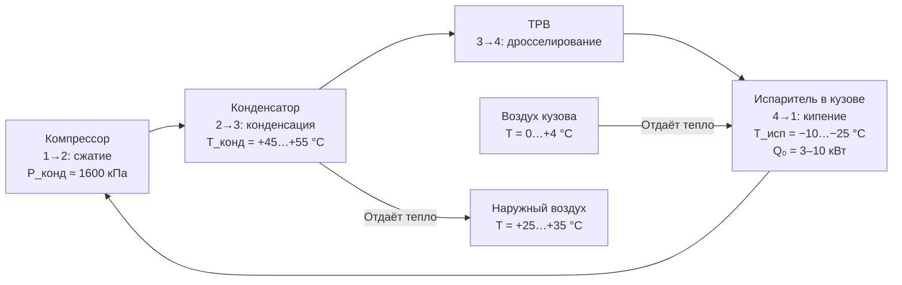

## Обзор

Грузовые автомобили распределительной логистики (distribution trucks, reefer vans) предназначены для перевозки скоропортящихся грузов на коротких и средних маршрутах в городской и пригородной среде. В отличие от магистральных рефрижераторов, распределительные автомобили работают в режиме многостоповой доставки: 8–15 остановок в сутки с открытием дверей при каждой выгрузке, полезный объём кузова 2–15 м³, полная масса до 7,5 т.

Требуемые температурные режимы охватывают широкий спектр: молочная продукция и мясо (0…+4 °C), замороженные товары (−18…−22 °C), фармацевтика (2…+8 °C), шоколад (+15…+20 °C). Высокие амбиентные температуры и частые тепловые возмущения при открытии дверей существенно усложняют поддержание уставки.

Нормативная база: ASHRAE Handbook Refrigeration (2022, гл. 26 «Transport Refrigeration»), Соглашение ATP (Agreement on the International Carriage of Perishable Foodstuffs, 1970), ASHRAE 15-2022 (Safety Standard for Refrigeration Systems), EN 12830:2018 (регистраторы температуры), ГОСТ Р 41.104 (холодильные машины коммерческих ТС, гармонизирован с UN ECE R.104), ГОСТ Р 52249-2009 (холодовая цепь для лекарственных средств), СП 131.13330.2020 (климатология).

---

## Физические принципы теплопередачи

### Тепловой баланс кузова

Суммарная тепловая нагрузка на испаритель складывается из четырёх компонентов:


Q_{\text{итог}} = Q_{\text{огр}} + Q_{\text{инф}} + Q_{\text{груз}} + Q_{\text{вент}}


где:

- $Q_{\text{огр}}$ — теплопередача через ограждающие конструкции (стены, пол, потолок, двери), Вт;
- $Q_{\text{инф}}$ — инфильтрация тёплого воздуха при открытии дверей, Вт;
- $Q_{\text{груз}}$ — теплота охлаждения груза от начальной до целевой температуры, Вт;
- $Q_{\text{вент}}$ — теплота вентиляции и дыхания продукции (актуально для фруктов и овощей), Вт.

Теплопередача через ограждение описывается законом Фурье в стационарном приближении:


Q_{\text{огр}} = U_{\text{ок}} \cdot A_{\text{стен}} \cdot \Delta T


где $U_{\text{ок}}$ — коэффициент теплопередачи ограждения, Вт/(м²·К); $A_{\text{стен}}$ — суммарная площадь стен, пола и потолка, м²; $\Delta T$ — разность температур наружного воздуха и внутреннего объёма, К.

Типовые значения $U_{\text{ок}}$ по классам кузова (ATP):


| Класс ATP | Конструкция изоляции | $U_{\text{ок}}$, Вт/(м²·К) |
|-----------|----------------------|---------------------------|
| Нормально изолированный (IN) | Полиуретан 75–80 мм | 0,30–0,40 |
| Хорошо изолированный (IR) | Полиуретан 90–100 мм | 0,22–0,30 |
| Глубоко изолированный (IIR) | Полиуретан 100–120 мм | 0,15–0,22 |


### Инфильтрация при открытии дверей

При каждом открытии двери в холодный объём проникает тёплый наружный воздух. Объём инфильтрации за одно открытие (t = 30 с, проём 1,4×2,0 м):


V_{\text{инф}} \approx A_{\text{проём}} \cdot v_{\text{поток}} \cdot t_{\text{откр}} / 2


где $v_{\text{поток}}$ — средняя скорость воздушного потока в проёме (0,5–1,5 м/с). На практике принимают $V_{\text{инф}} \approx$ 2–5 м³ за одно открытие. Теплота нагрева этого объёма до температуры кузова:


Q_{\text{инф,разовая}} = \rho_{\text{возд}} \cdot V_{\text{инф}} \cdot c_{p,\text{возд}} \cdot (T_{\text{нар}} - T_{\text{куз}})


где $\rho_{\text{возд}} \approx$ 1,2 кг/м³, $c_{p,\text{возд}} \approx$ 1,005 кДж/(кг·К).

---

## Конструктивные решения

### Компрессорные системы с приводом от ДВС и вспомогательным агрегатом

Классический вариант: компрессор с ремённым приводом от коленчатого вала двигателя грузовика или независимый вспомогательный двигатель (auxiliary power unit, APU) мощностью 3–8 кВт. Хладагент: R-134a (GWP 1430) или R-452A (Opteon XP44, GWP 2140, более высокая объёмная холодопроизводительность при низких температурах).

Холодопроизводительность: 3–10 кВт для автомобилей грузоподъёмностью 1–7 т. Расход топлива на охлаждение: 5–12 л/сутки в режиме городской доставки при $\Delta T \approx$ 40 К.

Недостатки: выбросы CO₂, шум при работе двигателя на стоянках, зависимость производительности от частоты вращения двигателя.

### Электрические рефрижераторы с аккумуляторным питанием

Системы с питанием от бортовой батареи (nominal 48–400 В DC, Li-Ion аккумуляторы 50–200 кВт·ч) обеспечивают нулевые выбросы в зоне доставки. Компрессор с электроприводом: 2–6 кВт, инвертор 3–10 кВА.

Коэффициент преобразования электроэнергии в холод (COP, coefficient of performance):


COP = \frac{Q_0}{P_{\text{эл}}}


Для электромотор-компрессора $COP$ = 3,0–4,5, что существенно выше дизельного варианта ($COP$ = 1,8–2,5). Предварительное охлаждение кузова от сети перед рейсом: 20–45 мин при подключении 230 В.

### Эвтектические пластины и материалы с фазовым переходом (PCM)

Эвтектические пластины (eutectic plates, EP) аккумулируют холод путём кристаллизации раствора при низкой температуре и отдают его при таянии. Состав раствора подбирается под нужную температуру фазового перехода:


| Состав | Температура фазового перехода, °C | Скрытая теплота, кДж/кг |
|--------|----------------------------------|------------------------|
| Вода (чистая) | 0 | 334 |
| NaCl 23 % + H₂O | −21 | 240 |
| CaCl₂ 29 % + H₂O | −55 | 170 |
| Пропиленгликоль 30 % | −13 | 195 |


Пластины размещаются на стенах и потолке кузова. Для рейса 8–10 ч в умеренном климате (+20 °C наружи, −18 °C в кузове) требуются 3–6 пластин массой 20–40 кг каждая. Ограничение: невозможна активная коррекция температуры; применяются как основная система для коротких маршрутов или как резервная в сочетании с компрессорным агрегатом.

### Системы с жидким хладоносителем

Жидкие теплоносители (пропиленгликолевые растворы 20–40 %, CO₂ в жидкой фазе) прокачиваются через пластинчатые теплообменники в кузове. Расход жидкости при заданной нагрузке:


\dot{m} = \frac{Q_0}{c_p \cdot \Delta T_{\text{ж}}}


**Пример расчёта.** Кузов V = 10 м³, $Q_0$ = 4 кВт, жидкость — 30 % пропиленгликоль ($c_p \approx$ 3,7 кДж/(кг·К)), перепад температур $\Delta T_{\text{ж}}$ = 5 К:


\dot{m} = \frac{4000}{3700 \cdot 5} \approx 0{,}216 \text{ кг/с} = 778 \text{ кг/ч}


---

## Расчёт требуемой холодопроизводительности

### Пример для распределительного грузовика 5 т

Параметры: кузов 2,5 × 2,2 × 1,8 м (V ≈ 10 м³), площадь стен $A$ ≈ 28 м², изоляция PUR 90 мм ($U_{\text{ок}}$ = 0,26 Вт/(м²·К)), климат: $T_{\text{нар}}$ = +30 °C, $T_{\text{куз}}$ = +2 °C (молочная продукция).

**Шаг 1. Теплопередача через ограждение**


Q_{\text{огр}} = 0{,}26 \times 28 \times (30 - 2) = 0{,}26 \times 28 \times 28 \approx 204 \text{ Вт}


**Шаг 2. Инфильтрация.** 10 открытий дверей в день, $V_{\text{инф}}$ = 3 м³/открытие, $\Delta T$ = 28 К:


Q_{\text{инф,сут}} = 10 \times 3 \times 1{,}2 \times 1005 \times 28 \approx 1{,}01 \times 10^6 \text{ Дж} = 1010 \text{ кДж}


Средняя мощность за рабочий день (8 ч = 28 800 с):


Q_{\text{инф}} = \frac{1{,}01 \times 10^6}{28800} \approx 35 \text{ Вт}


**Шаг 3. Охлаждение груза.** Груз 400 кг молочной продукции, $c_p$ = 3,9 кДж/(кг·К), начальная температура +12 °C, целевая +2 °C, время охлаждения 45 мин (2700 с):


Q_{\text{груз}} = \frac{400 \times 3900 \times 10}{2700} \approx 5{,}78 \text{ кВт}


**Шаг 4. Итоговая нагрузка и выбор оборудования**


Q_{\text{итог}} = Q_{\text{огр}} + Q_{\text{инф}} + Q_{\text{груз}} = 0{,}204 + 0{,}035 + 5{,}78 \approx 6{,}02 \text{ кВт}


С коэффициентом запаса 1,25 (ASHRAE Handbook Refrigeration, рекомендация для городской доставки):


Q_{\text{расч}} = 6{,}02 \times 1{,}25 \approx 7{,}5 \text{ кВт}


Выбирается компрессорный агрегат производительностью 8 кВт при расчётных условиях ASHRAE (T₀ = +32,2 °C; хладагент R-134a).

---

## Система управления и регулирования

Микропроцессорный контроллер (microprocessor-based controller) реализует ПИД-алгоритм (proportional-integral-derivative) поддержания температуры. Типовые уставки:

- Включение компрессора: $T_{\text{вкл}} = T_{\text{уст}} + 2$ °C;
- Отключение компрессора: $T_{\text{откл}} = T_{\text{уст}} - 0{,}5$ °C;
- Защита от замерзания груза: $T_{\text{подача воздуха}} \geq T_{\text{груза}} - 3$ °C;
- Задержка повторного пуска: 5–10 с (снижение пиков давления).

Датчики: Pt100 RTD (±0,3 °C) в центре груза, на выходе испарителя и наружный. Регистратор данных (data logger) с интервалом записи 5–15 мин обеспечивает прослеживаемость холодовой цепи для HACCP и Регламента ЕС 1169/2011.

---

## Диаграмма холодильного цикла





---

## Применение в логистических сценариях


| Сценарий | Тип ТС | Груз | Рекомендуемая система | Q₀, кВт |
|----------|--------|------|----------------------|---------|
| Городская доставка, ≤3,5 т МГВП | Фургон | Молочка, бакалея | Электрорефрижератор или APU | 2,5–4 |
| Пригородная, 5–7 т | Среднетоннажник | Мясо, рыба | Компрессор от ДВС или электро | 5–8 |
| Фармацевтика, ≤3,5 т | Изотерм. фургон | Вакцины, инсулин | Электрорефрижератор + PCM резерв | 3–5 |
| Мороженое, короткие маршруты | Малотоннажник | Замороженные | Эвтектические пластины | пассивно |
| Розничная доставка | Среднетоннажник | Смешанный | Многозонный компрессор | 6–10 |


---

## Нормативные требования


| Стандарт | Область | Ключевое требование |
|----------|---------|---------------------|
| ASHRAE Handbook Refrigeration 2022, гл. 26 | Транспортная рефрижерация | Методология расчёта нагрузок, выбор оборудования |
| ASHRAE 15-2022 | Безопасность холодильных систем | Хладагенты, давления, вентиляция |
| ATP 1970 (и поправки) | Международные перевозки ЕС | K-коэффициент кузова, сертификация оборудования |
| EN 12830:2018 | Регистраторы температуры | Точность ±0,5 °C, интервал ≤15 мин |
| ГОСТ Р 41.104–2017 | Холодильные машины коммерч. ТС | Маркировка, испытания (гармонизация с ECE R.104) |
| ГОСТ Р 52249–2009 | Холодовая цепь для лекарств | Непрерывный мониторинг, диапазон +2…+8 °C |
| ГОСТ Р 51705.1–2001 | HACCP | Критические точки контроля, ведение записей |
| СП 131.13330.2020 | Строительная климатология | Расчётные наружные температуры по регионам |


---

## Практические рекомендации

### Выбор холодопроизводительности по типу груза


| Груз | Целевая T, °C | Q₀ (поддержание), кВт | Q₀ (охлаждение груза), кВт | Время предохлаждения, мин |
|------|--------------|----------------------|---------------------------|--------------------------|
| Молочная продукция | +2…+4 | 0,5–1,5 | 5–8 | 20–35 |
| Мясо, рыба | 0…+2 | 0,7–2,0 | 6–10 | 25–40 |
| Замороженные товары | −18…−22 | 1,5–3,0 | 10–15 | 20–40 |
| Мороженое | −20…−25 | 2,0–4,0 | 12–18 | 15–30 |
| Фармацевтика | +2…+8 | 0,5–1,0 | 3–6 | 25–35 |
| Шоколад, кондитерка | +15…+18 | 0,3–0,8 | 2–4 | 30–50 |


### Типичные ошибки проектирования

1. **Недооценка инфильтрации.** При 12 открытиях дверей в день инфильтрация может составить 20–35 % суммарной нагрузки; её часто упускают в упрощённых расчётах.
2. **Отсутствие гистерезиса в регуляторе.** Без гистерезиса компрессор циклирует чаще 2–3 раз/мин, что снижает КПД на 10–15 % и ускоряет износ.
3. **Игнорирование теплоты предварительного охлаждения груза.** Для молочной продукции, загружаемой при +12 °C вместо +4 °C, нагрузка на испаритель возрастает в 2–3 раза в первые 30 мин рейса.
4. **Обледенение испарителя.** При частых открытиях дверей и влажном грузе конденсат замерзает на рёбрах испарителя; требуется автоматическая оттайка с временными циклами не реже 1 раза в 8 ч.
5. **Слабая изоляция проёмов.** Тепловые мостики по периметру дверей и у напольных направляющих приводят к локальному обмерзанию и потерям, не учтённым в расчёте.

### Диагностика неисправностей


| Симптом | Вероятная причина | Действие |
|---------|------------------|-----------|
| Температура не достигает уставки | Недостаточная холодопроизводительность или утечка хладагента | Проверить давления, дозаправить систему |
| Частое циклирование компрессора | Малый гистерезис регулятора | Увеличить дифференциал уставки |
| Неравномерная температура в кузове | Забит испаритель льдом или мусором | Запустить ручную оттайку, прочистить воздухораспределение |
| Повышенный расход топлива APU | Засорён конденсатор | Продуть конденсатор сжатым воздухом |
| Компрессор не запускается | Перегрев двигателя или низкий уровень хладагента | Проверить защиты по давлению, уровень масла |

