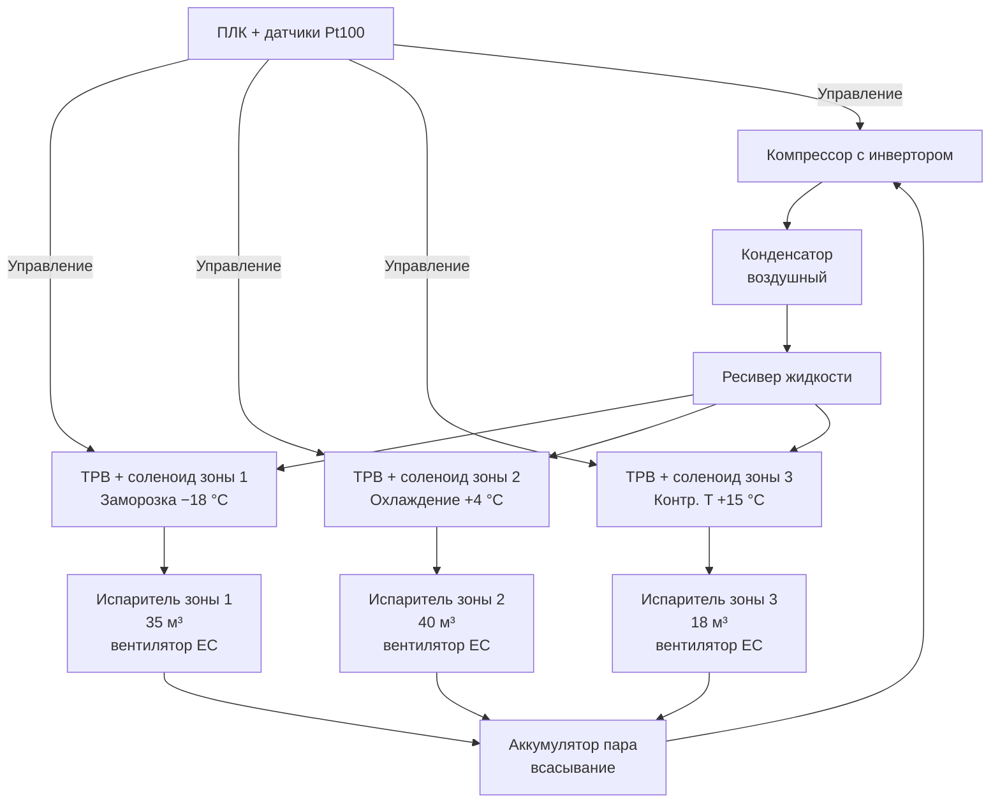

## Обзор

Многозонные рефрижераторные прицепы — грузовые транспортные средства с несколькими независимо управляемыми секциями охлаждения в одном кузове. Технология позволяет одновременно перевозить замороженную продукцию (−18…−22 °C), охлаждённые товары (0…+4 °C) и грузы при контролируемой комнатной температуре (+15…+20 °C) без пересортировки и дополнительных рейсов. Типичная экономия транспортных циклов составляет 30–40 % по сравнению с использованием раздельных специализированных единиц.

Нормативная база: EN 13004:2019 (Active Refrigerating Appliances), ASHRAE Handbook Refrigeration (2022, гл. 26), ISO 23045 (маркировка и передача данных температуры в цепи холода), ГОСТ Р 41.104–2017 (холодильные машины в ТС), ATP 1970, СП 60.13330.2020.

---

## Физические принципы

### Тепловой баланс по зонам

Для каждой независимой зоны $i$ тепловой баланс записывается как:


Q_i = U_i \cdot A_i \cdot \Delta T_{\text{ог},i} + \dot{m}_{i} \cdot c_p \cdot (T_{\text{вх},i} - T_{\text{вых},i})


где:

- $Q_i$ — суммарная тепловая нагрузка на зону $i$, Вт;
- $U_i$ — коэффициент теплопередачи ограждения зоны $i$, Вт/(м²·К);
- $A_i$ — площадь ограждающих конструкций зоны $i$, м²;
- $\Delta T_{\text{ог},i}$ — разность температур между смежным пространством и зоной $i$, К;
- $\dot{m}_i$ — массовый расход воздуха через испаритель зоны $i$, кг/с;
- $c_p$ — удельная теплоёмкость воздуха, ≈ 1,005 кДж/(кг·К).

Суммарная холодопроизводительность компрессора должна покрывать нагрузки всех зон:


Q_{\text{компр}} \geq \sum_{i=1}^{n} Q_i \cdot k_{\text{зап}}


где $k_{\text{зап}}$ = 1,15–1,25 — коэффициент запаса (ASHRAE Handbook Refrigeration).

### Логарифмическая разность температур в испарителе

Для расчёта площади теплообмена испарителя каждой зоны:


\Delta T_{\text{lm}} = \frac{(T_{\text{возд,вх}} - T_{\text{кип}}) - (T_{\text{возд,вых}} - T_{\text{кип}})}{\ln\!\left(\dfrac{T_{\text{возд,вх}} - T_{\text{кип}}}{T_{\text{возд,вых}} - T_{\text{кип}}}\right)}


где $T_{\text{кип}}$ — температура кипения хладагента в испарителе, °C.

---

## Конструкция и компоненты

### Изолированные перегородки

Первичное разделение зон осуществляется стационарными и подвижными перегородками из закрытоячеистого полиуретана высокой плотности (PUR, $\rho$ = 35–42 кг/м³, $\lambda$ = 0,022–0,026 Вт/(м·К)). Толщина стационарных перегородок: 100–150 мм для разделения зоны заморозки и охлаждения; 80–100 мм между охлаждённой и температурно-нейтральной зонами.

Уплотнение периметра перегородки: профиль EPDM (этилен-пропилен-диеновый каучук) толщиной 20–30 мм обеспечивает воздушную герметичность с утечкой менее 2 % объёма зоны в час.

Подвижные перегородки позволяют изменять соотношение объёмов зон под разные грузы. Направляющие из анодированного алюминия; фиксация в промежуточных положениях с шагом 100–200 мм.

### Испарители и воздухораспределение

Каждая зона оснащается собственным воздухоохладителем (evaporator unit) с вентилятором переменной производительности (EC-motor, electronically commutated). Типовые параметры по зонам:


| Зона | Уставка, °C | T кипения хладагента, °C | Коэф. теплоотдачи, Вт/(м²·К) | Относит. влажность выхода, % |
|------|------------|--------------------------|-------------------------------|------------------------------|
| Заморозка | −18…−22 | −35…−40 | 80–120 | 70–80 |
| Охлаждение | 0…+4 | −15…−20 | 60–90 | 85–95 |
| Контролируемая T | +12…+18 | −5…0 | 40–70 | 80–90 |


Воздух распределяется автоматическими заслонками (dampers), управляемыми ПЛК (programmable logic controller) по сигналам датчиков зон. Сечение воздуховодов рассчитывается из условия скорости воздуха не более 4 м/с для снижения шума и потерь давления.

### Система управления

Центральный контроллер обеспечивает:

- Независимое ПИД-регулирование температуры в каждой зоне (точность ±1 °C);
- Управление скоростью компрессора (инвертор, 20–100 % мощности);
- Управление электромагнитными клапанами подачи хладагента в каждый испаритель;
- Запись температурных профилей с интервалом 5–15 мин (требование ATP, ISO 23045);
- Передачу данных по GPS-трекингу в реальном времени (4G/LTE).

Датчики температуры: Pt100 RTD (точность ±0,5 °C) в каждой зоне, в возвратных воздуховодах и на поверхности груза.

---

## Расчёт холодопроизводительности

### Нагрузка на зону заморозки

**Пример:** зона заморозки прицепа-рефрижератора 13,6 м, объём 25 м³, площадь ограждения $A_{\text{замор}}$ = 65 м², $U$ = 0,22 Вт/(м²·К). Условия: $T_{\text{нар}}$ = +25 °C, $T_{\text{зам}}$ = −18 °C.


Q_{\text{огр,зам}} = 0{,}22 \times 65 \times (25 - (-18)) = 0{,}22 \times 65 \times 43 \approx 615 \text{ Вт}


Инфильтрация и груз (продуктовая нагрузка 10 т замороженных грузов, уже при −18 °C): $Q_{\text{доп}}$ ≈ 1,5 кВт.

Итого по зоне заморозки: $Q_{\text{зам}} \approx$ 2,1 кВт в режиме поддержания.

### Нагрузка на охлаждённую зону

Охлаждение 8 т фруктов с +18 °C до +4 °C ($c_p$ = 3,6 кДж/(кг·К)) за 6 ч:


Q_{\text{охл,груз}} = \frac{8000 \times 3600 \times (18 - 4)}{6 \times 3600} = \frac{8000 \times 3600 \times 14}{21600} \approx 18{,}7 \text{ кВт}


В режиме поддержания (+4 °C, $\Delta T$ = 29 К, $A$ = 55 м²):


Q_{\text{огр,охл}} = 0{,}22 \times 55 \times 29 \approx 352 \text{ Вт}


Тепловыделение дыхания фруктов: ≈ 2–5 Вт/кг при +4 °C; для 8 т — 16–40 кВт. Это определяет выбор мощности испарителя охлаждённой зоны.

### Выбор компрессора и хладагента


| Хладагент | GWP | T кипения при −18 °C, давл. кПа | T конденсации +45 °C, давл. кПа | COP (расч.) |
|-----------|-----|----------------------------------|----------------------------------|-------------|
| R-134a | 1430 | 133 | 1160 | 1,8–2,2 |
| R-452A (Opteon XP44) | 2140 | 180 | 1400 | 2,0–2,4 |
| R-513A | 573 | 143 | 1218 | 1,9–2,3 |
| R-1234yf | 4 | 182 | 1361 | 1,9–2,3 |


Компрессор: поршневой или спиральный (scroll compressor), производительность 150–300 м³/ч (номинал), инвертор для модуляции мощности. Конденсатор: воздушный, площадь 6–10 м², вентилятор 3–5 кВт.

Удельная холодопроизводительность хладагента:


Q_0 = \dot{m}_{\text{хл}} \cdot (h_1 - h_4)


где $h_1$ — энтальпия на выходе испарителя, $h_4$ — энтальпия на входе испарителя (после ТРВ), значения определяются из диаграмм Молье (Mollier diagram) или таблиц свойств хладагента при расчётных давлениях.

---

## Схема многозонной системы





---

## Применение


| Сценарий | Зона 1 | Зона 2 | Зона 3 | Преимущество |
|----------|--------|--------|--------|--------------|
| Смешанная доставка супермаркету | Рыба −18 °C | Молоко +2 °C | Хлеб +18 °C | 1 рейс вместо 3 |
| Фармацевтика + продукты | Вакцины +2…+8 °C | Мясо 0…+2 °C | — | Сертификация GDP |
| Чартер с несколькими клиентами | Клиент А −18 °C | Клиент Б +4 °C | Клиент В +15 °C | Оптимизация загрузки |
| Сезонные фрукты + заморозка | Ягоды −18 °C | Яблоки +4 °C | Бананы +14 °C | Нет порчи от неправильной T |


По данным ASHRAE TC 7.2 (Refrigeration Systems), многозонная эксплуатация снижает удельное энергопотребление на 25–35 % по сравнению с двумя однотемпературными прицепами за счёт совместного использования компрессора и конденсатора.

---

## Нормативные требования


| Стандарт | Область | Ключевое требование |
|----------|---------|---------------------|
| EN 13004:2019 | Активные рефрижераторы для ТС | Точность поддержания температуры ±2 °C в каждой зоне |
| ASHRAE Handbook Refrigeration 2022, гл. 26 | Транспортная рефрижерация | Методология расчёта нагрузок |
| ISO 23045:2021 | Холодовые цепи | Маркировка, передача данных о температуре |
| ATP 1970 + поправки | Международные перевозки ЕС | K-коэффициент кузова, сертификация |
| ГОСТ Р 41.104–2017 | Холодильные машины в ТС | Испытания, маркировка, выбросы |
| СП 60.13330.2020 | Охлаждение и климатизация | Нормы проектирования холодоснабжения |
| HACCP + ГОСТ Р 51705.1 | Безопасность пищевых продуктов | Непрерывная регистрация, критические точки |


---

## Практические рекомендации

### Типовые параметры прицепа


| Параметр | Типовое значение |
|----------|-----------------|
| Полезный объём | 82–90 м³ (общий) |
| Мощность компрессора | 15–25 кВт |
| Годовое электропотребление | 35–50 МВт·ч |
| K-коэффициент кузова (ATP) | ≤0,006 Вт/(м³·К) |
| Время охлаждения (+20 °C → −18 °C) | 6–10 ч |
| Удержание температуры без мотора | 14–20 ч |
| Диапазон внешних температур | −35…+50 °C |
| Масса рефрижераторного агрегата | 350–600 кг |


### Регламент технического обслуживания

1. Еженедельно: проверка герметичности перегородок (утечка воздуха > 2 % объёма зоны снижает КПД на 5–8 % и нарушает температурный баланс).
2. Ежемесячно: очистка конденсатора (накопление пыли повышает давление конденсации на 0,5–1,5 бар); обслуживание компрессора и проверка давлений.
3. Ежегодно: дозаправка хладагента (нормированная утечка ≤5 % массы зарядки по ASHRAE 15-2022); калибровка датчиков температуры Pt100.
4. Перед сезоном: проверка уплотнений EPDM дверей и перегородок; калибровка TXV каждой зоны.

### Типичные ошибки проектирования

1. Занижение мощности компрессора более чем на 15 % от суммарной расчётной нагрузки — приводит к потере температурного режима в жаркую погоду.
2. Неправильное соотношение площадей испарителей зон (рекомендуется 1:1,5:2 для трёхзонного варианта заморозка:охлаждение:контролируемая T).
3. Отсутствие обратного клапана на всасывающей линии при отключении зоны — хладагент перетекает в активные испарители, нарушая режим.
4. Применение минерального масла вместо POE (polyol ester) при переходе на R-452A или R-513A — осадок масла забивает TXV.
