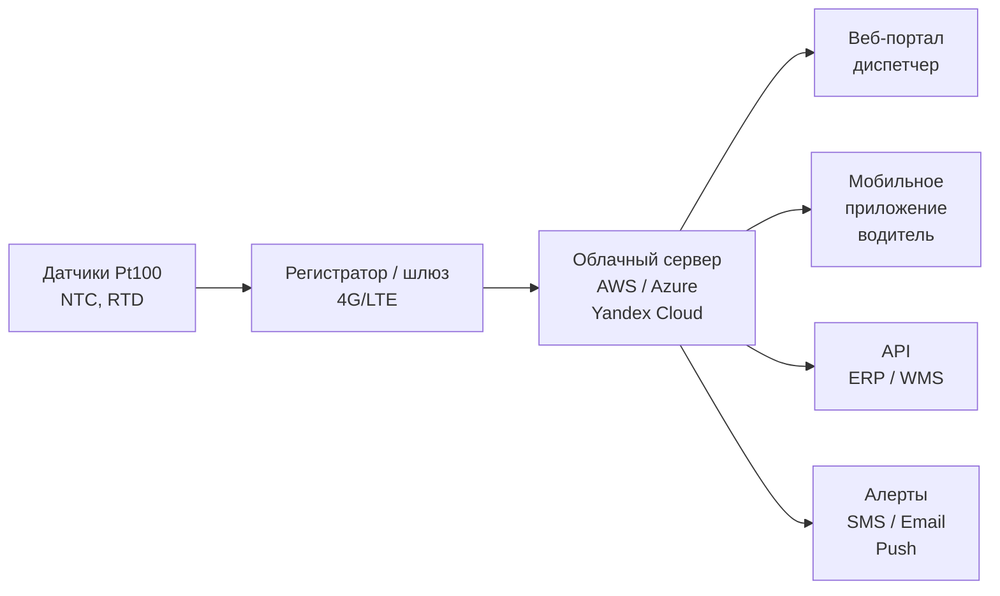

## Обзор

Мониторинг температуры в рефрижерируемом транспорте — критический элемент холодовой цепи (cold chain) и системы управления качеством. Непрерывная запись температурных условий позволяет документировать соответствие нормативным требованиям, своевременно обнаруживать отклонения и защищать груз от порчи.

Нормативные основания: HACCP (Hazard Analysis and Critical Control Points), ГОСТ Р 51705.1–2001, Регламент ЕС 1169/2011, ASHRAE TC 6.7 (рекомендации по температурному контролю рефрижерированных ТС), ISO 23412:2014, FDA FSMA (Food Safety Modernization Act), СП 60.13330.2020. Системы должны обеспечивать точность ±0,5…±1,0 °C, интервал записи не реже 15–30 мин и полную прослеживаемость измерений.

---

## Физические принципы измерения температуры

### Термоэлектрический эффект (эффект Зебека)

Термопары используют ЭДС, возникающую на контакте разнородных металлов:


E = \alpha \cdot \Delta T


где $E$ — ЭДС термопары, мВ; $\alpha$ — коэффициент Зебека, мВ/°C; $\Delta T$ — разность температур горячего и холодного спаев, °C. Тип K (Ni-Cr/Ni-Al): диапазон −40…+400 °C, точность ±1,1 °C, применяется для широкого спектра грузов.

### Изменение электрического сопротивления

Датчики сопротивления (RTD, resistance temperature detector) используют зависимость $R(T)$:


R_T = R_0 \bigl[1 + \alpha_0 (T - T_0)\bigr]


где $R_T$ — сопротивление при температуре $T$; $R_0$ — сопротивление при $T_0$ = 0 °C; $\alpha_0$ = 0,003851 °C⁻¹ для платины (IEC 60751, класс A). Датчики Pt100 обеспечивают линейность ±0,15…±0,3 °C в диапазоне −50…+200 °C — стандартный выбор для фармацевтики и пищевой промышленности.

### Полупроводниковые термисторы (NTC)

Термисторы с отрицательным температурным коэффициентом (negative temperature coefficient):


R_T = R_{\infty} \cdot e^{B/T}


где $B$ — константа термистора (2000–5000 K), $T$ — абсолютная температура. Чувствительность −3…−5 %/°C. Диапазон −20…+80 °C, точность ±0,3…±0,5 °C, быстрое время отклика 10–30 с. Применяются в беспроводных автономных датчиках.

---

## Компоненты систем мониторинга

### Механические самопишущие приборы

Традиционные приборы с биметаллическим чувствительным элементом и диаграммной лентой (7-суточная или 24-часовая). Барабан с диаграммой приводится часовым механизмом; перо оставляет непрерывный графический след. Точность: ±1,5…±2,0 °C. Применяются как резервный инструмент или при отсутствии требований к цифровой передаче данных.

Стандарт EN 12830:2018 устанавливает требования к точности и испытаниям.

### Электронные регистраторы данных (data loggers)

Портативные приборы с микроконтроллером, энергонезависимой памятью и интерфейсами передачи данных:


| Параметр | Базовый | Высокоточный |
|----------|---------|--------------|
| Диапазон | −20…+50 °C | −40…+85 °C |
| Точность | ±0,5 °C | ±0,1…±0,3 °C |
| Интервал записи | 5–60 мин | 1 с – 1 ч |
| Объём памяти | 8 000–50 000 записей | 250 000+ записей |
| Автономность | 1–3 года | 3–5 лет |
| Интерфейс | USB | USB, NFC, Bluetooth |
| Сенсор | NTC термистор | Pt100, Pt1000 |


### Многоточечные системы температурного зондирования

Для крупных прицепов (площадь пола 25–35 м²) используются 4–12 датчиков, расположенных по объёму: верх/середина/низ, передняя/средняя/задняя зоны. Кабельная разводка в гофрированных каналах, провод 0,75 мм², протокол 1-Wire или RS-485. Система позволяет идентифицировать зоны с недостаточным охлаждением и нарушения циркуляции воздуха.

### Беспроводные датчики

Автономные датчики с интегрированным трансивером (Bluetooth LE, Zigbee, LoRaWAN):


| Технология | Дальность | Интервал передачи | Автономность | Применение |
|-----------|----------|------------------|-------------|-----------|
| Bluetooth LE | 10–100 м | 15–60 с | 6–24 мес | Малые парки, 5–50 единиц |
| Zigbee | 30–100 м | 30 с – 5 мин | 1–3 года | Складские зоны |
| LoRaWAN | 2–15 км | 1–15 мин | 3–10 лет | Большие территории, депо |
| 4G LTE | неограничен | 1–15 мин | от сети ТС | Линейные и городские маршруты |
| Спутник | глобально | 15–60 мин | от сети ТС | Отдалённые регионы, Арктика |


### Облачные платформы IoT

Архитектура типичной платформы:





Функции платформы: отслеживание маршрута с наложением температурного профиля; SMS/email-алерты при выходе за границы диапазона; формирование отчётов для HACCP, FDA FSMA, Регламента ЕС 1169/2011; архивирование данных (GDPR: не менее 3 лет для пищевых грузов, до истечения срока годности + 1 год для фармацевтики).

---

## Методология картирования температуры

### Temperature Mapping Study

При вводе нового транспортного средства или после ремонта проводится тепловая картировка (ASHRAE TC 6.7, ISO 23412):

1. Размещение не менее 9 датчиков: 3 уровня высоты × 3 продольных зоны.
2. Загрузка кузова макетами груза (картонные коробки с водой, $c_p$ ≈ 4200 Дж/(кг·К)) для имитации тепловой инерции.
3. Поддержание наружной температуры +25 °C (или расчётной по региону).
4. Длительность испытания: 24–48 ч.
5. Интервал записи: 15 мин.

**Критерии приёмки:** все точки в диапазоне ±2 °C от номинала не менее 95 % времени испытания.

### Калибровка и прослеживаемость


U_{\text{итог}} = \sqrt{U_{\text{NIST}}^2 + U_{\text{лаб}}^2 + U_{\text{прибор}}^2}


где $U$ — расширенная неопределённость (коэффициент охвата $k$ = 2, уровень доверия 95 %).

Типовая неопределённость откалиброванного датчика Pt100: ±0,2…±0,3 °C. Калибровка выполняется в аккредитованной лаборатории (ISO 17025:2017), прослеживаемость к ГОСТ 8.367–2006 (Россия) или NIST (США).

**Минимальные точки калибровки:**

| Точка | Реализация | Температура |
|-------|-----------|-------------|
| Нижняя | Смесь льда с дистиллированной водой (ледяная баня) | 0 °C |
| Средняя | Термостатированная баня | −20 °C |
| Верхняя | Сухое тепло или баня | +25 °C |

Допуск: отклонение не более ±0,5 °C от эталонного прибора. Протокол хранится 3 года.

---

## Пример расчёта: охлаждаемый фургон с 8 остановками

**Условия:** кузов 8 м³, $U_{\text{ок}}$ = 0,25 Вт/(м²·К), площадь стен $A$ = 22 м², $T_{\text{нар}}$ = +28 °C, $T_{\text{куз}}$ = +2 °C (молочная продукция). Восемь открытий дверей за рейс, $V_{\text{инф}}$ = 2 м³ на открытие.

**Теплопередача через ограждение:**


Q_{\text{огр}} = 0{,}25 \times 22 \times (28 - 2) = 143 \text{ Вт}


**Суммарная суточная инфильтрация:**


Q_{\text{инф,сут}} = 8 \times 2 \times 1{,}2 \times 1005 \times 26 \approx 501 \text{ кДж}


Средняя мощность за 8 ч = 28 800 с:


Q_{\text{инф}} = \frac{501\,000}{28800} \approx 17 \text{ Вт}


**Итого тепловая нагрузка (режим поддержания):** 143 + 17 ≈ **160 Вт**.

Требуемая мощность испарителя с учётом КПД системы ($COP$ = 3,5) и запаса 25 %:


P_{\text{компр}} = \frac{160 \times 1{,}25}{3{,}5} \approx 57 \text{ Вт (электрическая)}


Минимальная холодопроизводительность установки — 0,2 кВт; реально выбирается 1,5–2 кВт для обеспечения pull-down при первоначальном охлаждении кузова.

---

## Применение по типу груза и маршрута


| Тип груза | T номинальная, °C | Допустимый диапазон, °C | Интервал записи | Датчик |
|-----------|------------------|------------------------|----------------|--------|
| Молочная продукция | +4 | +2…+6 | 15 мин | RTD Pt100 |
| Мясо и птица | −2 | −3…−1 | 30 мин | Термопара K |
| Замороженные продукты | −18 | −20…−16 | 30 мин | NTC термистор |
| Вакцины / инсулин | +5 | +2…+8 | 5–15 мин | RTD Pt1000 |
| Тропические фрукты | +12 | +10…+14 | 60 мин | RTD Pt1000 |
| Свежие овощи | 0 | −1…+2 | 30 мин | Термопара K |
| Мороженое | −25 | −28…−22 | 60 мин | NTC |


---

## Нормативная база


| Стандарт | Область | Требование |
|----------|---------|-----------|
| ASHRAE TC 6.7 | Контроль температуры рефрижерированных ТС | Методология картирования, точность ±1 °C |
| ISO 23412:2014 | Упаковка и цепочка поставок | Критические параметры холодовой цепи |
| EN 12830:2018 | Регистраторы температуры | Испытания, точность ±0,5 °C, сертификация |
| ГОСТ Р 51705.1–2001 | HACCP | Критические точки контроля |
| ГОСТ 8.367–2006 | Калибровка преобразователей T | Прослеживаемость к ГЭТ |
| ГОСТ Р 51105–97 | Контейнеры-рефрижераторы | Требования безопасности |
| Регламент ЕС 1169/2011 | Информация о пищевых продуктах | Документирование температурных условий |
| FDA FSMA 2011 | Безопасность пищевых продуктов (США) | Мониторинг холодовой цепи |
| ATP (1970 + поправки) | Международные перевозки в ЕС | Сертификация ТС и оборудования |


---

## Практические рекомендации

### Выбор технологии по размеру парка

- **5–20 единиц:** электронные регистраторы, ежедневный USB-экспорт; анализ в LogTag Analyzer или Excel.
- **20–100 единиц:** облачная платформа с 4G/LTE-шлюзами; автоматическая проверка соответствия HACCP; алерты диспетчеру.
- **Фармацевтика и biologics:** многоточечное зондирование (8–12 датчиков/прицеп), резервный регистратор, передача каждый час, IoT-метки на уровне паллеты.

### Критические ошибки эксплуатации

1. **Датчик в одной точке** — даёт иллюзию контроля; локальные нарушения режима остаются незаметными.
2. **Редкая калибровка** — смещение Pt100 на ±1 °C накапливается за 12–18 мес; систематическая погрешность не обнаруживается без поверки.
3. **Неверное толкование температурных пиков** — кратковременный скачок при открытии двери не означает отказ компрессора; требуется анализ профиля, а не отдельных точек.
4. **Отсутствие резервной копии данных** — потеря записей при сбое шлюза лишает документальных доказательств соблюдения режима.
5. **Датчик у стенки** — стенки холоднее центра груза; датчик должен располагаться на высоте 0,5–1,0 м от пола в репрезентативной точке.

### Допустимые отклонения и трансгрессии

- Охлаждённая продукция: ±0,5…±1,0 °C от номинала (фармацевтика ±0,3 °C).
- Замороженная продукция: допускается временное повышение до −15 °C на время разгрузки не более 1 ч (ATP, класс FRC).
- Молоко при международных перевозках: трансгрессия до +8 °C не более 4 ч в сутки (Регламент ЕС 2021/953).
