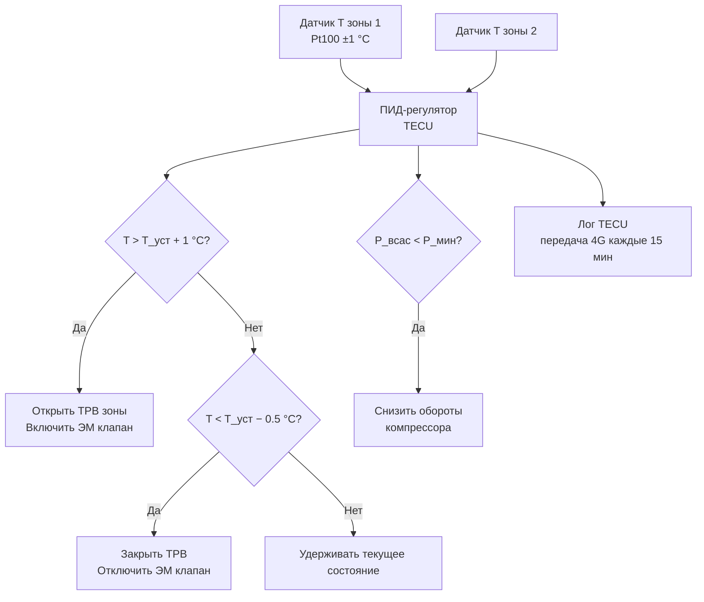

## Обзор

Транспортный рефрижераторный агрегат (Transport Refrigeration Unit, TRU) — специализированная холодильная установка для поддержания заданной температуры в кузове грузовика или полуприцепа при перевозке скоропортящихся грузов (продукты питания, фармацевтика, цветы, химические вещества). Установка работает независимо от главного двигателя тягача, обеспечивая непрерывное охлаждение на стоянках и при отключённом двигателе.

Типовая холодопроизводительность TRU: 8–52 кВт при объёме кузова 10–65 м³. Нормативная база: ASHRAE Handbook Refrigeration (2022, гл. 26), ASHRAE 15-2022 (Safety Standard for Refrigeration Systems), EN 378-1:2016, ISO 1496-2 (рефрижераторные контейнеры), Регламент ЕС 517/2014 (F-газы), US EPA Tier 4 / EU Stage V (выбросы дизелей), ATP 1970.

---

## Термодинамический цикл

TRU реализует паровой компрессионный цикл Ренкина (vapour compression cycle) с четырьмя процессами:


COP = \frac{Q_0}{P_{\text{компр}}} = \frac{h_1 - h_4}{h_2 - h_1}


где $h_1$ — удельная энтальпия пара на всасывании компрессора; $h_2$ — после сжатия; $h_4$ — после дросселирования перед испарителем (кДж/кг).

Холодопроизводительность:


Q_0 = \dot{m}_{\text{хл}} \cdot (h_1 - h_4)


где $\dot{m}_{\text{хл}}$ — массовый расход хладагента, кг/с.

### Состояния хладагента в цикле (R-134a, T_куз = −18 °C, T_нар = +35 °C)


| Точка | Процесс | T, °C | P, кПа | h, кДж/кг | Состояние |
|-------|---------|-------|--------|----------|----------|
| 1 | Вход компрессора | −25 | 133 | 385 | Насыщ. пар |
| 2 | Выход компрессора | +62 | 1600 | 440 | Перегр. пар |
| 3 | Выход конденсатора | +42 | 1600 | 256 | Насыщ. жидкость |
| 4 | Вход испарителя | −30 | 133 | 256 | Влажный пар |



COP = \frac{385 - 256}{440 - 385} = \frac{129}{55} \approx 2{,}35


---

## Компоненты и конструкция

### Дизельный двигатель и компрессор

Сердце TRU — четырёхтактный дизель мощностью 5–15 кВт (типично 8–12 кВт), отвечающий нормам Tier 4 Final (EPA) / Stage V (EU): NOx < 3,5 г/кВт·ч, PM < 0,02 г/кВт·ч, оснащён фильтром твёрдых частиц (DPF). Двигатель работает 1500–3000 об/мин; компрессор подключается через отбор мощности PTO (Power Take-Off) с гидравлической или электромагнитной муфтой.

Типы компрессоров:

- **Поршневой (reciprocating):** 2–6 цилиндров, производительность 150–300 м³/ч; надёжен при переменных нагрузках; применяется в большинстве TRU.
- **Спиральный (scroll):** тихий, без клапанов, $COP$ на 5–10 % выше; применяется в малых и средних установках.
- **Винтовой (screw):** для агрегатов > 30 кВт; высокий ресурс, постоянная производительность при переменных оборотах.

Расход топлива дизельного TRU: 3–8 л/ч в зависимости от $\Delta T$ и теплоизоляции кузова.

### Конденсатор

Воздушный конденсатор (air-cooled condenser) с площадью поверхности 3–8 м² устанавливается на крыше или передней стенке прицепа. Вентилятор прокачивает 8 000–14 000 м³/ч наружного воздуха. При $T_{\text{нар}}$ > 35 °C допускается включение вспомогательного водяного охлаждения или увеличение скорости вентилятора — давление конденсации растёт, $COP$ снижается на 15–20 % по сравнению с нормальными условиями.

### Терморегулирующий вентиль (TXV)

ТРВ (thermostatic expansion valve) дросселирует жидкий хладагент с высокого давления до давления испарения и поддерживает заданный перегрев (обычно 4–6 К) на выходе испарителя. Для систем с инверторным компрессором применяются электронные ТРВ (EEV, electronic expansion valve) с точностью регулирования ±0,5 К.

### Испарители и многозонные конфигурации

Стандартные конфигурации TRU:


| Конфигурация | Зоны | Диапазон T, °C | Применение |
|-------------|------|----------------|-----------|
| Однозонная | 1 | 0…+8 или −18…−22 | Молочка, мясо или заморозка |
| Двухзонная | 2 | −18 + 0…+4 | Заморозка + охлаждение |
| Трёхзонная | 3 | −18 + 0 + +12 | Сложные составы грузов |


Каждая зона оснащена собственным ТРВ (или EEV), электромагнитным клапаном и датчиком температуры Pt100. Контроллер TECU (Thermo Electronic Control Unit) независимо регулирует расход хладагента в каждый испаритель.

### Береговое питание и электрический режим

Стандартное оснащение TRU:

- **Аккумулятор 12/24 В** (100–200 А·ч): питание вентиляторов, клапанов и контроллера до 4 ч при отключённом дизеле.
- **Электрический режим 230 В / 16 А (или 400 В / 3-фазный):** электромотор 3–5 кВт заменяет дизель при стоянке у дока, в порту, на складе. Снижение выбросов CO₂ в городской среде критично для зон с ограничениями (LEZ, low emission zone).
- **Солнечные панели (опционально):** 60–120 Вт на крыше прицепа — компенсация нагрузки вентиляторов конденсатора.

---

## Расчёт требуемой холодопроизводительности

Общий принцип выбора агрегата:


Q_0 \geq Q_{\text{тепловой нагрузки}} = U \cdot A \cdot \Delta T + Q_{\text{инф}} + Q_{\text{груза}} + Q_{\text{прочие}}


**Пример.** Полуприцеп V = 22 м³ (10 м длиной), $U$ = 0,28 Вт/(м²·К), $A$ = 70 м², $T_{\text{нар}}$ = +35 °C, $T_{\text{куз}}$ = +2 °C ($\Delta T$ = 33 К). Без груза:


Q_{\text{кондукция}} = 0{,}28 \times 70 \times 33 = 646 \text{ Вт}


Инфильтрация + вентиляция ≈ 10 % от кондукции = 65 Вт. Итого режим поддержания:


Q_{\text{итог}} \approx 646 + 65 = 711 \text{ Вт} \approx 0{,}71 \text{ кВт}


С грузом 5 т свежих фруктов (дыхание 3 Вт/кг при +2 °C): $Q_{\text{дыхание}}$ = 15 кВт — это и определяет размер испарителя. На практике выбирается агрегат мощностью 15–20 кВт для обеспечения 20 % запаса и нормального pull-down.

---

## Система управления TECU





Функции TECU: автоматический запуск/остановка по температуре (гистерезис ±1–2 °C от уставки); переход в малые обороты (700–900 об/мин) при достижении уставки — экономия топлива; режим таймера (отложенный запуск перед отправкой); диагностика давлений всасывания/нагнетания; регистрация ошибок с временными метками (timestamp).

---

## Применение в логистических сценариях


| Сценарий | Требования | Конфигурация TRU | Q₀, кВт |
|----------|-----------|-----------------|---------|
| Трансевропейские маршруты (1000–3000 км) | T: −18 °C, ATP сертификат | Дизельный, однозонный | 18–30 |
| Городская доставка, LEZ | 0 выбросов в городе | Электрический / гибрид с АКБ | 8–15 |
| Фармацевтика +2…+8 °C | GDP, точность ±2 °C | Двухзонный (фарм + прохладный) | 12–20 |
| Глубокая заморозка −25 °C | Усиленная изоляция | Дизельный, повышенная мощность | 25–50 |
| Многотемпературная доставка | Несколько клиентов / грузов | Двух- или трёхзонный | 20–40 |


---

## Нормативные требования


| Стандарт | Область | Требование |
|----------|---------|-----------|
| ASHRAE 15-2022 | Безопасность холодильных систем | Хладагенты, давления, вентиляция машинных отделений |
| ASHRAE Handbook Refrigeration 2022, гл. 26 | TRU | Методология расчёта, испытания |
| EN 378-1:2016 | Холодильные системы ЕС | Безопасность, герметичность, документация |
| ISO 1496-2:2018 | Рефрижераторные контейнеры | Конструктивные требования, маркировка |
| Регламент ЕС 517/2014 | F-газы | GWP-ограничения; запрет R-134a в новых ТС с 2025 |
| US EPA Tier 4 Final | Выбросы дизелей (США) | NOx < 3,5 г/кВт·ч, PM < 0,02 г/кВт·ч |
| EU Stage V | Выбросы дизелей (ЕС) | PM < 0,015 г/кВт·ч |
| ATP 1970 + поправки | Международные перевозки | K-коэффициент, ежегодная сертификация |
| ГОСТ 28547–90 | Холодильные транспортные машины | Классификация, техтребования РФ |


---

## Практические рекомендации

### Выбор типоразмера

- Фургон 10 м³: агрегат 8–12 кВт (например, Thermo King T-800, Carrier X4 7300).
- Прицеп 20 м³: 15–20 кВт.
- Стандартный 13,6 м полуприцеп (60 м³): 25–35 кВт.
- Трёхзонный прицеп: суммарно 35–52 кВт.

### Техническое обслуживание TRU

| Интервал | Работа |
|---------|--------|
| Еженедельно | Очистка конденсатора; проверка натяжения ремня PTO |
| 500 ч работы дизеля | Замена масляного фильтра и масла дизеля |
| 2000 ч | Замена масла компрессора (POE ISO 46 или 68) |
| Ежегодно | Проверка герметичности контура (допуск < 3 % в год, ASHRAE 15-2022); сертификация ATP |
| 5 лет | Ревизия ТРВ / EEV; замена прокладок и уплотнений; DPF-регенерация |

### Диагностика по параметрам TECU


| Симптом | Вероятная причина | Диагностика |
|---------|------------------|-------------|
| Высокое давление конденсации | Засорён конденсатор или недостаток воздуха | Проверить вентилятор, продуть радиатор |
| Низкое давление всасывания | Утечка хладагента или закрытый ТРВ | Проверить массу заправки, настройку ТРВ |
| Компрессор не запускается | Перегрев двигателя, низкое давление масла | Проверить защиты по температуре и давлению масла |
| Недостаточная холодопроизводительность | Обледенение испарителя | Запустить принудительную оттайку |
| Высокий расход топлива | Неэффективный цикл (высокое P_конд) | Проверить степень открытия ТРВ, заправку |


### Экономия топлива и снижение выбросов

- Правильная настройка ТРВ и гистерезиса контроллера снижает расход на 10–15 %.
- Использование электрического режима на береговых постах экономит 2–4 л дизеля в сутки при стационарном хранении.
- Переход с R-134a на R-452B снижает GWP заправки с 1430 до 698 единиц при сохранении COP.
- Оснащение крыши солнечными панелями (120 Вт) частично компенсирует нагрузку вентиляторов в режиме поддержания (~0,5–1 л/сутки эквивалент).
