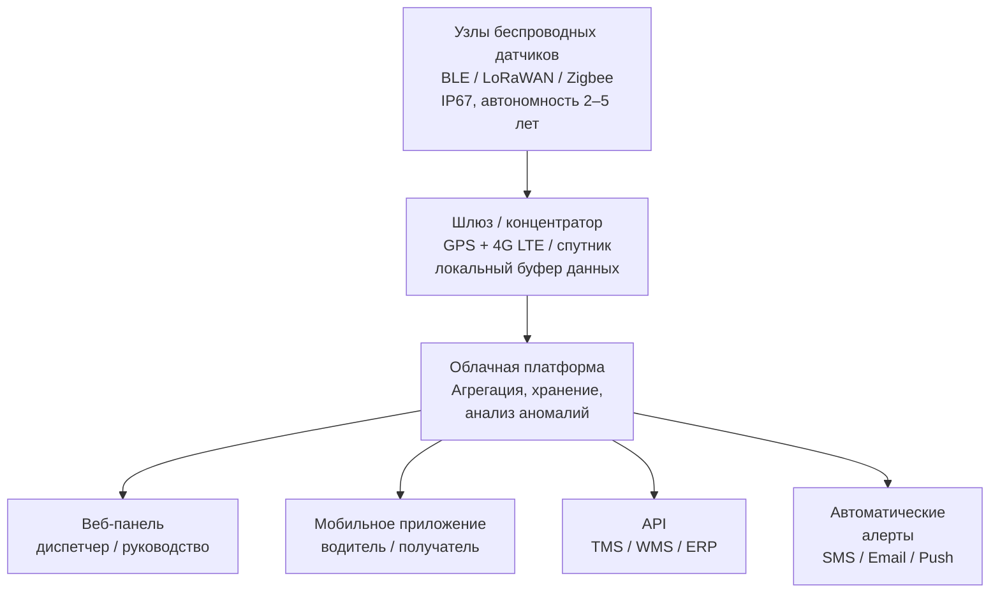

## Обзор

Устройства записи температуры обеспечивают документальное подтверждение целостности холодовой цепи (cold chain) при рефрижерированном транспортировании. Системы верифицируют, что чувствительные к температуре грузы оставались в заданных диапазонах на протяжении всей цепочки поставок, обеспечивая соответствие нормативным требованиям, качество продукции и безопасность.

Нормативная база: ASHRAE RP-1450 (рекомендации по передаче данных температуры), ISO 23412:2014, EN 12830:2018, FDA FSMA (Food Safety Modernization Act), 21 CFR Part 11, EU GDP (Good Distribution Practice), ГОСТ Р 51705.1–2001 (HACCP), ГОСТ Р 51105–97, СП 60.13330.2020.

---

## Механические самопишущие приборы

Механические регистраторы используют биметаллический или паровой датчик для управления пером, оставляющим непрерывный чернильный след на вращающейся диаграммной ленте.

### Принцип работы

Биметаллическая спираль (например, латунь-инвар) деформируется пропорционально изменению температуры:


\Delta L = L_0 \cdot (\alpha_1 - \alpha_2) \cdot \Delta T


где $\Delta L$ — деформация, м; $L_0$ — начальная длина, м; $\alpha_1$, $\alpha_2$ — коэффициенты линейного расширения материалов, К⁻¹; $\Delta T$ — изменение температуры, К. Деформация через рычажный механизм преобразуется в радиальное смещение пера на круговой диаграмме.

Диаграмма закреплена на барабане часового механизма: 24-часовой или 7-дневный оборот. Ширина линии пера: 0,3–0,5 мм. Точность хода часового механизма: ±15 % (EN 12830, ISO 18637).

### Характеристики по типу груза


| Применение | Диапазон | Точность | Диаграмма |
|-----------|---------|---------|-----------|
| Замороженные товары | −40…+7 °C | ±1,7 °C | 7 суток |
| Охлаждённые продукты | −7…+27 °C | ±1,1 °C | 7 суток |
| Контролируемая T комн. | +4…+49 °C | ±1,1 °C | 24 ч или 7 суток |


### Преимущества и ограничения

**Преимущества:** независимость от электропитания; немедленная визуальная интерпретация при получении; физический документ, устойчивый к подделкам; нет дрейфа калибровки в пути.

**Ограничения:** только ручное извлечение данных; точность ±1,5…±2,0 °C уступает электронным; трудоёмкость архивирования бумажных диаграмм; сложная интеграция с цифровыми системами.

---

## Электронные регистраторы данных (data loggers)

Электронные регистраторы преобразуют сигнал датчика в цифровые данные, хранимые в энергонезависимой памяти (Flash, EEPROM, microSD).

### Типы датчиков

**Термисторы NTC** (negative temperature coefficient): полупроводник с нелинейной характеристикой; чувствительность −3…−5 %/°C; диапазон −40…+125 °C; точность ±0,2…±0,5 °C; низкая стоимость.

**RTD Pt100/Pt1000:** платиновый проволочный элемент; линейная характеристика +0,385 Ω/°C; диапазон −200…+850 °C; точность ±0,1…±0,3 °C (класс A по IEC 60751); требует 3-проводного подключения для компенсации сопротивления проводников.

**Термопары тип K:** хромель-алюмель; диапазон −200…+1350 °C; точность ±1…±2 °C; требует компенсации холодного спая; применяется в суровых условиях.

### Технические параметры


| Параметр | Стандартный | Высокоточный |
|---------|-------------|-------------|
| Точность | ±0,5 °C | ±0,1 °C |
| Разрешение | 0,1 °C | 0,01 °C |
| Интервал записи | 1–60 мин | 1 с – 24 ч |
| Объём памяти | 16 000 записей | 250 000+ записей |
| Срок службы батареи | 1–3 года | 3–5 лет |
| Интерфейс | USB | USB, NFC, Bluetooth |
| Тревога | Анализ post-hoc | Оповещения в реальном времени |


### Расчёт ёмкости памяти


N = \frac{M_{\text{доступ}} \times 1024^2}{B \times n_{\text{кан}}}


где $M_{\text{доступ}}$ — доступный объём памяти, МБ; $B$ — размер одной записи (4 байта для 32-бит метка + T); $n_{\text{кан}}$ — число каналов.

**Пример.** microSD 2 ГБ (доступно 1900 МБ), 1 канал:


N = \frac{1900 \times 1{,}048 \times 10^6}{4} \approx 498 \times 10^6 \text{ записей}


При интервале 10 мин (144 записи/сутки) — запас ≈ 9,5 лет.

### Одноразовые и многоразовые регистраторы

| Тип | Применение | Преимущество |
|-----|-----------|-------------|
| Одноразовые (disposable) | Фарм. однонаправленные отправки | Заводская настройка; запечатанный корпус; PDF-отчёт через USB |
| Многоразовые (reusable) | Регулярные маршруты | Сменная батарея; гибкая настройка; ROI через 10–20 поездок |

---

## Системы беспроводного мониторинга

Беспроводные системы обеспечивают видимость температуры в режиме реального времени (real-time visibility) и позволяют провести упреждающее вмешательство до повреждения груза.

### Архитектура IoT-системы





### Технологии передачи данных


| Технология | Покрытие | Диапазон | Скорость | Потребление | Применение |
|-----------|---------|---------|---------|-------------|-----------|
| 4G LTE / 5G | Широкое (населённые пункты) | Неогр. | 1–100 Мбит/с | Среднее | Линейные и городские маршруты |
| LoRaWAN | Инфраструктура шлюза | 2–10 км | 0,3–50 кбит/с | Очень низкое | Депо, терминалы |
| Спутник (Iridium) | Глобальное | Неогр. | 0,3–2,4 кбит/с | Высокое | Арктика, морские маршруты |
| Bluetooth LE | 10–100 м | — | 1 Мбит/с | Минимальное | Последняя миля, городские |


---

## Требования к калибровке

### Прослеживаемость к эталонам

Цепь прослеживаемости измерений:


\text{NIST / ГОСТ 8.367} \rightarrow \text{Аккредитованная лаб. (ISO 17025)} \rightarrow \text{Рабочий эталон} \rightarrow \text{Регистратор}


Общая неопределённость калибровки:


U_{\text{итог}} = \sqrt{U_{\text{эт}}^2 + U_{\text{лаб}}^2 + U_{\text{прибор}}^2}


Для транспортных регистраторов: $U_{\text{итог}}$ = ±0,2…±0,5 °C при коэффициенте охвата $k$ = 2 (95 %).

### Стандартные точки калибровки


| Применение | Точки, °C | Эталон | Допуск |
|-----------|---------|-------|--------|
| Заморозка | −30; −20; −10 | Крио-термостат + Pt100 | ±0,5 °C |
| Охлаждение | 0; +5; +15 | Ледяная баня + термостат | ±0,3 °C |
| Фармацевтика | −20; 0; +25 | Крио-термостат / ГОСТ 8.531 | ±0,2 °C |
| Контр. T комн. | +15; +22; +30 | Термостат | ±0,5 °C |


### Периодичность калибровки


| Нормативная база | Стандартный интервал | Best practice |
|----------------|---------------------|---------------|
| FDA FSMA | 12 месяцев | 6 месяцев |
| 21 CFR Part 11 | По протоколу валидации | Ежеквартально (критичные) |
| EU GDP | 12 месяцев | 12 месяцев + промежуточные проверки |
| ГОСТ 8.367–2006 | 12 месяцев | 12 месяцев |


Немедленная внеплановая калибровка требуется: после механического удара или падения; при подозрении на дрейф показаний; после ремонта; после воздействия температур вне рабочего диапазона.

### Протокол документирования

Сертификат калибровки содержит: идентификатор прибора (серийный номер, модель); диапазон и точки поверки; фактические погрешности; дату и срок действия; ссылку на аккредитационный номер лаборатории (ISO 17025). Хранение: не менее 3 лет для пищевых грузов; до истечения срока годности препарата + 1 год для фармацевтики.

---

## Нормативное соответствие

### FDA FSMA — Правило санитарного транспорта (Sanitary Transportation Rule)

Применяется к перевозкам пищевых продуктов, требующих контроля время-температура (TCS products):

- Письменные процедуры мониторинга: частота, методология, предварительное охлаждение.
- Обучение персонала процедурам контроля температуры.
- Ведение журналов: перевозчики — 6 мес.; грузоотправители/получатели — 12 мес.

### 21 CFR Part 11 — Электронные записи

Требования к системам для фармацевтики:

- Журнал аудита (audit trail): временны́е метки, ID пользователя, действие — неизменяемые.
- Принципы ALCOA+: Attributable, Legible, Contemporaneous, Original, Accurate, Complete, Consistent, Enduring, Available.
- Уникальные ID пользователей; двухфакторная аутентификация для критичных действий.
- Шифрование данных в покое и при передаче (AES-256, TLS 1.3).
- Валидация программного обеспечения: IQ / OQ / PQ по GAMP 5.

### EU GDP — Глава 9 «Транспорт»

- Квалификационные исследования (Temperature Mapping Study) для всего оборудования; сезонные испытания (лето/зима); оценка вариаций загрузки и открывания дверей.
- Планы непрерывности при отказе оборудования.
- Расследование каждого температурного отклонения (excursion) с оценкой влияния на качество продукции.

---

## Практические рекомендации

### Выбор технологии мониторинга

- **Парк 5–20 единиц:** многоразовые регистраторы; ежедневный USB-экспорт.
- **20–100 единиц:** облачная платформа с 4G-шлюзами; автоматические алерты; отчёты HACCP.
- **Фармацевтика / biologics:** многоточечное зондирование (8–12 датчиков/прицеп); резервный регистратор; почасовая передача; IoT-метки уровня паллеты.

### Критические ошибки при внедрении

1. **Один датчик на весь прицеп** — локальные нарушения режима остаются незаметными; необходим минимум 3–6 датчиков по объёму.
2. **Датчик у стенки** — температура стенки ≠ температура груза; датчик должен быть на высоте 0,5–1,0 м от пола в репрезентативной точке.
3. **Игнорирование тепловой инерции** — датчику Pt100 в воздухе требуется 5–10 мин для стабилизации после открытия двери; кратковременные пики не свидетельствуют об отказе оборудования.
4. **Отсутствие резервного копирования** — данные на борту регистратора могут быть потеряны при сбое шлюза; облачный буфер с локальным кэшем обязателен.
5. **Просроченная калибровка** — дрейф ±1…±2 °C накапливается незаметно; регистратор старше 12 мес. без сертификата недопустим в критичных отправках.
