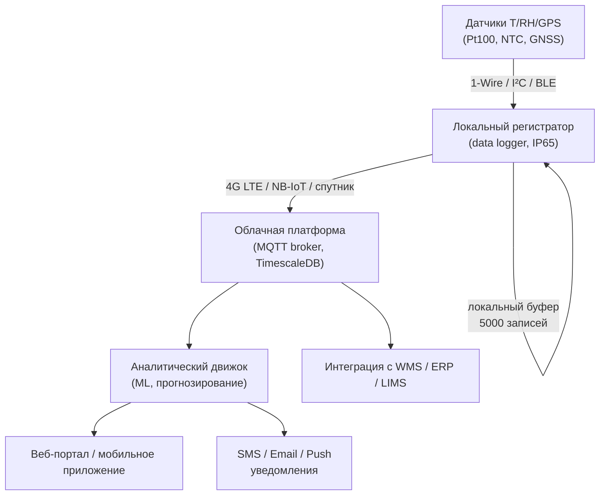

## Обзор

Беспроводной мониторинг в транспортной холодильной цепи (cold chain) охватывает совокупность технологий удалённого отслеживания параметров груза и оборудования в режиме реального времени. Системы строятся на датчиках температуры, влажности и местоположения, передающих данные через сотовые сети (4G LTE, 5G) или спутниковые каналы на облачные платформы с аналитическими возможностями.

Согласно ASHRAE Handbook — Refrigeration и ISO 22000 (Food Safety Management), надёжность холодной цепи критична при перевозке чувствительных грузов: фармацевтики, продуктов питания и биопрепаратов. Отклонения за пределы диапазона 2...8 °C или −18...−25 °C влекут утрату товарной стоимости и риски для безопасности. Беспроводные системы мониторинга обеспечивают прозрачность логистики, снижают потери и повышают соответствие требованиям регуляторов.

## Физические принципы и технологические основы

### Первичные преобразователи температуры

Датчики температуры (temperature sensors) в беспроводных системах основаны на явлениях, обеспечивающих преобразование теплового состояния в электрический сигнал:

- **Термисторы NTC/PTC**: изменение сопротивления с температурой по экспоненциальному закону; диапазон −40...+125 °C, точность ±0,2...±1 °C;
- **Резистивные датчики Pt100/Pt1000**: линейная зависимость сопротивления от температуры по ГОСТ Р 8.625–2006; погрешность класса B: ±(0,30 + 0,005|t|) °C;
- **Цифровые датчики** (DS18B20, SHT3x): встроенные АЦП и коммуникационные интерфейсы (1-Wire, I²C); разрешение 0,0625 °C; погрешность ±0,5 °C в диапазоне −10...+85 °C.

Частота опроса варьируется от 1 измерения в минуту до 1 в час в зависимости от критичности груза.

### Поток данных и энергетика канала

Пропускная способность канала передачи данных (data transmission rate):


f_{\text{канал}} = \frac{N_{\text{байт}} \times 8}{\Delta t_{\text{цикл}}}


где $N_{\text{байт}}$ — объём пакета (10–50 байт: температура, метка времени, координаты GPS), $\Delta t_{\text{цикл}}$ — интервал передачи (300–3600 с).

Для стандартного пакета 30 байт при интервале 15 мин: $f = 30 \times 8 / 900 = 0{,}27$ бит/с — пренебрежимо малая нагрузка на 4G LTE.

## Компоненты и архитектура

### Датчики и локальная электроника

Устройства размещаются в грузовом отсеке, на упаковке или внутри контейнеров:

- Питание: встроенные батареи LiPo (3,7 В) ёмкостью 1000–5000 мАч на 1–12 месяцев;
- Разрешение АЦП: 0,1...0,5 °C;
- Защита корпуса: IP65–IP67 (ГОСТ 14254, IEC 60529);
- Локальный буфер памяти: 500–5000 записей для автономной работы при потере связи.

### Каналы передачи данных


| Технология | Диапазон частот | Задержка | Потребление при передаче | Охват |
|---|---|---|---|---|
| 4G LTE (3GPP Rel. 13) | 800–2600 МГц | 50–200 мс | 0,5–2 Вт | 90–99 % маршрутов |
| 5G NR (Sub-6 GHz) | 600 МГц – 6 ГГц | 1–10 мс | 0,3–1,5 Вт (+20 % КПД) | хабы, порты, СЭЗ |
| Iridium / Globalstar (спутник) | L-диапазон | 10–30 с | 1–3 Вт | 100 % (полярные маршруты) |
| NB-IoT (3GPP Rel. 13) | 700–900 МГц | 1–10 с | 0,05–0,2 Вт | городская застройка |


**Сотовая связь 4G LTE** обеспечивает глобальное покрытие и пропускную способность 1–100 Мбит/с. Потребление батареи при цикле передачи каждые 15 мин: 20–50 мАч/сут.

**5G NR**: меньшая задержка и энергоэффективность выше на 20–40 % за счёт оптимизированного планирования передачи. Применяется в развитых логистических хабах и морских портах.

**Спутниковый мониторинг** (Iridium, Globalstar, Inmarsat): независимость от наземной инфраструктуры, охват полярных и морских маршрутов. Стоимость передачи 0,5–2 USD за сообщение; задержка 10–30 с.

**GPS/GNSS-интеграция**: определение местоположения с точностью ±5–10 м; интегрировано в модули сотовой связи через A-GPS (Assisted GPS).

### Облачные платформы и аналитика

Данные собираются с использованием протоколов MQTT (IoT-ориентированный, низкая полоса, QoS 0/1/2), HTTP/REST (универсальный) или проприетарных API. Платформы обеспечивают:

- **Хранилище временных рядов**: InfluxDB, TimescaleDB; ёмкость — свыше 1 млн точек в сутки на устройство;
- **Обнаружение аномалий**: алгоритмы Isolation Forest, LSTM-нейросети для прогнозирования отказов;
- **Геозонирование (geofencing)**: уведомления при входе/выходе из географических зон (склады, таможенные пункты, порты).

### Интерфейсы пользователя и оповещения

- **SMS/Email**: доставляются при превышении установленных порогов (например, T > 8 °C для фармацевтики); время доставки SMS — 1–5 с, email — 5–30 с;
- **Push-уведомления**: в мобильные приложения Android/iOS с задержкой 1–2 с;
- **Веб-портал**: карта маршрутов, графики температур, история событий; доступ по HTTPS с многофакторной аутентификацией;
- **Панель управления автопарком (fleet dashboard)**: статус 100–10 000 единиц оборудования; группировка по контрактам и маршрутам; экспорт в PDF/CSV.

## Методика проектирования и расчёты

### Расчёт автономности батареи

Время автономной работы устройства (battery life):


T_{\text{авт}} = \frac{Q_{\text{бат}}}{P_{\text{ср}}} = \frac{Q_{\text{бат}}}{P_{\text{сон}} \cdot (1 - \delta) + P_{\text{пер}} \cdot \delta}


где $Q_{\text{бат}}$ — ёмкость батареи (мАч); $P_{\text{сон}}$ — потребление в дежурном режиме (мВт); $P_{\text{пер}}$ — потребление при передаче (мВт); $\delta$ — доля времени в активном режиме передачи.

**Пример SI.** Батарея 2500 мАч; $P_{\text{сон}} = 5$ мВт; $P_{\text{пер}} = 500$ мВт; передача 1 с каждые 15 мин ($\delta = 1/900 = 0{,}0011$):

$$P_{\text{ср}} = 5 \times (1 - 0{,}0011) + 500 \times 0{,}0011 = 5{,}0 + 0{,}55 \approx 5{,}6 \text{ мВт}$$

$$T_{\text{авт}} = \frac{2500 \text{ мАч} \times 3{,}7 \text{ В}}{5{,}6 \times 10^{-3} \text{ Вт}} = \frac{9250 \text{ мВт·ч}}{5{,}6 \text{ мВт}} \approx 1652 \text{ ч} \approx 69 \text{ сут}$$

Результат соответствует типичным данным производителей (2–3 месяца при цикле 15 мин).

### Оптимальный интервал выборки данных

Для контроля нарушений холодной цепи достаточно интервала 5–15 мин. Критические грузы (вакцины, препараты крови) требуют 1–5 мин. Оптимальный интервал:


\Delta t_{\text{опт}} = \frac{k \cdot \tau_{\text{тепл}}}{N_{\text{тревога}}}


где $\tau_{\text{тепл}}$ — постоянная времени нагрева контейнера (20–40 мин); $N_{\text{тревога}}$ — требуемое число точек до обнаружения отклонения (3–5); $k$ — поправочный коэффициент 0,1–0,2 для раннего обнаружения.

При $\tau_{\text{тепл}} = 30$ мин и $N_{\text{тревога}} = 3$: $\Delta t_{\text{опт}} = 0{,}15 \times 30 / 3 = 1{,}5$ мин — приемлемо для фармацевтики.

### Прогнозная аналитика

Предиктивная модель прогноза температуры:


T_{\text{прогн}}(t + \Delta t) = T_{\text{тек}} + \frac{dT}{dt} \cdot \Delta t + \varepsilon


Уклон $dT/dt$ вычисляется методом наименьших квадратов по последним 10–50 точкам. При выходе прогноза за границу диапазона в течение 30 мин система формирует сигнал «Критическое состояние».

## Применение в транспортной холодильной цепи

### Типовые сценарии

1. **Дистрибьюция фармацевтики** (2...8 °C): гарантия соответствия в каждый момент доставки; интеграция с LIMS (Laboratory Information Management System) для фиксации отклонений; соответствие EU GDP (Good Distribution Practice) и 21 CFR Part 11 (FDA).

2. **Быстрозамороженные продукты** (−18...−25 °C): мониторинг 2–3 раза в день; уведомления при подъёме выше −15 °C как индикатор неисправности холодильного оборудования.

3. **Морские и воздушные перевозки**: спутниковый мониторинг на маршрутах без мобильного покрытия; синхронизация данных при прибытии в порт/аэропорт.

4. **Многоэтапная логистика**: отслеживание температуры от склада поставщика через распределительный центр (DC) до точки продажи; накопление истории для аудита соответствия ХАССП (HACCP).

## Стандарты и нормативная база


| Стандарт | Область применения |
|---|---|
| ASHRAE Handbook — Refrigeration (гл. 42) | Проектирование холодовой цепи, транспортная рефрижерация |
| ASHRAE 15-2022 | Безопасность холодильных систем |
| ISO 22000:2018 | Системы менеджмента безопасности пищевой продукции |
| EU GDP 2013/C 343/01 | Надлежащая дистрибьюторская практика (фармацевтика) |
| 21 CFR Part 11 (FDA) | Электронные записи и подписи |
| IEC 60529 / ГОСТ 14254 | Степени защиты IP датчиков и корпусов |
| ГОСТ Р 51121–97 | Холодильная цепь: контроль температуры при хранении и транспортировке |
| СП 89.13330.2016 | Методики проектирования и эксплуатации холодильных установок |


## Практические рекомендации


| Параметр | Типовое значение | Диапазон |
|---|---|---|
| Интервал передачи | 15 мин | 1–60 мин |
| Точность датчика | ±1 °C | ±0,5...±2 °C |
| Время автономии | 3 месяца | 1–12 месяцев |
| Задержка уведомления | <5 с | 1–30 с |
| Покрытие 4G LTE | 95 % маршрутов | 85–99 % |
| Стоимость устройства | 150–500 USD | 80–2000 USD |


**Типичные ошибки при внедрении:**

- Выбор избыточно высокой частоты опроса (>1 мин) без технической необходимости: расходует батарею и канал передачи;
- Отсутствие локального буфера при сбоях сети: потеря критически важной информации за время до 24 ч;
- Игнорирование геозонирования при погрузке/разгрузке: ложные срабатывания, снижение доверия к системе;
- Недостаточная настройка порогов уведомлений: избыток ложных тревог приводит к отключению оповещений персоналом.

**Лучшие практики:**

- Проводить калибровку (calibration) датчиков ежегодно по ГОСТ Р 8.625;
- Использовать избыточность — не менее двух датчиков на одну транспортную единицу для критических грузов;
- Интегрировать данные температуры с GPS для анализа корреляции между остановками и температурными отклонениями;
- Архивировать исторические данные минимум 3 года для аудита и анализа трендов;
- Обеспечивать шифрование (encryption) данных по стандарту AES-256 при передаче и хранении;
- Ежеквартально проводить функциональные тесты системы тревоги с имитацией отклонения температуры.

## Схема архитектуры системы

