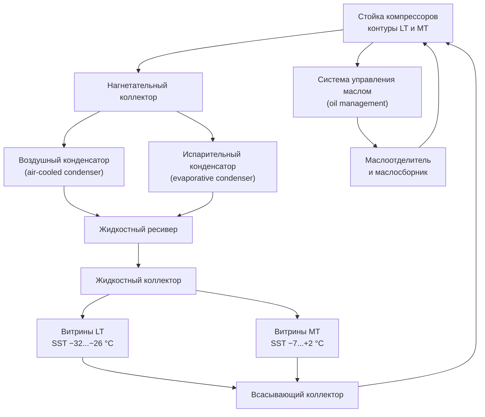

## Фундаментальный цикл охлаждения

Системы коммерческого охлаждения (commercial refrigeration) используют цикл паросжатия (vapor-compression cycle), передавая тепло из охлаждаемых пространств в окружающую среду через термодинамику фазовых переходов. Применение охватывает розничные магазины, предприятия общественного питания и распределительные центры; нагрузки от единиц до тысяч киловатт холода.

### Термодинамический анализ

Коэффициент производительности (COP — Coefficient of Performance) количественно определяет эффективность охлаждения:


\text{COP}_{\text{ref}} = \frac{Q_{\text{исп}}}{W_{\text{комп}}} = \frac{h_1 - h_4}{h_2 - h_1}


где:
- $Q_{\text{исп}}$ — холодопроизводительность испарителя (кВт);
- $W_{\text{комп}}$ — мощность, потребляемая компрессором (кВт);
- $h_1$ — энтальпия пара на всасывании компрессора (кДж/кг);
- $h_2$ — энтальпия на нагнетании компрессора (кДж/кг);
- $h_4$ — энтальпия смеси на входе испарителя (кДж/кг).

Теплоотдача в конденсаторе:


Q_{\text{конд}} = Q_{\text{исп}} + W_{\text{комп}} = \dot{m}(h_2 - h_3)


**Пример SI.** Система R-448A: $h_1 = 420$ кДж/кг, $h_2 = 460$ кДж/кг, $h_4 = 250$ кДж/кг. Тогда:

$$\text{COP} = \frac{420 - 250}{460 - 420} = \frac{170}{40} = 4{,}25$$

При массовом расходе хладагента $\dot{m} = 0{,}1$ кг/с холодопроизводительность составит $Q_{\text{исп}} = 0{,}1 \times 170 = 17$ кВт.

## Классификация температурных уровней

Коммерческое охлаждение работает в трёх диапазонах температуры насыщения при всасывании (SST — Saturated Suction Temperature):

**Низкая температура (LT — Low Temperature)**: SST −32...−26 °C
- Шкафы для замороженных продуктов, морозильные лари;
- Скоростные морозильники (blast freezers).

**Средняя температура (MT — Medium Temperature)**: SST −7...+2 °C
- Шкафы для свежего мяса, молочных продуктов, овощей;
- Прогулочные холодильники (walk-in coolers).

**Высокая температура (HT — High Temperature)**: SST +4...+10 °C
- Кондиционирование воздуха в торговых залах;
- Шкафы для напитков, цветочные витрины.

## Архитектуры систем


| Тип системы | Диапазон мощности | Заряд хладагента | Эффективность | Применение |
|---|---|---|---|---|
| Самостоятельные (self-contained) | 0,05–1,5 кВт | 0,3–3 кг | Умеренная | Настольные витрины, мини-бары |
| Дистанционная конденсация (remote condensing) | 1–10 кВт | 2–11 кг | Хорошая | Прогулочные холодильники, средние объекты |
| Многоблочные стойки (multiplex racks) | 15–500 кВт | 100–1000 кг | Отличная | Супермаркеты, РЦ (распределительные центры) |
| Вторичный контур (secondary loop) | 5–100 кВт | 5–40 кг (первичный) | Хорошая | Объекты с ограничениями по заряду |
| CO₂ трансгритическая | 10–200 кВт | 50–300 кг | Очень хорошая | Северный климат, «зелёные» объекты |


### Системы многоблочных стоек

Централизованные стоечные системы (rack systems) обслуживают несколько испарителей в различных температурных зонах одновременно:

Многоблочные стойки достигают экономии энергии 15–30 % за счёт интегрированных стратегий управления по сравнению с обычной эксплуатацией при постоянной скорости и фиксированных уставках (ASHRAE Handbook — Refrigeration, гл. 2).

## Методы отвода тепла

Выбор конденсатора существенно влияет на производительность системы и эксплуатационные расходы. ASHRAE 15-2022 и EN 378-1 регулируют безопасность применения хладагентов и требования к конденсаторам.

### Производительность конденсатора

Влияние температуры конденсации на мощность компрессора:


\frac{W_{\text{высок}}}{W_{\text{низк}}} \approx \left(\frac{T_{\text{конд,высок}}}{T_{\text{конд,низк}}}\right)^{0{,}28}


Для системы R-448A: снижение температуры конденсации с 40 °C (313 К) до 35 °C (308 К) сокращает мощность компрессора на:

$$\frac{W_{\text{высок}}}{W_{\text{низк}}} \approx \left(\frac{313}{308}\right)^{0{,}28} \approx 1{,}0045^{0{,}28} \approx 1{,}09 \Rightarrow \text{экономия } \approx 8\text{–}9\%$$

Испарительные конденсаторы (evaporative condensers) достигают температуры конденсации на 8–11 °C выше температуры мокрого термометра, тогда как воздушные — на 8–14 °C выше сухого. Это улучшает COP на 15–25 % в большинстве климатических зон. Расход воды: 45–76 л/(ч·кВт_хол).

## Стратегии оттаивания

Накопление инея (frost) на змеевиках испарителя ухудшает теплопередачу и расход воздуха. Метод оттаивания (defrost) выбирают в зависимости от температурного уровня и типа применения.


| Метод | Диапазон SST | Продолжительность | Энергозатраты | Применение |
|---|---|---|---|---|
| Бесцикловой (off-cycle) | выше 0 °C | 20–40 мин | Минимальные | Витрины MT, вентилируемые шкафы |
| Электрический (electric resistance) | −40...+2 °C | 15–45 мин | 4,5–7 Вт/м² змеевика | Универсальное LT/MT |
| Горячий газ (hot gas) | −40...+2 °C | 20–60 мин | Умеренные | Стоечные системы |
| Водяной (water defrost) | −7...+2 °C | 5–15 мин | Низкие | Мясопереработка, высокая влажность |


Потребление энергии при электрическом оттаивании:


E_{\text{оттаив}} = P_{\text{нагр}} \times t_{\text{оттаив}} \times n_{\text{цикл/сут}}


**Пример SI.** Нагреватель 2 кВт, цикл оттаивания 30 мин, 4 цикла/сут:

$$E_{\text{оттаив}} = 2 \times 0{,}5 \times 4 = 4{,}0 \text{ кВт·ч/сут}$$

Оттаивание горячим газом (hot-gas defrost) снижает электрическую нагрузку, но требует точного управления для предотвращения гидравлического удара и обеспечения полного удаления инея.

## Расчёт тепловых нагрузок

Суммарная холодильная нагрузка:


Q_{\text{total}} = Q_{\text{трансм}} + Q_{\text{продукт}} + Q_{\text{инфильтр}} + Q_{\text{внутр}} + Q_{\text{оттаив}}


- **$Q_{\text{трансм}}$** — теплопроводность через изолированные ограждающие конструкции: $Q = U \cdot A \cdot \Delta T$;
- **$Q_{\text{продукт}}$** — удаление явного и скрытого тепла от поступающего продукта;
- **$Q_{\text{инфильтр}}$** — влажный воздух через дверные проёмы, рассчитывается по психрометрическим свойствам и кратности открывания;
- **$Q_{\text{внутр}}$** — освещение, электродвигатели, персонал;
- **$Q_{\text{оттаив}}$** — тепло, добавляемое в цикле оттаивания и подлежащее последующему съёму.

ASHRAE Handbook — Refrigeration (2022) приводит детальные процедуры расчёта каждой составляющей.

## Выбор хладагента

Согласно ASHRAE 34-2022 и EN 378-1, хладагенты классифицируются по воспламеняемости (группы A, B) и токсичности (классы 1–3):

- **R-448A / R-449A**: низкий GWP ≈ 1400, прямые замены R-404A; применяются в новых и реконструируемых объектах;
- **R-744 (CO₂)**: GWP = 1; природный хладагент; трансгритические системы для умеренного климата, каскадные — для жаркого; высокое рабочее давление (до 130 бар в трансгритическом режиме);
- **R-290 (пропан)**: GWP = 3; отличные термодинамические свойства; ASHRAE 15-2022 ограничивает заряд до 150 г на систему в занятых помещениях;
- **R-404A / R-507A**: GWP ≈ 3900; поэтапно выводятся из оборота согласно Кигалийской поправке к Монреальскому протоколу.

## Стратегии управления

Передовые контроллеры оптимизируют потребление энергии при сохранении безопасных температур продукта:

- **Управление давлением конденсации с плавающей головкой (floating head pressure)**: снижает температуру конденсации в холодный период, сохраняя минимальное давление для надёжной подачи жидкости;
- **Оптимизация давления всасывания**: повышение температуры испарения в пределах допусков продукта снижает перепад давления и улучшает COP;
- **Приводы с переменной частотой (VFD — Variable Frequency Drive)**: применяются к компрессорам, вентиляторам конденсатора и испарителя для соответствия производительности нагрузке;
- **Электронные расширительные клапаны (EEV — Electronic Expansion Valve)**: точное управление перегревом (superheat) в широком диапазоне условий, улучшение утилизации испарителя.

## Метрики энергетической эффективности

**EER (Energy Efficiency Ratio)** — установившаяся эффективность в заданных условиях:


\text{EER} = \frac{Q_{\text{исп}} \, [\text{кДж/ч}]}{W_{\text{total}} \, [\text{кВт}]}


**AWEF (Annual Walk-in Energy Factor)**: интегрированная метрика для прогулочных холодильников и морозильников согласно нормативам DOE (США).

**DEC (Daily Energy Consumption)**: суточное потребление энергии демонстрационными шкафами; используется в сертификационных стандартах ЕС (Регламент ЕС 2019/2024).

## Нормативная база

- ASHRAE 15-2022 — Safety Standard for Refrigeration Systems;
- ASHRAE 34-2022 — Designation and Safety Classification of Refrigerants;
- ASHRAE Handbook — Refrigeration (2022), главы 2, 14, 15;
- EN 378-1:2016+A1:2021 — Refrigerating systems and heat pumps;
- IIAR Bulletin 110 — Guidelines for Start-Up, Inspection and Maintenance;
- СП 60.13330.2022 — Отопление, вентиляция и кондиционирование воздуха;
- ГОСТ 28547–90 — Установки холодильные; общие технические требования.
