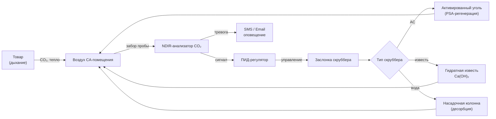

## Генерация CO₂ дыханием товара

Диоксид углерода (CO₂) непрерывно накапливается в CA-хранилищах в результате аэробного метаболизма хранящихся плодов и овощей. Скорость генерации зависит от нескольких факторов:

- **Вид товара**: яблоки выделяют 5–15 мг CO₂/(кг·ч) при 0–2 °C; брокколи — 60–90 мг/(кг·ч) при тех же условиях;
- **Температура**: скорость дыхания удваивается примерно при каждом повышении на 10 °C (принцип Q₁₀);
- **Концентрация O₂**: снижение до 1–3 % уменьшает дыхание на 30–50 % по сравнению с воздухом;
- **Стадия зрелости**: климактерические плоды показывают пиковое производство CO₂ в период созревания;
- **Продолжительность хранения**: интенсивность дыхания обычно снижается на 10–20 % при длительном хранении.

**Пример SI.** Хранилище объёмом 1130 м³ содержит 227 т яблок сорта Гренни Смит при 0 °C, 1,5 % O₂. При RR = 2–4 мг CO₂/(кг·ч) суточная генерация CO₂:

$$\dot{m}_{CO_2} = 227\,000 \text{ кг} \times 3 \times 10^{-3} \text{ г/(кг·ч)} \times 24 \text{ ч} = 16\,344 \text{ г/сут} \approx 16 \text{ кг/сут}$$

## Методы очистки CO₂

### Скрубберы с активированным углём (Activated Carbon Scrubbers)

Активированный уголь физически адсорбирует молекулы CO₂ на развитой поверхности (удельная поверхность 800–1200 м²/г).

**Рабочие параметры:**
- Адсорбционная ёмкость: 5–8 % CO₂ по массе сорбента при условиях хранения;
- Глубина слоя: 610–910 мм для коммерческих установок;
- Скорость подачи (face velocity): 250–500 м/ч через слой;
- Цикл адсорбции: 4–8 ч; регенерации: 2–4 ч продувкой наружным воздухом;
- Расход продувочного воздуха: в 2–3 раза превышающий объём слоя.

**Конструкция системы.** Скрубберы работают по схеме PSA (Pressure Swing Adsorption) с двумя и более слоями попеременно: пока один адсорбирует CO₂, другой регенерируется. Переключение — автоматически по сигналу breakthrough-анализатора на выходе.

**Преимущества**: нет расхода химикатов; регенерируемая система; одновременное удаление этилена. **Ограничения**: высокая капитальная стоимость; необходимость сжатого воздуха для регенерации; чувствительность к высокой влажности.

### Скрубберы с гидратной известью (Hydrated Lime Scrubbers)

Гидроксид кальция Ca(OH)₂ химически реагирует с CO₂:

$$\text{Ca(OH)}_2 + \text{CO}_2 \rightarrow \text{CaCO}_3 + \text{H}_2\text{O}$$

**Проектные спецификации:**
- Глубина слоя извести: 300–460 мм;
- Размер гранул: 4–8 меш (2–5 мм);
- Скорость воздушного потока через слой: 150–305 м/ч;
- Теоретическая ёмкость: 0,59 кг CO₂ на 1 кг Ca(OH)₂;
- Фактическая ёмкость (с учётом обводнения): 0,40–0,50 кг CO₂/кг;
- Интервал замены: при повышении downstream-CO₂ на 1–2 % выше уставки.

Толщина слоя рассчитывается на 7–14 сут работы до замены на основе ожидаемой суточной генерации CO₂. Реакция экзотермическая: выделяется ~178 кДж/кг CO₂ — учитывается в тепловом балансе хранилища.

**Преимущества**: низкая начальная стоимость; простая эксплуатация; нет электроэнергии для реакции. **Ограничения**: расходный химикат; трудовые затраты на замену; отходы CaCO₃; тепловыделение.

### Водяная абсорбция (Water Absorption Scrubbers)

CO₂ растворяется в воде по закону Генри (Henry's law): 1,7 объёма CO₂ на объём воды при 0 °C и атмосферном давлении. Растворимость возрастает с понижением температуры и давления; снижается с ростом pH при образовании бикарбоната.

**Параметры насадочной колонны:**
- Высота: 4,6–7,6 м;
- Насадка: кольца Рашига или Палла 25–50 мм;
- Соотношение жидкость/газ: 40–75 л воды на 1000 м³/ч воздуха;
- Температура воды: 0...+4 °C для максимального поглощения;
- Десорбция: продувка воздухом или нагрев для регенерации воды.

**Преимущества**: нет расходных химикатов при регенерации; высокая нагрузка CO₂. **Ограничения**: сложная система; риск микробного обрастания.

## Целевые уровни CO₂ по культурам


| Культура | Целевой диапазон CO₂ | Максимально безопасный | Симптомы повреждения CO₂ |
|---|---|---|---|
| Яблоки (большинство сортов) | 1–3 % | 5 % | Коричневое ядро (brown core), потемнение мякоти |
| Яблоки Гренни Смит | 0,5–1 % | 2 % | Высокая чувствительность |
| Груши Бартлетт | 0–1 % | 2 % | Разложение ядра (core breakdown) |
| Груши Анжу, Бос | 1–3 % | 5 % | Хорошая толерантность |
| Киви | 3–5 % | 7 % | Относительно толерантны |
| Вишня сладкая | 10–15 % | 20 % | CO₂ полезен; подавляет гниль |
| Брокколи | 5–10 % | 15 % | Пожелтение при избытке |
| Салат | 0–2 % | 3 % | Коричневое пятно (brown stain) выше 3 % |
| Лук | 0–1 % | 2 % | Изменение цвета кроющих чешуй |


### Механизмы повреждения CO₂

Избыточный CO₂ вызывает несколько физиологических нарушений:

- **Ферментационный метаболизм**: анаэробное дыхание производит этанол и ацетальдегид — посторонние запахи и вкусы;
- **Повреждение мембран**: CO₂ нарушает целостность клеточных мембран и ионный транспорт;
- **Ингибирование ферментов**: CO₂ подавляет ключевые дыхательные ферменты цикла Кребса;
- **Внутреннее потемнение (internal browning)**: окисление фенольных соединений, ускоренное CO₂-стрессом;
- **Потеря текстуры**: деградация клеточных стенок вследствие метаболического нарушения.

## Мониторинг и управление CO₂

### Технологии анализаторов

**Инфракрасные анализаторы NDIR (Non-Dispersive Infrared)** — промышленный стандарт:
- Принцип: CO₂ поглощает инфракрасное излучение на длине волны 4,26 мкм;
- Диапазон: 0–25 % CO₂; точность ±0,1 %;
- Время отклика: 30–60 с;
- Калибровка: ежемесячно стандартными газами (5–10 % CO₂ в N₂);
- Подготовка пробы: фильтрация частиц; осушение до точки росы −40 °C.

**Анализаторы на основе теплопроводности (Thermal Conductivity Detectors)**:
- Диапазон: 0–20 % CO₂; точность ±0,5 %;
- Ниже точностью, чем NDIR, но дешевле;
- Подвержены помехам от влажности и температуры.

### Стратегии управления

**Непрерывная очистка**: постоянный поток воздуха через скруббер с модулирующими заслонками. Типовой контур управления:

1. NDIR-анализатор измеряет CO₂ в помещении каждые 2–5 мин;
2. ПИД-регулятор модулирует расход воздуха через скруббер;
3. Пропорциональная полоса: 2–4 % CO₂; интегральное время: 10–20 мин.

**Прерывистая очистка (on/off)**: скруббер включается при достижении верхнего порога CO₂ и отключается при нижнем. Дифференциал 0,5–1 % предотвращает частые переключения.

**Пример настройки**: цель 3 % CO₂; скруббер включается при 3,5 %, отключается при 2,5 % — дифференциал 1 %.

## Взаимосвязь с теплом дыхания и холодильной системой

Скрубберы с гидратной известью выделяют тепло реакции 178 кДж/кг CO₂. При суточной выработке 16 кг CO₂ (пример выше):

$$Q_{\text{скруббер}} = \frac{16 \times 178}{24} \approx 119 \text{ Вт}$$

Это дополнительная нагрузка на холодильную систему хранилища. Скруббер следует располагать после охлаждающих змеевиков (downstream) для удаления конденсата перед подачей воздуха в сорбент.

**Координация с генератором N₂**: подача N₂ и удаление CO₂ должны быть согласованы по расходам для поддержания целевых концентраций O₂ и CO₂ одновременно. Дополнительная подача N₂ при работе скруббера предотвращает нежелательный подъём O₂.

**Очистка этилена**: комбинированные системы с активированным углём удаляют CO₂ и этилен одновременно; в системах с гидратной известью дополнительно устанавливают каталитический конвертер этилена.

## Интеграция в систему CA-хранилища

## Требования безопасности

- **Сигнал тревоги высокого CO₂**: на 2–3 % выше максимально безопасного уровня для культуры;
- **Вход персонала**: вентиляция до CO₂ < 0,5 % (ПДК по OSHA: 5000 ppm = 0,5 %);
- **Замкнутое пространство**: CA-помещения — permit-required confined spaces согласно OSHA 29 CFR 1910.146 из-за дефицита O₂;
- **Аварийная вентиляция**: не менее 12 воздухообменов в час при эвакуации;
- **Мониторинг кислорода**: O₂ > 19,5 % перед входом персонала;
- **Непрерывная регистрация**: все параметры газов с архивом не менее 2 лет.

## Нормативная база

- ASHRAE Handbook — Refrigeration (2022), главы 21, 25, 47;
- ASHRAE 15-2022 — Safety Standard for Refrigeration Systems;
- ISO 5149-1:2014 — Refrigerating systems and heat pumps;
- EN 378-1:2016+A1:2021 — Safety and environmental requirements;
- OSHA 29 CFR 1910.146 — Permit-Required Confined Spaces;
- IIAR Bulletin 116 — Guidelines for Component Maintenance;
- ГОСТ 28547–90 — Холодильные установки; общие технические требования;
- СП 60.13330.2022 — Отопление, вентиляция и кондиционирование воздуха.

Надлежащее управление CO₂ продлевает срок хранения на 30–100 % по сравнению с обычным охлаждаемым хранением, что экономически оправдывает капитальные затраты для высокоценной продукции при длительном хранении.
