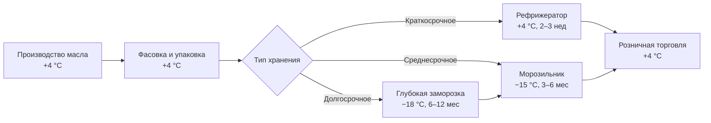

## Обзор

Масло сливочное (butter) — скоропортящийся молочный продукт с массовой долей жира не менее 72,5 % (ГОСТ 32261–2013). Оно высокочувствительно к температуре, световому излучению, кислороду и посторонним запахам. Холодильные системы для хранения масла должны обеспечивать точный температурный режим, барьерную защиту от внешних загрязнений и минимальные колебания микроклимата. При рефрижерации (+4 °C) срок хранения составляет 2–3 недели, при глубоком замораживании (−18 °C и ниже) — до 12 месяцев.

Согласно техническому регламенту Таможенного союза ТР ТС 033/2013, все категории масла сливочного требуют непрерывного холодного хранения для поддержания органолептических характеристик и микробиологической безопасности. Система охлаждения (refrigeration system) должна предотвращать окисление жиров (fat oxidation), конденсацию влаги на упаковке и миграцию посторонних запахов через жировую матрицу.

## Физические принципы деградации

Деградация масла протекает по двум основным механизмам: окислительному и микробиологическому.

### Окислительная прогорклость

Автокаталитическое расщепление триглицеридов молекулярным кислородом с образованием гидроперекисей и альдегидов подчиняется уравнению Аррениуса (Arrhenius equation):


k = k_0 \exp\!\left(-\frac{E_a}{RT}\right)


где $k$ — константа скорости окисления (с⁻¹); $E_a \approx 50$–$80$ кДж/моль — энергия активации (зависит от сорта и упаковки); $R = 8{,}314$ Дж/(моль·К); $T$ — абсолютная температура (К).

Каждые 10 °C повышения температуры ускоряют окисление в 2–3 раза (правило Q₁₀). Хранение при −18 °C снижает скорость окисления примерно в 1000 раз по сравнению с 20 °C.

### Микробиологический контроль

При +4 °C размножение мезофильных бактерий замедляется, однако не прекращается: психротрофные виды (Pseudomonas spp.) сохраняют активность. При −18 °C микроорганизмы переходят в анабиоз (dormancy), что гарантирует микробиологическую безопасность в течение 6–12 месяцев при условии первоначально низкой обсеменённости и герметичной упаковки.

### Поглощение посторонних запахов

Жировая матрица масла легко адсорбирует летучие органические соединения из воздуха камеры. Защита достигается герметичной упаковкой и строгим зонированием хранилища: исключается совместное хранение с рыбой, острыми специями и другими высокоароматными продуктами.

## Температурные режимы хранения


| Режим | Температура | Влажность, % ОВ | Срок хранения | Назначение |
|---|---|---|---|---|
| Рефрижерация (refrigeration) | +4 ±1 °C | 85–90 | 2–3 недели | Розничные полки, РЦ |
| Морозильное хранение | −12…−15 °C | 80–85 | 3–6 месяцев | Среднесрочный запас |
| Глубокое замораживание (deep freeze) | −18 °C и ниже | 75–80 | 6–12 месяцев | Стратегические резервы |


Допуск температуры при рефрижерации — ±1 °C; при морозильном хранении — ±2 °C согласно ISO 23953 (cold chain equipment). Электронные регуляторы (Danfoss AK, CAREL IR33, Eliwell ID974) обеспечивают точность поддержания ±0,5 °C.

## Компоненты и конструкция холодильной системы

### Теплоизоляция (thermal insulation) ограждающих конструкций

Стены камеры выполняются из жёсткого пенополиуретана (polyurethane foam, PUF) или экструдированного пенополистирола (XPS). Минимальная толщина:

- для камеры +4 °C — 80 мм, коэффициент теплопередачи $U \leq 0{,}35$ Вт/(м²·К);
- для камеры −18 °C — 150 мм, $U \leq 0{,}25$ Вт/(м²·К).

Двери оснащаются силиконовыми уплотнителями, подогреваемыми порогами и воздушными завесами (air curtain) при частых открываниях. Инфильтрация воздуха не должна превышать 0,5 % суммарного теплопритока камеры.

### Воздухоохладители (evaporative unit coolers)

Выбор испарителя (evaporator) зависит от температурного режима:

- **Камера +4 °C:** температура кипения хладагента (evaporating temperature) $t_0 = -5$…$-10$ °C; температурный напор $\Delta T = 10$–$12$ К; оребрение 8–10 рядов/дюйм.
- **Камера −18 °C:** $t_0 = -25$…$-30$ °C; $\Delta T = 12$–$16$ К; оребрение 10–12 рядов/дюйм.

Материал трубок — медь или алюминий с эпоксидным или алкидным покрытием против коррозии. Скорость циркуляции воздуха в зоне продукта — 0,3–0,5 м/с (исключает образование ледяных «мёртвых зон»).

### Управление влажностью (humidity control)

Целевой диапазон относительной влажности — 75–85 %. Осушение достигается за счёт конденсации влаги на холодном испарителе. При необходимости применяются вспомогательные адсорбционные осушители на основе силикагеля или молекулярных сит (molecular sieve). Упаковка из ламинированного картона и пергамента снижает поглощение влаги продуктом.

### Защита от ультрафиолетового облучения

Масло сливочное чувствительно к УФ-излучению при длинах волн $\lambda < 400$ нм, которое катализирует фотоокисление (photo-oxidation) жиров. Холодильные камеры оборудуются:

- светодиодным освещением LED 4000–5000 K (не более 10 Вт/м³);
- непрозрачными дверями или жалюзи на остеклении;
- реле присутствия для автоматического отключения освещения при отсутствии персонала.

## Расчёт холодильной нагрузки

### Суммарный тепловой поток


Q_{\mathrm{total}} = Q_{\mathrm{tr}} + Q_{\mathrm{inf}} + Q_{\mathrm{prod}} + Q_{\mathrm{equip}}


**Передача тепла через ограждение (transmission load):**


Q_{\mathrm{tr}} = U \cdot A \cdot \Delta T_{\mathrm{mean}}


**Инфильтрация воздуха (infiltration load):**


Q_{\mathrm{inf}} = \dot{m}_{\mathrm{air}} \cdot c_p \cdot \Delta T


где $c_p = 1{,}005$ кДж/(кг·К) — удельная теплоёмкость воздуха.

**Охлаждение продукта (product load):**


Q_{\mathrm{prod}} = m_{\mathrm{butter}} \cdot c_{\mathrm{butter}} \cdot \Delta T_{\mathrm{prod}}


где $c_{\mathrm{butter}} \approx 3{,}0$ кДж/(кг·К) — удельная теплоёмкость масла сливочного.

### Пример расчёта — камера рефрижерации (+4 °C)

**Условия:** объём камеры 50 м² × 3,5 м = 175 м³; ограждение 55 м², $U = 0{,}30$ Вт/(м²·К); наружная температура +28 °C; дневная загрузка 500 кг масла при +15 °C.

Теплоприток через ограждение при $\Delta T = 24$ К:


Q_{\mathrm{tr}} = 0{,}30 \times 55 \times 24 = 396\ \text{Вт}


Охлаждение 500 кг масла с +15 °C до +4 °C ($\Delta T = 11$ К) за 8 ч:


Q_{\mathrm{prod}} = \frac{500 \times 3{,}0 \times 11}{8 \times 3600} \approx 573\ \text{Вт}


Инфильтрация (10 открываний двери в смену) — ориентировочно 400 Вт; оборудование — 200 Вт.

**Суммарная пиковая нагрузка:**


Q_{\mathrm{total}} \approx 396 + 573 + 400 + 200 \approx 1{,}57\ \text{кВт}


### Подбор компрессора

Коэффициент эффективности (COP, coefficient of performance) холодильной установки при рефрижерации (+4 °C, конденсация +40 °C):


\mathrm{COP} = \frac{Q_0}{P_{\mathrm{comp}}} \approx 3{,}5\text{–}4{,}5


При $Q_{\mathrm{total}} \approx 8$ кВт (с учётом запаса 15–20 %):


P_{\mathrm{comp}} = \frac{8}{4{,}0} = 2{,}0\ \text{кВт}


Рекомендуется герметичный спиральный компрессор (scroll compressor) 2,5–3,0 кВт на хладагенте R-448A (GWP = 1387) или R-290 (пропан, GWP = 3) согласно Регламенту ЕС 517/2014 о фторсодержащих газах.

## Типовые схемы применения

### Розничные холодильные витрины (retail display cases)

Объём 50–300 л; температура +4 °C; цикл разморозки испарителя (defrost cycle) — каждые 4–6 ч; хладагент R-600a (изобутан) или R-290; COP ≈ 3,0–3,5. Управление — программируемый контроллер CAREL pCO или Danfoss EKC.

### Холодильные камеры оптовых складов (cold storage warehouses)

Объём 100–500 м³; централизованная холодильная установка (central refrigeration plant) с двумя-тремя компрессорами; хладагент R-404A (в действующих системах) или R-448A (в новых); система мониторинга с регистрацией температуры каждые 15 мин.

### Морозильные камеры хранения (deep-freeze storage, −18 °C)

Объём ≥ 1000 м³ для стратегических резервов; двухступенчатый компрессор (two-stage compressor) или каскадная система (cascade system) на R-507A/R-23; допуск температуры ±1 °C; аварийная сигнализация при $T > -15\ °C$.

## Диаграмма технологической цепочки





## Энергоэффективность и оптимизация


| Мероприятие | Экономия энергии | Примечание |
|---|---|---|
| Инвертерный привод компрессора (VFD) | 20–30 % | Окупаемость 2–3 года |
| Экономайзер (flash gas economizer) | 5–10 % | Повышение COP |
| Рекуперация тепла конденсатора (heat recovery) | 15–25 % | Нагрев горячей воды |
| Теплоизоляция U ≤ 0,25 Вт/(м²·К) | 15–20 % | Относительно U = 0,40 |
| Воздушные завесы на дверях | 10–15 % | Снижение инфильтрации |


Удельное энергопотребление холодильной системы: 40–60 кВт·ч/(м³·год) при рефрижерации (+4 °C) в стабилизированных условиях. Для морозильной камеры (−18 °C): 80–120 кВт·ч/(м³·год).

## Типовые ошибки проектирования

1. **Недостаточная теплоизоляция** — перерасход электроэнергии 30–50 %; решение: толщина PUF не менее 100 мм для +4 °C и 150 мм для −18 °C.

2. **Отсутствие защиты от УФ и посторонних запахов** — окисление и прогоркание масла за 3–4 недели; решение: светонепроницаемые двери, герметичные уплотнители, зонирование склада.

3. **Колебания температуры ±3 °C** — льдообразование на испарителе, разрыхление упаковки; решение: электронный расширительный клапан (EEV) с точностью регулирования ±0,5 °C.

4. **Занижение холодопроизводительности** — недостаточное охлаждение при пиковой загрузке; решение: расчётный запас 15–20 %, ступенчатые или инвертерные компрессоры.

5. **Неверный подбор хладагента** — несовместимость с компрессорным маслом, утечки; решение: новые установки проектировать под R-448A или R-290 с полиолэфирным маслом (POE oil).

## Применяемые стандарты и нормативы

- **ГОСТ 32261–2013** — Масло сливочное. Технические условия.
- **ТР ТС 033/2013** — Технический регламент о безопасности молочной продукции.
- **ГОСТ Р 30494–2016** — Микроклимат в помещениях складов и холодильников.
- **СП 60.13330.2020** (актуализированный СНиП 41-01-2003) — Отопление, вентиляция и кондиционирование воздуха.
- **ASHRAE Handbook — Refrigeration** (2022), глава 19 «Food Storage Requirements».
- **ASHRAE 34–2022** — Обозначение и классификация хладагентов (designation and safety classification of refrigerants).
- **ASHRAE 15–2022** — Safety Standard for Refrigeration Systems.
- **ISO 23953–2005** — Refrigerated display cabinets. Definitions and classification.
- **EN 378–2016** — Refrigerating systems and heat pumps. Safety and environmental requirements.
- **ГОСТ 28547–90** — Установки холодильные. Термины и определения.
