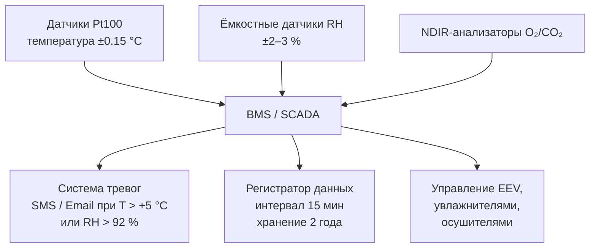

## Обзор

Сыр (cheese) — высокоценный молочный продукт с разнообразным биохимическим составом: влага 30–55 %, белки 20–35 %, жиры 25–35 % в зависимости от типа. Скорость протеолиза, липолиза и микробиологической деградации определяется температурой и влажностью хранения. Холодильные системы для сыра должны обеспечивать однородное температурное поле с отклонением не более ±0,5 °C по объёму камеры, стабильную относительную влажность 80–85 % и контролируемую циркуляцию воздуха без конденсации на поверхности продукта.

В соответствии с ТР ТС 033/2013 (молочная продукция) и рекомендациями ASHRAE Handbook — Refrigeration (2022), глава 19, холодильные камеры для сыра оснащаются системами непрерывного мониторинга температуры (точность ±0,5 °C), датчиками влажности (погрешность ±2–3 % RH) и регистраторами данных (data logger) с интервалом записи не более 15 мин.

## Физические принципы деградации

### Кинетика биохимических реакций

Скорость протеолиза и липолиза в сырах подчиняется уравнению Аррениуса (Arrhenius equation):


k = A \cdot \exp\!\left(-\frac{E_a}{RT}\right)


где $k$ — константа скорости реакции (с⁻¹); $A$ — предэкспоненциальный фактор; $E_a = 40$–$60$ кДж/моль — энергия активации для молочных продуктов; $R = 8{,}314$ Дж/(моль·К); $T$ — абсолютная температура (К).

Повышение температуры на 8–10 °C удваивает скорость микробиального размножения, включая психротрофные патогены (*Listeria monocytogenes*, *Salmonella* spp.). Поддержание диапазона 2–4 °C замедляет их метаболизм в 100–1000 раз по сравнению с +20 °C.

### Транспорт влаги внутри сыра

Влага мигрирует в сыре по механизму капиллярного переноса согласно закону Фика (Fick's law):


J = -D \cdot \nabla c


где $J$ — поток влаги, кг/(м²·с); $D$ — коэффициент диффузии, м²/с; $\nabla c$ — градиент концентрации. При влажности камеры ниже 75 % усыхание поверхностного слоя сыра достигает 2–3 % массы в неделю, что вызывает растрескивание корки и нежелательный налёт плесени.

### Окисление жиров и контроль кислорода

Скорость окисления жировой фракции зависит от парциального давления кислорода:


r_{\mathrm{ox}} = k_{\mathrm{ox}} \cdot p_{\mathrm{O_2}}^n


где $n \approx 0{,}5$–$1{,}0$ для липидных систем. При $p_{\mathrm{O_2}} > 5$ кПа окисление становится интенсивным, что обуславливает применение вакуумной упаковки (vacuum packaging) или упаковки в модифицированной газовой среде MAP (modified atmosphere packaging) с заменой кислорода азотом.

## Температурные режимы по типам сыра


| Тип сыра | Температура хранения, °C | Влажность, % ОВ | Срок хранения |
|---|---|---|---|
| Твёрдый (Чеддер, Пармезан, Эмменталь) | 4–8 | 80–85 | 3–12 месяцев |
| Полутвёрдый (Гауда, Маасдам, Тильзитер) | 2–8 | 80–85 | 2–6 месяцев |
| Мягкий (Камамбер, Бри) | 2–4 | 80–85 | 1–2 недели |
| Голубая плесень (Горгонзола, Рокфор, Данаблю) | 2–4 | 85–90 | 2–3 недели |
| Свежий (Рикотта, творог, Маскарпоне) | 0–2 | 85–95 | 3–5 дней |
| Козий с белой плесенью | 2–4 | 85–90 | 1–2 недели |


### Твёрдый сыр

Твёрдые сыры (Чеддер, Пармезан, Грана Падано) содержат 30–40 % влаги и развитую кристаллическую матрицу лактата кальция. Оптимальный диапазон 4–8 °C (предпочтительно 6–7 °C) замедляет нежелательный неолиз. При $T < 4$ °C возможно выпадение жировой фракции с образованием песчанистой текстуры; при $T > 8$ °C ускоряется жировое окисление и рост плесневых грибов.

Система охлаждения должна обеспечивать отклонение температуры не более ±1 °C по объёму камеры. Циркуляция воздуха 0,2–0,5 м/с равномерно распределяет температурное поле без конденсации на поверхности сыра. Разморозку испарителя (defrost cycle) проводят в ночные часы с отключением циркуляции.

### Мягкий сыр

Мягкие сыры (Камамбер, Бри, сливочный) с содержанием влаги 45–55 % чрезвычайно чувствительны к колебаниям $T$ и ОВ. Режим 3 ±1 °C предотвращает размножение *Listeria monocytogenes* и других психротрофных патогенов. При ОВ ниже 75 % — растрескивание корки, выше 90 % — неконтролируемый рост нежелательной плесени.

### Сыры с плесенью (blue cheese, white mold cheese)

Голубые сыры (Горгонзола, Рокфор) содержат живые культуры *Penicillium roqueforti*. Оптимум: 2–4 °C, ОВ 85–90 %. Парциальное давление кислорода поддерживается в диапазоне 10–15 кПа для контролируемой активации плесневого метаболизма. Сыры с белой плесенью (козий, Шеврот) требуют защиты от вторичного заражения: на входе в камеру устанавливают HEPA-фильтры класса H13 (задержка частиц ≥ 0,3 мкм — 99,95 %).

## Компоненты холодильной системы

### Испарители и воздухораспределение (evaporators and air distribution)

Температура поверхности испарителя — $-5$…$-8$ °C (исключает прямое обмораживание продукта). Размещение — потолочное горизонтальное, пластинчато-трубчатые или трубчатые испарители. Рекомендуемое число воздухообменов (air changes per hour, ACH): 4–6 ч⁻¹.

Скорость воздуха в зоне продукта: 0,2–0,5 м/с, измеряется на расстоянии 0,3 м от ближайшей поверхности сыра. Скорость выше 0,8 м/с — пересыхание поверхности; ниже 0,15 м/с — неравномерность температуры.

### Система управления влажностью (humidity control)

Для поддержания ОВ 80–85 % применяются:

1. **Гигростатические терморасширительные клапаны** — регулируют дросселирование хладагента по сигналу датчика влажности.
2. **Ультразвуковые или паровые увлажнители** — включаются при ОВ < 75 %; производительность 2–5 л/ч на 10–20 м³ объёма камеры.
3. **Адсорбционные осушители** (силикагель, молекулярные сита) — включаются при ОВ > 90 %.

### Контролируемая атмосфера (CA/MAP) для сыров с плесенью

Для голубых сыров применяется инъекция смеси N₂/CO₂ с целью снижения $p_{\mathrm{O_2}}$ до 5–15 кПа. Состав атмосферы контролируется анализаторами O₂ и CO₂ типа NDIR (non-dispersive infrared). Типовой состав MAP для голубых сыров: 70 % N₂ + 30 % CO₂.

### Упаковочные материалы

- **Кислородный барьер:** материалы с проницаемостью O₂ менее 1 см³/(м²·сут·атм) — многослойная плёнка EVOH (ethylene vinyl alcohol), PET/Al/PE.
- **Барьер к водяному пару:** водопаропроницаемость (WVT) менее 5 г/(м²·сут) при 38 °C, 90 % ОВ.
- **Вакуумная упаковка** (остаточное давление 1–5 кПа): снижает окисление жиров в 10–20 раз, блокирует доступ микроорганизмов.

## Расчёт тепловой нагрузки

### Суммарная холодильная нагрузка


Q_{\mathrm{total}} = Q_{\mathrm{tr}} + Q_{\mathrm{inf}} + Q_{\mathrm{prod}} + Q_{\mathrm{misc}}


**Теплопередача через ограждение** при коэффициенте теплопередачи PUF-панели 100 мм ($\lambda = 0{,}025$ Вт/(м·К)):


U = \frac{\lambda}{d} = \frac{0{,}025}{0{,}1} = 0{,}25\ \text{Вт/(м}^2\text{·К)}


**Пример:** камера хранения сыра $V = 15$ м³, площадь ограждения $A \approx 55$ м², $\Delta T = 25$ К (+25 °C снаружи, +3 °C внутри):


Q_{\mathrm{tr}} = 0{,}25 \times 55 \times 25 = 344\ \text{Вт}


**Охлаждение продукта** — 1000 кг сыра с +15 °C до +3 °C ($\Delta T = 12$ К) за $\tau = 12$ ч; $c_{\mathrm{cheese}} \approx 3{,}5$ кДж/(кг·К):


Q_{\mathrm{prod}} = \frac{1000 \times 3500 \times 12}{12 \times 3600} = 972\ \text{Вт}


Инфильтрация и прочие источники — ориентировочно 150 Вт.

**Суммарная нагрузка:** $Q_{\mathrm{total}} \approx 344 + 972 + 150 = 1{,}47$ кВт.

### Подбор компрессора


\mathrm{COP} = \frac{Q_{\mathrm{evap}}}{W_{\mathrm{comp}}} \approx 3{,}5\text{–}4{,}5
\quad\Rightarrow\quad
W_{\mathrm{comp}} = \frac{1{,}5}{4{,}0} = 0{,}375\ \text{кВт}


Выбирается герметичный спиральный компрессор (hermetic scroll compressor) 0,5–0,75 кВт на хладагенте R-134a (GWP 1430) или R-513A (GWP 631) как низкопотенциальная замена.

## Типовая конфигурация сырохранилища


| Зона | Назначение | Температура, °C | Площадь, м² |
|---|---|---|---|
| Зона 1 | Вызревание твёрдого сыра | 6–8 | 100 |
| Зона 2 | Хранение мягкого и плесневого сыра | 2–4 | 80 |
| Зона 3 | Упаковка и фасовка | 4–6 | 40 |
| Зона 4 | Приёмка и первичная сортировка | 8–10 | 30 |


Каждая зона оснащается независимым испарителем, электронным расширительным клапаном (EEV) и датчиками $T$/$RH$. Головной компрессор или компрессорная группа обслуживает испарители через балансировочный коллектор с регуляторами давления испарения (EPR, evaporator pressure regulator).

## Диаграмма системы мониторинга





## Сезонные корректировки и free cooling

В холодных климатических зонах (Россия, Скандинавия) при наружной температуре $T_{\mathrm{ext}} < +8$ °C целесообразно применять фрикулинг (free cooling) — охлаждение камеры наружным воздухом через воздухо-воздушный теплообменник (bypass компрессора). Экономия энергопотребления: 30–50 % в переходный период (март–май, сентябрь–ноябрь).

Летом (наружная температура +28…+32 °C) расчётная нагрузка возрастает на 20–30 % — необходимо закладывать соответствующий запас холодопроизводительности.

## Энергопотребление

Типовые значения энергопотребления сырохранилища объёмом 100 м³:

- Без оптимизации: 30–40 кВт·ч/сут (летний период);
- С фрикулингом и рекуперацией тепла конденсатора: 15–20 кВт·ч/сут;
- С инвертерным компрессором: дополнительная экономия 15–25 %.

Срок окупаемости инвертерной системы при интенсивной эксплуатации — 2–3 года.

## Типовые ошибки проектирования

1. **Избыточное охлаждение ($T < 0$ °C)** — кристаллизация жиров, песчанистость текстуры; решение: EEV с датчиком перегрева + регулятор давления испарения (EPR).
2. **Конденсация на продукте** — рост плесени, химическое загрязнение упаковки; решение: контроль ОВ в диапазоне 75–90 %, воздушные завесы на дверях.
3. **Неравномерность температуры** — ускоренное созревание в центре камеры; решение: 6–8 ACH, активные воздуховоды с щелевыми диффузорами.
4. **Окисление жировой фракции** — горький привкус, пожелтение; решение: вакуумная или MAP-упаковка, O₂ < 3 %, LED-освещение без УФ.
5. **Пересыхание поверхности сыра** — растрескивание корки, потеря массы > 2 % в неделю; решение: ОВ 85–88 %, ультразвуковые увлажнители.

## Применяемые стандарты и нормативы

- **ТР ТС 033/2013** — Технический регламент о безопасности молочной продукции.
- **ГОСТ Р 52054–2003** — Молоко коровское сырое. Требования к хранению молочного сырья.
- **ГОСТ Р 50961–96** — Система HACCP (Hazard Analysis and Critical Control Points) для пищевых производств.
- **СП 60.13330.2020** (актуализированный СНиП 41-01-2003) — Отопление, вентиляция и кондиционирование воздуха.
- **СП 332.1325800.2017** — Проектирование холодильных установок.
- **ASHRAE Handbook — Refrigeration** (2022), глава 19 «Food Storage Requirements».
- **ASHRAE 34–2022** — Designation and Safety Classification of Refrigerants.
- **ASHRAE 15–2022** — Safety Standard for Refrigeration Systems.
- **EN 378–2016** — Refrigerating systems and heat pumps. Safety and environmental requirements.
- **ISO 5149–2014** — Refrigerating systems and heat pumps. Safety and environmental requirements.
- **ГОСТ 28547–90** — Установки холодильные. Термины и определения.
