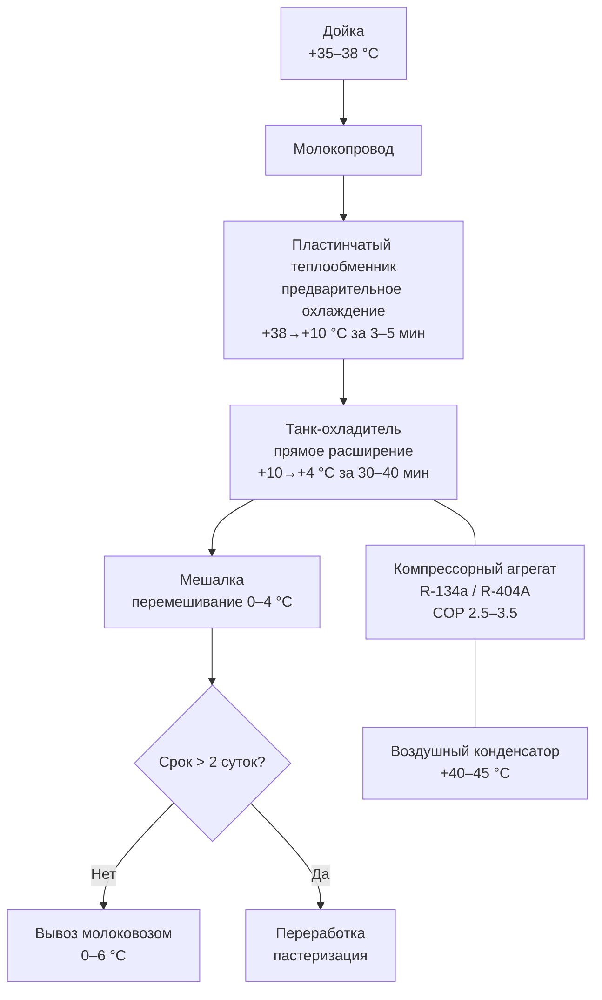

## Обзор

Молоко — скоропортящийся пищевой продукт, требующий непрерывного соблюдения температурного режима от момента дойки до реализации. В зависимости от типа тепловой обработки (сырое, пастеризованное, ультрапастеризованное) предъявляются различные требования к скорости охлаждения, температуре хранения и срокам годности. Биологическая опасность определяется экспоненциальным ростом психротрофных и мезофильных микроорганизмов при повышении температуры. Эффективная система охлаждения должна обеспечивать быстрое снятие тепла с только что надоенного молока и поддерживать однородную температуру по всему объёму хранилища.

## Физические принципы

### Рост микробной популяции

Основной механизм порчи молока — размножение психротрофных и мезофильных микроорганизмов, а также активизация ферментов (липазы, протеазы), вызывающих гидролиз жиров и белков. Численность микробной популяции описывается уравнением экспоненциального роста:


N(t) = N_0 \cdot e^{\mu t}


где $N(t)$ — число клеток в момент $t$; $N_0$ — начальная численность; $\mu$ — удельная скорость роста (ч⁻¹).

При $T = 4$ °C значение $\mu$ для психротрофов снижается в 5–10 раз по сравнению с $T = 20$ °C, что увеличивает период безопасного хранения с нескольких часов до 7–10 суток для пастеризованного молока.

### Теплопередача через стенки танка

Теплоприток из окружающей среды к молоку в танке-охладителе:


Q = U \cdot A \cdot \Delta T


где $Q$ — тепловой поток (Вт); $U$ — коэффициент теплопередачи (Вт/(м²·К)); $A$ — площадь поверхности (м²); $\Delta T$ — разность температур (К).

Для типового фермерского танка объёмом 2000 л с PUF-изоляцией 80 мм ($U \approx 0{,}30$ Вт/(м²·К)) при $\Delta T = 24$ К теплоприток составляет около 120 Вт — на два порядка меньше, чем нагрузка охлаждения молока.

### Скорость охлаждения (cooling rate)

Согласно ASHRAE Handbook — Refrigeration (2022) и ГОСТ 3662–2014, молоко должно охлаждаться со скоростью не менее 1–2 °C/мин на первом этапе: от +38 °C (температура после дойки) до +10 °C — для подавления размножения психротрофов. Второй этап (от +10 °C до +4 °C) допускает более медленное охлаждение за 30–40 мин.

## Типы молока и режимы хранения

### Сырое молоко (raw milk)

Сырое молоко содержит все классы микроорганизмов, включая патогенные. Требования:

- немедленное охлаждение до **+4 °C** в течение 2 ч после дойки;
- непрерывный мониторинг температуры датчиками Pt100 (погрешность ≤ ±0,5 °C по ГОСТ Р 52070–2003);
- максимальный срок хранения до переработки — **2–3 суток**;
- перемешивание мешалкой (0,5–2 кВт) для предотвращения стратификации и отстоя сливок.

### Пастеризованное молоко (pasteurized milk, HTST)

Нагрев 72–76 °C, выдержка 15–20 с (high-temperature short-time, HTST). После пастеризации сохраняются психротрофные виды (*Pseudomonas*, *Bacillus* spp.), адаптированные к холоду. Характеристики хранения:

- температура: **0–4 °C**;
- срок годности: **7–10 суток** в герметичной упаковке;
- при $T > 7$ °C срок сокращается до 3–5 суток.

### Ультрапастеризованное молоко (UHT milk)

Нагрев 135–150 °C, выдержка 2–5 с. Разрушаются вегетативные формы микроорганизмов и большая часть спор. При асептической фасовке и закрытой упаковке:

- хранение при **+4 °C**: срок годности до 30 суток;
- хранение при комнатной температуре до +25 °C: до 90 суток (согласно ГОСТ Р 52090–2003);
- после вскрытия упаковки — хранить при +4 °C не более 3–5 суток.

## Компоненты системы охлаждения молока

### Холодильный агрегат (refrigeration unit)

Для ферм и молокозаводов применяются:

- **Герметичные компрессоры** (2–15 кВт) — для танков объёмом до 5000 л;
- **Полугерметичные компрессоры** (15–50 кВт) — для производства 20–100 т/сут;
- **Аммиачные установки** (NH₃) — для крупных молокозаводов, производительность 100–500 т/сут.

Хладагент выбирается в соответствии с Регламентом ЕС 517/2014 и российскими требованиями по фазированию ХФУ/ГХФУ: R-134a, R-404A (в действующих системах), R-513A или R-448A (в новых).

COP цикла при $t_0 = -5$ °C, $t_k = +40$ °C: 2,5–3,5 для поршневых и спиральных компрессоров.

### Теплообменники (heat exchangers)

Для молока применяются:

- **Пластинчатые теплообменники** (PHE, plate heat exchanger) — КПД 85–95 %, $U = 800$–$1200$ Вт/(м²·К);
- **Трубчатые теплообменники** (tubular HE) — для высоковязких и сырых продуктов;
- **Скребковые испарители** (scraped surface evaporator) — в танках-охладителях прямого охлаждения.

Площадь поверхности теплообменника:


A = \frac{Q}{U \cdot \Delta T_{\mathrm{lm}}}


где $\Delta T_{\mathrm{lm}}$ — логарифмическая средняя разность температур (K).

### Система перемешивания (agitation system)

В танках объёмом более 1000 л обязательно постоянное перемешивание (лопастная мешалка, 0,5–2 кВт) для устранения стратификации и обеспечения однородного охлаждения. Скорость циркуляции охлаждающей среды (смесь воды с пропиленгликолем): не менее 1–3 м³/ч на 1000 л молока.

## Расчёт нагрузки охлаждения

### Нагрузка охлаждения молока от температуры дойки


Q = m \cdot c_p \cdot (t_1 - t_2)


где $m$ — масса молока (кг); $c_p \approx 3{,}93$ кДж/(кг·К) — удельная теплоёмкость молока; $t_1 = 38$ °C — температура после дойки; $t_2 = 4$ °C — температура хранения.

**Пример расчёта:** суточный надой фермы 5000 кг:


Q = 5000 \times 3{,}93 \times (38 - 4) = 668\,100\ \text{кДж} = 185{,}6\ \text{кВт·ч}


При требовании охладить за 2 ч требуемая холодопроизводительность:


\dot{Q} = \frac{185{,}6\ \text{кВт·ч}}{2\ \text{ч}} = 92{,}8\ \text{кВт}


### Тепловые потери через стенки танка

Для танка с поверхностью $A = 20$ м², PUF-изоляцией 80 мм ($\lambda = 0{,}025$ Вт/(м·К)), $\Delta T = 24$ К (+28 °C снаружи, +4 °C молоко):


U = \frac{0{,}025}{0{,}08} = 0{,}31\ \text{Вт/(м}^2\text{·К)};
\quad Q_{\mathrm{tr}} = 0{,}31 \times 20 \times 24 = 149\ \text{Вт}


### Итоговая холодопроизводительность агрегата


\dot{Q}_{\mathrm{total}} = \dot{Q}_{\mathrm{cool}} + Q_{\mathrm{tr}} + Q_{\mathrm{agit}} + Q_{\mathrm{misc}}


Тепло от мешалки и насоса циркуляции добавляет 5–10 % к $\dot{Q}_{\mathrm{cool}}$. Выбираемый агрегат должен иметь запас холодопроизводительности 20–30 % сверх расчётной нагрузки.

## Микробиологические показатели сырого молока


| Показатель | Класс I | Класс II | Класс III |
|---|---|---|---|
| КМАФАнМ (мезофилы), КОЕ/см³ | до 100 000 | 100 001–500 000 | 500 001–1 000 000 |
| Психротрофные бактерии, КОЕ/см³ | до 10 000 | 10 001–50 000 | 50 001–100 000 |


При уровне психротрофов выше 10⁵ КОЕ/см³ молоко должно быть переработано в течение 24 ч. Психротрофные виды (*Pseudomonas aeruginosa*, *Listeria monocytogenes*, *Bacillus cereus*) способны размножаться при $T < 10$ °C, вызывая гидролиз казеина и появление прогорклого вкуса в пастеризованном молоке даже при соблюдении температурного режима.

## Диаграмма системы охлаждения молока на ферме





## Применение в промышленных холодильных системах

На молокозаводах и распределительных холодильниках применяются централизованные системы охлаждения с аммиаком (NH₃) или фторсодержащими хладагентами, питающие зоны хранения молока при $-0{,}5$…$+4$ °C. Системы с переменной производительностью (VAV, variable air volume) адаптируют работу компрессора к колебаниям теплопритока в течение суток. Энергопотребление холодильной системы молокозавода производительностью 50 т/сут: 400–600 кВт·ч/сут при COP ≈ 3.

## Практические рекомендации

1. **Скорость охлаждения:** молоко должно остыть с +38 °C до +10 °C за 20–30 мин; с +10 °C до +4 °C — за дополнительные 30–40 мин (требование ГОСТ 3662–2014 и ASHRAE Handbook, глава 19).

2. **Мониторинг:** непрерывная регистрация температуры; разница между верхней, средней и нижней точкой танка — не более 1–2 °C.

3. **Гигиена оборудования:** ежедневная CIP (Cleaning-in-Place) мойка теплообменников и трубопроводов горячей водой (+80 °C) или щелочными/кислотными моющими средствами.

4. **Упаковка:** асептическая упаковка (Tetra Pak, стекло, ПЭТФ) исключает вторичное заражение и частично замедляет окисление жиров.

5. **Аварийная сигнализация:** при $T > +6$ °C в танке или хранилище — автоматическое оповещение персонала (SMS, звуковая сирена); задержка отклика не более 15 мин.

## Применяемые стандарты и нормативы

- **ГОСТ 3662–2014** — Молоко коровское сырое. Технические условия.
- **ГОСТ 3663–2015** — Молоко коровское. Требования при закупке.
- **ГОСТ Р 52070–2003** — Молоко и молочные продукты. Методы микробиологического анализа.
- **ГОСТ Р 52090–2003** — Молоко питьевое. Технические условия (требования к УПМ).
- **ТР ТС 021/2011** — Технический регламент Таможенного союза о безопасности пищевой продукции.
- **ТР ТС 033/2013** — Технический регламент о безопасности молочной продукции.
- **СП 60.13330.2020** (актуализированный СНиП 41-01-2003) — Отопление, вентиляция и кондиционирование воздуха.
- **ASHRAE Handbook — Refrigeration** (2022), глава 19 «Dairy Products — Milk».
- **ASHRAE 15–2022** — Safety Standard for Refrigeration Systems.
- **ASHRAE 34–2022** — Designation and Safety Classification of Refrigerants.
- **EN 378–2016** — Refrigerating systems and heat pumps. Safety and environmental requirements.
- **ISO 6730** — Milk. Determination of freezing point (осмотическое давление, индикатор фальсификации).
- **IIAR Bulletin 109** — Design, Installation, and Maintenance of Ammonia Refrigerating Systems.
- **ГОСТ 28547–90** — Установки холодильные. Термины и определения.
