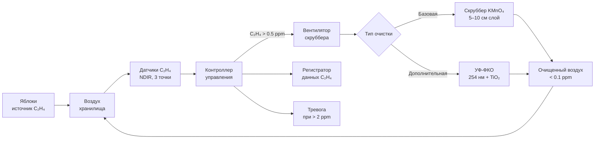

## Обзор

Этилен (C₂H₄, ethylene) — газообразный фитогормон, синтезируемый при созревании климактерических фруктов и овощей. Даже концентрации 0,1–1,0 ppm (part per million, части на миллион) существенно сокращают сроки хранения чувствительных товаров: киви, брокколи, салата и срезанных цветов. Источником газа служат сами хранящиеся плоды, а также дефектное электрооборудование (коронный разряд) и двигатели внутреннего сгорания погрузчиков.

Системы активной очистки от этилена (ethylene scrubbing) — неотъемлемый элемент инфраструктуры современных холодильных хранилищ. Они удаляют или химически преобразуют этилен путём окисления, адсорбции или фотокаталитического разложения, поддерживая концентрацию ниже пороговых значений и обеспечивая соответствие стандартам качества продукции на протяжении всего периода хранения.

## Физические и химические механизмы удаления этилена

### Химическое окисление перманганатом калия (KMnO₄)

Перманганат калия прямо окисляет молекулы этилена в диоксид углерода и воду:


2\,\text{KMnO}_4 + \text{C}_2\text{H}_4 + 2\,\text{H}_2\text{O}
\;\rightarrow\; 2\,\text{MnO}_2 + 2\,\text{KOH} + \text{CO}_2


Фиолетовый ион MnO₄⁻ восстанавливается в коричневый MnO₂, что визуально индицирует истощение реагента. Ёмкость адсорбции: 5–15 г этилена на кг материала в зависимости от относительной влажности (оптимум 50–80 % ОВ).

### Каталитическое окисление (catalytic oxidation)

Благородные металлы (Pt, Pd) на керамических носителях (Al₂O₃, TiO₂) катализируют полное окисление этилена:


\text{C}_2\text{H}_4 + 3\,\text{O}_2 \;\xrightarrow{\text{Pt/Pd, }150\text{–}200°\text{C}}\; 2\,\text{CO}_2 + 2\,\text{H}_2\text{O}


Время пребывания воздуха в реакторе 0,5–2,0 с обеспечивает конверсию выше 95 %. Срок службы катализатора: 2–5 лет при нормальной эксплуатации.

### Фотокаталитическое разложение (photocatalytic oxidation, PCO)

Облучение TiO₂-покрытых поверхностей ультрафиолетом (UV, 254 нм) генерирует электронно-дырочные пары и гидроксильные радикалы (·OH), которые окисляют этилен и летучие органические соединения (VOC):


\text{TiO}_2 + h\nu \;\rightarrow\; e^- + h^+
\;\rightarrow\; \cdot\text{OH}
\;\rightarrow\; \text{CO}_2 + \text{H}_2\text{O}


Эффективность за один проход — 40–80 %; необходимо несколько воздухообменов для достижения целевой концентрации. Оптимальная относительная влажность для образования ·OH: выше 40 % ОВ.

### Адсорбция на активированном угле (activated carbon)

Стандартный активированный уголь с размером пор 3,9 Å имеет ограниченную эффективность для этилена. Пропитанные угли (KMnO₄, фосфорная кислота) достигают ёмкости 3–8 г/кг при 50 % ОВ и +4 °C. Одновременно удаляются летучие органические соединения и запахи.

## Чувствительность товаров к этилену


| Категория | Примеры товаров | Пороговая концентрация |
|---|---|---|
| Высокочувствительные | Киви, брокколи, салат, огурцы, срезанные цветы | < 0,1 ppm |
| Умеренно чувствительные | Морковь, сельдерей, клубника, картофель | 0,1–1,0 ppm |
| Низкочувствительные (производители) | Яблоки, груши, бананы (климактерические) | — |
| Низкочувствительные | Апельсины, лимоны, свежая капуста | > 1,0 ppm |


Климактерические фрукты (яблоки, груши, бананы, авокадо) выделяют 10–100 мкл/(кг·ч) в зависимости от сорта и стадии созревания. Повреждённая или больная продукция производит экспоненциально большее количество этилена.

## Компоненты и конструкция систем очистки

### Скрубберы с перманганатом калия (KMnO₄ scrubbers)

Материал (KMnO₄, пропитанный на подложке из оксида алюминия или силикагеля) загружается в корзины или слои толщиной 5–10 см. Скорость воздушного потока через слой: 30–60 м/ч. Система не требует внешнего источника энергии, кроме циркуляционного вентилятора, — низкие эксплуатационные расходы.

Индикация исчерпания материала: 70–80 % визуального изменения цвета с фиолетового на коричневый. Замена — каждые 30–90 суток (сезонно).

**Ограничение:** при ОВ ниже 30 % скорость реакции снижается.

### Каталитические окислители (catalytic oxidizers)

Электрический или газовый нагреватель доводит поток воздуха до 150–200 °C для активации Pt/Pd-катализатора. Рекуператор тепла (heat exchanger) снижает потребление электроэнергии: 2–5 кВт на 1699 м³/ч (1000 CFM). Системы эффективны при высоких концентрациях этилена (50–500 ppm): камеры дозревания бананов, помещения хранения высокоинтенсивных производителей.

### УФ-фотокаталитические системы (UV-PCO systems)

УФ-лампы (254 нм, 40–80 Вт на лампу) облучают TiO₂-покрытую поверхность внутри канала воздушного потока. Скорость потока воздуха через реактор: 60–120 м/ч. Замена ламп: каждые 12–18 месяцев. Не требует расходуемого реагента — удобно для долгосрочного применения в хранилищах яблок.

## Методика расчёта производительности системы

### Требуемое удаление этилена


Q_{\mathrm{eth}} = V \cdot n \cdot \rho_{\mathrm{eth}} \cdot k


где $Q_{\mathrm{eth}}$ — требуемое удаление этилена, г/ч; $V$ — объём хранилища, м³; $n$ — кратность воздухообмена через систему очистки (2–6 ч⁻¹); $\rho_{\mathrm{eth}}$ — текущая концентрация этилена, мг/м³; $k = 1{,}5$–$2{,}0$ — коэффициент запаса.

**Пример:** хранилище яблок $V = 500$ м³, целевая концентрация 0,3 ppm (= 0,37 мг/м³), $n = 4$ ч⁻¹, $k = 1{,}5$:


Q_{\mathrm{eth}} = 500 \times 4 \times 0{,}37 \times 1{,}5 = 1110\ \text{мг/ч} \approx 1{,}11\ \text{г/ч}


### Масса реагента на цикл обслуживания


m_{\mathrm{mat}} = \frac{Q_{\mathrm{eth}} \cdot t_{\mathrm{cycle}}}{x_e}


где $t_{\mathrm{cycle}}$ — интервал замены, ч (обычно 720–2160 ч); $x_e$ — ёмкость материала (г этилена/кг материала).

Для $x_e = 10$ г/кг и $t_{\mathrm{cycle}} = 1440$ ч (60 суток):


m_{\mathrm{mat}} = \frac{1{,}11 \times 1440}{10} = 160\ \text{кг KMnO}_4\text{-материала}


### Производительность вентилятора скруббера


\dot{V}_{\mathrm{fan}} = \frac{V \cdot n}{3600}\ \text{м}^3\text{/с}


Для $V = 500$ м³, $n = 4$ ч⁻¹:


\dot{V}_{\mathrm{fan}} = \frac{500 \times 4}{3600} \approx 0{,}56\ \text{м}^3\text{/с} = 2000\ \text{м}^3\text{/ч}


## Применение в системах холодильного хранения

### Хранилища яблок и груш

Централизованные системы очистки интегрируются в трассы обратного воздуха основного воздухоохладителя. Целевая концентрация этилена < 0,5 ppm при продолжительности хранения 6–12 месяцев. Перманганатный материал заменяется каждые 2–3 месяца либо применяется УФ-ФКО-система с непрерывной работой.

### Камеры дозревания бананов (banana ripening rooms)

Каталитические окислители обрабатывают концентрации этилена 20–100 ppm в помещениях с контролируемой этиленовой атмосферой (искусственное дозревание). Система работает 24/7 с рекуперацией тепла.

### Смешанные хранилища (ягоды, зелень, цветы)

Распределённые переносные скрубберы с KMnO₄ обслуживают наиболее чувствительные зоны. Гибридные системы объединяют перманганат для базовой очистки и УФ-ФКО для «полировки» воздуха до уровня ниже 0,05 ppm.

## Диаграмма типовой системы управления этиленом





## Типовые эксплуатационные параметры


| Параметр | Диапазон |
|---|---|
| Целевая концентрация этилена | 0,1–1,0 ppm |
| Скорость воздуха через скруббер | 20–120 м/ч (зависит от типа) |
| Кратность воздухообмена в хранилище | 2–6 ч⁻¹ |
| Интервал замены KMnO₄-материала | 30–90 суток (сезонно) |
| Интервал замены УФ-ламп | 12–18 месяцев |
| Срок службы каталитического катализатора | 2–5 лет |
| ОВ для оптимальной работы KMnO₄ | 30–90 % |
| Потребление энергии (каталитический окислитель) | 2–5 кВт на 1699 м³/ч |


## Типовые ошибки проектирования и рекомендации

**Типовые ошибки:**
- Недооценка скорости образования этилена повреждёнными или перезрелыми плодами — приводит к недостаточной мощности системы очистки.
- Размещение датчиков у вентиляционных решёток — нерепрезентативные показания; датчики устанавливать на средней высоте у решёток обратного воздуха (не менее 2–3 датчиков в крупном хранилище).
- Игнорирование зонирования: высокочувствительные товары требуют отдельных контуров очистки от производителей этилена.
- Нерегулярная калибровка датчиков приводит к ложным показаниям.

**Рекомендуемые практики:**
- Калибровка датчиков этилена ежемесячно с использованием сертифицированных газовых стандартов (1,0; 10; 50 ppm).
- Регистрация трендов концентрации для прогнозирования ресурса реагента и сроков замены.
- Настройка сигнализации при превышении 2,0 ppm (двукратный порог для большинства чувствительных товаров).
- Комбинирование технологий: KMnO₄ для базовой очистки + УФ-ФКО для «полировки» воздуха.

## Применяемые стандарты и нормативы

- **ASHRAE TC 10.3** — Рекомендации по контролю этилена в холодильных хранилищах (Handbook Refrigeration, 2022).
- **ISO 11379:2015** — Методы измерения этилена; стандартные газовые образцы.
- **СП 60.13330.2020** (актуализированный СНиП 41-01-2003) — Проектирование систем вентиляции и кондиционирования воздуха.
- **ГОСТ Р 30494–2011** — Микроклимат в помещениях, требования к составу воздуха.
- **EN 12101-8** — Системы дымоудаления и очистки воздуха; критерии производительности.
- **IIAR Bulletin 116** — Refrigeration in Fresh Produce Storage and Distribution.
