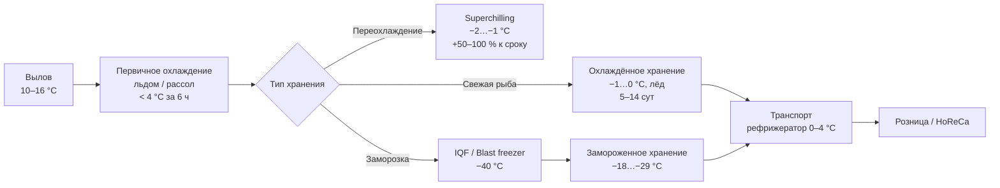

## Обзор

Рыба и морепродукты (fish and seafood) — наиболее скоропортящиеся белковые продукты, требующие точного контроля температуры от вылова до хранения. Быстрое разложение тканей происходит в результате ферментативной активности, роста бактерий и окислительных реакций, ускоряющихся экспоненциально при превышении критических температурных пределов. Проектирование холодильной системы должно учитывать требования, специфичные для вида продукта, метода обработки и предполагаемой продолжительности хранения.

Согласно ASHRAE Handbook — Refrigeration (2022) и ISO 19343:2018, свежая рыба должна храниться при −1…0 °C, относительная влажность 95–100 %. Жирные виды (лосось, скумбрия, сельдь) требуют более низких температур замороженного хранения из-за ускоренного окисления омега-3 жирных кислот.

## Физические механизмы деградации

### Микробиологическое разложение (microbial spoilage)

Рост патогенных (*Listeria monocytogenes*, *Vibrio* spp., *Clostridium botulinum*) и порчеобразующих (*Pseudomonas*, *Shewanella putrefaciens*) микроорганизмов замедляется ниже +3 °C. Температурный коэффициент Q₁₀ для микробного роста на рыбе: 2,5–4,0 (скорость порчи возрастает в 2,5–4 раза при каждых +10 °C).

Накопление летучих аминов (триметиламин, TMA; диметиламин, DMA; аммиак) — химический признак порчи. Критический уровень органолептического отклонения: TVB-N (total volatile bases nitrogen) выше 25–35 мг/100 г (по ISO 19343:2018).

### Ферментативная деградация (autolytic degradation)

Ферментные системы рыбы (катепсины, липазы, оксидазы) сохраняют активность при низких температурах. Закон Аррениуса:


k = A \cdot \exp\!\left(-\frac{E_a}{RT}\right)


Для рыбных тканей $E_a = 45$–$65$ кДж/моль. Снижение температуры с +5 °C до 0 °C замедляет ферментативные реакции в 2–3 раза.

### Окисление липидов (lipid oxidation)

Рыбий жир содержит высокую долю полиненасыщенных жирных кислот (PUFA), включая EPA и DHA. Скорость пероксидного окисления зависит от парциального давления кислорода и температуры. Для жирной рыбы при −18 °C скорость окисления снижается в ~50 раз по сравнению с 0 °C, что обуславливает более низкие рекомендуемые температуры замороженного хранения.

## Хранение свежей рыбы (chilled storage)

Справочник ASHRAE — Refrigeration рекомендует хранение свежей рыбы при −1…0 °C, ОВ 95–100 %. Этот диапазон сохраняет качество ткани, предотвращая образование кристаллов льда, разрушающих клеточную структуру.


| Вид рыбы | Форма обработки | Срок хранения |
|---|---|---|
| Тощая рыба (треска, пикша, минтай) | Целая, потрошёная | 10–14 суток |
| Жирная рыба (лосось, скумбрия, сельдь) | Целая | 5–8 суток |
| Филе или стейки | Любая | 3–5 суток |
| Тунец (для сасими) | Целый/филе | 1–2 суток при 0 °C; −46 °C для долгосрочного хранения |


Колебания температуры, превышающие ±0,6 °C, снижают качество продукта и ускоряют порчу.

## Переохлаждение (superchilling)

Переохлаждение поддерживает рыбу при −2…−1 °C, обеспечивая частичное замерзание тканевой воды (10–20 % льда в тканях). Метод продлевает срок годности свежей рыбы на 50–100 % по сравнению с обычным охлаждением:

- частичная кристаллизация замедляет бактериальную активность и ферментативную деградацию;
- без изменений текстуры, характерных для полной заморозки;
- скрытая теплота плавления обеспечивает термическую буферизацию при транспортировке.

Оборудование требует точного контроля $T$ в диапазоне ±0,2 °C. Применяется для ценных видов (дикий лосось, тунец, морские ежи) и расширенных транспортных маршрутов.

## Методы льдообразования (ice contact cooling)

Контакт со льдом обеспечивает наиболее надёжный контроль температуры поверхности (0 °C при таянии). Соотношение рыба:лёд по массе — 1:1 (минимум). Чешуйчатый лёд (flake ice, размер 2–5 мм) обеспечивает максимальный контакт с неправильными формами рыб.

Скрытая теплота плавления льда:


Q_{\mathrm{melt}} = m_{\mathrm{ice}} \cdot L_f = m_{\mathrm{ice}} \times 334\ \text{кДж/кг}


Тепло, отводимое от свежевыловленной рыбы при первичном охлаждении с +15 °C до 0 °C:


Q_{\mathrm{fish}} = m_{\mathrm{fish}} \cdot c_p \cdot \Delta T = 1\ \text{кг} \times 3{,}7\ \frac{\text{кДж}}{\text{кг·К}} \times 15\ \text{К} = 55{,}5\ \text{кДж/кг}


Непрерывное пополнение льда компенсирует таяние: 10–15 % от массы льда в сутки в хорошо изолированных контейнерах.

## Протоколы скоростной заморозки (quick freezing)

Быстрая заморозка минимизирует размер кристаллов льда и сохраняет качество ткани. Ключевой параметр — скорость прохождения через критическую зону температур от −4 °C до −1 °C.

### Воздушные морозильные камеры (blast freezers)

Температура −34…−40 °C, скорость воздуха 2,5–5,1 м/с. Время заморозки рыбных порций: 2–4 ч; целой рыбы: 6–12 ч.

### Системы IQF (individual quick freezing)

Отдельные куски рыбы/креветок помещаются в высокоскоростной холодный поток воздуха при −40 °C, скорость > 10 м/с. Полная заморозка за 10–20 мин для мелких кусков. Предотвращает слипание продукта.

### Пластинчатые морозильники (plate freezers)

Прямой контакт с охлаждаемыми металлическими пластинами при −40 °C. Коэффициент теплопередачи 85–142 Вт/(м²·К). Применяется для рыбных блоков и филе правильной формы.

## Замороженное хранение (frozen storage)


| Температура хранения | Срок годности тощей рыбы | Срок годности жирной рыбы |
|---|---|---|
| −18 °C | 6–8 месяцев | 3–4 месяца |
| −23 °C | 12–18 месяцев | 6–9 месяцев |
| −29 °C | 24+ месяца | 12–18 месяцев |
| −40 °C | 36+ месяцев | 24+ месяца |


Колебания температуры во время замороженного хранения вызывают миграцию влаги и рост кристаллов льда (recrystallization). Объект хранения должен поддерживать стабильность $T$ в пределах ±1,1 °C.

## Контроль гистамина (histamine control)

Образование гистамина — критическая проблема безопасности для скомброидных рыб (тунец, скумбрия, дорадо). Фермент гистидиндекарбоксилаза бактерий преобразует гистидин в гистамин при $T > 4$ °C:


\text{Гистидин} \xrightarrow{\text{гистидиндекарбоксилаза}} \text{Гистамин} + \text{CO}_2


Гистамин термостабилен и не разрушается при приготовлении пищи. Рыба, хранившаяся при $T > 4$ °C более 4–6 ч, может накопить опасные уровни. Предельно допустимое содержание (EU Regulation 2073/2005): 100 мг/кг (100 ppm) — при 9 из 9 проб; 200 мг/кг — допустимо не более чем в 2 пробах из 9.

**Критические контрольные точки (CCP):**
- первичное охлаждение до +4 °C в течение 6 ч после вылова;
- непрерывный мониторинг $T$ при хранении и транспортировке;
- поддержание замороженных продуктов ниже −18 °C.

## Предотвращение обезвоживания (dehydration prevention)

Ткань рыбы содержит 65–80 % воды, поэтому потеря влаги (морозный ожог, freezer burn) ухудшает внешний вид и текстуру. Управление ОВ 90–95 % в камерах свежей рыбы минимизирует миграцию влаги.

Глазировка (glazing) замороженной рыбы слоем льда 2–5 %:
- погружение в воду около 0 °C на 2–5 с;
- защита от обезвоживания и окисления при долгосрочном хранении;
- периодическое переглазирование по мере сублимации ледяного покрытия.

## Расчёт холодильной нагрузки


Q_{\mathrm{total}} = Q_{\mathrm{prod}} + Q_{\mathrm{tr}} + Q_{\mathrm{inf}} + Q_{\mathrm{melt}} + Q_{\mathrm{equip}}


| Составляющая | Значение |
|---|---|
| Первичное охлаждение продукта | 140–232 кДж/кг |
| Тепловыделение дыхания (свежая рыба) | 3500–7000 кДж/(т·сут) |
| Таяние льда (непрерывное пополнение) | 334 кДж/кг льда |
| Инфильтрация через открывания дверей | 15–30 % от Q_tr |

**Пример:** камера хранения 100 м³, загрузка 30 т свежей рыбы, наружная температура +25 °C, температура камеры 0 °C, $U = 0{,}25$ Вт/(м²·К), $A = 280$ м²:


Q_{\mathrm{tr}} = 0{,}25 \times 280 \times 25 = 1750\ \text{Вт}



Q_{\mathrm{resp}} = \frac{30\,000\ \text{кг} \times 5000\ \text{кДж/(т·сут)}}{30\,000 \times 24\ \text{ч}} \approx 1736\ \text{Вт}


Суммарная пиковая нагрузка (с учётом инфильтрации и оборудования): **8–12 кВт**.

## Диаграмма холодной цепи рыбопродуктов





## Применяемые стандарты и нормативы

- **ASHRAE Handbook — Refrigeration** (2022), глава 19 «Fish» и глава 20 «Seafood».
- **ASHRAE 15–2022** — Safety Standard for Refrigeration Systems.
- **ASHRAE 34–2022** — Designation and Safety Classification of Refrigerants.
- **ISO 19343:2018** — Fish and fishery products. Determination of histamine.
- **EN 378–2016** — Refrigerating systems and heat pumps. Safety and environmental requirements.
- **ISO 5149–2014** — Refrigerating systems and heat pumps. Safety and environmental requirements.
- **ГОСТ 33476–2015** — Рыба, морепродукты и пресноводные продукты. Холодная цепь. Принципы и требования.
- **ГОСТ Р 55520–2013** — Рыба и морепродукты охлаждённые. Требования и методы контроля.
- **СП 60.13330.2020** (актуализированный СНиП 41-01-2003) — Отопление, вентиляция и кондиционирование воздуха.
- **IIAR Bulletin 109** — Design, Installation, and Maintenance of Ammonia Refrigerating Systems.
- **ГОСТ 28547–90** — Установки холодильные. Термины и определения.
