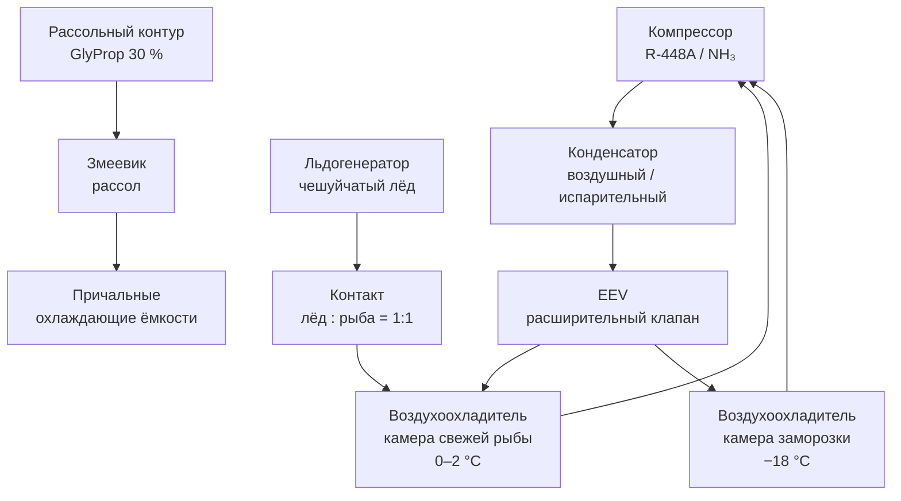

## Обзор

Рыба и рыбопродукты (finfish) относятся к высокоскоропортящимся продуктам: биохимический состав рыбьего мяса — высокое содержание полиненасыщенных жирных кислот и свободных аминокислот (гистидин, лизин) — обусловливает быстрое окисление и микробиологическое разложение. Холодильные системы должны поддерживать температуру 0–2 °C с контролем относительной влажности 85–95 % ОВ и минимизировать температурные колебания. По данным ASHRAE Handbook — Refrigeration (2022) и EN 378:2016, рыба классифицируется как скоропортящийся продукт с коротким сроком хранения, зависящим от вида обработки.

## Физические принципы и микробиология

Порча рыбы происходит в результате трёх взаимосвязанных процессов: микробного разложения, автолитического ферментного расщепления и окисления липидов. Ферментные системы рыбьего мяса остаются активными при низких температурах; максимальная скорость автолиза наблюдается при 0–4 °C.

Рост патогенных (*Listeria monocytogenes*, *Vibrio* spp., *Clostridium botulinum*) и порчеобразующих (*Pseudomonas*, *Lactobacillus*) микроорганизмов замедляется ниже +3 °C. Время удвоения популяции:


| Температура | Время удвоения |
|---|---|
| 0 °C | 4–8 суток |
| 5 °C | 1–2 суток |
| 10 °C | 12–24 ч |


Температурный коэффициент Q₁₀ для микробного роста на рыбе: 2,5–4,0.

Накопление летучих аминов (ТМА, ДМА, NH₃) и пероксидов — химический признак порчи. По ISO 19343:2018, критическая точка органолептического отклонения: TVB-N выше 25–35 мг/100 г азота летучих оснований.

## Температурные режимы и виды хранения

### Свежая рыба на льду (chilled on ice)


| Вид обработки | Температура | Срок хранения |
|---|---|---|
| Целая рыба, неповреждённая чешуя | 0–2 °C | 5–7 суток |
| Потрошёная рыба | 0–2 °C | 7–12 суток |
| Филе, стейки | 0–2 °C | 3–5 суток |


Контакт продукта со льдом обязателен: лёд обеспечивает охлаждение поверхностных слоёв до 0 °C, снижает испарение влаги и создаёт микроанаэробные условия, замедляющие окисление.

### Управление влажностью и циркуляцией воздуха

Относительная влажность в камерах хранения рыбы: **85–95 % ОВ**. При ОВ ниже 85 % — активное пересыхание поверхности, образование окисленного слоя, рост плесени. При ОВ выше 95 % — конденсация на ограждениях, риск капельного инфицирования.

Скорость циркуляции воздуха (air velocity):
- приёмная зона: **0,3–0,5 м/с**;
- основной объём камеры: **0,1–0,3 м/с** (исключает механические повреждения и чрезмерное испарение).

## Источники холода

### Кусковой лёд (block ice / flake ice)

- размер куска: 25–50 мм; для максимального теплообмена — чешуйчатый лёд (flake ice) 2–5 мм;
- чистота по ГОСТ 27138:2010: не менее 99,9 %;
- контакт льда с продуктом обеспечивает охлаждение до 0 °C.

### Ледяная суспензия (ice slurry)

- смесь льда с охлаждающим раствором (вода + NaCl, или морская вода);
- температура плавления от −2 до −6 °C в зависимости от концентрации соли;
- концентрация NaCl: 3–6 % (EN 12007:2012);
- преимущество: лучшее распределение холода, минимальные механические повреждения продукта.

### Рассольные системы охлаждения (blast chilling)

- потоковое охлаждение филе в камерах при −8…−10 °C с последующим хранением при 0–2 °C;
- хладагент: R-404A, R-22 (в действующих системах), NH₃;
- производительность льдогенераторов для рыбных портов: 150–300 т/сут.

## Расчёт холодильной мощности

### Суммарная тепловая нагрузка


Q_{\mathrm{total}} = Q_{\mathrm{prod}} + Q_{\mathrm{tr}} + Q_{\mathrm{inf}} + Q_{\mathrm{equip}}


### Охлаждение продукта


Q_{\mathrm{cool}} = m \cdot c_p \cdot \Delta T


где $c_p \approx 3{,}5$–$3{,}8$ кДж/(кг·К) для свежей рыбы; $\Delta T$ — температурный перепад.

### Поддержание температуры при контакте со льдом


Q_{\mathrm{melt}} = m_{\mathrm{ice}} \cdot L_f + m_{\mathrm{ice}} \cdot c_{w} \cdot \Delta T_w


где $L_f = 335$ кДж/кг — скрытая теплота плавления льда; $c_w = 4{,}18$ кДж/(кг·К) — удельная теплоёмкость воды; $\Delta T_w$ — нагрев талой воды.

### Пример расчёта для камеры 100 м³

**Условия:** 30 т свежей рыбы; наружная температура +25 °C; $\Delta T = 25$ К; $U = 0{,}25$ Вт/(м²·К); $A = 280$ м².


Q_{\mathrm{tr}} = 0{,}25 \times 280 \times 25 = 1750\ \text{Вт}



| Составляющая | Значение |
|---|---|
| $Q_{\mathrm{prod}}$ (охлаждение партии) | 4–6 кВт |
| $Q_{\mathrm{tr}}$ (ограждение) | 1,75–2,5 кВт |
| $Q_{\mathrm{inf}}$ (инфильтрация) | 1–2 кВт |
| $Q_{\mathrm{equip}}$ (освещение, двигатели) | 0,5–1 кВт |
| **Суммарная пиковая нагрузка** | **8–12 кВт** |
| **Поддерживающая нагрузка** | **3–5 кВт** |


## Типы холодильных установок

### Прямое расширение (direct expansion, DX)

Испаритель расположен в камере или воздухоохладителе. Хладагент: R-404A (действующие системы), R-507A, R-448A (новые системы), NH₃ (крупные предприятия). COP при $t_0 = 0$ °C, $t_k = +30$ °C: 2,5–3,2.

Преимущества: компактность, быстрое охлаждение. Недостатки: высокое давление в системе, необходим тщательный контроль точки росы компрессора.

### Вторичный хладоноситель (secondary coolant / brine)

Циркуляция гликолевого раствора (пропиленгликоль 30–35 %) или рассола через змеевики. Возможность обслуживания нескольких камер от одной компрессорной станции. COP снижается на 5–15 % из-за промежуточного теплообменника. Применяется в морских портах из соображений безопасности (исключение хладагента из рабочих зон).

### Каскадные системы (cascade systems, ниже −30 °C)

Первый контур на хладагенте R-744 (CO₂) или R-23 обеспечивает низкие температуры; второй контур на R-507A или NH₃ отводит тепло к конденсатору. Применяется на интегрированных рыбоперерабатывающих предприятиях.

## Географические и климатические особенности

**Прибрежные регионы (Дальний Восток, Мурманск, Норвегия):**
- Летняя наружная температура: +18…+25 °C;
- Высокая ОВ: 70–90 %;
- Теплообменники из нержавеющей стали или титана (защита от солевой коррозии);
- Льдогенераторы производительностью 150–300 т/сут для крупного флота.

**Континентальные регионы (внутренние РЦ):**
- Наружная температура летом: +25…+35 °C;
- Требуется предварительное охлаждение продукта до −3…−8 °C перед поступлением в хранилище;
- Мощность холодильной установки увеличивается на 20–30 %.

## Типовые ошибки проектирования

1. **Недостаточная мощность льдогенератора:** норма производительности — 40–60 % от максимальной суточной загрузки; в портовых условиях — до 100 %. Занижение приводит к срывам температурного режима в пиковые периоды вылова.

2. **Неправильное распределение воздуха:** центральная приточная вентиляция создаёт локальное замерзание продукта у воздуховода и недоохлаждение в удалённых зонах. Решение: боковое или потолочное расположение диффузоров с низкой скоростью подачи.

3. **Отсутствие осушки воздуха:** при инфильтрации наружного воздуха ОВ превышает 95 %. Требуется воздухоохладитель с точкой росы не выше −4…−6 °C (испаритель при −10…−12 °C).

4. **Некачественный контакт льда с продуктом:** рыба должна быть упакована в пищевой полиэтилен; лёд распределяется послойно (соотношение лёд:рыба = 1:1).

5. **Широкий гистерезис регулятора компрессора:** переключение при ±2 °C вызывает периодическое замерзание поверхности продукта. Решение: ПИД-регулятор с гистерезисом ±0,5 °C.

## Диаграмма системы охлаждения рыбного склада





## Энергоэффективность

Удельное энергопотребление холодильной установки для рыбы: 150–250 кВт·ч/т в год (климатический класс 3–4 по ASHRAE). Меры повышения эффективности:

- Инвертерный привод компрессоров (VFD): экономия 15–25 %;
- Рекуперация тепла конденсатора на подогрев горячей воды: 10–20 %;
- Оптимальная толщина теплоизоляции: стены 150–200 мм, потолок 200–250 мм (PUF);
- IoT-системы управления с прогнозированием поступления продукта.

## Применяемые стандарты и нормативы

- **ASHRAE Handbook — Refrigeration** (2022), глава 19 «Fish».
- **ASHRAE 15–2022** — Safety Standard for Refrigeration Systems.
- **ASHRAE 34–2022** — Designation and Safety Classification of Refrigerants.
- **ISO 19343:2018** — Fish and fishery products. Histamine determination.
- **EN 378–2016** — Refrigerating systems and heat pumps. Safety and environmental requirements.
- **ISO 5149–2014** — Refrigerating systems and heat pumps. Safety and environmental requirements.
- **ГОСТ 27138:2010** — Лёд из природной воды и морской воды. Требования.
- **ГОСТ 33476–2015** — Рыба, морепродукты и пресноводные продукты. Холодная цепь.
- **ГОСТ Р 55520–2013** — Рыба и морепродукты охлаждённые. Требования и методы контроля.
- **СП 60.13330.2020** (актуализированный СНиП 41-01-2003) — Отопление, вентиляция и кондиционирование воздуха.
- **СП 131.13330.2020** — Строительная климатология.
- **IIAR Bulletin 109** — Design, Installation, and Maintenance of Ammonia Refrigerating Systems.
- **ГОСТ 28547–90** — Установки холодильные. Термины и определения.
