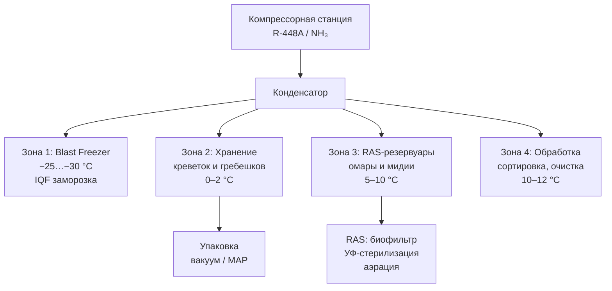

## Обзор

Морские моллюски и ракообразные (shellfish and crustaceans) — высокоценная белковая продукция с коротким сроком годности в охлаждённом состоянии. Каждая категория требует специфических режимов температуры и влажности, определяемых метаболизмом, скоростью микробиологического разложения и физиологическими механизмами деградации. Согласно рекомендациям ASHRAE Handbook — Refrigeration (2022) и стандарту FAO/WHO (Codex Alimentarius, CAC/RCP 52-2003), каждый вид требует индивидуального подхода к проектированию холодильной системы.

Экономические потери от порчи при неадекватном контроле параметров составляют 15–25 % от первоначальной стоимости партии (по данным FAO). Ключевые специфические риски: меланоз (melanosis) панциря креветок, контаминация живых моллюсков *Norovirus* и *Vibrio* spp., анаэробная гибель живых ракообразных.

## Физические принципы и механизмы деградации

### Теплоёмкость и скорость охлаждения

Мышечная ткань моллюсков содержит 70–85 % воды; удельная теплоёмкость:


c_p \approx 3{,}5\ \text{кДж/(кг·°C)}


Скорость охлаждения свежепойманного товара подчиняется уравнению Ньютона–Рихмана:


\frac{dT}{dt} = -\frac{h_A}{m \cdot c_p} \cdot (T - T_\infty)


где $h_A$ — коэффициент теплопередачи, Вт/(м²·К); $T_\infty$ — температура охлаждающей среды; $m$ — масса, кг.

Для креветок средней массы 20–30 г при прямом контакте со льдом время охлаждения до центральной части составляет 2–4 ч.

### Меланоз (melanosis) у ракообразных

Потемнение наружных покровов (панциря) креветок — результат ферментативного окисления L-тирозина полифенолоксидазой (PPO, polyphenol oxidase):


\text{L-тирозин}
\xrightarrow{\text{PPO}}
\text{DOPA}
\xrightarrow{\text{PPO}}
\text{дофахинон}
\longrightarrow
\text{меланин}


Скорость реакции — Q₁₀ = 2–3 (ферментативный диапазон 0–15 °C). Хранение при 0–2 °C замедляет реакцию на 80–90 % по сравнению с 10 °C. Сульфиты (Na₂SO₃, метабисульфит натрия, E223) ингибируют PPO необратимо.

### Рост микроорганизмов

Психрофильные и мезофильные бактерии (*Vibrio* spp., *Listeria monocytogenes*, *Aeromonas*) развиваются на поверхности и в полости моллюсков. Модель Ratkowsky для низких температур:


\mu = b \cdot (T - T_{\min})^2


где $\mu$ — удельная скорость роста (ч⁻¹); $T_{\min} \approx -5$…$-3$ °C; $b$ — константа для конкретного вида.

При 0 °C время удвоения популяции: 7–10 суток; при +5 °C: 2–3 суток.

## Требования к хранению по видам

### Креветки (*Penaeus* spp.)


| Параметр | Значение |
|---|---|
| Оптимальная температура | 0–2 °C |
| Относительная влажность | 90–95 % ОВ |
| Среда хранения | Взвешенный флюидный лёд (1:1 или 1:1,5 по массе) |
| Кратность воздухообмена | 4–6 ч⁻¹ |
| Срок хранения | 7–10 суток |
| Время охлаждения (образец 50 г) | 2–3 ч |


Высокая восприимчивость к меланозу: видимые изменения цвета появляются через 12–24 ч при +10 °C; при 0 °C — замедление в 5–8 раз. Предварительная обработка: кратковременное бланширование (60–65 °C, 1–2 мин) или обработка сульфитами. Допустимая остаточная концентрация сульфитов в морепродуктах согласно ТР ТС 029/2012: **не более 50 мг/кг** (E220–E228).

### Омары живые (*Homarus americanus*, *H. gammarus*)

Хранение в системах рециркуляции морской воды (RAS, recirculating aquaculture system):

- температура: 5–10 °C (допустимо 3–8 °C для краткосрочного хранения);
- солёность: 30–35 ‰ (натуральная морская вода или синтетический аналог);
- растворённый O₂: ≥ 5 мг/л (насыщение морской воды при +5 °C ≈ 9 мг/л);
- pH: 7,8–8,2;
- срок жизнеспособности: 2–3 недели в стационарных RAS; 3–5 суток без активной аэрации.

**Состав RAS-системы:**
1. Механический фильтр (100–200 мкм) — удаление взвеси;
2. Биофильтр (нитрификация NH₄⁺ → NO₃⁻);
3. УФ-стерилизация или озонирование (3–5 мг O₃/л);
4. Контроль $T$ с точностью ±1 °C.

Плотность посадки: 20–40 кг на 1000 л воды. Каннибализм — обязательно разделять омаров сетчатыми перегородками.

### Устрицы (*Crassostrea*, *Ostrea edulis*)

- температура: 0–5 °C (оптимум 2–4 °C);
- ОВ: 85–90 %;
- среда: лёд или охлаждённая морская вода; хранение в раковинах выпуклой стороной вниз — для сохранения жидкости;
- срок: 10–14 суток на льду; 3–5 суток в морской воде без аэрации.

Микробиологический риск: устрицы — активные фильтраторы, накапливающие *Norovirus*, *Vibrio parahaemolyticus*, *V. vulnificus* из окружающей воды. Смертность более 5 % особей приводит к выбраковке партии.

### Мидии (*Mytilus edulis*, *M. galloprovincialis*)

- температура: 0–5 °C;
- срок в живом состоянии: 7–10 суток в резервуарах с аэрацией; 5–7 суток на льду;
- полная смена воды в резервуаре: каждые 2–3 ч;
- дренаж избыточной воды обязателен для предотвращения анаэробных условий.

### Гребешки (*Pecten maximus*, *Placopecten magellanicus*)

- охлаждённые в раковине: 0–5 °C, 8–12 суток на льду;
- очищенный адуктор (без раковины): 0–2 °C, до 2–3 суток (высокая скорость окисления);
- рекомендованная MAP-атмосфера для целых гребешков: 40 % CO₂ + 30 % N₂ + 30 % O₂ (снижает окисление и рост бактерий).

## Сводная таблица условий хранения


| Вид | T, °C | ОВ, % | Время охлаждения | Срок хранения | Критические параметры |
|---|---|---|---|---|---|
| Креветки | 0–2 | 90–95 | 2–4 ч | 7–10 сут | Меланоз, сульфиты ≤ 50 мг/кг |
| Омары живые | 5–10 | 90–95 | 1–2 ч | 14–21 сут | DO₂ ≥ 5 мг/л, каннибализм |
| Устрицы | 0–5 | 85–90 | 1–2 ч | 10–14 сут | Жизнеспособность (смертность < 5 %) |
| Мидии | 0–5 | 90–95 | 1–2 ч | 7–10 сут | Аэрация, дренаж воды |
| Гребешки (в раковине) | 0–5 | 95 | 3–4 ч | 8–12 сут | Окисление липидов, MAP |
| Гребешки (очищенные) | 0–2 | 95 | 1–2 ч | 2–3 сут | Вакуум / MAP, минимум O₂ |


## Расчёт холодопроизводительности

### Суммарная тепловая нагрузка


Q_{\mathrm{total}} = Q_{\mathrm{prod}} + Q_{\mathrm{resp}} + Q_{\mathrm{tr}} + Q_{\mathrm{vent}} + Q_{\mathrm{misc}}


**Пример:** охлаждение 500 кг креветок с +20 °C до +2 °C за 4 ч:


Q_{\mathrm{prod}} = \frac{500 \times 3{,}5 \times (20 - 2)}{4} = 7875\ \text{Вт} \approx 7{,}9\ \text{кВт}


**Тепловыделение метаболизма** при 0–2 °C:


Q_{\mathrm{resp}} \approx 0{,}5\text{–}1{,}0\ \text{кВт/т}


**Теплопередача через стены** ($U \approx 0{,}20$ Вт/(м²·К) для PUF 150 мм):


Q_{\mathrm{tr}} = U \cdot A \cdot \Delta T


**Вентиляционные потери** при 6-кратном воздухообмене камеры 20 м³ ($\Delta T = 25$ К):


Q_{\mathrm{vent}} = \frac{20 \times 6 \times 1{,}2 \times 1005 \times 25}{3600} \approx 1000\ \text{Вт}


**Суммарная холодопроизводительность** типовой камеры 20–30 м³ для хранения креветок: **10–12 кВт**.

### Выбор хладагента и компрессора

- **R-448A** (GWP 1387) — рекомендуемая замена R-404A; совместимость с POE-маслом;
- **R-290** (пропан, GWP = 3) — низкопотенциальный хладагент, требует ATEX-сертификации и ограничений по заправке;
- **NH₃** (аммиак) — для крупных предприятий; IIAR-стандарты.

Температура испарения $t_0 = -8$…$-5$ °C для хранения при 0–2 °C (температурный напор $\Delta T_{\mathrm{evap}} = 5$–$8$ К). Степень сжатия (compression ratio) ≤ 8–10 для R-448A при указанных условиях.

## Диаграмма типовой схемы рыбоперерабатывающего предприятия





## Типовые ошибки проектирования

1. **Применение льда из пресной воды для ракообразных** — осмотический шок тканей; решение: морской лёд (NaCl ≥ 3,5 %) или суспензия с морской солью.

2. **Температурные колебания ±2 °C при хранении креветок** — снижение срока хранения на 20–30 %; решение: датчики RTD/термопары с погрешностью ≤ 0,5 °C, ПИД-регулятор.

3. **Анаэробные условия в резервуарах для омаров** — гибель от нехватки кислорода; решение: непрерывная циркуляция воды и аэрация (DO₂ > 5 мг/л).

4. **Задержка размещения живых омаров и мидий** свыше 2 ч после поимки — ускоренная потеря жизнеспособности и обезвоживание; решение: немедленная посадка в резервуар.

5. **Нарушение дозировки сульфитов** для креветок: передозировка > 200 мг/кг — неприятный привкус; недостаточная < 30 мг/кг — неэффективная защита от меланоза. Контроль остаточного содержания — хромато- или спектрофотометрически.

## Энергоэффективность

Применение скребковых испарителей (scraped-surface evaporators) и каскадных систем для поддержания 0–2 °C снижает электропотребление на 15–20 % по сравнению с традиционными воздушными охладителями — за счёт меньшей температурной разницы на испарителе ($\Delta T = 4$ К вместо 8 К).

## Применяемые стандарты и нормативы

- **ASHRAE Handbook — Refrigeration** (2022), глава 20 «Shellfish».
- **ASHRAE 15–2022** — Safety Standard for Refrigeration Systems.
- **ASHRAE 34–2022** — Designation and Safety Classification of Refrigerants.
- **FAO/WHO Codex Alimentarius CAC/RCP 52-2003** — Code of Practice for Fish and Fishery Products.
- **ISO 13015:2005** — Refrigerating systems. Safety and environmental requirements below −20 °C.
- **EN 378–2016** — Refrigerating systems and heat pumps. Safety and environmental requirements.
- **ISO 5149–2014** — Refrigerating systems and heat pumps. Safety and environmental requirements.
- **ГОСТ 7631–2008** — Рыба, морские беспозвоночные и водоросли. Методы определения свежести.
- **ГОСТ Р 50474–93** — Мороженые креветки. Технические условия.
- **ГОСТ Р 33333–2015** — Охлаждённые продукты из морских беспозвоночных.
- **ТР ТС 029/2012** — Требования безопасности пищевых добавок, ароматизаторов и технологических вспомогательных средств (сульфиты E220–E228).
- **СП 60.13330.2020** (актуализированный СНиП 41-01-2003) — Отопление, вентиляция и кондиционирование воздуха.
- **IIAR Bulletin 109** — Design, Installation, and Maintenance of Ammonia Refrigerating Systems.
- **ГОСТ 28547–90** — Установки холодильные. Термины и определения.
