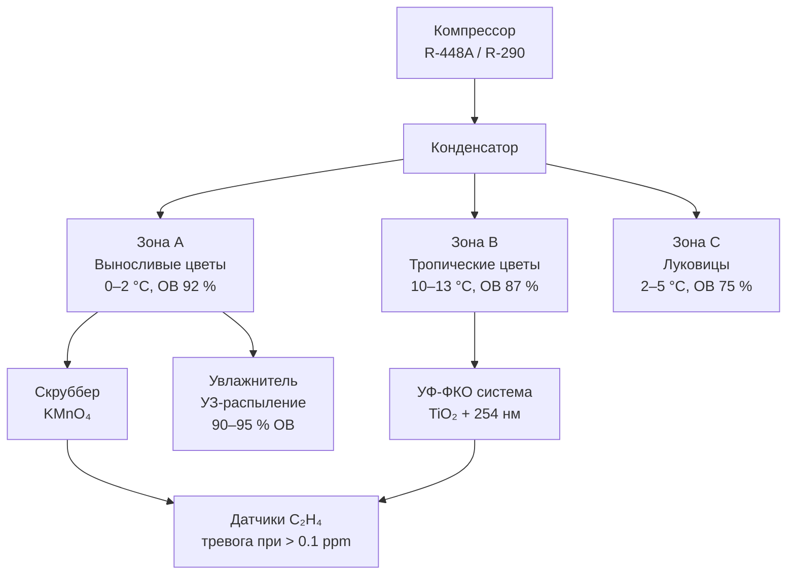

## Обзор

Холодильное хранение цветов и растений (floral cold storage) требует точного контроля микроклимата для продления времени стояния в вазе (vase life), предотвращения преждевременного старения и сохранения эстетического качества по всей цепи распределения. В отличие от овощей и фруктов, цветочная продукция проявляет экстремальную чувствительность к этилену (ethylene sensitivity) и требует специфических сочетаний температуры и влажности, соответствующих ботаническим характеристикам каждого вида.

Ключевые факторы деградации: скорость дыхания, потеря влаги через транспирацию, накопление этилена и физическое повреждение лепестков. Температура непосредственно управляет скоростью дыхания: снижение с +20 °C до +2 °C замедляет обменные процессы в 8–12 раз.

## Физические принципы

### Закон Аррениуса и скорость дыхания

Скорость дыхания (respiration rate) подчиняется уравнению Аррениуса:


r = A \cdot \exp\!\left(-\frac{E_a}{RT}\right)


Типовая энергия активации для цветочных тканей: $E_a = 50$–$80$ кДж/моль. Каждые 10 °C снижения температуры (правило Q₁₀ = 2–3) уменьшают скорость метаболизма в 2–3 раза и соответственно продлевают срок хранения.

### Транспирация и потеря тургора

Потеря воды через устьица и кутикулу (transpiration) вызывает снижение тургора лепестков и увядание. Поток водяного пара:


J = k_T \cdot (e_s(T_{\mathrm{leaf}}) - e_a)


где $k_T$ — коэффициент транспирации; $e_s$ — давление насыщенного пара на поверхности листа; $e_a$ — давление пара в воздухе камеры. Поддержание ОВ 90–95 % минимизирует $\Delta e$ и снижает транспирацию.

## Температурные режимы хранения


| Тип цветка | Температура хранения | Ожидаемый срок хранения |
|---|---|---|
| Выносливые (гвоздики, хризантемы) | 0–2 °C | 3–4 недели |
| Розы (Hybrid Tea, Floribunda) | 0,5–2 °C | 2–3 недели |
| Деликатные (тюльпаны, фрезии, нарциссы) | 0–2 °C | 1–2 недели |
| Тропические (орхидеи, антуриумы, геликония) | 10–13 °C | 1–2 недели |
| Птица Рая, имбирь | 10–13 °C | 1–2 недели |


Однородность температуры в камере: ±0,3 °C — критично для предотвращения локальных повреждений лепестков и ускоренного увядания. Колебания, превышающие 1 °C, повышают восприимчивость к грибковому заражению (*Botrytis cinerea*).

## Чувствительность к этилену и методы контроля

Этилен (C₂H₄) причиняет необратимый вред при концентрациях, начиная с 0,1 ppm, вызывая опадение лепестков, увядание и выцветание. Источники: созревающие фрукты и овощи в соседних камерах, дефектное электрооборудование, выхлопные газы погрузчиков.


| Чувствительность | Культуры | Пороговая концентрация | Симптомы |
|---|---|---|---|
| Высокая | Гвоздика, орхидеи, дельфиниум, душистый горошек | < 0,1 ppm | Загибание лепестков, опадение цветков за 6–12 ч |
| Умеренная | Роза, львиный зев, альстромерия | 0,5–1,0 ppm | Почернение краёв, несмыкание бутонов |
| Низкая | Хризантема, гербера, лилия | > 1,5 ppm | Незначительное пожелтение листьев |


### Стратегии контроля этилена (ethylene management)

1. **Каталитические преобразователи (catalytic converters):** окисляют C₂H₄ в CO₂ и воду при 175–205 °C на Pt/Pd-катализаторе; эффективность > 95 % за проход.

2. **Скрубберы с перманганатом калия (KMnO₄ scrubbers):** химическое поглощение при концентрациях 0,1–2,0 ppm; замена материала каждые 30–60 суток.

3. **УФ-фотокаталитические системы (UV-PCO):** TiO₂ + UV 254 нм; без расходуемого материала; эффективность 40–80 % за проход.

4. **Впрыск озона (ozone injection):** 0,05–0,10 ppm окисляет этилен и подавляет *Botrytis*; необходим строгий контроль концентрации (предел для людей: 0,1 ppm, OSHA).

Системы очистки должны обеспечивать полный оборот воздуха камеры каждые 30–60 мин для поддержания концентрации C₂H₄ ниже 0,05 ppm.

## Требования к влажности

Потеря воды срезанными цветами — основная причина увядания. Целевые диапазоны:

- Срезанные цветы (большинство видов): **90–95 % ОВ**;
- Тропические цветы: **85–90 % ОВ** (при более высокой влажности возможен ожог холодом);
- Сухие цветы и декоративные травы: **50–60 % ОВ**.

Скорость воздуха на уровне цветков не должна превышать **0,1 м/с** во избежание механического повреждения лепестков и ускоренной транспирации.

### Методы регулирования влажности

- **Ультразвуковые увлажнители** — туманное распыление без повышения температуры воздуха;
- **Испарительные прокладки** — снижают температуру воздуха на 1,7–2,8 °C при увлажнении;
- **Прямой впрыск пара** — точный контроль, требует деминерализованной воды для предотвращения минеральных отложений на лепестках.

## Требования к хранению луковиц (bulb storage)

### Луковицы тюльпанов

- Сухие луковицы: 17–20 °C до укоренения, затем 9–10 °C;
- Предохлаждённые (для выгонки): 2–5 °C в течение 14–16 недель;
- Максимальная ОВ: **75 %** для предотвращения плесени *Penicillium tulipae*.

### Луковицы лилий

- Длительное хранение: −0,5…+2 °C, ОВ 70–75 %;
- Развитие корней происходит при 4–10 °C.

### Луковицы нарцисса

- Тепловая обработка: 17 °C, 2 недели;
- Холодная обработка: 9–10 °C, 14–15 недель;
- Критично: не хранить ниже −1 °C (повреждение морозом).

Хранение луковиц требует интенсивной циркуляции воздуха — 20–40 ACH для удаления тепла дыхания и предотвращения анаэробных условий в штабелированных контейнерах.

## Горшечные растения (potted plants)


| Категория растений | Оптимальная температура | Максимальная продолжительность |
|---|---|---|
| Лиственные тропические (фикус, диффенбахия) | 10–16 °C | 5–7 суток |
| Цветущие горшечные (Poinsettia, Primula) | 4–10 °C | 3–5 суток |
| Суккуленты и кактусы | 7–13 °C | 7–10 суток |
| Выносливые цветущие (Cyclamen, Kalanchoe) | 2–7 °C | 5–7 суток |


Предварительное охлаждение горшечных растений до транспортировочной температуры в течение 4–6 ч предотвращает тепловой шок. Резкое снижение $T$ повреждает корневые системы тропических видов.

## Специфические требования по культурам

### Розы

- Хранить при 0,5–2 °C в вёдрах с цветочным консервантом;
- Удаление этилена обязательно при хранении более 48 ч;
- Контролируемая атмосфера 5 % O₂ + 10 % CO₂ продлевает хранение до 4 недель;
- Максимальная скорость воздуха: 0,08 м/с — предотвращает высыхание защитных лепестков.

### Орхидеи (Phalaenopsis, Cattleya)

- Минимальная температура: **7 °C** (повреждение от охлаждения, chilling injury, ниже этого порога);
- ОВ: 85–90 %, непрерывная циркуляция воздуха;
- Хранить отдельно от фруктов и овощей — источников этилена;
- Индивидуальная упаковка каждого цветка во избежание механических повреждений.

### Тюльпаны

- Хранить сухими при 0–1 °C в вертикальной ориентации;
- Отрицательный геотропизм вызывает изгибание стебля при горизонтальном хранении;
- Предохлаждённые тюльпаны продолжают расти при хранении: предусмотреть 5–8 см вертикального зазора;
- ОВ 95 % снижает потерю влаги, но без циркуляции воздуха стимулирует *Botrytis*.

### Тропические цветы (Geliconium, имбирь, Strelitzia)

- Минимальная температура: **10 °C** (chilling injury ниже 7 °C — побурение лепестков);
- Требуют увлажнения в растворе консерванта при хранении;
- Хранить отдельно от чувствительных к холоду овощей.

## Конструкция холодильной системы для цветочного хранилища

### Ключевые принципы проектирования

- Несколько температурных зон для различных ботанических требований (минимум: зона 0–2 °C для выносливых видов и зона 10–13 °C для тропических);
- Испарительный змеевик (evaporator coil) с температурным напором $\Delta T_{\mathrm{coil}} = 4{,}4$–$5{,}6$ °C предотвращает прямое подмораживание цветов рядом с испарителем;
- Разморозка испарителя (defrost) — горячим газом (hot gas defrost), а не электрическим нагревом: минимальный скачок температуры в камере;
- Переключатели с механической фиксацией на дверях предотвращают короткие циклы компрессора при частом доступе.

### Холодильная нагрузка

Холодопроизводительность рассчитывается с учётом:
- **Полевого тепла** (field heat): охлаждение свежесрезанных цветов от +20…+25 °C до температуры хранения;
- **Тепла дыхания**: 0,23–0,70 кДж/(кг·ч) для большинства срезанных цветов;
- **Инфильтрации**: в розничной среде с частыми открываниями двери нагрузка от инфильтрации составляет 40–60 % суммарной потребности в холоде.


Q_{\mathrm{total}} = Q_{\mathrm{field}} + Q_{\mathrm{resp}} + Q_{\mathrm{inf}} + Q_{\mathrm{tr}} + Q_{\mathrm{equip}}


**Пример:** розничный цветочный холодильник 10 м³, ежедневная загрузка 200 кг роз при +20 °C (охлаждение до +2 °C), 50 открываний двери в сутки.

Тепло продукта:


Q_{\mathrm{field}} = \frac{200 \times 3{,}8 \times (20 - 2)}{8 \times 3600} \approx 0{,}47\ \text{кВт}


Суммарная пиковая нагрузка с учётом инфильтрации и дыхания: **1,2–1,8 кВт** для камеры 10 м³.

## Диаграмма типового цветочного хранилища





## Типичные ошибки проектирования

1. **Единая температурная зона** для тропических и выносливых цветов — chilling injury орхидей и геликоний при 0–2 °C; решение: раздельные зоны с независимыми контурами.

2. **Отсутствие удаления этилена** — гвоздики и орхидеи увядают за 12–24 ч при 0,1 ppm; решение: KMnO₄-скруббер или УФ-ФКО с циклом 30–60 мин на полный объём.

3. **Чрезмерная скорость воздуха** (> 0,2 м/с) — механические повреждения лепестков и ускоренная транспирация; решение: низкоскоростные диффузоры с настройкой по воздухообмену 8–12 ACH.

4. **Отсутствие предварительного охлаждения** горшечных тропических растений — тепловой шок корневой системы при немедленном помещении в 2 °C; решение: выдержка в переходном помещении при 10–12 °C не менее 4–6 ч.

5. **Электрическая разморозка испарителя** в рабочее время — скачок температуры +3…+5 °C в камере; решение: горячая газовая разморозка (hot gas defrost) в ночное время.

## Применяемые стандарты и нормативы

- **ASHRAE Handbook — Refrigeration** (2022), глава 19 «Ornamental Plants, Flowers and Bulbs».
- **ASHRAE 15–2022** — Safety Standard for Refrigeration Systems.
- **ASHRAE 34–2022** — Designation and Safety Classification of Refrigerants.
- **ASHRAE TC 10.3** — Рекомендации по контролю этилена в холодильных хранилищах.
- **ISO 11379:2015** — Методы измерения этилена в закрытых помещениях.
- **EN 378–2016** — Refrigerating systems and heat pumps. Safety and environmental requirements.
- **ISO 5149–2014** — Refrigerating systems and heat pumps. Safety and environmental requirements.
- **СП 60.13330.2020** (актуализированный СНиП 41-01-2003) — Отопление, вентиляция и кондиционирование воздуха.
- **ГОСТ Р 30494–2011** — Микроклимат в помещениях. Требования к составу воздуха.
- **ГОСТ 28547–90** — Установки холодильные. Термины и определения.
