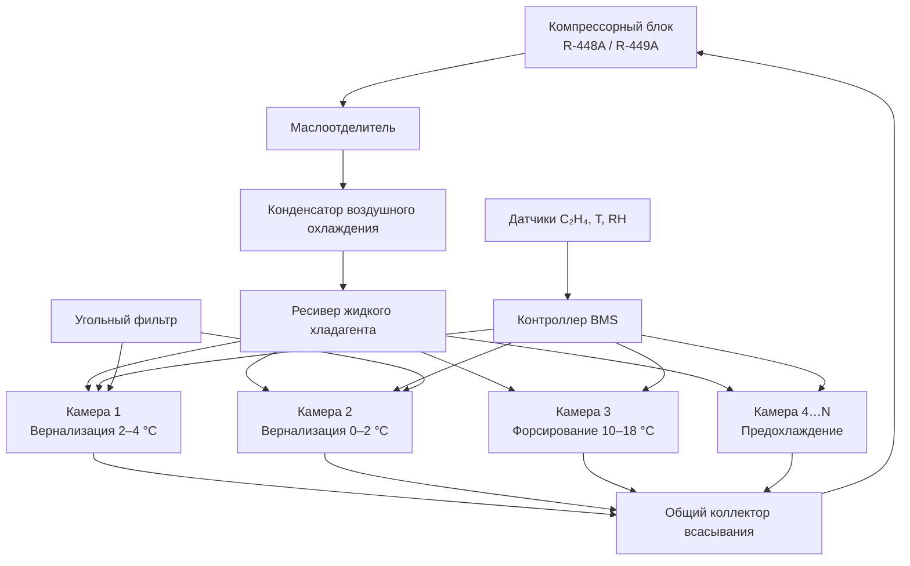

## Обзор

Хранение луковиц цветочных культур — тюльпанов (Tulipa spp.), нарциссов (Narcissus spp.), лилий (Lilium spp.) и гиацинтов (Hyacinthus orientalis) — требует прецизионного контроля температуры, относительной влажности (relative humidity, RH) и газового состава воздуха. Цель состоит в сохранении посадочного качества луковиц и обеспечении физиологических условий, необходимых для полноценного цветения. Луковица представляет собой подземный многолетний орган запаса питательных веществ, проходящий в природе период покоя (dormancy). В защищённом грунте и тепличном цветоводстве применяют управляемые режимы охлаждения — предварительное охлаждение (pre-cooling) и вернализацию (vernalisation) — с последующим температурным форсированием (forcing) для синхронизации цветения в заданные сроки.

Системы хранения луковиц интегрируются в специализированные многокамерные холодильные комплексы с относительной влажностью 65–80 % и кратностью воздухообмена 4–8 объёмов в час. Управление этиленом (C₂H₄) и летучими органическими соединениями (volatile organic compounds, VOC) предотвращает преждевременное прорастание и деградацию запасных веществ. Нормативную основу составляют ASHRAE Handbook Refrigeration (2022), ASHRAE 15, ISO 5149 и ГОСТ 54699–2011.

## Физиология и принципы хранения

### Физиологические фазы луковицы

Луковица проходит три чётко выраженные фазы, определяющие требования к температурному режиму холодильной системы.

**Фаза 1. Период покоя (dormancy).** Метаболическая активность минимальна. Интенсивность дыхания в диапазоне 0…5 °C составляет 0,04–0,06 кДж/(кг·ч). Требуется температура 0…5 °C и RH 65–70 % для предотвращения высыхания и преждевременного прорастания.

**Фаза 2. Вернализация (vernalisation).** Длительное воздействие холода — 6–16 недель при 0…5 °C — индуцирует формирование цветочных зачатков (flower initiation) и создаёт условия для последующего цветения. Без достаточной вернализации цветение не наступает или протекает дефектно.

**Фаза 3. Температурное форсирование (forcing).** Последовательное повышение температуры активирует рост, удлинение стебля и раскрытие бутонов в контролируемые сроки. Скорость изменения температуры не должна превышать 2–3 °C в сутки.

### Тепловыделение при дыхании

Интенсивность дыхания луковиц подчиняется правилу Q₁₀: скорость биохимических реакций удваивается при повышении температуры на 10 °C в диапазоне 0…20 °C. Тепловая мощность, выделяемая луковицами:


Q_{\text{дых}} = m \cdot q(T) \cdot \eta


где $Q_{\text{дых}}$ — тепловыделение, Вт; $m$ — масса луковиц, кг; $q(T)$ — удельная интенсивность дыхания при температуре $T$, Вт/кг; $\eta$ — коэффициент нагрузки (обычно 1,0 для полной загрузки).


| Температура | Удельное тепловыделение, кДж/(кг·ч) | Эквивалент, Вт/кг |
|-------------|--------------------------------------|-------------------|
| 2 °C        | 0,04–0,06                            | 0,011–0,017       |
| 5 °C        | 0,07–0,10                            | 0,019–0,028       |
| 10 °C       | 0,10–0,15                            | 0,028–0,042       |
| 20 °C       | 0,25–0,35                            | 0,069–0,097       |


### Этилен и летучие органические соединения

Этилен (C₂H₄) — фитогормон, стимулирующий старение тканей луковицы, активацию боковых почек и деградацию клеточных структур. Скорость накопления этилена при 20 °C и плохой вентиляции составляет 0,5–2,0 мкл/л в сутки. Критический уровень, превышение которого вызывает необратимые изменения, — более 0,1 мкл/л при длительном воздействии. Источники этилена в хранилище: собственное дыхание луковиц, микробное разложение органических остатков, проникновение из соседних помещений при неудовлетворительной герметизации.

## Режимы охлаждения и хранения

### Предварительное охлаждение

После выкопки луковицы содержат остаточное тепло поля (field heat) — 20…25 °C. Задача предварительного охлаждения состоит в снижении температуры до режимных значений и стабилизации метаболизма. Охлаждение ведётся воздушным способом при скорости воздуха 0,5–1,0 м/с.

**Тюльпаны и нарциссы:** диапазон −1…2 °C, продолжительность 1–2 суток до выравнивания температуры по сечению луковицы (core temperature), RH 65–75 %.

**Лилии:** диапазон −1…2 °C до появления ростков, затем 2…5 °C, продолжительность 2–4 недели в зависимости от сорта, RH 70–80 %.

### Вернализация — холодное хранение

Продолжительный холодный период при строго контролируемой температуре активирует формирование генеративных органов. Нарушение режима вернализации — основная причина дефектного цветения в промышленном тепличном производстве.


| Культура  | Температура, °C | Длительность, недель | RH, % |
|-----------|-----------------|----------------------|-------|
| Тюльпан   | 2…4             | 12–16                | 70–75 |
| Нарцисс   | 2…4             | 8–12                 | 70–75 |
| Лилия     | 0…2             | 6–10                 | 70–80 |
| Гиацинт   | 2…4             | 8–12                 | 70–75 |


### Температурное форсирование

После завершения вернализации луковицы переводят в режим форсирования с поэтапным повышением температуры.

**Стадия 1 (укоренение, rooting):** 10…12 °C, 2–3 недели. Интенсивное развитие корневой системы; RH повышается до 75–85 % для стимуляции роста.

**Стадия 2 (удлинение побега, elongation):** 15…18 °C, 2–4 недели. Активный рост стебля; потребность в вентиляции возрастает.

**Стадия 3 (цветение, anthesis):** 20…22 °C, 1–2 недели до полного раскрытия бутонов.

Скорость изменения температуры при переходе между стадиями не должна превышать 2–3 °C/сут во избежание физиологических стрессов, расщепления побегов и бластирования (blasting).

## Управление газовым составом воздуха

### Удаление этилена

Три основных метода применяются в промышленных хранилищах луковиц:

**Адсорбция на активированном угле (activated carbon):** норма загрузки 200–500 г на 1 м³ объёма камеры. Материал меняется еженедельно. Метод прост и надёжен, но требует регулярного обслуживания.

**Каталитическое окисление (catalytic oxidation):** катализаторы на основе MnO₂ или Pt при воздухообмене 4–6 объёмов в час разрушают этилен до CO₂ и H₂O. Эффективность 95–99 %.

**Озонирование (ozonation):** концентрация озона 0,3–0,5 мг/м³ в течение 30–60 мин ежедневно. Озон дезинфицирует и разрушает этилен. Требуется строгий контроль остаточной концентрации озона в соответствии с санитарными нормами (предельно допустимая концентрация для рабочей зоны — 0,1 мг/м³ по ГОСТ 12.1.005-88).

### Углекислый газ

CO₂ накапливается при высокой плотности загрузки луковиц. Допустимая концентрация в атмосфере хранилища — до 2–3 % по объёму. Превышение подавляет дыхание и вызывает анаэробный метаболизм с образованием этанола и ацетальдегида, что необратимо снижает посадочное качество. Требуемый воздухообмен — 4–8 объёмов камеры в час.

## Расчёт тепловой нагрузки

### Методика ASHRAE

Суммарная холодильная нагрузка на хранилище луковиц включает несколько составляющих:


Q_{\Sigma} = Q_{\text{дых}} + Q_{\text{инф}} + Q_{\text{огр}} + Q_{\text{осв}} + Q_{\text{вент}}


где $Q_{\text{инф}}$ — теплопоступления через ограждающие конструкции при инфильтрации наружного воздуха; $Q_{\text{огр}}$ — теплопередача через стены, пол и потолок; $Q_{\text{осв}}$ — теплоотдача от источников освещения; $Q_{\text{вент}}$ — теплота от вентиляционного оборудования.

Теплоотдача при дыхании:


Q_{\text{дых}} = m \cdot q(T)


### Пример расчёта (SI)

**Условие задачи.** Хранилище объёмом $V = 100$ м³ с загрузкой луковиц тюльпана $m = 50$ т. Температура хранения 2 °C. Удельное тепловыделение при 2 °C: $q = 0{,}05$ кДж/(кг·ч). Теплоизоляция стен: $U = 0{,}20$ Вт/(м²·К), суммарная площадь ограждений $A_{\text{огр}} = 150$ м². Наружная температура $T_{\text{н}} = 25$ °C.

**Тепловыделение при дыхании:**

Q_{\text{дых}} = 50\,000 \cdot 0{,}05 = 2\,500 \; \text{кДж/ч} \approx 0{,}69 \; \text{кВт}


**Теплопередача через ограждения:**

Q_{\text{огр}} = U \cdot A_{\text{огр}} \cdot (T_{\text{н}} - T_{\text{хр}}) = 0{,}20 \times 150 \times (25 - 2) = 690 \; \text{Вт} \approx 0{,}69 \; \text{кВт}


**Итоговая нагрузка** (без освещения и вентиляции): $Q_{\Sigma} \approx 1{,}4$ кВт. С коэффициентом запаса 1,2 и добавлением нагрузки от вентиляторов и освещения — расчётная мощность холодильного агрегата около **2,0 кВт**.

## Требования к влажности

Луковицы чувствительны как к высыханию, так и к избыточной увлажнённости. Прорастание корней начинается при RH > 85 %, однако повышенная влажность стимулирует развитие плесневых грибов — Penicillium spp. и Fusarium spp. Оптимальные диапазоны:


| Фаза хранения                 | RH, % | Риски при нарушении |
|-------------------------------|-------|---------------------|
| Сухое хранение (до укоренения)| 65–70 | Высыхание при RH < 60 %; плесень при RH > 80 % |
| Мокрое хранение (форсирование)| 75–85 | Грибковые болезни при RH > 90 %; вялость при RH < 70 % |


Увлажнение воздуха выполняется ультразвуковыми (ultrasonic humidifier) или паровыми увлажнителями (steam humidifier). Осушение — адсорбционными осушителями или за счёт поверхности испарителя с пониженной температурой кипения хладагента.

## Проектирование систем охлаждения

### Конфигурация оборудования

В промышленном цветоводстве применяют многокамерные холодильные комплексы (4–8 автономных камер) с независимым управлением каждой секцией. Это позволяет одновременно поддерживать несколько режимов вернализации и форсирования для луковиц разных сортов и сроков цветения.

Каждая камера комплектуется следующим оборудованием:

1. Компрессорный агрегат (refrigerating unit) на хладагентах R-448A или R-449A (в соответствии с требованиями ASHRAE 34 и EU 517/2014 по низкому потенциалу глобального потепления, GWP < 2500).
2. Воздушный охладитель (air cooler, evaporator unit) с регулирующим расширительным клапаном — электронным (electronic expansion valve, EEV) для точного контроля перегрева.
3. Вентилятор с EC-двигателем (electronically commutated motor) и частотным регулированием для управления скоростью воздуха в диапазоне 0,3–1,0 м/с.
4. Комбинированный датчик температуры и влажности (класс точности ±0,5 °C / ±2 % RH).
5. Электрохимический или фотоионизационный датчик этилена (electrochemical C₂H₄ sensor, диапазон 0–10 мкл/л, порог срабатывания 0,05 мкл/л).
6. Угольный фильтр (activated carbon filter) для непрерывной адсорбции этилена.

### Диаграмма архитектуры системы





### Типовые параметры системы


| Параметр                          | Значение          |
|-----------------------------------|-------------------|
| Объём одной камеры                | 50–200 м³         |
| Расчётная холодопроизводительность| 3–10 кВт          |
| Кратность воздухообмена           | 4–8 ч⁻¹           |
| Хладагент                         | R-448A, R-449A    |
| Температура кипения хладагента    | −8…−12 °C         |
| COP системы                       | 3,0–3,5           |
| Температура конденсации           | 35–40 °C (лето)   |
| Точность поддержания температуры  | ±0,5 °C           |
| Точность поддержания RH           | ±3 %              |


## Нормативная база


| Стандарт                      | Область применения                                               |
|-------------------------------|------------------------------------------------------------------|
| ASHRAE Handbook Refrigeration (2022) | Физиология и режимы хранения цветочной продукции, расчёт нагрузок |
| ASHRAE 15-2022                | Требования безопасности к холодильным системам                    |
| ASHRAE 34-2022                | Номенклатура и классификация хладагентов                          |
| ISO 5149-1:2014               | Холодильные системы: требования безопасности                      |
| EN 378-1:2016+A1:2020         | Холодильные системы и тепловые насосы                             |
| ГОСТ 54699–2011               | Луковицы тюльпанов посадочные; условия хранения 0…5 °C, RH 65–75 % |
| ГОСТ Р 53082–2008             | Луковицы лилий; условия хранения                                 |
| СП 60.13330.2020              | Отопление, вентиляция и кондиционирование воздуха                |


## Практические рекомендации

### Организация хранения

**Предварительная сортировка.** Перед закладкой на охлаждение необходимо отбраковать луковицы с механическими повреждениями, признаками грибковых инфекций (Botrytis, Fusarium, Penicillium) и деформаций. Поражённые экземпляры служат источником патогенов для всей партии.

**Режим вентиляции.** Для тюльпанов и нарциссов — 4 объёмa/ч, для лилий (более интенсивное дыхание) — 6–8 объёмов/ч. Воздух подаётся равномерно через перфорированные полы или боковые распределители для исключения застойных зон.

**Мониторинг этилена.** Датчики C₂H₄ размещают на высоте 0,5–1,5 м в центральной части камеры. Целевое значение: менее 0,05 мкл/л. При превышении 0,1 мкл/л система управления автоматически увеличивает кратность воздухообмена и активирует дополнительную угольную фильтрацию.

**Градиент температуры.** Скорость изменения температурной уставки при переходе между режимами — не более 0,5 °C/сут. Резкие переходы вызывают физиологический стресс и нарушение вернализации.

**Запас мощности.** Холодильная установка должна иметь резерв 15–20 % сверх расчётной нагрузки для компенсации неравномерности распределения воздуха, загрузки тёплых луковиц и пиковых теплопоступлений через ограждения летом.

**Периодические осмотры.** Визуальный контроль состояния луковиц проводится каждые 2 недели: проверка наличия плесени, степени прорастания корней и стеблей, целостности луковичных чешуй.

### Диагностика отказов


| Симптом                          | Вероятная причина                          | Мероприятие                                              |
|----------------------------------|--------------------------------------------|----------------------------------------------------------|
| Преждевременное прорастание      | RH > 85 %; концентрация C₂H₄ > 0,1 мкл/л | Снизить RH; увеличить воздухообмен; заменить угольный фильтр |
| Плесень (Penicillium)            | RH > 80 %; повреждённые луковицы          | Снизить RH; усилить сортировку; обработать фунгицидом     |
| Слабое цветение после хранения   | Недостаточная вернализация                 | Проверить журнал температур; продлить холодный период     |
| Расщепление побегов (blasting)   | Резкое повышение температуры форсирования  | Ограничить скорость роста температуры до 2 °C/сут         |
| Подмерзание луковиц              | T < −1 °C                                 | Проверить калибровку датчиков; перенастроить уставки      |

