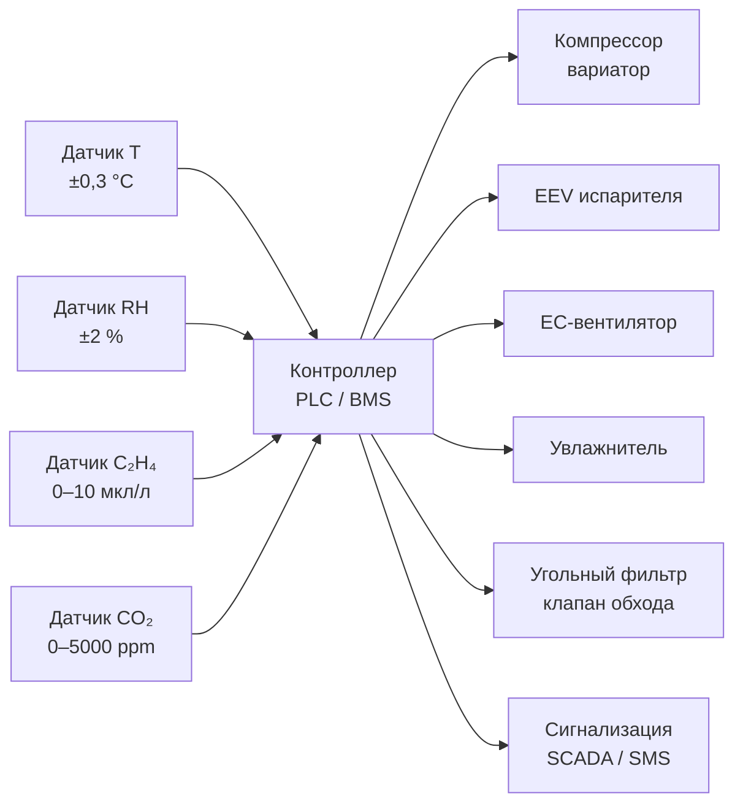

## Обзор

Хранение срезанных цветов — критическая составляющая цветочной логистики и розничной торговли, требующая точного контроля температурно-влажностного режима и газового состава воздуха. После срезки цветок остаётся живым организмом с продолжающимся аэробным дыханием (aerobic respiration), выделяет тепло и становится крайне чувствительным к этилену (C₂H₄) — фитогормону старения. Срок сосудной жизни (vase life) напрямую определяется качеством холодильного хранения в первые часы и дни после срезки.

По данным ASHRAE Handbook Refrigeration и рекомендациям Международной ассоциации производителей и оптовых торговцев цветами (AIPH), правильно организованный микроклимат продлевает жизнь срезанных цветов на 50–100 % по сравнению с хранением при комнатной температуре. Холодильные системы для цветочных хранилищ предъявляют повышенные требования к однородности температурного поля (равномерность ±0,5 °C), поддержанию относительной влажности 90–95 % и удалению загрязняющих газов.

Нормативная база: ASHRAE Handbook Refrigeration (2022), ASHRAE 15, ISO 5149, EN 378, ТР ТС 031/2011.

## Физические принципы

### Дыхание срезанного цветка

После срезки в тканях цветка протекает аэробное дыхание:


\text{C}_6\text{H}_{12}\text{O}_6 + 6\,\text{O}_2 \;\to\; 6\,\text{CO}_2 + 6\,\text{H}_2\text{O} + \text{энергия (АТФ)}


Интенсивность дыхания зависит от вида цветка и температуры. Снижение температуры на 10 °C замедляет обмен веществ в 2–3 раза согласно коэффициенту Q₁₀ в физиологии растений. Тепловая мощность, выделяемая массой срезанных цветов:


Q_{\text{дых}} = m \cdot r(T)


где $m$ — масса свежей биомассы, кг; $r(T)$ — удельный тепловой эквивалент дыхания при температуре $T$: при 0 °C составляет 20–25 кДж/(кг·ч), при 20 °C — 60–80 кДж/(кг·ч).

### Действие этилена

Этилен (C₂H₄) — газообразный фитогормон, вызывающий преждевременную сенесценцию (senescence) лепестков, потерю окраски, опадение. Чувствительность срезанных цветов к этилену экстремальна: концентрация 0,1–1,0 мкл/л (100–1000 ppb) ускоряет деградацию в течение нескольких часов. Источники этилена в цветочном хранилище: выделение самими цветками при стрессе; выхлопные газы от погрузочной техники; микробное разложение органических остатков.

Контроль этилена обеспечивается:
- активной вентиляцией с кратностью воздухообмена ≥ 4–6 ч⁻¹;
- адсорбционной фильтрацией (activated carbon, KMnO₄-импрегнированные фильтры) для захвата C₂H₄ и VOC;
- каталитическим окислением этилена (catalytic oxidation) до CO₂ и H₂O.

### Влажность и управление конденсацией

Для минимизации транспирации (transpiration) через лепестки требуется относительная влажность 90–95 %. Избыточная влажность (> 98 %) приводит к конденсации и развитию серой плесени Botrytis cinerea. Точка росы воздуха в камере должна быть на 2–3 °C ниже температуры хранилища:


T_{\text{dp}} \approx T - \frac{100 - \varphi}{5}


где $T$ — температура воздуха, °C; $\varphi$ — относительная влажность, %. Формула приблизительна для диапазона 0…5 °C; точный расчёт ведётся по таблицам ASHRAE Handbook Fundamentals или уравнению Магнуса.

## Требования по видам цветов


| Вид цветка                  | Температура, °C | RH, %  | Срок хранения  | Особенности                                           |
|-----------------------------|-----------------|--------|----------------|-------------------------------------------------------|
| Розы (Rosa spp.)            | 0–2             | 90–95  | 1–2 недели     | Экстрачувствительны к C₂H₄; требуют консервирующего раствора |
| Гвоздики (Dianthus spp.)    | 0–2             | 90–95  | 2–3 недели     | Устойчивы к холоду; допускают 2–4 °C краткосрочно    |
| Хризантемы (Chrysanthemum)  | 0–2             | 90–95  | 2–3 недели     | Хорошо переносят холод; нужен питательный раствор     |
| Орхидеи (Orchidaceae)       | 7–10            | 90–95  | 1–2 недели     | Чувствительны к переохлаждению; T не ниже +5 °C       |
| Антуриум (Anthurium)        | 10–13           | 90–95  | 1–2 недели     | Риск холодового повреждения при T < 10 °C              |
| Протея (Protea spp.)        | 10–13           | 90–95  | 1–2 недели     | Тропическое происхождение; не переносит заморозков    |


## Конструкция холодильных камер

### Теплоизоляция и герметичность

Толщина теплоизоляции (полиуретан, polyurethane) — не менее 100 мм для стен и потолка, не менее 120 мм для пола. Коэффициент теплопередачи ограждений: $U \leq 0{,}25$ Вт/(м²·К). Все швы паронепроницаемы; двери оборудованы надувными уплотнителями (inflatable door seals) для предотвращения притока тёплого наружного воздуха с этиленом и влагой. Конструкция должна соответствовать требованиям EN 378-2 и ГОСТ 9833-73.

### Система охлаждения

Применяются прямые испарительные системы (direct expansion, DX) с циркуляционными вентиляторами. Хладагенты: R-448A или R-449A (GWP < 2500, согласно EU 517/2014). Рабочие параметры: температура кипения −8…−12 °C, температура конденсации 35–40 °C (при воздушном конденсаторе летом). Разность температур воздух–испаритель (evaporator temperature difference, ETD) должна составлять не более 5–8 °C для обеспечения достаточной теплопередачи без чрезмерного осушения воздуха.

### Управление влажностью

Система управления влажностью включает:
- электронный гигростат (точность ±2 % RH) со встроенным ПИД-регулятором;
- испаритель-осушитель с уставкой точки росы на 2–3 °C ниже температуры хранилища;
- ультразвуковой или паровой увлажнитель для поддержания 90–95 % RH при необходимости.

### Воздухообмен и фильтрация

- Кратность воздухообмена: 4–6 ч⁻¹ в соответствии с рекомендациями ASHRAE Handbook Refrigeration для цветочных холодильников.
- Трёхступенчатая фильтрация: предварительный фильтр класса G4, угольный фильтр для поглощения C₂H₄ и VOC, финальный фильтр класса F7.

## Расчёт тепловой нагрузки

### Составляющие нагрузки

Суммарная холодильная нагрузка:


Q_{\Sigma} = Q_1 + Q_2 + Q_3 + Q_4 + Q_{\text{проч}}


**Q₁ — охлаждение поступающего продукта (product pull-down):**


Q_1 = \frac{m_{\text{пр}} \cdot c_p \cdot (T_{\text{вх}} - T_{\text{хр}})}{\Delta\tau}


где $m_{\text{пр}}$ — масса цветов, кг; $c_p \approx 3{,}7$ кДж/(кг·К) для растительной ткани; $T_{\text{вх}}$ — температура поступления (15–20 °C); $\Delta\tau$ — время охлаждения, с.

**Q₂ — тепло дыхания (respiratory heat):**


Q_2 = m_{\text{пр}} \cdot r(T)


При 0 °C: $r \approx 6$ мДж/(кг·с) ≈ 22 кДж/(кг·ч).

**Q₃ — теплопередача через ограждения:**


Q_3 = U_{\text{огр}} \cdot A \cdot (T_{\text{н}} - T_{\text{хр}})


**Q₄ — теплота инфильтрации:**


Q_4 = \dot{V}_{\text{инф}} \cdot \rho_{\text{воз}} \cdot c_{p,\text{воз}} \cdot (T_{\text{н}} - T_{\text{хр}})


где $\dot{V}_{\text{инф}}$ — расход инфильтрующегося воздуха, м³/ч; $\rho_{\text{воз}} \approx 1{,}2$ кг/м³; $c_{p,\text{воз}} \approx 1{,}01$ кДж/(кг·К).

### Пример расчёта (SI)

**Условие.** Камера 20 м² × 3 м = 60 м³. Поступление 500 кг роз при $T_{\text{вх}} = 18$ °C. Требуемая температура хранилища $T_{\text{хр}} = 1$ °C. Наружная температура $T_{\text{н}} = 25$ °C. Время охлаждения 4 ч. $U_{\text{огр}} = 0{,}25$ Вт/(м²·К), $A = 60$ м². Кратность воздухообмена 5 ч⁻¹.


Q_1 = \frac{500 \times 3{,}7 \times (18 - 1)}{4 \times 3600} \approx 2{,}2 \; \text{кВт}



Q_2 = 500 \times \frac{22}{3600} \approx 3{,}1 \; \text{кВт}



Q_3 = 0{,}25 \times 60 \times (25 - 1) = 360 \; \text{Вт} \approx 0{,}36 \; \text{кВт}



Q_4 = (5 \times 60) \times 1{,}2 \times 1{,}01 \times (25 - 1) / 3600 \approx 2{,}4 \; \text{кВт}


**Итого:** $Q_{\Sigma} = 2{,}2 + 3{,}1 + 0{,}36 + 2{,}4 + 0{,}3 \approx 8{,}4$ кВт. С коэффициентом запаса 1,2: **расчётная мощность ≈ 10 кВт**.

## Архитектура холодильных систем

### Типовые конфигурации

**Автономный агрегат (self-contained unit).** Компрессорно-конденсаторный агрегат (condensing unit) располагается снаружи или в машинном отделении. Испаритель с вентиляторами — внутри камеры. Преимущества: простота, независимость, надёжность. Риски: накопление C₂H₄ при недостаточной вентиляции.

**Централизованная холодильная станция (central plant) с распределённой циркуляцией.** Один или несколько компрессорных агрегатов обслуживают несколько камер через общий трубопровод. Электронные расширительные клапаны (EEV) на каждом испарителе обеспечивают независимое регулирование. Оптимально для распределительных центров с 5 и более камерами.

**Распределительный центр с зонированием.** Цветочные распределительные центры проектируют с разделением функциональных зон:
- камера предварительного охлаждения (2–4 °C) с высокой пропускной способностью;
- камеры длительного хранения (0–2 °C для роз; 10–13 °C для тропических видов) с точным управлением;
- упаковочное отделение (12–15 °C, 60–70 % RH) для минимизации конденсации при передаче в розничную сеть.

Цветы хранятся в затемнённых камерах, поскольку видимый свет ускоряет раскрытие бутонов и сокращает срок сосудной жизни.

### Схема системы управления





## Нормативная база


| Стандарт                           | Область применения                                              |
|------------------------------------|-----------------------------------------------------------------|
| ASHRAE Handbook Refrigeration (2022)| Физиология, режимы хранения и расчёт нагрузок для цветочной продукции |
| ASHRAE 15-2022                     | Безопасность холодильных систем                                 |
| ASHRAE 34-2022                     | Хладагенты, классификация и обозначение                         |
| ISO 5149-1:2014                    | Холодильные системы: требования безопасности                    |
| EN 378-1:2016+A1:2020              | Холодильные системы и тепловые насосы; безопасность и экология  |
| ГОСТ 9833-73                       | Холодильные установки; классификация и общие технические требования |
| ТР ТС 031/2011                     | Оборудование для хранения и транспортировки скоропортящихся продуктов |
| СП 60.13330.2020                   | Отопление, вентиляция и кондиционирование воздуха               |


## Практические рекомендации

### Нормативные режимы


| Параметр                     | Значение                                   |
|------------------------------|--------------------------------------------|
| T для роз, гвоздик, хризантем| 0–2 °C, стабильность ±0,5 °C              |
| T для тропических видов       | 10–13 °C, стабильность ±1 °C              |
| Относительная влажность       | 90–95 %; точка росы на 2–3 °C ниже T хранилища |
| Кратность воздухообмена       | 4–6 ч⁻¹                                    |
| Максимум C₂H₄                | 0,1 мкл/л (100 ppb)                        |
| Максимум CO₂                 | 1 % (10 000 ppm) — допустимо краткосрочно  |
| Скорость воздуха у продукции  | 0,2–0,5 м/с                                |
| Удельная мощность охлаждения  | 30–50 Вт/м³ объёма камеры                  |


### Контроль и диагностика

**Однородность температуры.** В камере размещают 8–10 логгеров данных (data loggers) в различных точках; допустимый разброс ±1,0 °C. Логгеры класса точности ±0,2 °C.

**Эффективность осушения.** Мониторинг точки росы; при превышении заданного значения на 2 °C активируют дополнительное осушение или снижают влажность подаваемого воздуха через байпасный клапан испарителя.

**Контроль C₂H₄.** Электрохимические датчики или переносной газоанализатор PID-типа (photoionization detector). Органолептический тест: розы теряют лепестки за несколько часов при концентрации C₂H₄ > 1 мкл/л.

**Санитарная обработка.** Ежемесячная дезинфекция камер раствором перекиси водорода (H₂O₂) 3–5 % распылением с последующей вентиляцией — для предотвращения Botrytis и бактериального поражения.

### Типичные ошибки проектирования и эксплуатации

**Недостаточная вентиляция** — приводит к накоплению C₂H₄ и CO₂. Решение: обеспечить кратность 4–6 ч⁻¹ с угольной фильтрацией.

**Колебания температуры > ±1 °C** — ускоряют старение. Требуются электронный термостат с ПИД-регулятором и достаточная тепловая масса (thermal mass) системы.

**Повышенная влажность > 98 %** — развитие Botrytis. Необходима регулировка точки росы и санитарная обработка.

**Размещение цветов на холодном полу** — прямой контакт вызывает локальные повреждения от переохлаждения. Используют перфорированные поддоны (pallets) с зазором ≥ 5 см от пола.

**Смешанное хранение видов с разными температурными требованиями** — орхидеи при 0–2 °C получают холодовое повреждение. Требуется зонирование или отдельные камеры.
